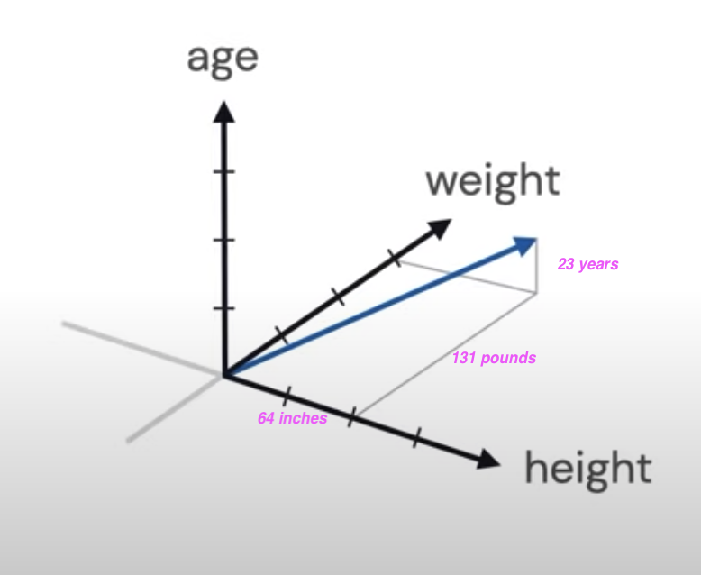
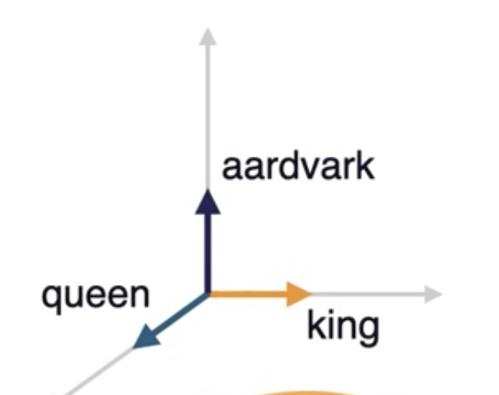

# Chapter 2 - Basic Linear Algebra needed for ML 

> DO NOT WORRY ABOUT YOUR DIFFICULTIES IN MATHEMATICS. I CAN ASSURE YOU MINE ARE STILL GREATER - Alert Einstein

> “Last time I asked: 'What does mathematics mean to you?', and some people answered: "The manipulation of numbers, the manipulation of structures.' And if I had asked what music means to you, would you have answered: 'The manipulation of notes?”
― [Serge Lang](https://en.wikipedia.org/wiki/Serge_Lang), The Beauty of Doing Mathematics 


 As we know computer are comfortable in dealing with numbers and perform fast operations on those numbers to provide us the results we are interested in. But in our real world we deal with **things** like *words, sentences and images*. This creates an *impedance mismatch*. So obvious solution will be to solve this mismatch is by representing our **things** in numbers, let us call this as **Data Representations**.
 
**Linear Algebra** what we learned in our high school math class comes to save us here!

In this chapter, we will have a friendly introduction to **Linear Algebra**. 

If you did not have a chance to learn **Linear Algebra** in your high school, do not worry, I will try to explain in a *simplest possible way* to understand the *Data Representations* concepts so we can do Machine Learning work.

-----

*"Simplicity is the ultimate sophistication"* - [Leonardo da Vinci](https://en.wikipedia.org/wiki/Leonardo_da_Vinci)

-----

## Let us use Vectors for Data Representations

Ok, what is a **Vector**?

- Vector is one Dimensional Array of numbers
- It has magnitude (value) and direction


- Example vector with 3 entries
```
v1 = [1, 2, 3]

```

When we say *n-dimensional vector space* we mean this space consists of all vector with *n* entries.
In our vector with 3 entries, *3-dimensional vector space* will consist of all the vectors with *3* entries.

Another name vector space is **feature**, let me explain that in few moments...


## How you can draw a point 3D space

```py
from mpl_toolkits import mplot3d
import numpy as np
import matplotlib.pyplot as plt

# width by height here are 10 inches by  10 inches
fig = plt.figure(figsize=(10,10))

# 3d projection 
# with position (pos) of subplot as num-of-rows:1, num-of-cols:1, index-of-subplot:1
# If no positional arguments are passed, defaults to (1, 1, 1).

ax = fig.add_subplot(111, projection='3d')

# plot a point
ax.scatter(2,3,4)
plt.show()
```


## What is a feature Vector?

Entries of the feature vectors represent **features** of the thing (object) this vector is used to represent.

Example:
Assume the thing (object) has 3 features: *Color, Heaviness and Shape*:
1. **Color** = 2
    - say number 1 means it is Red 
    - say number 2 means it is Green
    - say number 3 means it is Blue
2. **Heaviness** : 2
    - say number 1 means it is light
    - say number 2 means it is medium
    - say number 3 means it is heavy
    - say number 4 means it is super heavy
3. **Shape** : 1
    - say number 1 means it is circle
    - say number 2 means it is rectangle
    - say number 3 means it is square
    - say number 4 means it is cube

So this object with *Color: Green, Heaviness: medium and Shape: circle* is represented (Data Representation) by this feature vector whose entries are:

```
 fv = [2,2,1]

```

Another example:

The object here is a *Patient* with:
- height: 64 inches,
- weight: 131 pounds, 
- age: 23 years

The *patient* vector **p**:
```
p = [64, 131, 23]
```



Now we understand how we can provide Data Representation using **Feature Vectors**.


### The Object I have is an Image, how to do the Data Representations for this?

- Black and White Images
    - Black: 0
    - White: 1
    - Gray: 0 to 255


### Now we have words in say English dictionary, how to do the Data Representations for these words

- Naive way:
    - words are **discrete** and **independent** tokens
    - Build Dictionary or tokens 

    ``` py
    ['aardvark', ... 'king', ..., 'queen', ...]
    ```

    - Since we need to convert words to numbers as part of our Data Representations, we can assign numbers to these words
    ```
    [0, ...  11000, ... 12000, ...]

    ``` 

    We will find out these large number are not well suited for ML. We can solve this by using a concept called **one-hot-vector**

    ```
     [ [1,0,0,0,...], ... [0,0,0,0…1,0,0…], ... [0,0,0,,0,0…1,0,0…] ]      ]
    ```

    These vectors have **same dimensionality** as the **number-of-words in the dictionary**.

    Suppose the English has 100,000 word, the dimension of the one-hot-vector for each word will be 100,000. In that one-hot-vector only one entry in this vector will be **1** and all other entries will be **0**.

    

    #### Disadvantages with one-hot-vector way of Data Representation
    - Very high dimensionality 
    - Do not capture any world knowledge (like: Gender, Part-of-Speech...) about the words
        - example: **king** and **queen** are more in common with each other than **aardvark**
            - all of these token have **90 degrees** angles between them
    - Let us take a dictionary with only these 3 words
    ```
    ['aardvark', 'king', 'queen'] 

    ```
    

    - These 3 words in vectors in above 3-dimensional space
    - They are unit vectors aligned to axes
    - We need to find a way the words to occupy the entire this 3-dimensional space instead of perfectly aligning to the axes.
    - More useful Data Representation of words will be continuous vectors in the n-dimensional space
        - This will allow **aardvark**, **king** and **queen** to flow anywhere in this 3-dimensional space. So their representations will be real-values like **0.3**, **1.9**, **-0.4** for **aardvark**

        


    - Representing world knowledge (like: Gender, Part-of-Speech...)
    - For example for **queen** [0.1, -0.3, 1.2,     -0.4, 0.02, 1.1,    -0.25, ... ]
        - First 3 entires can represent the aspect of **Gender** for example
        - Next 3 entires can represent the aspect of **Part-of-speech** for example 
    - This mechanism will help us to express **relationships between the words** as equal to relative **vector distance**

    

    - For example, for Gender Dimension, **king and queen** should be far part as **man and woman**
        - In case of Part-of-speech dimensions, all these words should clustered together at a distance zero, since all of them are **nouns**
        - **play** (verb) and **playful** (adjective) should be at the same distance as **joy** and **joyful**


    #### How we can learn useful embedding (Data Representations)?
    - **Wikipedia** comes to rescue us here! It is a reliable source of information we can use to learn the useful embeddings:
        - has 28 billion words
        - 309 languages
    - If we look at the **king** and **queen** in Wikipedia, both them have lot of commonality
        - They reference each other, includes common words like monarch
        - So Wikipedia has word knowledge we can extract to learn the useful embedding for us

    - Wikipedia is freeform text
        - Common practice
            - Unsupervised text data ---> supervised task
            - we can ask the ML model to fill in the gaps and predict the next word as shown below:

    ```
    King is the title given to male ______

    monarch : 70%
    body : 20%
    dog: 10%

    ```

    - The ML model could produce a probability distribution over the word in the vocabulary indicating which ones are more likely to follow the word given so far, in our case it is **monarch**


