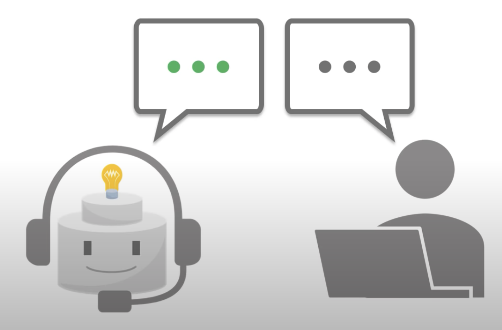
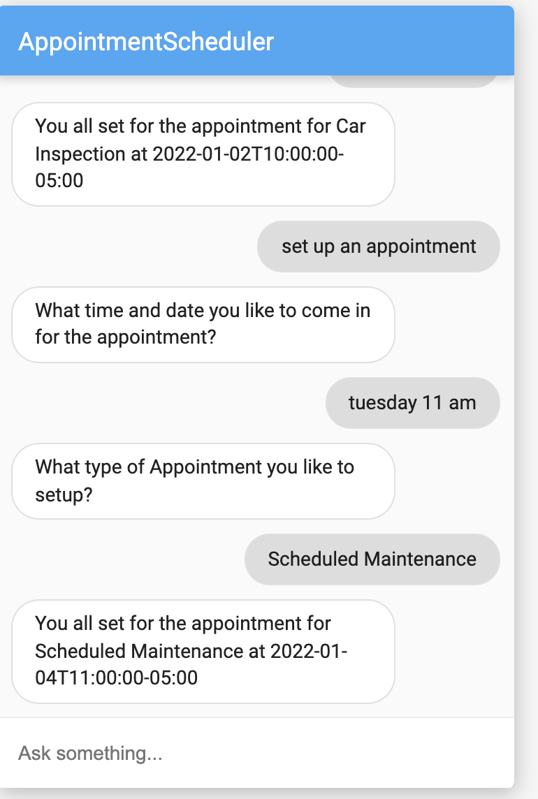

# Chatbots






- A chatbot is a **conversational AI system** that is able to communicate with a human in a natural language.
- It can be integrated into websites, messaging platforms, and devices.

- Companies can delegate routine tasks to a chatbot
    -  which will be able to process *multiple user requests simultaneously*

- Chatbots are **always available** to assist the users and provide huge labor cost savings.


## Two groups of chatbots

- **Rule Based**
    - Rely on predefined commands and templates. 
    - Each of these commands should be written by a chatbot developer using regular expressions and textual data analysis

- **Data-Driven**
    - Rely on machine learning (ML) models pre-trained on dialogue data.

## Main parts of the chatbot

- **Natural Language Understanding (NLU)**
    - chatbot needs to understand **utterances** in a natural language
    - NLU translates a user query from natural language into a **labeled semantic** representation.
    - Example: The following in English:
    ```
    What is the rental price in Boston?
    ```

    - will be translated into:

```py
rent_price("Boston")
``` 

- Then chatbot has to decide what is expected of it

-  **Dialogue Manager (DM)**
    -  keeps track of the dialogue **state** and decides what should be answered to the user. 

-  **Natural Language Generator (NLG)**
    - translates a semantic representation back into human language
    - Example:

```
    rent_price_in_USD("Boston") = 2500
``` 
- will be translated to:
```
 The average rent price in Boston is around $2,500

``` 



## Let us build a chatbot

The smallest building block of the library is **Component**. 
Component stands for any kind of function in an NLP pipeline. 
It can be implemented as: 
- a neural network
- a non-neural ML model 
- a rule-based system. 
Besides that, Component can have a nested structure, i.e. Component can include other Components.

Components can be joined into **Skill**. 
- Skill solves a larger NLP task compared to Component. However, in terms of implementation Skills are not different from Components. 

**Agent** is supposed to be a multi-purpose dialogue system that comprises several Skills and can switch between them. It can be a dialogue system that contains a goal-oriented and chatbot skills and chooses which one to use for generating the answer depending on an user input.


- [DeepPavlov: Hello bot! ](https://colab.research.google.com/github/deepmipt/dp_notebooks/blob/master/DP_hello_bot.ipynb)


## openAI Chat


## References
- Einstein
    - [Einstein Bots](https://help.salesforce.com/s/articleView?id=sf.bots_service_intro.htm&type=5)
    - [Deploy Your Bot to Your Channels](https://help.salesforce.com/s/articleView?id=sf.bots_service_deploy_to_channels.htm&type=5)
- Google Contact Center AI
    - [Google Dialogflow](https://cloud.google.com/dialogflow)
- DEEPPAVLOV
    - [DeepPavlov articles with Python code](https://github.com/deepmipt/dp_notebooks)
- RASA
    - [RASA: The Future of Customer Experience](https://rasa.com/)