# Dialogflow

> Trying to teach a machine to have conversion is not easy!

> User will ask same thing in a different ways!

User Ask|
---|
What is the forecast tomorrow?|
What is the weather tomorrow?|
What is the weather tomorrow in Boston?|


> Rule based systems to handle this not manageable! We need Natural Language Understanding (NLU)

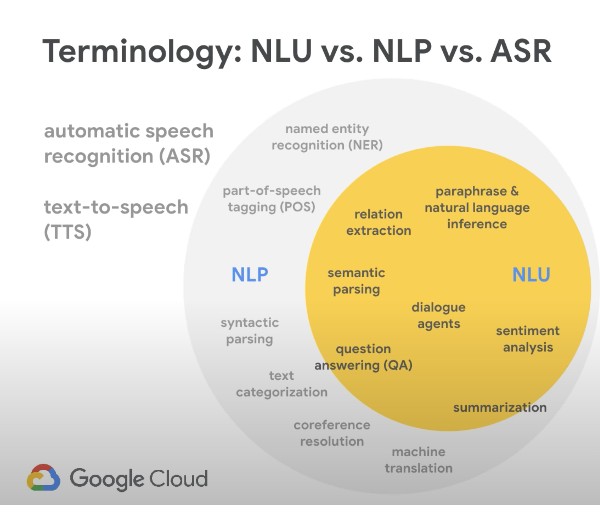

- NLU works for both voice and text and with help of ML we can make chatbots really useful!
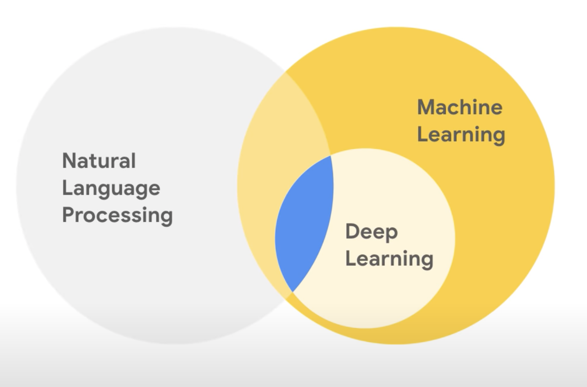


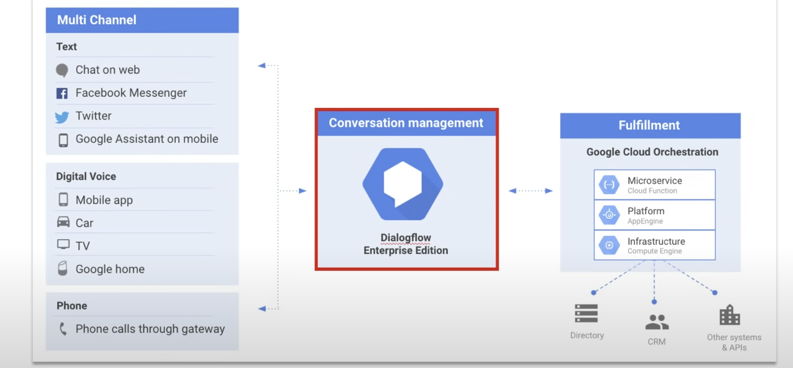


A natural language understanding (NLU) platform that makes it easy to design and integrate a conversational user interface into :

- mobile app
- web application
- device
- bot 
- interactive voice response (IVR) system

 Using Dialogflow, you can provide new and **engaging ways for users to interact** with your product.


 - Translate the Natural Language into machine readable data using ML models trained by the given set of examples.
 - It identifies about what the user is talking about, provides this data to the backend to take actions.


 - The backend performs the actions


 ## Steps


 - Create an Agent (the chatbot application) within Dialogflow

    - Collecting what the **user is saying** and mapping into an **intent**
    - Taking an action on that intent
    - Provide the user with the **response**

- This all starts with a trigger event - **Utterance**
- This is how the user **invokes** the chatbot

 > *Hey Google, what is the temperature at NY City?*  - is an utterance

 > *Hey Google* - is a trigger

   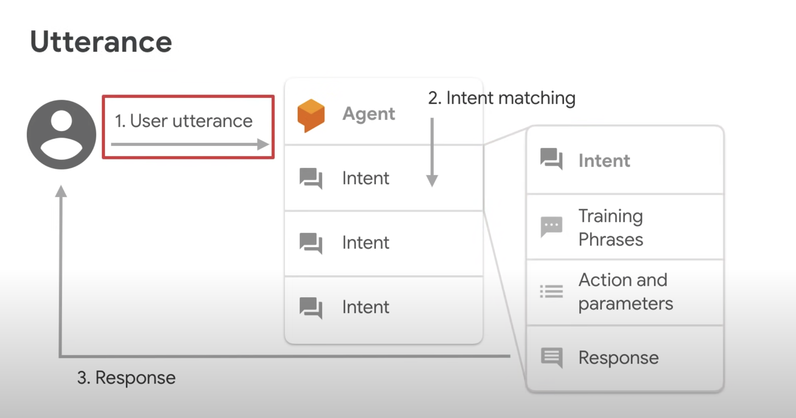

>  *Hey Google, find the current stock of iPads from Inventory Management*  - is an utterance

> *find the current stock of iPads from Inventory Management* is the invocation phase for the chatbot

> *Inventory Management* is the invocation name


### Key idea
- We need to understand:  *what is the user's intent?*

> User says: *I want to set an appointment*

> *set an appointment* is the **intent**

-----
> User says: *what are your hours of operation*

> *hours of operation* is the **intent**

- We provide Diagflow the different examples of user's intents
    - Diagflow trains a ML model with many more similar phrases 
        - maps the **user phrases** into the **right intent**

### Intent Matching
Training Phrase|Intent|Action and Parameters|
---|---|---|
I want to set an appointment|set an appointment|```set_appointment()```|
what are your hours of operation|hours of operation|```get_hoursOfOperation()```|

- Parameters define **variables** we need to **collect and store**


### Example

User Phrase|Intent|Entities|Action and Parameters|Backend|
---|---|---|---|---|
I want to set an appointment at 10am tomorrow |set an appointment|10am, tomorrow|```set_appointment("10", "tomorrow)```|Provide a dynamic response|
Good Morning|greeting||```greet()```|Provide a static response: *I am doing well*|


### Context
- is the method for the chatbot to store and access **variables**  so it can **exchange** information from one intent to another in a conversation.


## Dialogflow types of entities

- 


## Play with Dialogflow

- Dialogflow creates GCP project to access logs and Cloud functions

- Intents are mappings between a user's queries and actions fulfilled by your software. 


  
> User: good morning!

> Bot: Hi! How are you doing?

User|Bot|Intent|Action|Sentiment|
---|---|
good morning!|Hi! How are you doing?|Default Welcome Intent|input.welcome|Query Score: 0.9|
weather in Boston now|Sorry, what was that?|Default Fallback Intent|input.unknown|Query Score: 0.1|

- Resource URL
```
 https://dialogflow.googleapis.com/v2/projects/appointmentscheduler-kjsl/agent/sessions/bcef58f8-e2ad-0641-7655-06f1945f3713:detectIntent

```

- Request Payload
```json
{
  "queryInput": {
    "text": {
      "text": "good morning!",
      "languageCode": "en"
    }
  },
  "queryParams": {
    "source": "DIALOGFLOW_CONSOLE",
    "timeZone": "America/New_York",
    "sentimentAnalysisRequestConfig": {
      "analyzeQueryTextSentiment": true
    }
  }
}
```

- Response
```json

{
  "responseId": "0d8654f4-6b6e-4ac5-b99c-1054bcc653b3-e9fa6883",
  "queryResult": {
    "queryText": "good morning!",
    "action": "input.welcome",
    "parameters": {},
    "allRequiredParamsPresent": true,
    "fulfillmentText": "Hello! How can I help you?",
    "fulfillmentMessages": [
      {
        "text": {
          "text": [
            "Hello! How can I help you?"
          ]
        }
      }
    ],
    "intent": {
      "name": "projects/appointmentscheduler-kjsl/agent/intents/ef927e0a-b805-4ada-9936-90aa79d710a5",
      "displayName": "Default Welcome Intent"
    },
    "intentDetectionConfidence": 0.4507024,
    "languageCode": "en",
    "sentimentAnalysisResult": {
      "queryTextSentiment": {
        "score": 0.9,
        "magnitude": 0.9
      }
    }
  }
}
```
 


### Response for "weather in Boston now"

```json
{
  "responseId": "1dbd8e9d-3440-40e6-9605-67e84e7b2b0c-e9fa6883",
  "queryResult": {
    "queryText": "weather in Boston now",
    "action": "input.unknown",
    "parameters": {},
    "allRequiredParamsPresent": true,
    "fulfillmentText": "Say that one more time?",
    "fulfillmentMessages": [
      {
        "text": {
          "text": [
            "Say that one more time?"
          ]
        }
      }
    ],
    "outputContexts": [
      {
        "name": "projects/appointmentscheduler-kjsl/agent/sessions/bcef58f8-e2ad-0641-7655-06f1945f3713/contexts/__system_counters__",
        "lifespanCount": 1,
        "parameters": {
          "no-match": 2,
          "no-input": 0
        }
      }
    ],
    "intent": {
      "name": "projects/appointmentscheduler-kjsl/agent/intents/40d635ef-6274-4141-b6b3-7971c6866f53",
      "displayName": "Default Fallback Intent",
      "isFallback": true
    },
    "intentDetectionConfidence": 1,
    "languageCode": "en",
    "sentimentAnalysisResult": {
      "queryTextSentiment": {
        "score": 0.1,
        "magnitude": 0.1
      }
    }
  }
}
```


## Create Intent - Schedule Appointment

- Train the intent with what your users will say
- Provide examples of how users will express their intent in natural language. 
- Adding **numerous phrases** with different **variations and parameters** will improve the **accuracy** of intent matching.

Intent training phrase|Parameter Name|Entity|Resolved Value|
---|---|---|---|
set an appointment on Friday at 10 am|date-time|@sys.data-time|Friday at 10 am|


### Response for 
```
set an appointment on Tuesday at 9 am

```

```json
{
  "responseId": "676ca009-4f19-4e68-ac50-4f8db3c07fca-e9fa6883",
  "queryResult": {
    "queryText": "set an appointment on Tuesday at 9 am",
    "parameters": {
      "date-time": {
        "date_time": "2022-01-04T09:00:00-05:00"
      }
    },
    "allRequiredParamsPresent": true,
    "fulfillmentText": "You all set for the appointment at  2022-01-04T09:00:00",
    "fulfillmentMessages": [
      {
        "text": {
          "text": [
            "You all set for the appointment at  2022-01-04T09:00:00"
          ]
        }
      }
    ],
    "intent": {
      "name": "projects/appointmentscheduler-kjsl/agent/intents/95898256-556e-4e53-a7af-a595e9f8ff7f",
      "displayName": "Schedule Appointment"
    },
    "intentDetectionConfidence": 1,
    "languageCode": "en",
    "sentimentAnalysisResult": {
      "queryTextSentiment": {}
    }
  }
}
```

User|Bot|Intent|Action|Sentiment|Comments
---|---|---|---|--|---|
set an appointment on Tuesday at 9 am|You all set for the appointment at 2022-01-04T09:00:00|Schedule Appointment|Not Available, Parameter:```date-time```, Value:```{ "date_time": "2022-01-04T09:00:00-05:00" }```|Query Score: 0.0||
set an appointment|Not Available|Schedule Appointment|Not Available, Parameter:```date-time```, Value:``` ```|Query Score: 0.0|missing ```date-time```, requires **slot filling**|


### Slot filling
- Make the entities as **required**
    - Dialog flow will make sure it ask both date and time before it can respond back
 


User|Bot|Intent|Action|Sentiment|Comments
---|---|---|---|--|---|
set an appointment|What time and date you like to come in for the appointment?|Schedule Appointment|Not Available, Parameter:```date-time```, Value:``` ```|Query Score: 0.0|missing ```date-time```, requires **slot filling prompt is asked**| 
Monday 10 am|You all set for the appointment at 2022-01-03T10:00:00|Schedule Appointment|Not Available, Parameter:```date-time```, Value:```{ "date_time": "2022-01-04T09:00:00-05:00" }```|Query Score: 0.0| ```date-time``` is provided by the user| 


### Testing in our app

- Create a sample webapp using SFDX CLI
```
sfdx mohanc:app:webapp:gen -i /tmp/app.md -o df-appt.html \ 
                           -t 'Dialogflow Appointment testing app'
```

- Demo
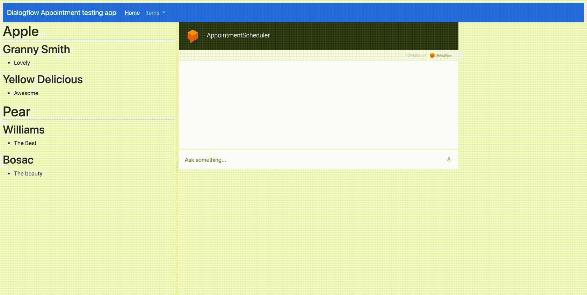


## Dialog flow Integration with Dialogflow Messenger
```

<script src="https://www.gstatic.com/dialogflow-console/fast/messenger/bootstrap.js?v=1"></script>
<df-messenger
  intent="WELCOME"
  chat-title="AppointmentScheduler"
  agent-id="d6e07c45-1523-4102-bf80-8fea7caf3caa"
  language-code="en"
></df-messenger>

```

- Demo

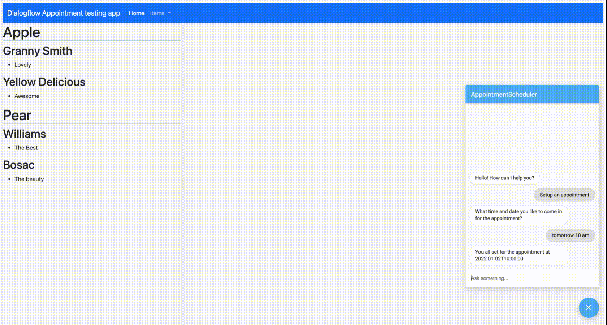


## Entities
- System 
```
@sys.date
@sys.time
@sys.number
@sys.unit-currency
@sys.percentage
@sys.address
@sys.phone-number
@sys.email
@sys.color

```
- Developer
- Session

### Adding Developer Entity

Entity Name|Value|Synonyms|
---|---|---|
AppointmentType|Car Inspection|State Inspection, Vehicle Inspection|
AppointmentType|Scheduled Maintenance|6 months Maintenance, Yearly Maintenance|


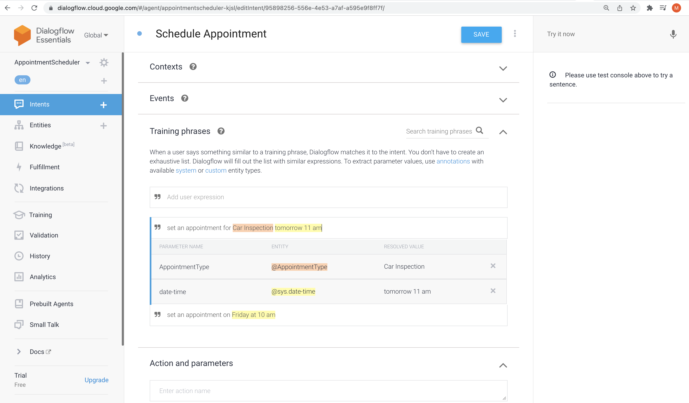
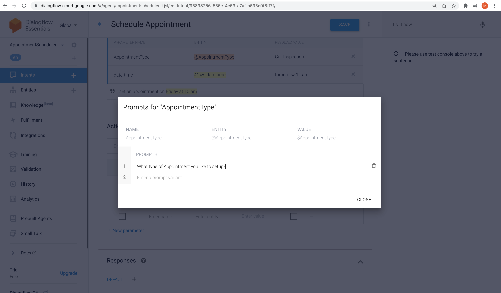
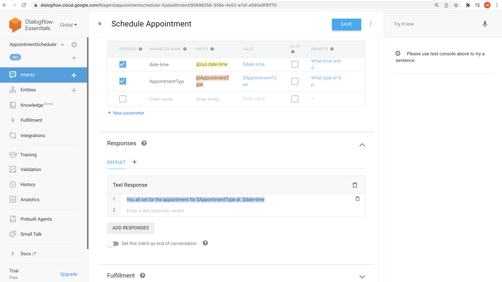


- Demo - slot filling

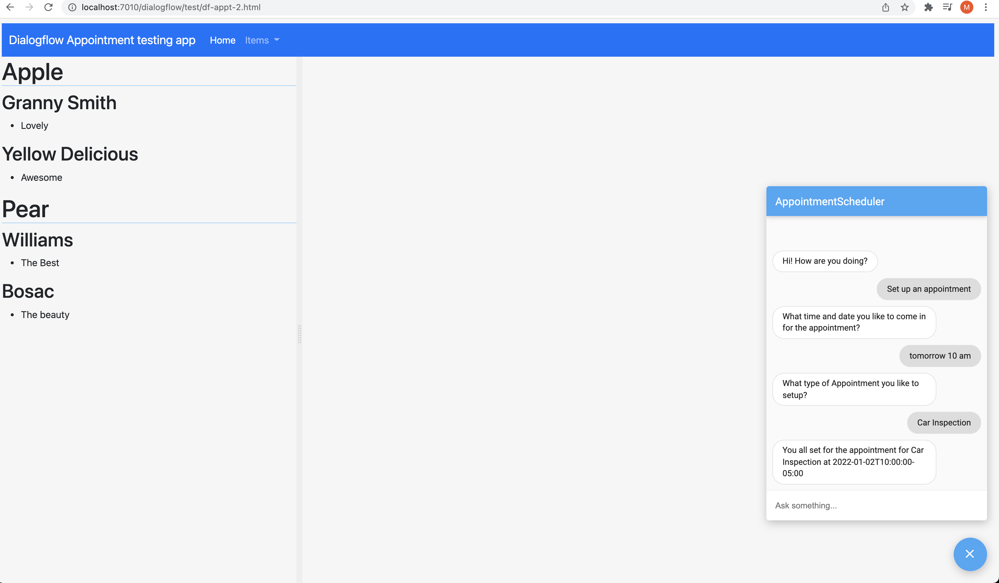


- Session Entity
    - Session ID
    - Have the information collected from the user from the rest of the conversion
    - Say, we can ask the user for the Vehicle Type  and get Toyota Camry, this value will be kept in the rest of the conversion


## Integration options

- One-click telephony BETA
    - Dialogflow Phone Gateway BETA
    - Avaya
    - SignalWire
    - Voximplant
    - AudioCodes
    - Twilio

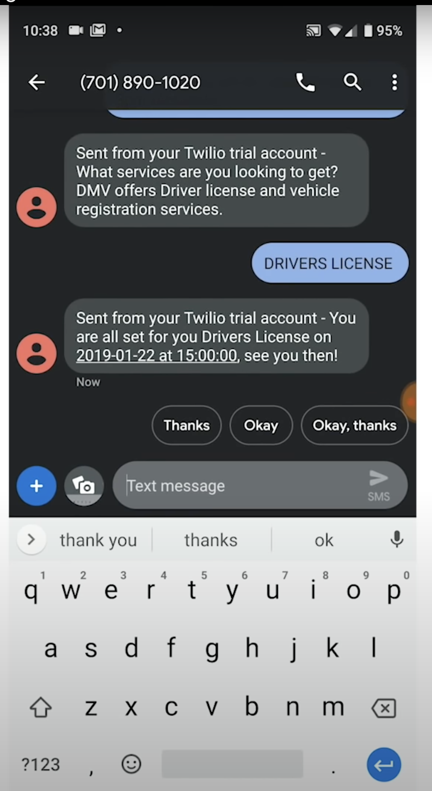
- Telephony
    - Genesys
    - Twilio

- Text Based
    - Web Demo
    -  Dialogflow Messenger BETA
    - Messenger from Facebook
    - Workplace from Facebook BETA
    - Slack
    - Telegram
    - LINE


## Fulfillment - Integration with Google Calendar
Intent|Fulfillment|Comments|
---|---|---|
Intent-1|BizLogic-1|
Intent-2|BizLogic-2|

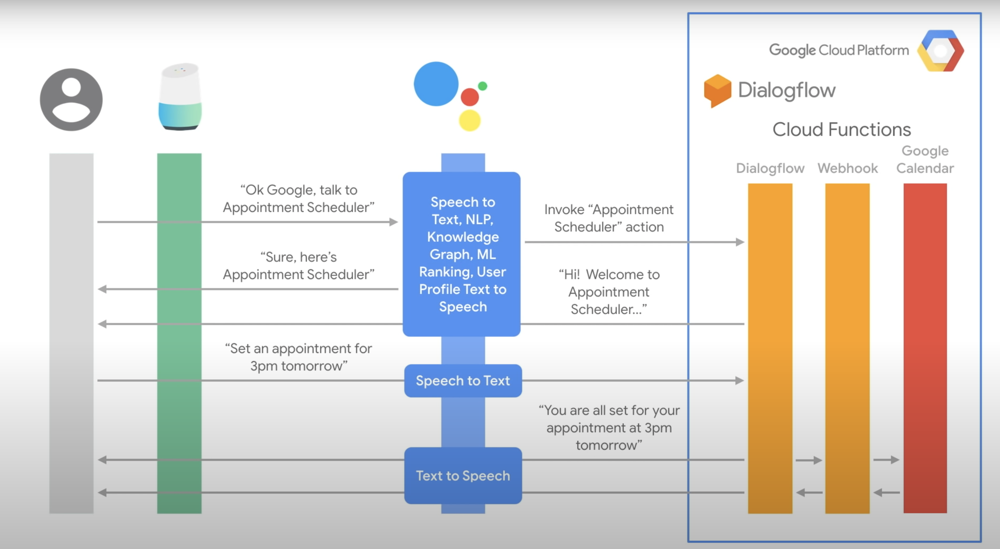

- webhook into Google Calendar

> The web service (in our case Google Calendar) will receive a POST request from Dialogflow in the form of the response to a user query matched by intents with webhook enabled. 


```json

{
  "type": "service_account",
  "project_id": "projectid",
  "private_key_id": "sk id here",
  "private_key": "sk here",
  "client_email": "appointmentscheduler-kjsl@appspot.gserviceaccount.com",
  "client_id": "102792484459978676466",
  "auth_uri": "https://accounts.google.com/o/oauth2/auth",
  "token_uri": "https://oauth2.googleapis.com/token",
  "auth_provider_x509_cert_url": "https://www.googleapis.com/oauth2/v1/certs",
  "client_x509_cert_url": "https://www.googleapis.com/robot/v1/metadata/x509/xyz-kjsl%40appspot.gserviceaccount.com"
}


```

```json
{
  "name": "dialogflowFirebaseFulfillment",
  "description": "This is the default fulfillment for a Dialogflow agents using Cloud Functions for Firebase",
  "version": "0.0.1",
  "private": true,
  "license": "Apache Version 2.0",
  "author": "Google Inc.",
  "engines": {
    "node": "10"
  },
  "scripts": {
    "start": "firebase serve --only functions:dialogflowFirebaseFulfillment",
    "deploy": "firebase deploy --only functions:dialogflowFirebaseFulfillment"
  },
  "dependencies": {
    "actions-on-google": "^2.2.0",
    "firebase-admin": "^5.13.1",
    "firebase-functions": "^2.0.2",
    "dialogflow": "^0.6.0",
    "dialogflow-fulfillment": "^0.5.0"
  }
}
```

```js
/**
 * Copyright 2017 Google Inc. All Rights Reserved.
 *
 * Licensed under the Apache License, Version 2.0 (the "License");
 * you may not use this file except in compliance with the License.
 * You may obtain a copy of the License at
 *
 *      http://www.apache.org/licenses/LICENSE-2.0
 *
 * Unless required by applicable law or agreed to in writing, software
 * distributed under the License is distributed on an "AS IS" BASIS,
 * WITHOUT WARRANTIES OR CONDITIONS OF ANY KIND, either express or implied.
 * See the License for the specific language governing permissions and
 * limitations under the License.
 */

 'use strict';

 const functions = require('firebase-functions');
 const {google} = require('googleapis');
 const {WebhookClient} = require('dialogflow-fulfillment');
 
 // Enter your calendar ID below and service account JSON below
 const calendarId = "xyx@group.calendar.google.com";
 const serviceAccount = "xyx-kjsl@appspot.gserviceaccount.com"; // Starts with {"type": "service_account",...
 
 // Set up Google Calendar Service account credentials
 const serviceAccountAuth = new google.auth.JWT({
   email: serviceAccount.client_email,
   key: serviceAccount.private_key,
   scopes: 'https://www.googleapis.com/auth/calendar'
 });
 
 const calendar = google.calendar('v3');
 process.env.DEBUG = 'dialogflow:*'; // enables lib debugging statements
 
 const timeZone = 'America/New_York';
 const timeZoneOffset = '-05:00';
 
 exports.dialogflowFirebaseFulfillment = functions.https.onRequest((request, response) => {
   const agent = new WebhookClient({ request, response });
   console.log("Parameters", agent.parameters);
   const appointment_type = agent.parameters.AppointmentType
   function makeAppointment (agent) {
     // Calculate appointment start and end datetimes (end = +1hr from start)
     //console.log("Parameters", agent.parameters.date);
     const dateTimeStart = new Date(Date.parse(agent.parameters.date.split('T')[0] + 'T' + agent.parameters.time.split('T')[1].split('-')[0] + timeZoneOffset));
     const dateTimeEnd = new Date(new Date(dateTimeStart).setHours(dateTimeStart.getHours() + 1));
     const appointmentTimeString = dateTimeStart.toLocaleString(
       'en-US',
       { month: 'long', day: 'numeric', hour: 'numeric', timeZone: timeZone }
     );
 
     // Check the availibility of the time, and make an appointment if there is time on the calendar
     return createCalendarEvent(dateTimeStart, dateTimeEnd, appointment_type).then(() => {
       agent.add(`Ok, let me see if we can fit you in. ${appointmentTimeString} is fine!.`);
     }).catch(() => {
       agent.add(`I'm sorry, there are no slots available for ${appointmentTimeString}.`);
     });
   }
 
   let intentMap = new Map();
   intentMap.set('Schedule Appointment', makeAppointment);
   agent.handleRequest(intentMap);
 });
 
 
 
 function createCalendarEvent (dateTimeStart, dateTimeEnd, appointment_type) {
   return new Promise((resolve, reject) => {
     calendar.events.list({
       auth: serviceAccountAuth, // List events for time period
       calendarId: calendarId,
       timeMin: dateTimeStart.toISOString(),
       timeMax: dateTimeEnd.toISOString()
     }, (err, calendarResponse) => {
       // Check if there is a event already on the Calendar
       if (err || calendarResponse.data.items.length > 0) {
         reject(err || new Error('Requested time conflicts with another appointment'));
       } else {
         // Create event for the requested time period
         calendar.events.insert({ auth: serviceAccountAuth,
           calendarId: calendarId,
           resource: {summary: appointment_type +' Appointment', description: appointment_type,
             start: {dateTime: dateTimeStart},
             end: {dateTime: dateTimeEnd}}
         }, (err, event) => {
           err ? reject(err) : resolve(event);
         }
         );
       }
     });
   });
 }
 ```


## Dialogflow Integration with Google Assistant Actions

- Actions in Google
    - Way to extend the functionality of Google Assistant
    - We can reach 500 million devices that support Google Assistant
        - Smart speakers
        - Phones
        - Cars
        - TVs
        - Watches


## Knowledge Base Support in Dialogflow chatbots

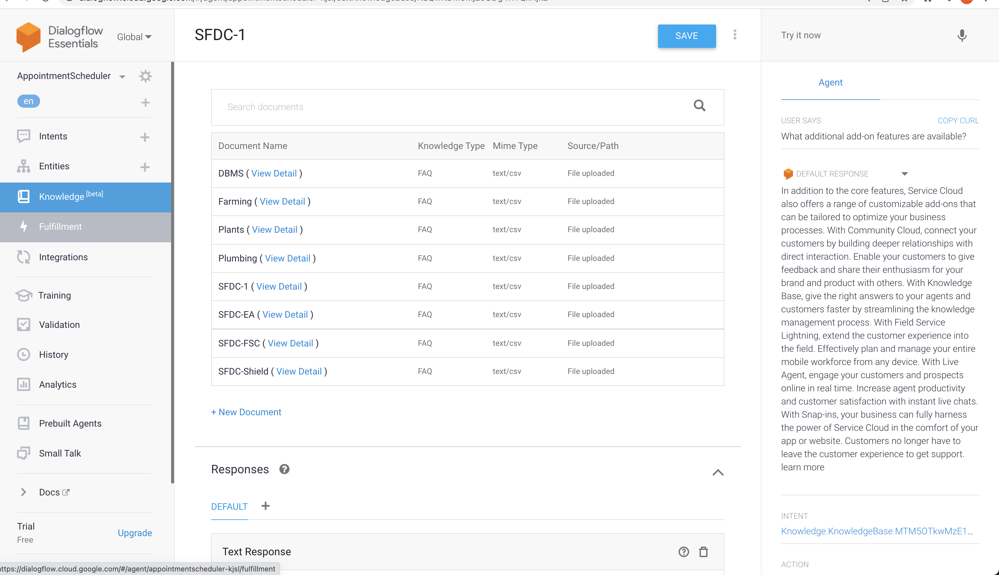

- Demo
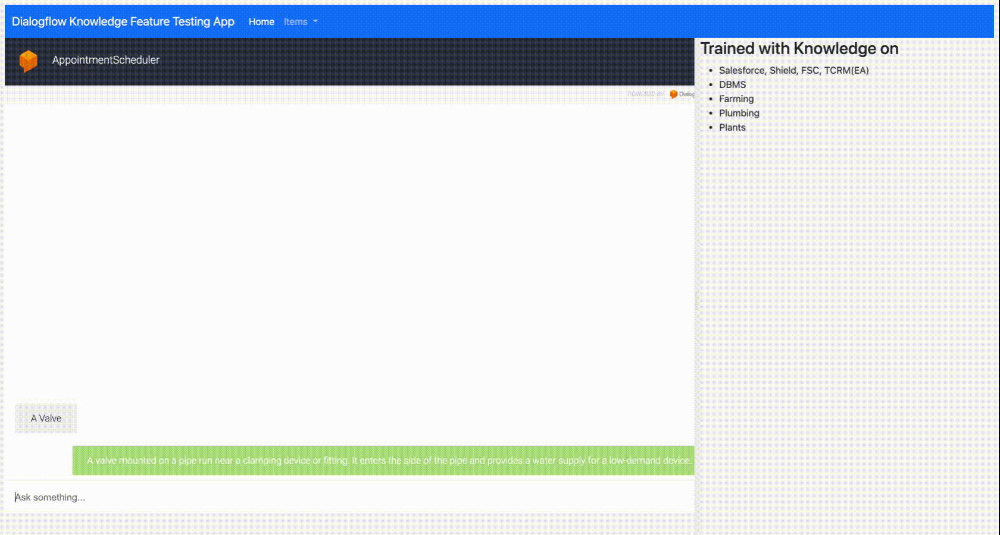

<iframe width="560" height="315" src="https://www.youtube.com/embed/J8ttQ1Veo_I" title="YouTube video player" frameborder="0" allow="accelerometer; autoplay; clipboard-write; encrypted-media; gyroscope; picture-in-picture" allowfullscreen></iframe>

## Django frontend


- [Django Dialogflow Appointment Scheduler](https://github.com/priyankavergadia/Django-Dialogflow-Appointment-Scheduler)


## Integration with Google Cloud ML 

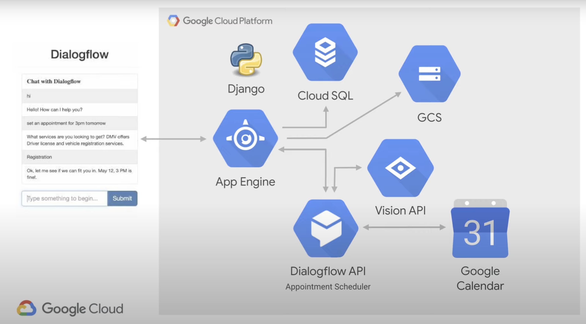


## Dialogflow (CX](https://dialogflow.cloud.google.com/cx/projects)

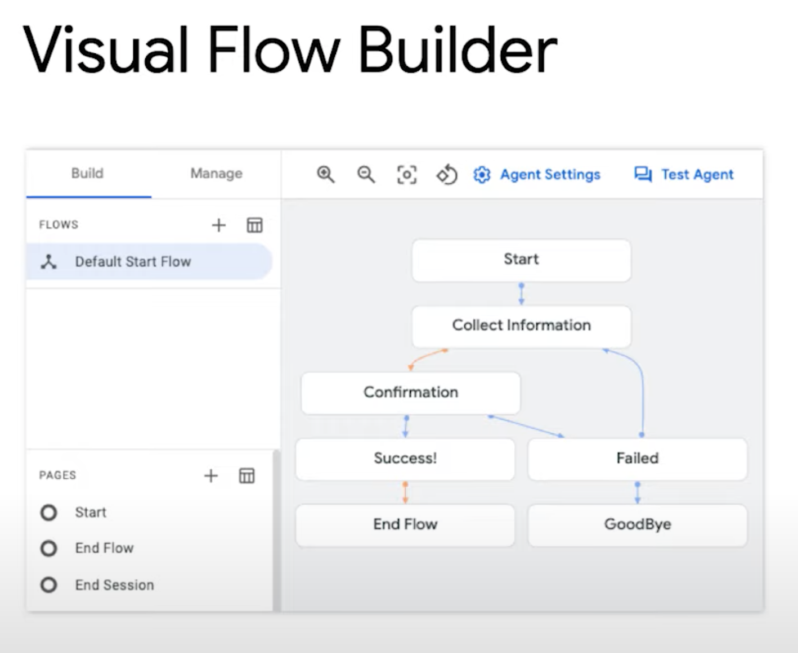
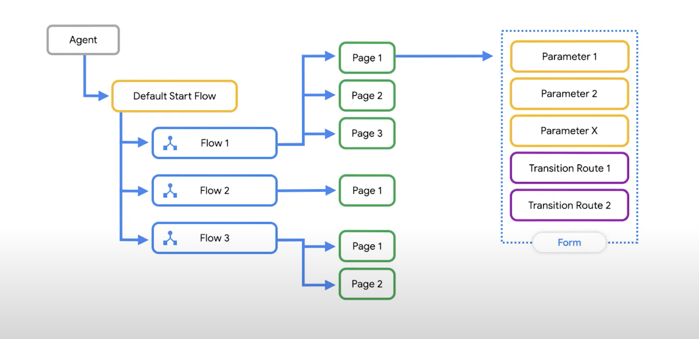

## References
- [Dialogflow](https://cloud.google.com/dialogflow/docs/)


## Videos

- What is Dialog flow
<iframe width="560" height="315" src="https://www.youtube.com/embed/Ov3CDTxZRQc" title="YouTube video player" frameborder="0" allow="accelerometer; autoplay; clipboard-write; encrypted-media; gyroscope; picture-in-picture" allowfullscreen></iframe>

- Intents, Prompts, Appointment Builder
<iframe width="560" height="315" src="https://www.youtube.com/embed/oU88sHd6ilE" title="YouTube video player" frameborder="0" allow="accelerometer; autoplay; clipboard-write; encrypted-media; gyroscope; picture-in-picture" allowfullscreen></iframe>


## References
- [Dialogflow](https://cloud.google.com/dialogflow/docs/)
- [Integration with Sheets API](https://github.com/asrivas/SmartAccountsBot)