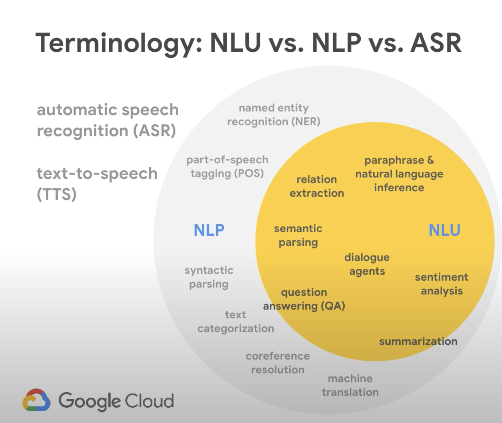
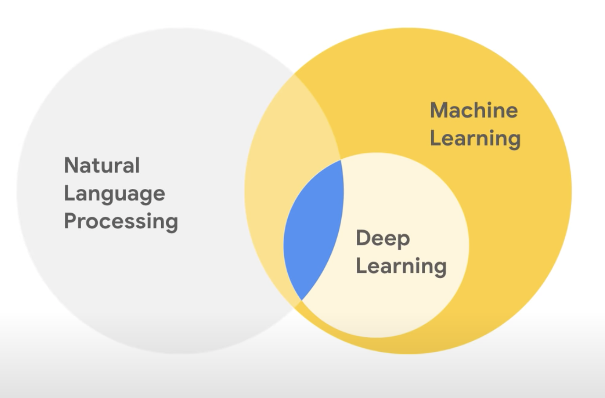
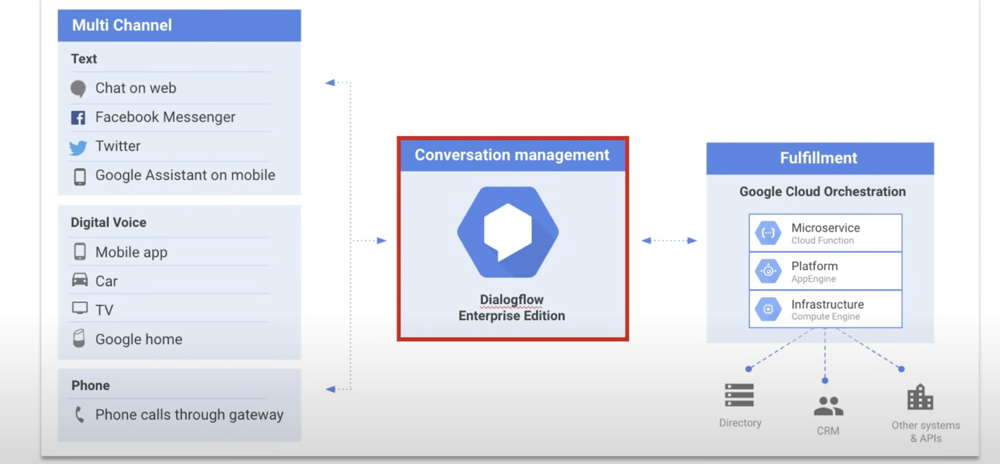
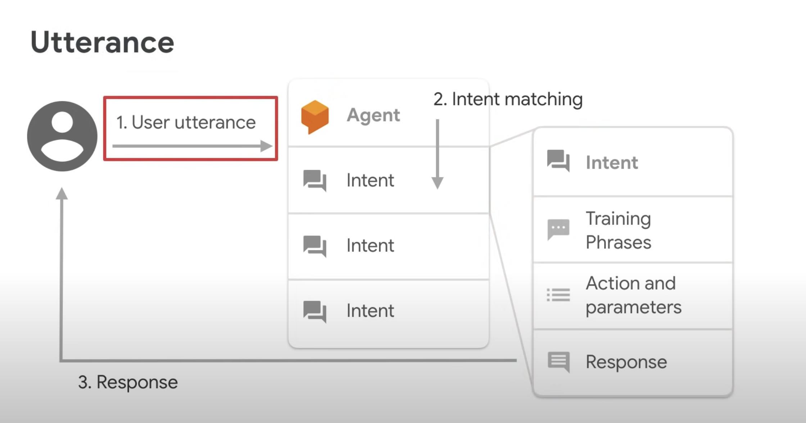

# Dialogflow

> Trying to teach a machine to have conversion is not easy!

> User will ask same thing in a different ways!

User Ask|
---|
What is the forecast tomorrow?|
What is the weather tomorrow?|
What is the weather tomorrow in Boston?|


> Rule based systems to handle this not manageable! We need Natural Language Understanding (NLU)



- NLU works for both voice and text and with help of ML we can make chatbots really useful!






A natural language understanding (NLU) platform that makes it easy to design and integrate a conversational user interface into :

- mobile app
- web application
- device
- bot 
- interactive voice response (IVR) system

 Using Dialogflow, you can provide new and **engaging ways for users to interact** with your product.


 - Translate the Natural Language into machine readable data using ML models trained by the given set of examples.
 - It identifies about what the user is talking about, provides this data to the backend to take actions.


 - The backend performs the actions


 ## Steps


 - Create an Agent (the chatbot application) within Dialogflow

    - Collecting what the **user is saying** and mapping into an **intent**
    - Taking an action on that intent
    - Provide the user with the **response**

- This all starts with a trigger event - **Utterance**
- This is how the user **invokes** the chatbot

 > *Hey Google, what is the temperature at NY City?*  - is an utterance

 > *Hey Google* - is a trigger

   

>  *Hey Google, find the current stock of iPads from Inventory Management*  - is an utterance

> *find the current stock of iPads from Inventory Management* is the invocation phase for the chatbot

> *Inventory Management* is the invocation name


### Key idea
- We need to understand:  *what is the user's intent?*

> User says: *I want to set an appointment*

> *set an appointment* is the **intent**

-----
> User says: *what are your hours of operation*

> *hours of operation* is the **intent**

- We provide Diagflow the different examples of user's intents
    - Diagflow trains a ML model with many more similar phrases 
        - maps the **user phrases** into the **right intent**

### Intent Matching
Training Phrase|Intent|Action and Parameters|
---|---|---|
I want to set an appointment|set an appointment|```set_appointment()```|
what are your hours of operation|hours of operation|```get_hoursOfOperation()```|

- Parameters define **variables** we need to **collect and store**


### Example

User Phrase|Intent|Entities|Action and Parameters|Backend|
---|---|---|---|---|
I want to set an appointment at 10am tomorrow |set an appointment|10am, tomorrow|```set_appointment("10", "tomorrow)```|Provide a dynamic response|
Good Morning|greeting||```greet()```|Provide a static response: *I am doing well*|


### Context
- is the method for the chatbot to store and access **variables**  so it can **exchange** information from one intent to another in a conversation.


## Dialogflow types of entities

- 


## Play with Dialogflow

- Dialogflow creates GCP project to access logs and Cloud functions

- Intents are mappings between a user's queries and actions fulfilled by your software. 


  
> User: good morning!

> Bot: Hi! How are you doing?

User|Bot|Intent|Action|Sentiment|
---|---|
good morning!|Hi! How are you doing?|Default Welcome Intent|input.welcome|Query Score: 0.9|
weather in Boston now|Sorry, what was that?|Default Fallback Intent|input.unknown|Query Score: 0.1|

- Resource URL
```
 https://dialogflow.googleapis.com/v2/projects/appointmentscheduler-kjsl/agent/sessions/bcef58f8-e2ad-0641-7655-06f1945f3713:detectIntent

```

- Request Payload
```json
{
  "queryInput": {
    "text": {
      "text": "good morning!",
      "languageCode": "en"
    }
  },
  "queryParams": {
    "source": "DIALOGFLOW_CONSOLE",
    "timeZone": "America/New_York",
    "sentimentAnalysisRequestConfig": {
      "analyzeQueryTextSentiment": true
    }
  }
}
```

- Response
```json

{
  "responseId": "0d8654f4-6b6e-4ac5-b99c-1054bcc653b3-e9fa6883",
  "queryResult": {
    "queryText": "good morning!",
    "action": "input.welcome",
    "parameters": {},
    "allRequiredParamsPresent": true,
    "fulfillmentText": "Hello! How can I help you?",
    "fulfillmentMessages": [
      {
        "text": {
          "text": [
            "Hello! How can I help you?"
          ]
        }
      }
    ],
    "intent": {
      "name": "projects/appointmentscheduler-kjsl/agent/intents/ef927e0a-b805-4ada-9936-90aa79d710a5",
      "displayName": "Default Welcome Intent"
    },
    "intentDetectionConfidence": 0.4507024,
    "languageCode": "en",
    "sentimentAnalysisResult": {
      "queryTextSentiment": {
        "score": 0.9,
        "magnitude": 0.9
      }
    }
  }
}
```
 


### Response for "weather in Boston now"

```json
{
  "responseId": "1dbd8e9d-3440-40e6-9605-67e84e7b2b0c-e9fa6883",
  "queryResult": {
    "queryText": "weather in Boston now",
    "action": "input.unknown",
    "parameters": {},
    "allRequiredParamsPresent": true,
    "fulfillmentText": "Say that one more time?",
    "fulfillmentMessages": [
      {
        "text": {
          "text": [
            "Say that one more time?"
          ]
        }
      }
    ],
    "outputContexts": [
      {
        "name": "projects/appointmentscheduler-kjsl/agent/sessions/bcef58f8-e2ad-0641-7655-06f1945f3713/contexts/__system_counters__",
        "lifespanCount": 1,
        "parameters": {
          "no-match": 2,
          "no-input": 0
        }
      }
    ],
    "intent": {
      "name": "projects/appointmentscheduler-kjsl/agent/intents/40d635ef-6274-4141-b6b3-7971c6866f53",
      "displayName": "Default Fallback Intent",
      "isFallback": true
    },
    "intentDetectionConfidence": 1,
    "languageCode": "en",
    "sentimentAnalysisResult": {
      "queryTextSentiment": {
        "score": 0.1,
        "magnitude": 0.1
      }
    }
  }
}
```


## Create Intent - Schedule Appointment

- Train the intent with what your users will say
- Provide examples of how users will express their intent in natural language. 
- Adding **numerous phrases** with different **variations and parameters** will improve the **accuracy** of intent matching.

Intent training phrase|Parameter Name|Entity|Resolved Value|
---|---|---|---|
set an appointment on Friday at 10 am|date-time|@sys.data-time|Friday at 10 am|


### Response for 
```
set an appointment on Tuesday at 9 am

```

```json
{
  "responseId": "676ca009-4f19-4e68-ac50-4f8db3c07fca-e9fa6883",
  "queryResult": {
    "queryText": "set an appointment on Tuesday at 9 am",
    "parameters": {
      "date-time": {
        "date_time": "2022-01-04T09:00:00-05:00"
      }
    },
    "allRequiredParamsPresent": true,
    "fulfillmentText": "You all set for the appointment at  2022-01-04T09:00:00",
    "fulfillmentMessages": [
      {
        "text": {
          "text": [
            "You all set for the appointment at  2022-01-04T09:00:00"
          ]
        }
      }
    ],
    "intent": {
      "name": "projects/appointmentscheduler-kjsl/agent/intents/95898256-556e-4e53-a7af-a595e9f8ff7f",
      "displayName": "Schedule Appointment"
    },
    "intentDetectionConfidence": 1,
    "languageCode": "en",
    "sentimentAnalysisResult": {
      "queryTextSentiment": {}
    }
  }
}
```

User|Bot|Intent|Action|Sentiment|Comments
---|---|---|---|--|---|
set an appointment on Tuesday at 9 am|You all set for the appointment at 2022-01-04T09:00:00|Schedule Appointment|Not Available, Parameter:```date-time```, Value:```{ "date_time": "2022-01-04T09:00:00-05:00" }```|Query Score: 0.0||
set an appointment|Not Available|Schedule Appointment|Not Available, Parameter:```date-time```, Value:``` ```|Query Score: 0.0|missing date-time, requires **slot filling**|


 


 


## References
- [Dialogflow](https://cloud.google.com/dialogflow/docs/)


## Videos

<iframe width="560" height="315" src="https://www.youtube.com/embed/Ov3CDTxZRQc" title="YouTube video player" frameborder="0" allow="accelerometer; autoplay; clipboard-write; encrypted-media; gyroscope; picture-in-picture" allowfullscreen></iframe>
