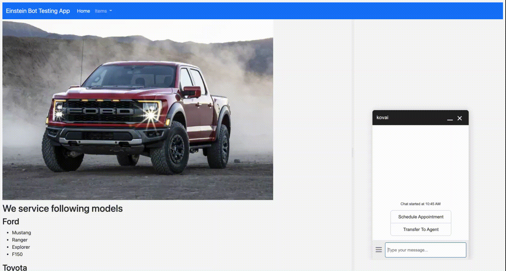

# Einstein Bots

## Simple setup
Licenses required
- Service Cloud
- A Chat license
- Enable Lightning Experience
- Click the toggle on the Einstein Bots Setup page


- Chat API Endpoint
```
https://d.la4-c1-ia4.salesforceliveagent.com/chat/rest/

```

- Entities
    - the bot to ask a question and then store the answer in a variable to use later. But first we need to set up an entity.

- Variable
    - A variable is a container that stores a specific piece of data collected from the customer. 


## Demo


## Appointment Scheduler 

### Flow
```

flowchart TB
    O[Appointment Menu] -->A[Schedule Appointment] --> B[What time you like to set up the appointment?]
    O -->Z[Transfer To Agent] 
    B --> C{Get Appointment Date and Time}
    C --> D[What type of appointment?] 
    D -->  E{Get Appointment Type}
    E -->  F[What type of car you have?]
    F -->  G{Get Car Type}
    G -->  H[You are all set for your appointment \non ApptDateTime \nfor appointmentType for your car Car_Type]

```

## Proposed Bot Def
```yaml

name: Kovai
ver: 1.0.0
description: Bot able to provide appointment management and take actions at the CRM system
menus:
  mainMenu: 
    - Appointment Booking
    - Transfer to an Agent
  AppointMenu:
    - question: What time and date you like to book the appointment?
        answer: 
          - Tomorrow 10 am
          - Tuesday 11 am
          - Next week Wednesday 12 noon
        entities:
           type:  sys.DateTime
           name: $AppointmentDateTime

    - question: What type of appointment type you need?
        menu:
          - Car Inspection
          - Car Maintenance
        entities:
          type: String
          name: $AppointmentType 
    - question: What type of car you have?
        menu:
          - Ford F-150
          - Ford Explorer
          - Toyota Camry
          - Toyota Corolla
        entities:
          type: String
          name :$CarType

    - response: |-
                 You are all set with your appointment on $AppointmentDateTime
                for $AppointmentType  for your $CarType


```


### Setup


### Demo 



<iframe width="560" height="315" src="https://www.youtube.com/embed/3wDpNNMu6Y0" title="YouTube video player" frameborder="0" allow="accelerometer; autoplay; clipboard-write; encrypted-media; gyroscope; picture-in-picture" allowfullscreen></iframe>


## Channels supported

Einstein Bots support the following channels: 
- Chat (In-App and Web) 
- Messaging 
    - SMS
    - Facebook Messenger
    - WhatsApp channels 


## Bot [metadata](https://github.com/mohan-chinnappan-n/cli-dx/blob/master/metadata/Bot/bot.md)

```
sfdx mohanc:mdapi:list -u mohan.chinnappan.n_ea2@gmail.com -t Bot
```

```
{
  result: [
    {
      createdById: '0053h000002xQ5sAAE',
      createdByName: 'Mohan Chinnappan',
      createdDate: 2021-06-03T01:01:58.000Z,
      fileName: 'bots/kovai.bot',
      fullName: 'kovai',
      id: '0Xx3h000000H4T0CAK',
      lastModifiedById: '0053h000002xQ5sAAE',
      lastModifiedByName: 'Mohan Chinnappan',
      lastModifiedDate: 2021-06-03T01:01:58.000Z,
      type: 'Bot'
    }
  ]
}

```


```

sfdx mohanc:mdapi:retrieve -u mohan.chinnappan.n_ea2@gmail.com -t Bot
```

```
{
    "RetrieveRequest": {
        "apiVersion": "53.0",
        "unpackaged": [
            {
                "types": {
                    "members": "*",
                    "name": "Bot"
                }
            }
        ]
    }
}
{ result: { done: false, id: '09S3h000005rNsXEAU', state: 'Queued' } }
```

```
 sfdx mohanc:mdapi:checkRetrieveStatus  -u mohan.chinnappan.n_ea2@gmail.com -i 09S3h000005rNsXEAU 
```

```
[
  {
    createdById: '0053h000002xQ5sAAE',
    createdByName: 'Mohan Chinnappan',
    createdDate: 2021-06-03T01:01:58.000Z,
    fileName: 'unpackaged/bots/kovai.bot',
    fullName: 'kovai',
    id: '0Xx3h000000H4T0CAK',
    lastModifiedById: '0053h000002xQ5sAAE',
    lastModifiedByName: 'Mohan Chinnappan',
    lastModifiedDate: 2021-06-03T01:01:58.000Z,
    type: 'Bot'
  },
  {
    createdById: '0053h000002xQ5sAAE',
    createdByName: 'Mohan Chinnappan',
    createdDate: 2022-01-03T20:43:32.647Z,
    fileName: 'unpackaged/package.xml',
    fullName: 'unpackaged/package.xml',
    id: '',
    lastModifiedById: '0053h000002xQ5sAAE',
    lastModifiedByName: 'Mohan Chinnappan',
    lastModifiedDate: 2022-01-03T20:43:32.647Z,
    manageableState: 'unmanaged',
    type: 'Package'
  }
]
=== Writing zipFile base64 content to 09S3h000005rNsXEAU.zip.txt ...
=== Writing zipFile binary content to 09S3h000005rNsXEAU.zip ... 


```

```
unzip 09S3h000005rNsXEAU.zip
Archive:  09S3h000005rNsXEAU.zip
  inflating: unpackaged/bots/kovai.bot  
  inflating: unpackaged/package.xml  

```

```
├── 09S3h000005rNsXEAU.zip
├── 09S3h000005rNsXEAU.zip.txt
└── unpackaged
    ├── bots
    │   └── kovai.bot
    └── package.xml

```

```xml
cat unpackaged/bots/kovai.bot 
<?xml version="1.0" encoding="UTF-8"?>
<Bot xmlns="http://soap.sforce.com/2006/04/metadata">
    <botMlDomain>
        <label>kovai</label>
        <mlIntents>
            <developerName>Confused</developerName>
            <label>Confused</label>
        </mlIntents>
        <mlIntents>
            <developerName>Transfer_To_Agent</developerName>
            <label>Transfer To Agent</label>
        </mlIntents>
        <mlSlotClasses>
            <dataType>Text</dataType>
            <developerName>appointment_type</developerName>
            <extractionRegex>.*</extractionRegex>
            <extractionType>Pattern</extractionType>
            <label>appointment type</label>
        </mlSlotClasses>
        <mlSlotClasses>
            <dataType>Text</dataType>
            <developerName>Car_Type</developerName>
            <extractionRegex>.*</extractionRegex>
            <extractionType>Pattern</extractionType>
            <label>Car Type</label>
        </mlSlotClasses>
        <mlSlotClasses>
            <dataType>Text</dataType>
            <description>Memory size</description>
            <developerName>Memory_size</developerName>
            <extractionRegex>[1-9][0-9]*</extractionRegex>
            <extractionType>Pattern</extractionType>
            <label>Memory size</label>
        </mlSlotClasses>
        <name>kovai</name>
    </botMlDomain>
    <botVersions>
        <fullName>v1</fullName>
        <botDialogs>
            <botSteps>
                <conversationRecordLookup>
                    <SObjectType>Contact</SObjectType>
                    <conditions>
                        <leftOperand>Contact.LastName</leftOperand>
                        <operatorType>Contains</operatorType>
                        <rightOperandName>LastName</rightOperandName>
                        <rightOperandType>ConversationVariable</rightOperandType>
                        <sortOrder>1</sortOrder>
                    </conditions>
                    <filterLogic>And</filterLogic>
                    <lookupFields>
                        <fieldName>Contact.Birthdate</fieldName>
                    </lookupFields>
                    <maxLookupResults>3</maxLookupResults>
                    <targetVariableName>ListVar</targetVariableName>
                </conversationRecordLookup>
                <stepIdentifier>33b7e5b2-e600-449d-ad6c-977980f017fd</stepIdentifier>
                <type>RecordLookup</type>
            </botSteps>
            <botSteps>
                <stepIdentifier>7bee15be-3454-49a9-a954-da9ec6d8ca1e</stepIdentifier>
                <type>Wait</type>
            </botSteps>
            <developerName>Check_My_Order</developerName>
            <label>Find  Birth Date</label>
            <showInFooterMenu>false</showInFooterMenu>
        </botDialogs>
        <botDialogs>
            <botSteps>
                <botMessages>
                    <message>We will fix it soon!</message>
                    <messageIdentifier>9f7211b0-141a-4ac8-a15a-da405e3df903</messageIdentifier>
                </botMessages>
                <stepIdentifier>bc4b5ba5-d5d7-4e49-a3ea-e181d6b98aa8</stepIdentifier>
                <type>Message</type>
            </botSteps>
            <botSteps>
                <stepIdentifier>6d4435bf-c2cb-4dda-a0f9-9915213e766e</stepIdentifier>
                <type>Wait</type>
            </botSteps>
            <developerName>Printer_not_working</developerName>
            <label>Printer not working</label>
            <showInFooterMenu>false</showInFooterMenu>
        </botDialogs>
        <botDialogs>
            <botSteps>
                <botVariableOperation>
                    <askCollectIfSet>false</askCollectIfSet>
                    <botMessages>
                        <message>How much memory</message>
                        <messageIdentifier>ad3b8a35-52b2-4dda-b19d-d427c121bc21</messageIdentifier>
                    </botMessages>
                    <botQuickReplyOptions>
                        <literalValue>6 GB</literalValue>
                        <quickReplyOptionIdentifier>be9aba98-d1ad-43a8-8919-8ff93dcc653a</quickReplyOptionIdentifier>
                    </botQuickReplyOptions>
                    <botQuickReplyOptions>
                        <literalValue>12 GB</literalValue>
                        <quickReplyOptionIdentifier>09772c46-ac87-4606-8dfc-6151be0f7392</quickReplyOptionIdentifier>
                    </botQuickReplyOptions>
                    <botQuickReplyOptions>
                        <literalValue>16 GB</literalValue>
                        <quickReplyOptionIdentifier>763e8f95-937d-4d6a-b293-b5efdbcd6e39</quickReplyOptionIdentifier>
                    </botQuickReplyOptions>
                    <botQuickReplyOptions>
                        <literalValue>32 GB</literalValue>
                        <quickReplyOptionIdentifier>f6155fa2-9a94-4062-a58f-3480bb49dd64</quickReplyOptionIdentifier>
                    </botQuickReplyOptions>
                    <botVariableOperands>
                        <disableAutoFill>false</disableAutoFill>
                        <sourceName>Memory_size</sourceName>
                        <sourceType>MlSlotClass</sourceType>
                        <targetName>Memory_Size</targetName>
                        <targetType>ConversationVariable</targetType>
                    </botVariableOperands>
                    <optionalCollect>false</optionalCollect>
                    <quickReplyType>Static</quickReplyType>
                    <quickReplyWidgetType>Buttons</quickReplyWidgetType>
                    <retryMessages>
                        <message>Please provide memory size in GB</message>
                        <messageIdentifier>cde1f4ca-5d67-4792-ac54-a6ae49ff7f99</messageIdentifier>
                    </retryMessages>
                    <type>Collect</type>
                    <variableOperationIdentifier>4c5b98ee-95ac-4d5d-9700-95cfa31c269e</variableOperationIdentifier>
                </botVariableOperation>
                <stepIdentifier>3bb7b606-69ec-4d2c-9616-8bb1419efc5a</stepIdentifier>
                <type>VariableOperation</type>
            </botSteps>
            <botSteps>
                <conversationSystemMessage>
                    <type>Transfer</type>
                </conversationSystemMessage>
                <stepIdentifier>b299f386-1ff0-4f00-8530-7baf68a7b059</stepIdentifier>
                <type>SystemMessage</type>
            </botSteps>
            <developerName>Find_a_MacBook_Pro</developerName>
            <label>Find a MacBook Pro</label>
            <showInFooterMenu>false</showInFooterMenu>
        </botDialogs>
        <botDialogs>
            <botSteps>
                <botMessages>
                    <message>Hi, I’m &apos;kovai&apos;,  your digital assistant.</message>
                    <messageIdentifier>2426b915-4efd-426d-be46-c45713d7ed44</messageIdentifier>
                </botMessages>
                <stepIdentifier>c419550f-92e8-47d4-a127-9f0aaf0507df</stepIdentifier>
                <type>Message</type>
            </botSteps>
            <botSteps>
                <botMessages>
                    <message>Let me offer you options</message>
                    <messageIdentifier>6b789c42-4d45-4b96-84ab-2971cfcf68a8</messageIdentifier>
                </botMessages>
                <stepIdentifier>ce9bfdd6-7993-48fd-abf4-f87b3d7efcf7</stepIdentifier>
                <type>Message</type>
            </botSteps>
            <botSteps>
                <botNavigation>
                    <botNavigationLinks>
                        <targetBotDialog>Main_Menu</targetBotDialog>
                    </botNavigationLinks>
                    <type>Redirect</type>
                </botNavigation>
                <stepIdentifier>85da64be-da77-4965-b978-2fa8488d758b</stepIdentifier>
                <type>Navigation</type>
            </botSteps>
            <developerName>Welcome</developerName>
            <label>Welcome</label>
            <showInFooterMenu>false</showInFooterMenu>
        </botDialogs>
        <botDialogs>
            <botSteps>
                <botNavigation>
                    <botNavigationLinks>
                        <label>Check My Order</label>
                        <targetBotDialog>Check_My_Order</targetBotDialog>
                    </botNavigationLinks>
                    <botNavigationLinks>
                        <label>Printer not working</label>
                        <targetBotDialog>Printer_not_working</targetBotDialog>
                    </botNavigationLinks>
                    <botNavigationLinks>
                        <label>Find a MacBook Pro</label>
                        <targetBotDialog>Find_a_MacBook_Pro</targetBotDialog>
                    </botNavigationLinks>
                    <type>Redirect</type>
                </botNavigation>
                <stepIdentifier>3d40fef7-a514-4c68-957b-ba2f3f9f0776</stepIdentifier>
                <type>Navigation</type>
            </botSteps>
            <developerName>Main_Menu</developerName>
            <label>Main Menu</label>
            <showInFooterMenu>true</showInFooterMenu>
        </botDialogs>
        <botDialogs>
            <botSteps>
                <botMessages>
                    <message>Transferring to the  Agent</message>
                    <messageIdentifier>c76163dc-a4f3-47f5-890e-17de71f73006</messageIdentifier>
                </botMessages>
                <stepIdentifier>31b86047-f3e8-4eb5-9595-e41d45588cf5</stepIdentifier>
                <type>Message</type>
            </botSteps>
            <botSteps>
                <conversationSystemMessage>
                    <type>Transfer</type>
                </conversationSystemMessage>
                <stepIdentifier>17a17172-c762-427d-ab07-ec23001781c6</stepIdentifier>
                <type>SystemMessage</type>
            </botSteps>
            <developerName>Transfer_To_Agent</developerName>
            <label>Transfer To Agent</label>
            <mlIntent>Transfer_To_Agent</mlIntent>
            <mlIntentTrainingEnabled>false</mlIntentTrainingEnabled>
            <showInFooterMenu>true</showInFooterMenu>
        </botDialogs>
        <botDialogs>
            <botSteps>
                <botMessages>
                    <message>Goodbye! Click the &quot;End Chat&quot; button to end this chat</message>
                    <messageIdentifier>c11e71d1-bdcf-45c6-a8e4-cc7c5b97d134</messageIdentifier>
                </botMessages>
                <stepIdentifier>1c06aad9-d63c-4e47-88e4-58f3af6b858e</stepIdentifier>
                <type>Message</type>
            </botSteps>
            <botSteps>
                <stepIdentifier>fd33a42e-c466-4f9e-8c5e-ad53c3bdf81a</stepIdentifier>
                <type>Wait</type>
            </botSteps>
            <developerName>End_Chat</developerName>
            <label>End Chat</label>
            <showInFooterMenu>false</showInFooterMenu>
        </botDialogs>
        <botDialogs>
            <botSteps>
                <botMessages>
                    <message>Sorry, I didn&apos;t understand the your request</message>
                    <messageIdentifier>653aa7c9-d205-4a52-96b8-543efd760d96</messageIdentifier>
                </botMessages>
                <stepIdentifier>26067502-7f1d-4bed-803f-43ca26c0ba63</stepIdentifier>
                <type>Message</type>
            </botSteps>
            <botSteps>
                <stepIdentifier>51dab797-c78f-41d0-a7b8-c30497a11446</stepIdentifier>
                <type>Wait</type>
            </botSteps>
            <developerName>Confused</developerName>
            <label>Confused</label>
            <mlIntent>Confused</mlIntent>
            <mlIntentTrainingEnabled>false</mlIntentTrainingEnabled>
            <showInFooterMenu>false</showInFooterMenu>
        </botDialogs>
        <botDialogs>
            <botSteps>
                <botMessages>
                    <message>Unfortunately, there are no agents available at the moment</message>
                    <messageIdentifier>8813055e-c518-4dbe-b430-ae02c76e6bf0</messageIdentifier>
                </botMessages>
                <stepIdentifier>4cd74b3f-7fa5-466b-89f5-a37be3ee8794</stepIdentifier>
                <type>Message</type>
            </botSteps>
            <botSteps>
                <stepIdentifier>e15e7024-72e0-4656-a05e-15e0906bec8e</stepIdentifier>
                <type>Wait</type>
            </botSteps>
            <developerName>No_Agent_Available</developerName>
            <label>No Agent</label>
            <showInFooterMenu>false</showInFooterMenu>
        </botDialogs>
        <botDialogs>
            <botSteps>
                <botMessages>
                    <message>Unfortunately, a system error occurred. I&apos;ll connect you to an agent who can help.</message>
                    <messageIdentifier>6bff781a-27bd-4fd3-9a5e-545d54313bd0</messageIdentifier>
                </botMessages>
                <stepIdentifier>390b8657-1e1d-4d5d-af4f-1ca00ca093db</stepIdentifier>
                <type>Message</type>
            </botSteps>
            <botSteps>
                <conversationSystemMessage>
                    <type>Transfer</type>
                </conversationSystemMessage>
                <stepIdentifier>2cd2ecb8-e5d6-490a-a329-8fdd62e5e3ec</stepIdentifier>
                <type>SystemMessage</type>
            </botSteps>
            <developerName>Error_Handling</developerName>
            <label>Error Handler</label>
            <showInFooterMenu>false</showInFooterMenu>
        </botDialogs>
        <botDialogs>
            <botSteps>
                <botVariableOperation>
                    <askCollectIfSet>false</askCollectIfSet>
                    <botMessages>
                        <message>What time you like to set up the appointment?</message>
                        <messageIdentifier>db1c8f72-5d22-e3ac-d940-a9f7cebc43da</messageIdentifier>
                    </botMessages>
                    <botVariableOperands>
                        <disableAutoFill>false</disableAutoFill>
                        <sourceName>_DateTime</sourceName>
                        <sourceType>StandardMlSlotClass</sourceType>
                        <targetName>ApptDateTime</targetName>
                        <targetType>ConversationVariable</targetType>
                    </botVariableOperands>
                    <optionalCollect>false</optionalCollect>
                    <quickReplyWidgetType>Buttons</quickReplyWidgetType>
                    <type>Collect</type>
                    <variableOperationIdentifier>e23fa3b7-c854-1169-4ec7-030cb091a885</variableOperationIdentifier>
                </botVariableOperation>
                <stepIdentifier>b1196beb-46f1-4dcc-b4aa-7486ae4cfd17</stepIdentifier>
                <type>VariableOperation</type>
            </botSteps>
            <botSteps>
                <botNavigation>
                    <botNavigationLinks>
                        <targetBotDialog>Ask_for_appointment_type</targetBotDialog>
                    </botNavigationLinks>
                    <type>Redirect</type>
                </botNavigation>
                <stepIdentifier>3493f124-9a0d-4ac5-965b-d2cccdff72b1</stepIdentifier>
                <type>Navigation</type>
            </botSteps>
            <developerName>Schedule_Appointment</developerName>
            <label>Schedule Appointment</label>
            <showInFooterMenu>true</showInFooterMenu>
        </botDialogs>
        <botDialogs>
            <botSteps>
                <botVariableOperation>
                    <askCollectIfSet>false</askCollectIfSet>
                    <botMessages>
                        <message>What type of appointment</message>
                        <messageIdentifier>4bb7bab9-7ffb-6834-58d4-95fe42586d2d</messageIdentifier>
                    </botMessages>
                    <botQuickReplyOptions>
                        <literalValue>Car Inspection</literalValue>
                        <quickReplyOptionIdentifier>01fca43c-4167-8ce0-4064-ea6014f6d1e4</quickReplyOptionIdentifier>
                    </botQuickReplyOptions>
                    <botQuickReplyOptions>
                        <literalValue>Car Maintenance</literalValue>
                        <quickReplyOptionIdentifier>95203cce-8c74-11ad-04e9-3a7dfed1f24f</quickReplyOptionIdentifier>
                    </botQuickReplyOptions>
                    <botVariableOperands>
                        <disableAutoFill>true</disableAutoFill>
                        <sourceName>appointment_type</sourceName>
                        <sourceType>MlSlotClass</sourceType>
                        <targetName>appointmentType</targetName>
                        <targetType>ConversationVariable</targetType>
                    </botVariableOperands>
                    <optionalCollect>false</optionalCollect>
                    <quickReplyType>Static</quickReplyType>
                    <quickReplyWidgetType>Buttons</quickReplyWidgetType>
                    <type>Collect</type>
                    <variableOperationIdentifier>dcba7bf3-682d-6529-5dc3-20edebeaaf35</variableOperationIdentifier>
                </botVariableOperation>
                <stepIdentifier>7d685414-e474-4bb2-8d9f-0aa9ea3424ea</stepIdentifier>
                <type>VariableOperation</type>
            </botSteps>
            <botSteps>
                <botNavigation>
                    <botNavigationLinks>
                        <targetBotDialog>Ask_for_car_type</targetBotDialog>
                    </botNavigationLinks>
                    <type>Redirect</type>
                </botNavigation>
                <stepIdentifier>d2c2c402-d027-47ef-b281-30f705cc2977</stepIdentifier>
                <type>Navigation</type>
            </botSteps>
            <developerName>Ask_for_appointment_type</developerName>
            <label>Ask for appointment type</label>
            <showInFooterMenu>false</showInFooterMenu>
        </botDialogs>
        <botDialogs>
            <botSteps>
                <botMessages>
                    <message>You are all set for your appointment on {!ApptDateTime} for {!appointmentType} for your car {!Car_Type}</message>
                    <messageIdentifier>118272b0-83ad-e8d8-0de0-92daa0ec9fc9</messageIdentifier>
                </botMessages>
                <stepIdentifier>141c3b77-466e-4f34-b347-f3a5805e7350</stepIdentifier>
                <type>Message</type>
            </botSteps>
            <botSteps>
                <stepIdentifier>947d7297-6c8a-4e5b-a8a5-44d7a847d316</stepIdentifier>
                <type>Wait</type>
            </botSteps>
            <developerName>Confirm_appointment</developerName>
            <label>Confirm appointment</label>
            <showInFooterMenu>false</showInFooterMenu>
        </botDialogs>
        <botDialogs>
            <botSteps>
                <botNavigation>
                    <botNavigationLinks>
                        <targetBotDialog>Schedule_Appointment</targetBotDialog>
                    </botNavigationLinks>
                    <botNavigationLinks>
                        <targetBotDialog>Transfer_To_Agent</targetBotDialog>
                    </botNavigationLinks>
                    <type>Redirect</type>
                </botNavigation>
                <stepIdentifier>dbb09296-4a74-4618-8373-1379fc37041d</stepIdentifier>
                <type>Navigation</type>
            </botSteps>
            <developerName>Appointment_Menu</developerName>
            <label>Appointment Menu</label>
            <showInFooterMenu>true</showInFooterMenu>
        </botDialogs>
        <botDialogs>
            <botSteps>
                <botVariableOperation>
                    <askCollectIfSet>false</askCollectIfSet>
                    <botMessages>
                        <message>What type of car you have?</message>
                        <messageIdentifier>d3eb1be4-a229-eb2f-9f53-17970b8fbd11</messageIdentifier>
                    </botMessages>
                    <botQuickReplyOptions>
                        <literalValue>Toyota: Camry</literalValue>
                        <quickReplyOptionIdentifier>09a8d86c-d225-c99b-148b-e0cd9604c334</quickReplyOptionIdentifier>
                    </botQuickReplyOptions>
                    <botQuickReplyOptions>
                        <literalValue>Toyota: 4Runner</literalValue>
                        <quickReplyOptionIdentifier>d8a40b69-c712-c35d-853d-beeeca9f08ed</quickReplyOptionIdentifier>
                    </botQuickReplyOptions>
                    <botQuickReplyOptions>
                        <literalValue>Ford: Mustang</literalValue>
                        <quickReplyOptionIdentifier>82d97836-9857-0db5-af32-708cbb114586</quickReplyOptionIdentifier>
                    </botQuickReplyOptions>
                    <botQuickReplyOptions>
                        <literalValue>Ford: Ranger</literalValue>
                        <quickReplyOptionIdentifier>f9b16e07-fedb-dd27-e2e0-66c5cd7ea5b8</quickReplyOptionIdentifier>
                    </botQuickReplyOptions>
                    <botQuickReplyOptions>
                        <literalValue>Ford: Explorer</literalValue>
                        <quickReplyOptionIdentifier>f2c96527-1dfa-0e7a-a711-8503d04c53b8</quickReplyOptionIdentifier>
                    </botQuickReplyOptions>
                    <botQuickReplyOptions>
                        <literalValue>Ford: F150</literalValue>
                        <quickReplyOptionIdentifier>7c54b29f-7428-d1c1-e667-6480a74a5702</quickReplyOptionIdentifier>
                    </botQuickReplyOptions>
                    <botVariableOperands>
                        <disableAutoFill>true</disableAutoFill>
                        <sourceName>Car_Type</sourceName>
                        <sourceType>MlSlotClass</sourceType>
                        <targetName>Car_Type</targetName>
                        <targetType>ConversationVariable</targetType>
                    </botVariableOperands>
                    <optionalCollect>false</optionalCollect>
                    <quickReplyType>Static</quickReplyType>
                    <quickReplyWidgetType>Buttons</quickReplyWidgetType>
                    <type>Collect</type>
                    <variableOperationIdentifier>638af6ae-9405-6a15-c328-79e4cf4cd31e</variableOperationIdentifier>
                </botVariableOperation>
                <stepIdentifier>01542a2a-61d4-49cc-962b-0ac52767dae4</stepIdentifier>
                <type>VariableOperation</type>
            </botSteps>
            <botSteps>
                <botNavigation>
                    <botNavigationLinks>
                        <targetBotDialog>Confirm_appointment</targetBotDialog>
                    </botNavigationLinks>
                    <type>Redirect</type>
                </botNavigation>
                <stepIdentifier>98bedd87-e0e3-4b71-8f57-81a79db90dea</stepIdentifier>
                <type>Navigation</type>
            </botSteps>
            <developerName>Ask_for_car_type</developerName>
            <label>Ask for car type</label>
            <showInFooterMenu>false</showInFooterMenu>
        </botDialogs>
        <conversationSystemDialogs>
            <dialog>Error_Handling</dialog>
            <type>ErrorHandling</type>
        </conversationSystemDialogs>
        <conversationSystemDialogs>
            <dialog>No_Agent_Available</dialog>
            <type>TransferFailed</type>
        </conversationSystemDialogs>
        <conversationVariables>
            <dataType>Text</dataType>
            <developerName>appointmentType</developerName>
            <label>appointmentType</label>
        </conversationVariables>
        <conversationVariables>
            <dataType>DateTime</dataType>
            <developerName>ApptDateTime</developerName>
            <label>ApptDateTime</label>
        </conversationVariables>
        <conversationVariables>
            <dataType>Text</dataType>
            <developerName>Car_Type</developerName>
            <label>Car Type</label>
        </conversationVariables>
        <conversationVariables>
            <dataType>Text</dataType>
            <developerName>LastName</developerName>
            <label>LastName</label>
        </conversationVariables>
        <conversationVariables>
            <collectionType>List</collectionType>
            <dataType>Object</dataType>
            <developerName>ListVar</developerName>
            <label>ListVar</label>
        </conversationVariables>
        <conversationVariables>
            <dataType>Text</dataType>
            <developerName>Memory_Size</developerName>
            <label>Memory Size</label>
        </conversationVariables>
        <entryDialog>Appointment_Menu</entryDialog>
        <mainMenuDialog>Schedule_Appointment</mainMenuDialog>
        <nlpProviders>
            <language>en_US</language>
            <nlpProviderType>EinsteinAi</nlpProviderType>
        </nlpProviders>
    </botVersions>
    <contextVariables>
        <contextVariableMappings>
            <SObjectType>LiveChatTranscript</SObjectType>
            <fieldName>LiveChatTranscript.ChatKey</fieldName>
            <messageType>WebChat</messageType>
        </contextVariableMappings>
        <dataType>Text</dataType>
        <developerName>ChatKey</developerName>
        <label>Chat Key</label>
    </contextVariables>
    <contextVariables>
        <contextVariableMappings>
            <SObjectType>LiveChatTranscript</SObjectType>
            <fieldName>LiveChatTranscript.ContactId</fieldName>
            <messageType>WebChat</messageType>
        </contextVariableMappings>
        <dataType>Id</dataType>
        <developerName>ContactId</developerName>
        <label>Contact Id</label>
    </contextVariables>
    <contextVariables>
        <contextVariableMappings>
            <SObjectType>LiveChatTranscript</SObjectType>
            <fieldName>LiveChatTranscript.LiveChatVisitorId</fieldName>
            <messageType>WebChat</messageType>
        </contextVariableMappings>
        <dataType>Id</dataType>
        <developerName>EndUserId</developerName>
        <label>End User Id</label>
    </contextVariables>
    <contextVariables>
        <contextVariableMappings>
            <SObjectType>LiveChatTranscript</SObjectType>
            <fieldName>LiveChatTranscript.Id</fieldName>
            <messageType>WebChat</messageType>
        </contextVariableMappings>
        <dataType>Id</dataType>
        <developerName>RoutableId</developerName>
        <label>Routable Id</label>
    </contextVariables>
    <conversationChannelProviders>
        <agentRequired>false</agentRequired>
        <chatButtonName>botQueueGroup</chatButtonName>
    </conversationChannelProviders>
    <description>A bot from scratch.</description>
    <label>kovai</label>
    <logPrivateConversationData>false</logPrivateConversationData>
    <richContentEnabled>false</richContentEnabled>
</Bot>
```

## References
- [Build an Einstein Bot](https://trailhead.salesforce.com/content/learn/projects/build-an-einstein-bot)
- [Einstein Bots Developer Cookbook](https://developer.salesforce.com/docs/atlas.en-us.bot_cookbook.meta/bot_cookbook/bot_cookbook_first_bot.htm)
- [Deploy Your Bot to Your Channels](https://help.salesforce.com/s/articleView?id=sf.bots_service_deploy_to_channels.htm&type=5)