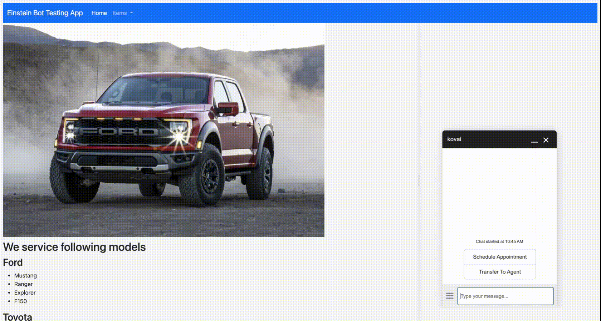

# Einstein Bots

## Simple setup
Licenses required
- Service Cloud
- A Chat license
- Enable Lightning Experience
- Click the toggle on the Einstein Bots Setup page


- Chat API Endpoint
```
https://d.la4-c1-ia4.salesforceliveagent.com/chat/rest/

```

- Entities
    - the bot to ask a question and then store the answer in a variable to use later. But first we need to set up an entity.

- Variable
    - A variable is a container that stores a specific piece of data collected from the customer. 


## Demo


## Appointment Scheduler 

### Flow
```

flowchart TB
    O[Appointment Menu] -->A[Schedule Appointment] --> B[What time you like to set up the appointment?]
    O -->Z[Transfer To Agent] 
    B --> C{Get Appointment Date and Time}
    C --> D[What type of appointment?] 
    D -->  E{Get Appointment Type}
    E -->  F[What type of car you have?]
    F -->  G{Get Car Type}
    G -->  H[You are all set for your appointment \non ApptDateTime \nfor appointmentType for your car Car_Type]

```


### Setup


### Demo 



<iframe width="560" height="315" src="https://www.youtube.com/embed/3wDpNNMu6Y0" title="YouTube video player" frameborder="0" allow="accelerometer; autoplay; clipboard-write; encrypted-media; gyroscope; picture-in-picture" allowfullscreen></iframe>


## References
- [Build an Einstein Bot](https://trailhead.salesforce.com/content/learn/projects/build-an-einstein-bot)
- [Einstein Bots Developer Cookbook](https://developer.salesforce.com/docs/atlas.en-us.bot_cookbook.meta/bot_cookbook/bot_cookbook_first_bot.htm)
- [Deploy Your Bot to Your Channels](https://help.salesforce.com/s/articleView?id=sf.bots_service_deploy_to_channels.htm&type=5)