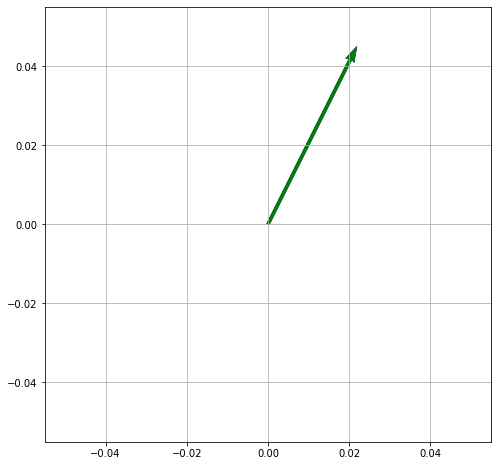
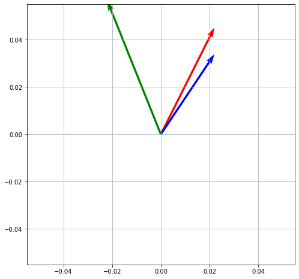

# Eigenvectors 

## Key points

- Matrices as linear transformations
- Determinants 
- Linear Systems
- Change of Bias

### Scalar

- A scalar is a number, like :
    - \\( 2, -5, 0.368 \\)


### Vector
- Vector can be thought of as a **list numbers** (can be in a row or column)
    - has rows **OR** columns
    - 2 numbers for 2D space, such as \\( (2,4) \\)
        - \\( \begin{bmatrix} 2 \\\ 8 \end{bmatrix} \\)  

    - 3 numbers for 3D space, such as \\( (1,2,4) \\)
        -  \\( \begin{bmatrix} 1 \\\ 2 \\\ 4 \end{bmatrix} \\)  
- A vector can be in:
    - magnitude and direction (Polar) form,
    - or in x and y (Cartesian) form

```python

import numpy as np
import matplotlib.pyplot as plt

def plot(V):

  origin = np.array([[0, 0, 0],[0, 0, 0]]) # origin point

  plt.figure(figsize=(8,8)) # 8 inches x 8 inches

  plt.grid()

  # Plot a 2D field of arrows.
  plt.quiver(*origin, V[:,0], V[:,1], color=['r','b','g'], scale=10)
  plt.show()
```

```python
plot(np.array( [ [2,4] ] ) )

```



```python
plot(np.array( [ [2,4], [2,3], [-2, 5] ] ) )
```




### Matrix
- A Matrix is an **array of numbers** (one or more rows, one or more columns)
- Has **rows x columns**
-  \\(  \begin{bmatrix} 1 & 2 & 3 \\\ 4 & 5 & 6 \\\ 7 & 8 & 9 \end{bmatrix}  \\) 

-  \\(  \begin{bmatrix} 1 & 0 & 0 \\\ 0 & 1 & 0 \\\ 0 & 0 & 1 \end{bmatrix}  \\) 

- Note:
    - A vector is also a matrix! 
    - It is special case of a matrix with  just **one row or one column**
    - So the rules that work for matrices also work for vectors.

- We can add and subtract matrices of the same size, 
- multiply one matrix with another as long as the sizes are compatible :
    - \\( (n × m) × (m × p) = n × p) \\)
- multiply an entire matrix by a constant:


### Tensor

Tensor is a generalized matrix. 
- 1-D matrix (a vector is actually such a tensor), 
- 3-D matrix (something like a cube of numbers), 
- 0-D matrix (a single number)
- a higher dimensional structure that is harder to visualize.
- The dimension of the tensor is called its **rank**.


### Liner Transformation described by a matrix

This transformation in 2D :

\\( \hat i \longrightarrow   \begin{bmatrix} 3  \\\ 0  \end{bmatrix} \\) 

\\( \hat j \longrightarrow  \begin{bmatrix} 1 \\\ 2 \end{bmatrix} \\)  

is represented by the matrix:
\\(  \begin{bmatrix} 3 & 1 \\\ 0 & 2 \end{bmatrix} \\)  


- Eigen vectors of the transformation
    - Each Eigen vector has **Eigen value** associated with it
    - **Eigen value** is the factor by which it will **stretch or squash** during the transformation
    -  \\(  \begin{bmatrix} 3  \\\ 0  \end{bmatrix} \\)  will **stretch** the length by factor of 3 during the transformation
        - Eigen value here is 3

    - \\(  \begin{bmatrix} -1  \\\ 1  \end{bmatrix} \\)  will **stretch** the length by factor of 2 during the transformation 
        -  - Eigen value here is 2

- Eigen value with 1
    - Provides **rotation**
    - No stretching or squashing here, so length of the vector remains same


## Eigen Value \\( \lambda  \\)


- Matrix-Vector multiplication

\\(A \vec{v} = \lambda \vec{v}  \\)

- Scales the  Eigen Vector **\\(  \vec{v} \\)** by \\(  \lambda \\) 


- \\( A \\) is Transformation matrix
- \\( \vec{v} \\) is Eigen Vector of \\( A \\) 

- Left hand side is Matrix-Vector multiplication
- Right hand side is Scalar-Vector multiplication 
- Let us make both side as Matrix-Vector multiplication

\\(A \vec{v} = \lambda \vec{v}  \\)

- We can write  the scalar \\( \lambda \\) as product of scalar and a Identity matrix \\( I \\):

\\(  \begin{bmatrix} \lambda & 0 & 0 \\\ 0 & \lambda & 0 \\\ 0 & 0 & \lambda \end{bmatrix} \longrightarrow  \lambda \begin{bmatrix} 1 & 0 & 0 \\\ 0 & 1 & 0 \\\ 0 & 0 & 1 \end{bmatrix} \\) 

We can write this in terms of  Identity matrix:

 \\( I  = \begin{bmatrix} 1 & 0 & 0 \\\ 0 & 1 & 0 \\\ 0 & 0 & 1 \end{bmatrix}  \\) 


as:

\\(A \vec{v} = (\lambda I) \vec{v}   \\)

so both sides are now Matrix multiplication

so we get:

\\(A \vec{v} - (\lambda I) \vec{v} = \vec 0  \\)

let us factor out \\( \vec{v} \\)

 \\( (A - \lambda I) \vec{v} = \vec 0\\)

 we have a new Matrix

  \\( (A - \lambda I) \\)

and [determinant](https://www.mathsisfun.com/algebra/matrix-determinant.html):

  \\( det (A - \lambda I) =  0 \\)


So:

For this Matrix: \\(    \begin{bmatrix} 3 & 1 \\\ 0 & 2 \end{bmatrix} \\) find this Matrix:


\\( det( \begin{bmatrix} 3-\lambda & 1 \\\ 0 & 2-\lambda      \end{bmatrix} ) 
 = ( 3 - \lambda) (2 - \lambda) - (0)(1) = ( 3 - \lambda) (2 - \lambda) 
\\) 

we have a quadratic polynominal in \\( \lambda \\)

\\( ( 3 - \lambda) (2 - \lambda) = 0 \\) 

only possible Eigen values are

\\( \lambda = 3 \\) or 
\\( \lambda = 2 \\)


 

## References

<iframe width="560" height="315" src="https://www.youtube.com/embed/PFDu9oVAE-g" title="YouTube video player" frameborder="0" allow="accelerometer; autoplay; clipboard-write; encrypted-media; gyroscope; picture-in-picture" allowfullscreen></iframe>

\\(  \begin{pmatrix} a & b \\\ c & d \end{pmatrix} \\)
\\( \hat i \\)  to  \\(  \begin{bmatrix} 3 & 5 \\\ 0 & 10 \end{bmatrix}  \\)
\\( \longrightarrow \\)

- [Mathjax](https://math.meta.stackexchange.com/questions/5020/mathjax-basic-tutorial-and-quick-reference)
- [](https://www.mathsisfun.com/algebra/scalar-vector-matrix.html)
