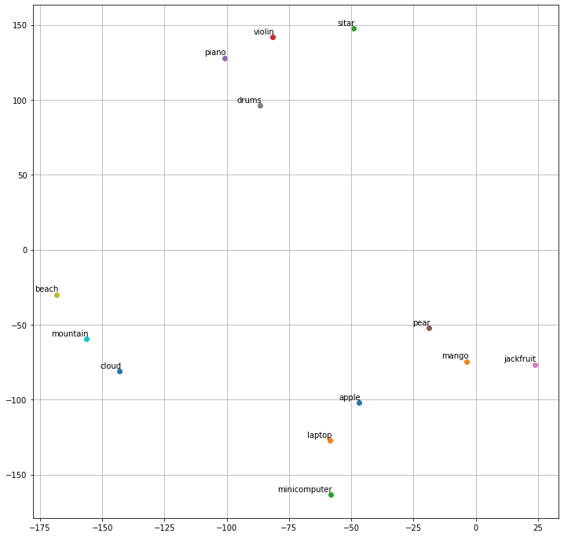

# GloVe - Global Vectors for Word Representation

GloVe is an **unsupervised learning algorithm** for obtaining vector representations for words. 

Training is performed on aggregated global word-word **co-occurrence statistics** from a corpus, and the resulting representations showcase interesting linear substructures of the word vector space.


## Playing with GloVe

```python
import matplotlib as plt
import numpy as np
from sklearn.manifold import TSNE
```


### Get word vectors (tranined on Wikipedia) from gensim
- 376MB size file

```python
import gensim.downloader as dn
gensim_wiki_model = dn.load('glove-wiki-gigaword-300')
## 300 is dimensions

```

### Let us find the vector representation of a given *word*

```python
def get_vec_rep(word : str) :
  return gensim_wiki_model[word]

def get_most_similar(word : str) :
  return gensim_wiki_model.most_similar(word)

```

```python
print(get_vec_rep('green'))

```

```
[ 9.7111e-02 -3.9549e-01  5.0061e-01 -2.6536e-01  8.1473e-02 -5.1845e-01
  2.4072e-01  3.1200e-01  2.8080e-02 -6.8087e-01  3.8081e-01 -2.0683e-01
 -2.0663e-01  4.7282e-01  3.9394e-01  2.7941e-01 -7.5484e-01  1.4609e-01
 -4.7726e-01  4.5302e-01 -2.0524e-01  1.6755e-01 -1.8848e-01  2.1746e-01
  9.6432e-02 -6.8901e-01 -8.8415e-02  2.9760e-01 -2.1951e-01  1.2810e-02
 -1.7955e-03 -2.5013e-03 -2.7744e-01  3.7136e-01 -9.8262e-01  6.8767e-01
  2.6734e-01 -6.3868e-01 -3.1059e-01 -5.6088e-01 -1.4389e-02  1.8422e-01
  ...
]
```

```python

print(get_most_similar('king'))

```

```python

[
 ('queen', 0.6336469054222107),
 ('prince', 0.619662344455719), 
 ('monarch', 0.5899620652198792), 
 ('kingdom', 0.5791267156600952), 
 ('throne', 0.5606487989425659), 
 ('ii', 0.5562329888343811), 
 ('iii', 0.5503199100494385), 
 ('crown', 0.5224862694740295), 
 ('reign', 0.521735429763794), 
 ('kings', 0.5066401362419128)
 ]

```

- What is king - boy + girl?
```python

print(gensim_wiki_model.most_similar(positive=['king', 'girl'], negative=['boy'], topn=2))
 
```

```python

[('queen', 0.6850624680519104), 
 ('monarch', 0.5474708676338196)
]


```

## Plotting

```python

## Plotting

vocab = ['apple', 'mango', 'sitar', 'violin', 'piano', 'pear', 'jackfruit', 'drums','beach', 'mountain', 'cloud' , 'laptop', 'minicomputer']
# TSNE T-distributed Stochastic Neighbor Embedding.
"""

t-SNE [1] is a tool to visualize high-dimensional data.

Refer: https://scikit-learn.org/stable/modules/generated/sklearn.manifold.TSNE.html


"""

def tsne_plot(model):
    labels = []
    wordvecs = []

    for word in vocab:
        wordvecs.append(model[word]) # add the wordvecs for the 'word'
        labels.append(word)
    
    tsne_model = TSNE(perplexity=3, n_components=2, init='pca', random_state=42)
    # n_components  Dimension of the embedded space.
    # random_state : determines the random number generator

    coordinates = tsne_model.fit_transform(wordvecs)

    # prepare 2-d data (x,y)
    x = []
    y = []
    for value in coordinates:
        x.append(value[0])
        y.append(value[1])
        
    plt.figure(figsize=(12,12)) # 12 inches x 12 inches
    for i in range(len(x)):
        plt.scatter(x[i],y[i])
        plt.annotate(labels[i],
                     xy=(x[i], y[i]),
                     xytext=(2, 2),
                     textcoords='offset points',
                     ha='right',
                     va='bottom')
    plt.grid()
    plt.show()

tsne_plot(gensim_wiki_model)


```


## References
- [GloVe](https://nlp.stanford.edu/projects/glove/)

