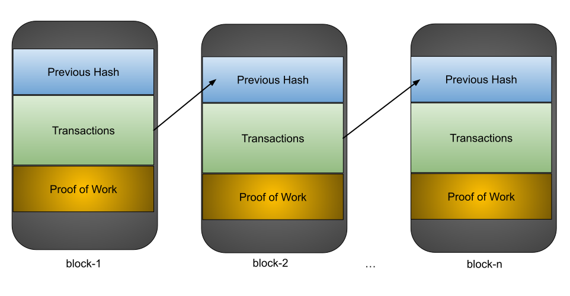

# Chapter 1 - What is Blockchain?
> We have a strong belief that ledger that nobody owns is going to be thing that draws all the developers and best payment facility, wire transfer, currency exchange - Ben Horowitz

image credit: Chromecast

A blockchain is a growing list of records, called **blocks**, that are linked together using **cryptography**

Cryptography
- Communication in the presence of adversaries

It is essentially a **digital ledger of transactions** that is 
  - duplicated 
  -  distributed 
across the entire network of computer systems on the blockchain.

Each block in the chain contains a number of transactions, and every time a new transaction occurs on the blockchain, a record of that transaction is added to **every participant’s ledger**. 

This de-centralized database managed by **multiple participants** is known as Distributed Ledger Technology (DLT).

## Features

- Distributed
    - All the participants have a local copy of the ledger for the completed transparency

- Immutable
    - Any validated records immutable, can't be changed/updated

- Time-stamped
    - All the transactions are time-stamped 
    
- Programmable 
    - Smart Contracts

- Secure
    - All records are encrypted

- Anonymous
    - Identity of the participants are 
        - Anonymous or PseudoAnonymous
- Unanimous
    - All the participants agree to the validity of the each records

## Actors in Blockchain

Actors|Purpose|
------|-----|
Datastore|Stores the data|
Processing Platform|Provides access to logic|
Blockchain Network Operator|Operates the blockchain network|
Blockchain Developer|Creates Applications|
Blockchain Architect|Designs the system|
Regulator|Perform oversight|
Blockchain User|Performs B2B transactions|
Membership Services|Access to security certificates|d

        

[Demo of Blockchain concepts](https://andersbrownworth.com/blockchain/hash")
[Demo of Public/Private Key](https://andersbrownworth.com/blockchain/public-private-keys/)

<iframe width="800" height="420" src="https://www.youtube.com/embed/_160oMzblY8" title="YouTube video player" frameborder="0" allow="accelerometer; autoplay; clipboard-write; encrypted-media; gyroscope; picture-in-picture" allowfullscreen></iframe>

<iframe width="800" height="420" src="https://www.youtube.com/embed/xIDL_akeras" title="YouTube video player" frameborder="0" allow="accelerometer; autoplay; clipboard-write; encrypted-media; gyroscope; picture-in-picture" allowfullscreen></iframe>

## References
- [ Gary Gensler: How blockchain can solve the payments riddle](https://www.thebanker.com/Comment-Profiles/Viewpoint/Gary-Gensler-How-blockchain-can-solve-the-payments-riddle?ct=true)
- [Byzantine fault](https://en.wikipedia.org/wiki/Byzantine_fault)

<iframe width="560" height="315" src="https://www.youtube.com/embed/VWG9xcwjxUg" title="YouTube video player" frameborder="0" allow="accelerometer; autoplay; clipboard-write; encrypted-media; gyroscope; picture-in-picture" allowfullscreen></iframe>

- [Dining philosophers problem](https://en.wikipedia.org/wiki/Dining_philosophers_problem)
<iframe width="560" height="315" src="https://www.youtube.com/embed/FYUi-u7UWgw" title="YouTube video player" frameborder="0" allow="accelerometer; autoplay; clipboard-write; encrypted-media; gyroscope; picture-in-picture" allowfullscreen></iframe>

<iframe width="800" height="420" src="https://www.youtube.com/embed/EH6vE97qIP4" title="YouTube video player" frameborder="0" allow="accelerometer; autoplay; clipboard-write; encrypted-media; gyroscope; picture-in-picture" allowfullscreen></iframe>
