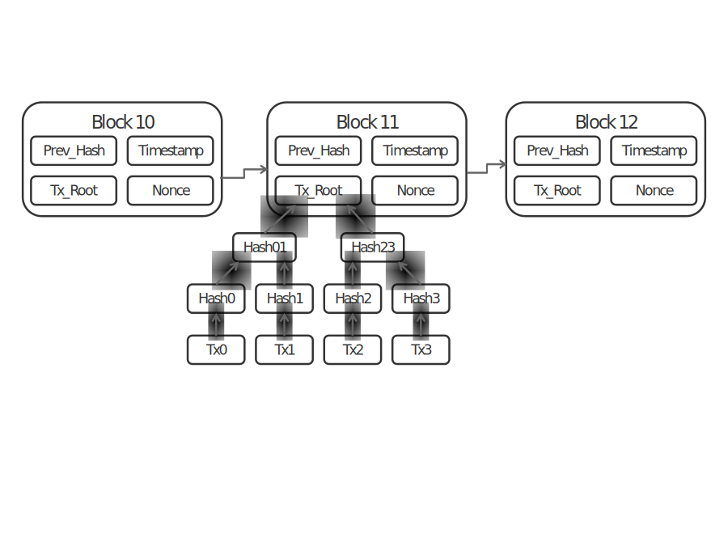

# Smart Contracts

Smart Contracts contain the business logic deployed to the peers.

- Interact with world-state 

Component|Description|
----|----|
Ledger|List of transactions maintained by peers|
**Smart Contract**|**Software running on peers, updates the world state**|
Peer Network|Network which reaches consensus to add blocks in the blockchain|
Membership|Authenticates and manages identities on network|
Events|Emits notifications of of the operations on the network|
System Management|Enables us to create/monitor components of blockchain|
Wallet|Securely manages user's credentials|
System Integration|Integrate block with external systems|

