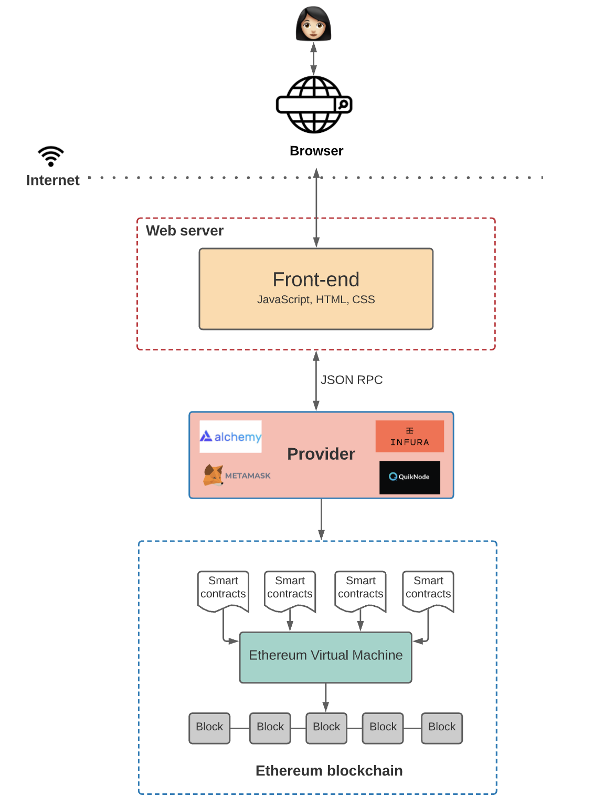

# Web3


- **Web2** refers to the version of the internet most of us know today. An internet dominated by companies that provide services in exchange for your personal data. 


- **Web3** refers to decentralized apps that run on the **blockchain**. These are apps that allow **anyone to participate** without monetizing their personal data.

## DApps

- Web3 applications are called **DApps**.
- Web3 leverages blockchain to build apps on a decentralized state machine that’s maintained by anonymous nodes on the internet.
- Web3 we can write **smart contracts** that define the logic of our applications and deploy them onto that decentralized state machine.

<iframe width="800" height="480" src="https://www.youtube.com/embed/F50OrwV6Uk8" title="YouTube video player" frameborder="0" allow="accelerometer; autoplay; clipboard-write; encrypted-media; gyroscope; picture-in-picture" allowfullscreen></iframe>
i

### Example: Ethlance
- Ethlance is running on the Ethereum public blockchain, therefore you'll need the MetaMask browser extension to be able to make changes into the blockchain.

### Metamask
- [Metamask](https://metamask.io/) is a [Chrome extension](https://chrome.google.com/webstore/detail/metamask/nkbihfbeogaeaoehlefnkodbefgpgknn)
- An Ethereum Wallet in your Browser
- MetaMask is an extension for accessing Ethereum enabled distributed applications, or "Dapps" in your browser!
- This extension injects the **Ethereum web3 API** into every website's javascript context, so that dapps can read from the blockchain.
- MetaMask also lets the user create and manage their own identities (via private keys, local client wallet and hardware wallets like Trezor™), so when a Dapp wants to perform a transaction and write to the blockchain, the user gets a secure interface to review the transaction, before approving or rejecting it.


[Ethlance](https://ethlance.com/)




Web2|Web3|
---|---|
Web2 (say Twitter) can censor any account or tweet|Web3 tweets would be not-censorable because control is decentralized|
Payment service may decide to not allow payments for certain types of work|Web3 payment apps require no personal data and can't prevent payments|
Servers for gig-economy apps could go down and affect worker income|Web3 servers can't go down because they use a decentralized network of 1000s of computers as their backend|


<iframe width="800" height="480" src="https://www.youtube.com/embed/pSTNhBlfV_s" title="YouTube video player" frameborder="0" allow="accelerometer; autoplay; clipboard-write; encrypted-media; gyroscope; picture-in-picture" allowfullscreen></iframe>

## Web3 limitations

- **Scalability** 
    - transactions are slower on web3 because they're decentralized. Changes to state, like a payment, need to be processed by a miner and propagated throughout the network.

- **UX** 
    - interacting with web3 applications can require extra steps, software, and education. This can be a hurdle to adoption.

- **Accessibility** 
    - the lack of integration in modern web browsers makes web3 less accessible to most users.
 


Centralized Systems|Decentralized Systems|
---|---|
Low network diameter (all participants are connected to a central authority); information propagates **quickly**, as propagation is handled by a central authority with lots of computational resources.|The furthest participants on the network may potentially be many edges away from each other. Information broadcast from one side of the network may take a **long time** to reach the other side.|
Usually **higher performance** (higher throughput, fewer total computational resources expended) and easier to implement.|Usually **lower performance**(lower throughput, more total computational resources expended) and more complex to implement.|
In the event of conflicting data, **resolution is clear** and easy: the ultimate source of truth is the central authority.|A protocol (often **complex**) is needed for dispute resolution, if peers make conflicting claims about the state of data which participants are meant to be synchronized on.|
**Single point of failure**: malicious actors may be able to take down the network by targeting the central authority.|	**No single point of failure**: network can still function even if a large proportion of participants are attacked/taken out.|
**Coordination** among network participants is **much easier**, and is handled by a central authority. Central authority can compel network participants to adopt upgrades, protocol updates, etc., with very little friction.|Coordination is often **difficult**, as no single agent has the final say in network-level decisions, protocol upgrades, etc. In the worst case, network is prone to fracturing when there are disagreements about protocol changes.|
Central authority **can censor data**, potentially cutting off parts of the network from interacting with the rest of the network.|**Censorship is much harder**, as information has many ways to propagate across the network.|
Participation in the network is controlled by the **central authority**.|	Anyone can participate in the network; there are **no “gatekeepers.”
** Ideally, the cost of participation is very low.|


### World computer

#### Blockchain

- The Ethereum blockchain
- Globally accessible, deterministic state machine maintained by a peer-to-peer network of nodes. 
- State changes on this state machine are governed by the rules of **consensus that the peers in the network follow**.

- Anyone in the world can access and write into this state machine, which is collectively owned by everyone in the network.

#### Smart Contracts

-  Programs that run on the Ethereum blockchain and defines the logic behind the state changes happening on the blockchain
- Written high level languages like **Solidity or Vyper**.
- Anyone can inspect the application logic of all smart contracts on the network.

```java
// SPDX-License-Identifier: GPL-3.0
pragma solidity >=0.4.16 <0.9.0;

// sets the value of a variable and exposes it for other contracts to access. 
contract SimpleStorage {
    uint storedData; // unsigned integer of 256 bit

    // does not  impose access restriction
    function set(uint x) public {
        storedData = x;
    }

    function get() public view returns (uint) {
        return storedData;
    }
}
```
#### Ethereum Virtual Machine (EVM)

- Executes the logic defined in the **smart contracts** and processes the state changes that happen on this globally accessible state machine.

- Smart Contracts written in high level languages like solidity are compiled into byte code which EVM can execute.


- When we want to interact with the data and code on a blockchain
    - We need to interact with one of these nodes. 
    - Any node can broadcast a request for a transaction to be executed on the EVM.
    - A **miner** will then execute the transaction and propagate the resulting state change to the rest of the network.

- There are two ways to broadcast a new transaction:
    1. Set up your own node which runs the Ethereum blockchain software
    2. Use nodes provided by third-party services like Infura, Alchemy, and Quicknode
        - Once you connect to the blockchain through a provider, you can **read** the state stored on the blockchain
        - To **write** to the state
            - Submit the transaction to the blockchain
            - *Sign* the transaction using the private key (sk).


### References
- [The Meaning of Decentralization](https://medium.com/@VitalikButerin/the-meaning-of-decentralization-a0c92b76a274)

- [The Architecture of a Web 3.0 application](https://www.preethikasireddy.com/post/the-architecture-of-a-web-3-0-application#Story)

- [What Is Web 3.0 & Why It Matters](https://medium.com/fabric-ventures/what-is-web-3-0-why-it-matters-934eb07f3d2b)


 


