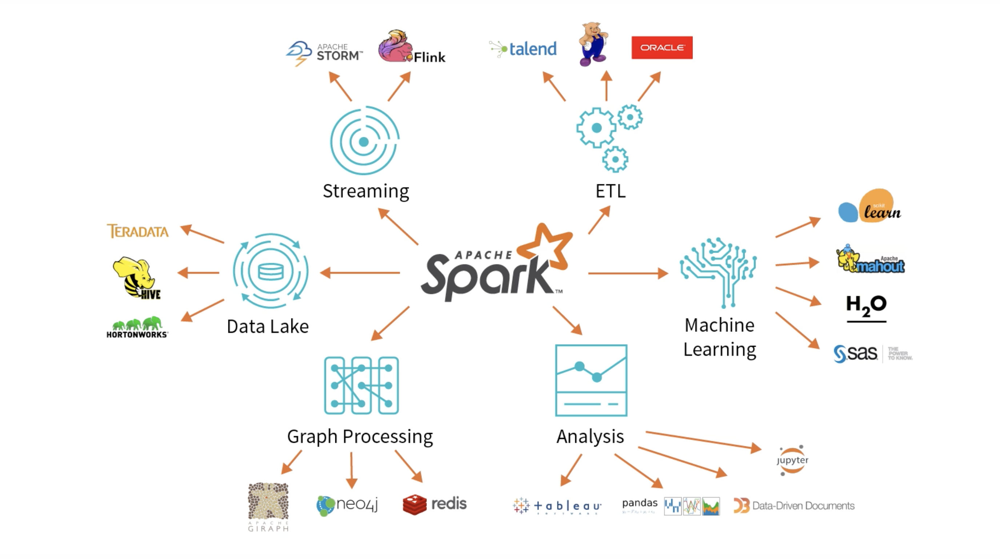
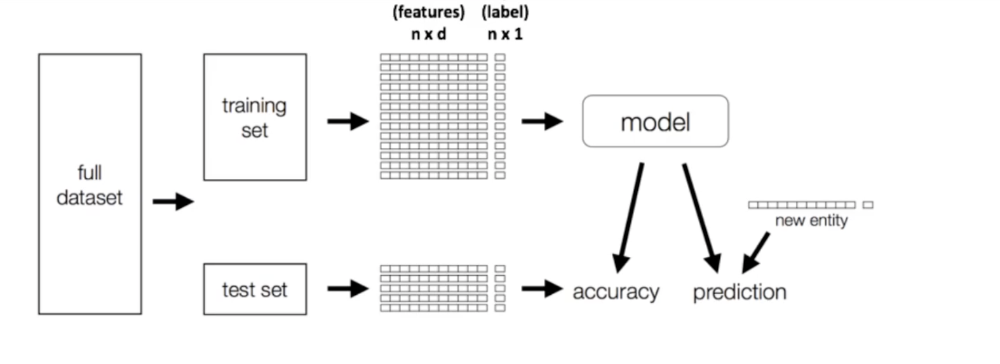

# Chapter 1 - Introduction to Spark

## Data Sources Connectivity




## Databricks notebook
```
%run ./Mount-Datasets


```

## Parquet 

Parquet is an open source file format built to handle **flat columnar storage data formats**.
- Operates well with complex data in large volumes.
- It is known for its both *performant data compression* and its ability to handle a wide variety of *encoding* types. 

- Deploys Google's *record-shredding and assembly algorithm* that can address complex data structures within data storage. 

- Some Parquet benefits include:

    - Fast queries that can *fetch specific column values* without reading full row data

    - Highly efficient column-wise compression

    - High compatibility with with **OLAP**

### Parquet vs CSV

- CSV is simple and the most widely used data format. Row oriented format

- Parquet is column oriented

- Row-oriented formats are optimized for **OLTP** workloads

- Column-oriented formats are better suited for **analytical** workloads.

- Column-oriented databases such as AWS Redshift Spectrum bill by the **amount data scanned per query**
    - Therefore, converting CSV to Parquet with partitioning and compression **lowers overall costs** and improves performance

- Parquet has helped its users reduce storage requirements by at least **one-third on large datasets**, in addition, it greatly improves **scan and de-serialization time**, hence the overall costs.

### Data

| Name  |Qty   |State   |  
|---|---|---|
|Apple  |100   |NH   |
|Pear  |200   |MA  |
|Peach  |400   |CA   |


- Row-Oriented Store

|RowID  |Value   | 
|---|---| 
|Row#1|Apple|  
|Row#1|100|  
|Row#1|NH | 
|---|---|  
|Row#2|Pear|  
|Row#2|100|  
|Row#2|MA| 
|---|---| 
|Row#3|Peach| 
|Row#3|400| 
|Row#3|CA|


- Col-Oriented Store

|Col  |Value   | 
|---|---| 
|Name|Apple|  
|Name|Pear|  
|Name|Peach | 
|---|---| 
|Qty|100|  
|Qty|200|  
|Qty|400| 
|---|---|
|State|NH| 
|State|MA| 
|State|CA|


## Working with Parquet file example

```scala


val data = Seq(("Apple",100, "NH"),
              ("Pear",200,   "MA"),
              ("Peach",400,  "CA")
)
              
val columns = Seq("name","qty","state")

import spark.sqlContext.implicits._
// data to dataFrame
val df = data.toDF(columns:_*)

// look at the df
df.show()
df.printSchema()


val fruitsFile = "/tmp/fruits.parquet"
// write this dataFrame to parquet file
df.write.parquet(fruitsFile)

// reading this parquet file into a dataFrame
val fruitsDF = df.read.parquet(fruitsFile)

 
// SQL queries on parquet file
fruitsDF.createOrReplaceTempView("FruitsParquetTable")
val parkSQL = spark.sql("SELECT * FROM FruitsParquetTable WHERE qty >= 10 ")


```

## Spark MLlib
-  MLlib is Apache Spark's scalable machine learning library. 

<iframe width="800" height="420" src="https://www.youtube.com/embed/DqihOzZl5jM" title="YouTube video player" frameborder="0" allow="accelerometer; autoplay; clipboard-write; encrypted-media; gyroscope; picture-in-picture" allowfullscreen></iframe>


## Transformers and Estimators

- [Spark ML Programming Guide](https://spark.apache.org/docs/latest/ml-guide.html)

 ###  [StringIndexer](https://spark.apache.org/docs/3.2.0/ml-features.html#stringindexer)
 

id | category
----|----------
 0  | apple
 1  | mango
 2  | peach
 3  | apple
 4  | apple
 5  | peach

 

 category is a string column with three labels: “apple”, “mango”, and “peach”. 
 Applying **StringIndexer** with category as the input column and categoryIndex as the output column, we should get the following:

 id | category | categoryIndex
----|----------|---------------
 0  | apple        | 0.0
 1  | mango        | 2.0
 2  | peach       | 1.0
 3  | apple        | 0.0
 4  | apple      | 0.0
 5  | peach        | 1.0


 ```scala

import org.apache.spark.ml.feature.StringIndexer

val df = spark.createDataFrame(
  Seq((0, "apple"), (1, "mango"), (2, "peach"), (3, "apple"), (4, "apple"), (5, "peach"))
).toDF("id", "category")

val indexer = new StringIndexer()
  .setInputCol("category")
  .setOutputCol("categoryIndex")

val indexed = indexer.fit(df).transform(df)
indexed.show()

```

### OneHotEncoder

- maps a categorical feature, represented as a label index, to a binary vector with at most a single one-value indicating the **presence of a specific feature value** from among the set of all feature values.

```scala

import org.apache.spark.ml.feature.OneHotEncoder

val df = spark.createDataFrame(Seq(
  (0.0, 1.0),
  (1.0, 0.0),
  (2.0, 1.0),
  (0.0, 2.0),
  (0.0, 1.0),
  (2.0, 0.0)
)).toDF("categoryIndex1", "categoryIndex2")

// setup encoder - OneHotEncoder
val encoder = new OneHotEncoder()
  .setInputCols(Array("categoryIndex1", "categoryIndex2"))
  .setOutputCols(Array("categoryVec1", "categoryVec2"))

// fit it 
val model = encoder.fit(df)

// transform the df
val encoded = model.transform(df)

encoded.show()

```


### VectorAssembler
Spark ML  works on single column instead of array columns.

VectorAssembler is a transformer that combines a **given list of columns** into a **single vector column**. - It is useful for combining raw features and features generated by different feature transformers into a single feature vector, in order to train ML models like logistic regression and decision trees. 

- VectorAssembler accepts the following input column types:
  -  all numeric types, boolean type, and vector type. 
  - In each row, the values of the input columns will be concatenated into a vector in the specified order.


id | hour | mobile | userFeatures     | clicked
----|------|--------|------------------|---------
 0  | 18   | 1.0    | [0.0, 10.0, 0.5] | 1.0


 id | hour | mobile | userFeatures     | clicked | features
----|------|--------|------------------|---------|-----------------------------
 0  | 18   | 1.0    | [0.0, 10.0, 0.5] | 1.0     | [18.0, 1.0, 0.0, 10.0, 0.5]


```scala

import org.apache.spark.ml.feature.VectorAssembler
import org.apache.spark.ml.linalg.Vectors

val dataset = spark.createDataFrame(
  Seq((0, 18, 1.0, Vectors.dense(0.0, 10.0, 0.5), 1.0))
).toDF("id", "hour", "mobile", "userFeatures", "clicked")

val assembler = new VectorAssembler()
  .setInputCols(Array("hour", "mobile", "userFeatures"))
  .setOutputCol("features") // output column

val output = assembler.transform(dataset) // transform the dataset

println("Assembled columns 'hour', 'mobile', 'userFeatures' to vector column 'features'")
output.select("features", "clicked").show(false)

```

### VectorIndexer


### Linear Regression

```scala
import org.apache.spark.ml.regression.LinearRegression

// Load training data
val training = spark.read.format("libsvm")
  .load("data/mllib/sample_linear_regression_data.txt")

val lr = new LinearRegression()
  .setMaxIter(10)
  .setRegParam(0.3)
  .setElasticNetParam(0.8)

// Fit the model
val lrModel = lr.fit(training)

// Print the coefficients and intercept for linear regression
println(s"Coefficients: ${lrModel.coefficients} Intercept: ${lrModel.intercept}")

// Summarize the model over the training set and print out some metrics
val trainingSummary = lrModel.summary
println(s"numIterations: ${trainingSummary.totalIterations}")
println(s"objectiveHistory: [${trainingSummary.objectiveHistory.mkString(",")}]")
trainingSummary.residuals.show()
println(s"RMSE: ${trainingSummary.rootMeanSquaredError}")
println(s"r2: ${trainingSummary.r2}")

```

### ML Pipelines
ML Pipelines provide a uniform set of high-level APIs built on top of DataFrames that help users create and tune practical machine learning pipelines.


```scala
from pyspark.ml import Pipeline
// setup the pipeline
featurizationPipeline = Pipeline(stages=[ ])

// fitting 
featurizationPipeline.fit(df).transform(df)

```

```scala

import org.apache.spark.ml.{Pipeline, PipelineModel}
import org.apache.spark.ml.classification.LogisticRegression
import org.apache.spark.ml.feature.{HashingTF, Tokenizer}
import org.apache.spark.ml.linalg.Vector
import org.apache.spark.sql.Row

// Prepare training documents from a list of (id, text, label) tuples.
val training = spark.createDataFrame(Seq(
  (0L, "a b c d e spark", 1.0),
  (1L, "b d", 0.0),
  (2L, "spark f g h", 1.0),
  (3L, "hadoop mapreduce", 0.0)
)).toDF("id", "text", "label")

// Configure an ML pipeline, which consists of three stages: tokenizer, hashingTF, and lr.
val tokenizer = new Tokenizer()
  .setInputCol("text")
  .setOutputCol("words")
val hashingTF = new HashingTF()
  .setNumFeatures(1000)
  .setInputCol(tokenizer.getOutputCol)
  .setOutputCol("features")
val lr = new LogisticRegression()
  .setMaxIter(10)
  .setRegParam(0.001)
val pipeline = new Pipeline()
  .setStages(Array(tokenizer, hashingTF, lr))

// Fit the pipeline to training documents.
val model = pipeline.fit(training)

// Now we can optionally save the fitted pipeline to disk
model.write.overwrite().save("/tmp/spark-logistic-regression-model")

// We can also save this unfit pipeline to disk
pipeline.write.overwrite().save("/tmp/unfit-lr-model")

// And load it back in during production
val sameModel = PipelineModel.load("/tmp/spark-logistic-regression-model")

// Prepare test documents, which are unlabeled (id, text) tuples.
val test = spark.createDataFrame(Seq(
  (4L, "spark i j k"),
  (5L, "l m n"),
  (6L, "spark hadoop spark"),
  (7L, "apache hadoop")
)).toDF("id", "text")

// Make predictions on test documents.
model.transform(test)
  .select("id", "text", "probability", "prediction")
  .collect()
  .foreach { case Row(id: Long, text: String, prob: Vector, prediction: Double) =>
    println(s"($id, $text) --> prob=$prob, prediction=$prediction")
  }

```

## Featurization:
- Encoding categorical variables
- Normalizing
- Creating new features
- Handling missing values
- Binning/discretizing



