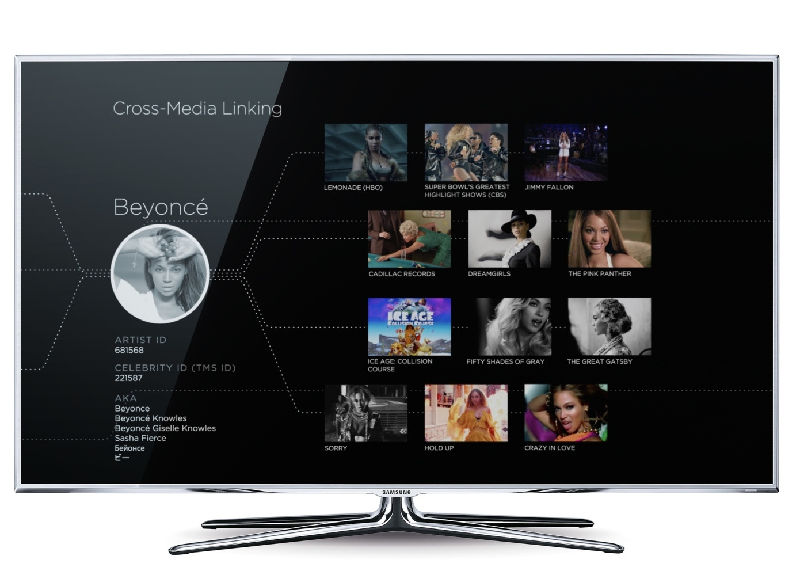
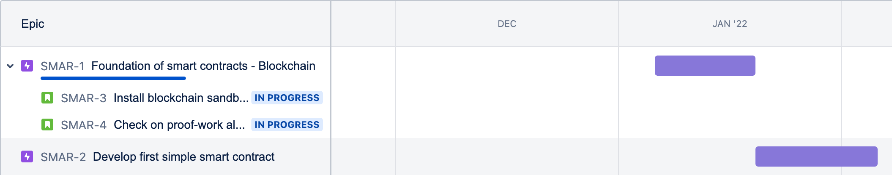

# Products involved

## CEO of these products!

- 1. ERP for Telephone Industry (ITI)
    - 
- 2. Component Information System (Played key role in [$9.3 billon acquisition](https://www.cnet.com/news/i2-technologies-buys-aspect-development-in-9-3-billion-deal/) of Aspect development by i2 Technologies)
    - 

- 3. [ProfitLogic (now part of Oracle)](https://www.oracle.com/industries/retail/products/macro-space/) migration to DB2
- 4. [iBasis](https://ibasis.com) Flagship VoIP app
    -  
- 5. CDDB Content, music recognition technology - [GraceNote](https://www.gracenote.com/project/toyota/)
    - 
    - metadata and automatic content recognition
    - MusicID
    - Fingerprint digital music for statistical and analytical purposes

    - Nielsen Holdings Group
    - Companies using:
        - Microsoft
        - Apple
        - Samsung 
        - Pandora
    - Used in vehicles:
        - Tesla
        - BMW
        - Toyota Entune
        - Ford
- 6. Oracle - Web Center, Siebel CRM for Affordable Care
- 7. Web Center Content integration for Siebel CRM
- 8. Bootstrapped Salesforce Consumer Goods Field Sales Application
- 9. CLI for Tableau CRM
- 10 Tableau CRM Workbench


# Frameworks followed
- [Notes on Product Management](https://mohan-chinnappan-n5.github.io/2021/pm/app/pmnotes.html#0)
- [Notes on Design](https://mohan-chinnappan-n2.github.io/2021/wp/design/design.md.html#0)

# Gracenote 

- CDDB Content, music recognition technology - [GraceNote](https://www.gracenote.com)
- 

- metadata and automatic content recognition
- MusicID
- Fingerprint digital music for statistical and analytical purposes

- Nielsen Holdings Group
- Companies using:
    - Microsoft
    - Apple (iTunes)
    - Samsung 
    - Pandora
    - Comcast
- Used in vehicles: (120 Million cars)
    - Tesla
    - BMW
    - Toyota Entune
    - Ford
    - Mercedes

# Valuable, Usable and Feasible 


# Gracenote - Biz (Valuable)

```
We need an awesome "Global Music Data" to become major player in 
entertainment industry world! 
```

```
How we designed CID (Component ID) in component information system to identify
any component in the world,  MusicID (32-bit number) will identify any music in the world!

```

- [US Patent US7555447B2 - System and method for identifying a product - Mohanasundaram Chinnappan, Manoel Tenorio ](https://patents.google.com/patent/US7555447B2/en?inventor=Mohanasundaram+Chinnappan&oq=inventor:(Mohanasundaram+Chinnappan))

```
The Gracenote search engine answers more queries per day than any other search engine, 
save Google (even more than Yahoo!, MSN, AOL and all the others). 
When you consider all types of user queries, 
the Gracenote service handles far more queries on any given day than 
even Google does in all of its services combined.
- Steve Scherf , Co-founder of Gracenote

```

- **Gracenote Global Music Data** is the most comprehensive collection of factual and descriptive metadata for the most popular music worldwide.

- With deep, clean data and standardized artist and recording IDs, Gracenote enables entertainment services to simplify how fans *find, discover, and connect* with more of the music they love.


- Gracenote **MusicID** is the standard for music recognition in the car, powering the music experience in **120 million vehicles and counting**. 

- With MusicID, drivers and passengers can easily identify and navigate all of their favorite jams, from any device, while keeping their eyes on the road.

## MusicID CD
- When a driver pops a CD into their car audio system 
- Gracenote MusicID CD recognizes the disc and delivers the correct artist, album and track names, as well as **Album Cover Art** to the dashboard display

## MusicID File
- Gracenote MusicID File scans music on smartphones when drivers connect by USB and Bluetooth. 
- Once identified, Gracenote enables drivers to browse and play music using **voice and touch** commands.

## Voice Recognition
- Gracenote has **deep data** to help drive voice intelligence. 
- With a database describing **millions of artists and tracks**, as well as thousands of artist nicknames and aliases, voice systems can get hip with names like Wu-Tang and Fiddy.

- Once music is identified by MusicID CD or MusicID File, Gracenote algorithms can transform music stored on mobile phones into killer playlists organized by similar Genres, Moods and Tempos.


## Integration
 - Help 3rd party companies to integrate **Gracenote metadata** into their applications and systems leveraged by the biggest entertainment brands around the globe. 

## Gracenote Sports
## Gracenote Video

# Gracenote -  UX (Usable)

[Guiding Principles](https://mohan-chinnappan-n2.github.io/2021/wp/design/design.md.html#0)


[](https://techcrunch.com/2017/02/23/nielsen-unified-tv-music-sports/)

## MusicID CD
- When a driver pops a CD into their car audio system ([Discoverability and Feedback](https://mohan-chinnappan-n2.github.io/2021/wp/design/design.md.html#2))
- Gracenote MusicID CD recognizes the disc and delivers the correct artist, album and track names, as well as **Album Cover Art** to the dashboard display

## Future
- As soon as the driver enters the car, system should find out the mood (using including Facial Recognition) of the driver and crew to offer the right playlist for the travel

 
# Gracenote - Tech (Feasible)

```
The Gracenote search engine answers more queries per day than any other search engine, 
save Google (even more than Yahoo!, MSN, AOL and all the others). 
When you consider all types of user queries, 
the Gracenote service handles far more queries on any given day than 
even Google does in all of its services combined.
- Steve Scherf , Co-founder of Gracenote

```

- Core ingredient is solid music metadata store - [CDDB](https://en.wikipedia.org/wiki/CDDB)
    - Complete and up-to-date
    - Info about complete album, not just the tracks
    - Versioned
    - API support
    - Easy to integrate
- Search engine 
    - Accuracy
    - Performance
    - Reliability
    - Scalability
    - Availability

# Roadmap, Epics, Issues - JIRA based


Big Goals
-   Roadmap
    - Project Goals (Epics )
        - Issues (user stories, bugs, tasks)
 
- Turn the big goals into achievable outcomes so our team can get more done, more often. 
- The roadmap helps us to plan, track, and visualize our project goals, which we call epics. 
- The epics are then broken down into small, actionable chunks of work.
    - Breakdown a goal so you can categorize, assign and move work forward, bit by bit. 
    - In Jira Software, *chunks of work* are called *issues*. 
    
    
    - There are different types of issues, like 
        - user stories
        - bugs
        - tasks



```

Map out your project goals
Identify small chunks of work
Monitor and manage risk
Create an issue
```

- Images credit: Jira

## References
- [Atlassian Agile Coach](https://www.atlassian.com/agile/tutorials/epics#new-epics)


# CDDB1 example 
- [code](https://github.com/gekowa/node-discid/blob/master/src/index.js)

```
32 bit id 
8 hexadecimal
    2 digits - (sum of starting time of all the track) mod 255
    4 digits - total time of the CD in secs from start of the first track to
      end of the last track
    2 digits - number of tracks on the CD


```

