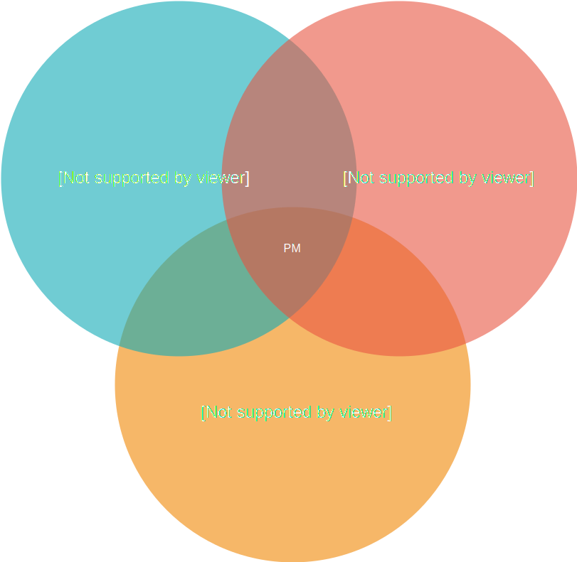
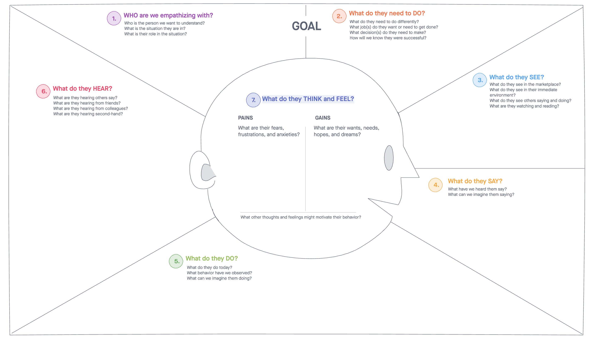
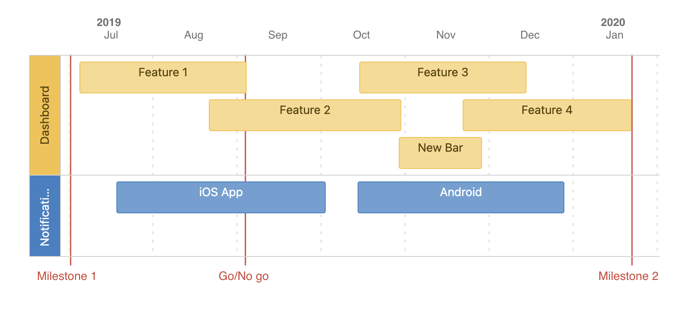
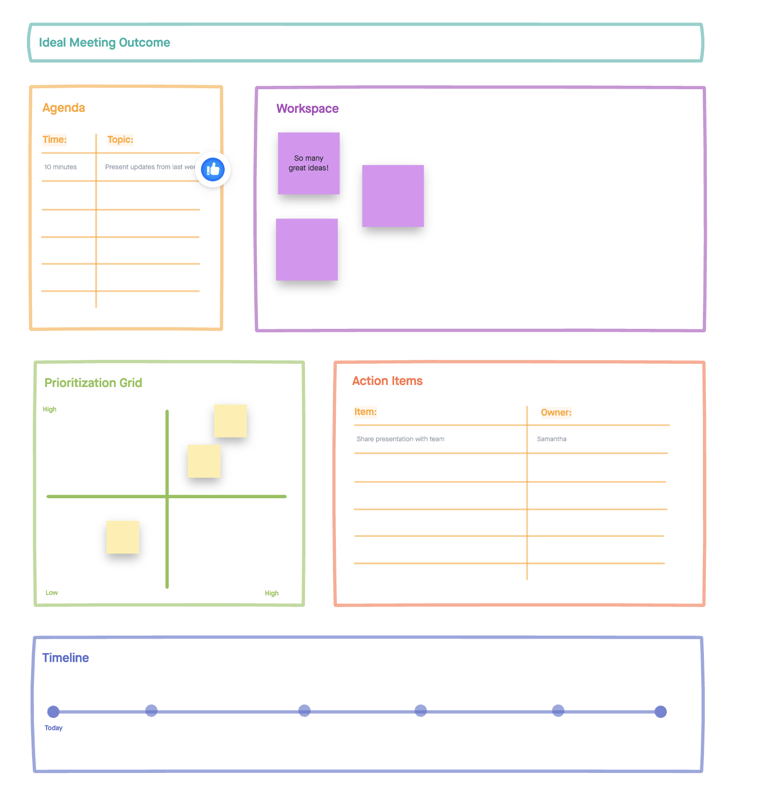

# Quotes to inspire

```
Job of the product manager is to discover a product that is 
valuable, usable and feasible 
- Marty Cagan

```

```
Product Manager is the CEO of the product 
- Ben Horowitz

```


#  Valuable, usable and feasible 



# CEO of the product

```
Ensure the success of the product vision becomes reality - whatever it takes!

```

Good|Bad|
---|---|
drives **vision** and ultimately responsible for the product's success or failure.|think of themselves as marketing resources|
have a realistic vision of what success of their product means and they ensure that this vision becomes reality - **whatever it takes**|have lots of excuses, like blaming Engineering manager...|
viewed as the *leader of the product* by the entire product team| when they fail, they point out that: they predicted they would fail|


# Meets company goals and capabilities

```
How much and what kind of marketing resources the company will spend on my product?

```

Good|Bad|
---|---|
take all important factors into consideration| |
understand and balance a wide variety of factors that affect product **strategy and execution**||
understand the capabilities and limitations of their overall company| |
knows approximately how much and what kind of marketing resources the company will spend on these products. Don't always know the answer to these questions, but they know enough to ask right folks|build a product that will take too long to pay off|


# Customer demand

```
Get the compelling value proposition for the customer!

```

Good|Bad|
---|---|
 **listen to customers** but probe deeper into the underlying problems to get at the **compelling value proposition** for the customer. *If you had a noisy car you might ask for a louder stereo, but you would probably be a lot happier with a quieter car* |ask customers leading questions and get biased answers. Go on their instinct and "confirm" it with two unusual customers|
also know what customers can & will **pay for**|build a good product for a market their company isn't in|
certain that if they build a certain product, **customers will buy it**. |build a product that's too complex for their company to sell. Aren't savvy or confident enough to distinguish between interest. Blindly listen to the loudest customers, and define a product that addresses yesterday's needs of a handful of companies.and commitment to buy. Compare future products to today's competition, or cite advantages customers don't care about. |
go the extra mile to make sure they get this right||

## Human Centered Design [HCD](https://mohan-chinnappan-n2.github.io/2021/wp/design/design.md.html#4)

- template credit: inVision


# Understanding competition

```
Knowing where the competitors can go easily and can't go at all is the key!

```

Good|Bad|
---|---|
 understand the architectural and business capabilities of the competition and know where the competitors can go easily and can't go at all. Also know the product must be better or different (integration/distribution). |react only to the moves of their competitors and forget to develop their own|


 |Competition Types|What they have|Action|
 |---|--|---|
 |Direct|Same features in the same way|Can we make a difference with integration/distribution?|
 |Indirect|Different features but may eat our market share|Innovate|
 |Secondary|Same features in a different way|Innovate|
 

# Know what you know and what you do not know

```
A fact is a statement that can be proven true or false. 
An opinion is an expression of a person’s feelings that cannot be proven. 
Opinions can be based on facts or emotions and
sometimes they are meant to deliberately mislead others. 

- The Center for Humanities, Inc. (1977).  Making judgments and Drawing Conclusions. 

```
Good|Bad|
---|---|
acutely aware of what they know and why they know it, as well as what they don't know.| |
understands the difference between **opinions, hunches, and objective facts**||
knows that their job is to fill in these gaps in knowledge, not to defend or obfuscate them.||
doesn't ruin their credibility by over-stating their knowledge. |try to defend their lack of knowledge
gain the knowledge all the time and be paranoid!|

|Questions|Who can help|Priority|
|--|--|--|
|Chatbot integration with Whatsapp and Facebook Messenger|Joe in Engineering|High|


# Think ahead and monitor your assumptions

```
It is impossible to plan a project without making a few assumptions. 
The key is knowing how to spot those assumptions and putting safeguards 
in place so that if any assumption is proven false, 
the impact on project delivery will be minimal.

- Project Management Institute (PMI)

```

Good|Bad|
---|---|
know what their important assumptions are and they monitor them from time to time to make sure they still hold| have blinders on and don't notice when things change and notice only when their product fails. |
re-evaluate the assumption as soon that assumption is threatened.||
actively confirm their understanding with their managers and others on their team||

|Assumption|Valid now?|Comments|
|--|--|--|
|Call deflection is number one priority for the customer|Yes||
|Customer is ok with Basic Auth until we provide OAuth2|No|We need to support OAuth2 ASAP|

# Clear written communication 

```
 If you can't explain it simply, you don't understand it well enough
 - Albert Einstein

```

```
1. Know Your Goal and State It Clearly
2. Use the Correct Tone for Your Purpose
3. Keep Language Simple
4. Stay on Topic and Keep It Concise

```

Good|Bad|
---|---|
define clearly and in as much detail as is necessary what the product should do, how fast it should be, etc.| cut corners on communication with engineering or misunderstand their role.  |
don't forget to specify critical information.||
willing to explain the obvious to make sure it's understood.||
specify the whole product, including release criteria, platforms, etc., not only the new features||
sense and tackle hard issues - **in writing - early in the development process** ||
production information  based on research, information and a logical, transparent
thought process that the entire team buys into||
know that engineers are scientists by nature and **value data much more than opinion**. other
parts of PD (QA, Doc, etc.) should be involved in that process. ||
define a clear product vision and target that empowers engineering to fill in the details that are difficult to specify or anticipate.||
explain why engineering should build a particular product a particular way.|They want light and ask for a candle when their engineers could have built a light bulb.|
respected by their engineering teams. Engineering teams involve good product managers in difficult decisions. ||
Written communication to engineering is superior because it is more consistent across an entire product team, it is more lasting, it raises accountability. | put off hard decisions until the end of the product cycle|
attend product team meetings regularly and make sure they're around when engineering is making tradeoffs. |change engineering priorities based on the latest customer feedback or latest hot sales situation without going through the defined process|

## Action Items

|Area|Key Points|Comments|
|---|---|---|
|Attention|Getting people’s attention is difficult. But adding visuals into the mix will help|
|Updates|Give updates on initiatives, business goals,  what we are building and why are we building it?|Keep the team up-to-date|
|Dependencies|Provide  technical dependency diagrams|New feature is depending on this|
|Dependencies|Provide  team dependency diagrams|Can’t be completed until  team Y has completed theirs|

## Org Structure
|Who|Responsible for|Team Members|
|---|---|---|
|Team - A|Mobile Development||
|Team - B|Security||
|Team - C|UX||
|Team - D|Prototype||


- [Visual Communication templates for Product Managers](https://www.departmentofproduct.com/blog/visual-communication-templates-for-product-managers/)


# Product Requirements Document (PRD) 
Good|Bad|
---|---|
keep PRDs up-to-date daily or weekly at a minimum.  Good product managers **view the entire PRD process as a living ongoing process**, because it is (engineering has new questions, market conditions change, etc.). If anything changes in the PRD, a good product manager **communicates the change clearly to the entire product team**| write a PRD and assume engineering understands it.
don't rest until they are sure that the **product vision is consistent across** product management, engineering, QA, tech pubs, and support and is reflected in the PRD. They don't rest, because they know that **no great product ever emerged from a broad set of conflicting visions**|managers don't have time to update their PRD. update the PRD and don't tell anyone, or don't tell enough people, or don't explain why.|


## Sample PRD (Confluence based)


-----

Item|Value
---|---|
Target release|| 
Epic|Jira epics and issues|
Doc Status|Draft|
Doc Owner||
Designer||
Tech Lead||
Tech Writers||
QA||

----

### Objectives


|Objective|Comments|
|---|---|
|State the objective here...||

----

### Success metrics


Goal|Metric|
---|---|
Goal-1|80% completed|

----

### Assumptions


|Assumption|Valid now?|Comments|
|--|--|--|
|Call deflection is number one priority for the customer|Yes||
|Customer is ok with Basic Auth until we provide OAuth2|No|We need to support OAuth2 ASAP|

----

### Milestones 



### Requirements


Requirement|User Story|Importance|Jira Issue|Notes|
---|---|---|---|---|
OAuth2 support|US134|HIGH|I345|Customer needs this feature ASAP|

### User interaction and design

UI Needs|Comments|
---|---|
Discoverability|Should be easy for the user to know about this feature|
Feedback|UI should provide feedback for every action performed by the user|

### Open Questions


Question|Answer|Date Answered|
---|---|---|
Required REST API performance|100 ms average|Dec-10-2021|

### Out of Scope


Item|Notes
---|---|
User mood based auto search|May be in version 2.0|


# Clear goals and advantages

Good|Bad|
---|---|
Good product managers have clear goals| have mushy goals and mushy product advantages.  |
re-evaluate the assumption as soon that assumption is threatened.||
define success as achieving explicit goals. Goals that are important are written down.||
have written goals for their product and for their own personal objectives|have inconsistent product positioning and advantages change from time to time|
know how their **product will be better / different than the competition** - a key part of the overall product vision from day one and is reflected in most things the product manager does|hesitate when asked for the advantages of their product.|


# Focus on the salesforce and customers

```
Knowing the current status of the salesforce will make you a winner!

```

```
Knowing a handful of current and potential customers personally will be a great asset!

```

Good|Bad|
---|---|
good product manager will be known personally or by reputation by at least half the sales force.||
know that sales people have a choice of products to sell and, at a higher level, companies to work for, and selling a particular product manager's product is optional||
focus on and understand that sales people are under a lot of pressure to make their quota, this quarter||
Knowledgeable of what actually happens in the field. Does not rambles on about their product features that does not help sales person's current situation|don't have time for the salesforce or customers|
been out in the field, been to sales training, been to SE training, been to pitches, etc.|aren't sure what's going on in the field,  delegate working with sales.|
A good presenter, Responsive|boring presenters.talk about how future products will be great, but the current products are weak |
know a handful of current and potential customers personally|don't care about individual customers|
understand the exact dynamics of real customer situations.leverage this knowledge with engineering, other customers, the salesforce, press and analysts, etc. ||


# Marketing & communication
Good|Bad|
---|---|
requires an understanding of and proficiency in though not deep expertise of a wide array of marketing functions. | |
good product managers should be able to work effectively with PR and press and analysts, understand how to execute a product launch, develop collateral, staff a tradeshow, train the salesforce, etc.||
knows the importance of creating leveragable collateral, FAQs, presentations, white papers.|If your primary competitor is abc and the most recent competitive positioning on abs is nine months old and refers to the last release of their product, this is indicative of a bad product manager. |
take competition into account in developing their messages, but are not a slave to what the competition does.||


# Time management 
Good|Bad|
---|---|
focuses on tasks that are critical to their product success|put out fires all day|
focuses on tasks that have a high impact on their business (closing big deals, updating their PRD, etc.)|complain that they spend all day answering questions for the sales force and are swamped|
tasks that have a high impact on their business (closing big deals, updating their PRD, etc.) |don't create FAQs or other leveragable collateral.|


- template credit: inVision

# Discipline
Good|Bad|
---|---|
respect a base level of discipline and organization in their work.||
keep their project up-to-date ||
send their status reports in on time every week, because they are disciplined.|forget to send in their status reports on time, because they don't value discipline.|
don't over-promise.||
keep developers doing product development||
don't offer engineering resources for things that can and should be handled by sales or marketing||
Work well with executives.||
Leverage the entire organization||
Use whatever intensity is required to close critical issues.||


# References
- [Good Product Manager/Bad Product Manager](https://a16z.com/2012/06/15/good-product-managerbad-product-manager/)

- [What is a Product Manager? - Martin Eriksson](https://medium.com/@bfgmartin/what-is-a-product-manager-ce0efdcf114c)

# Generation
```
sfdx mohanc:slides:gen  -i slides.md -o pmnotes.html -t 'Notes on Product Management'

```
