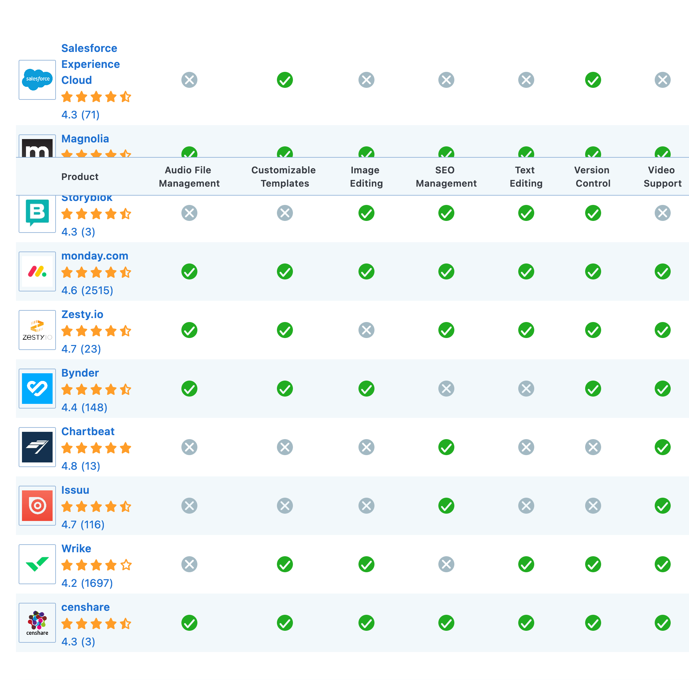

# Content Management Systems (CMS)

- collection, managing, and publishing of information in any form or medium.

# Roles
- Creator – responsible for creating and editing content.
- Editor – responsible for tuning the content message and the style of delivery, including translation and localization.
- Publisher – responsible for releasing the content for use.
- Administrator – responsible for managing access permissions to folders, collections and files, usually accomplished by assigning access rights to user groups or roles. Admins may also assist and support users in various ways.
- Consumer, viewer or guest – the person who reads or otherwise consumes the content after it is published or shared.

# Features

- Import and creation of documents and multimedia material
- Identification of all key users and their roles
- The ability to assign roles and responsibilities to different instances of content categories or types
- Definition of workflow tasks often coupled with messaging so that content managers are alerted to changes in content
- The ability to track and manage multiple versions of a single instance of content
- The ability to publish the content to a repository to support access
- The ability to personalize content based on a set of rules

- Audio File Management
- Customizable Templates
- Image Editing
- SEO Management
- Text Editing
- Version Control
- Video Support

# Popular CMS
- Optimizely Content Cloud CMS
- Drupal
- Joomla
- Magento
- Squarespace
- Wix
- Squarespace
- Wordpress

# SEO friendly
-  CMS that has automation for basic on-page optimization tasks such as title tags, urls, alt tags on images, and a sound internal linking structure. 

# Measuring success
- using a web analytics platform like Google Analytics or Mixpanel to measure conversions. 
- CMS allows authors to make rapid changes to your content without requiring a front-end developer. You can measure how these changes are impacting your website by running an A/B test. Great CMS software allows you to do this in an easy way, without building complex integrations.

# Digital Asset Management (DAM)
- different types of users also need document management for files like PDFs or images on your CMS. Good digital asset management (DAM) is key to creating great digital experiences.

# References
- [Content management ](https://en.wikipedia.org/wiki/Content_management)
- [Comparing CMSs](https://www.capterra.com/sem-compare/content-management-software/?utm_source=ps-google&utm_medium=ppc&gclid=Cj0KCQiAq7COBhC2ARIsANsPATGg9p0fu7djv-l0ZzFVQu-TomrSzGuqEkvkPdXa_YCj21STzn7pqoIaAmyiEALw_wcB)
