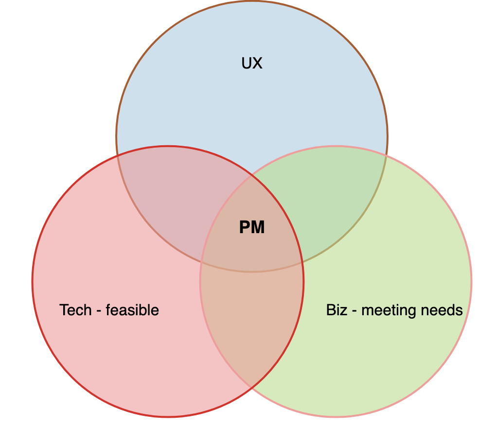

# What is Product Management?

> Job of the product manager is to **discover** a product that is **valuable, usable and feasible** -  *Marty Cagan*

image credit: Chromecast

Solving the great **customer problem** with the balancing the needs of:

- **UX - usable**
    - Product Manager is the **voice of the user inside the business** and must be passionate about the user experience.
    - Not being a pixel pusher or a designer 
    - Need to be out there testing the product, talking to users and getting that feedback first hand

- **Biz - meeting needs - valuable** 
    - focused on maximizing business value from a product
    - should be obsessed with optimizing a product to achieve the business goals while **maximizing return on investment (ROI)**

- **Tech - feasible**
    - There’s no point defining what to build if you don’t know **how it will get built**.
    - Understanding the **level of effort (LOE)** involved is crucial to making the right decisions

A good product manager must be experienced in at least one, **passionate about all three**, and conversant with practitioners in all.

##  Martin Eriksson's Venn Diagram

- **Empowering the team** by providing product owner like responsibilities 
- Trade-off decision maker

A Good Product Manager plays critical role in a successful product

- A **successful product** is the highest impact contribution that anyone can make in the Product Development organization
- Track record of **successful products** that become **profitable businesses** for their company.

### CEO of the product (influencing without any authority)

Good|Bad|
---|---|
drives vision and are ultimately responsible for the product's success or failure.|think of themselves as marketing resources|
have a realistic vision of what success of their product means and they ensure that this vision becomes reality - **whatever it takes**|have lots of excuses, like blaming Engineering manager...|
viewed as the *leader of the product* by the entire product team| when they fail, they point out that: they predicted they would fail|

### Balance all important factors

#### Company goals & capabilities

Good|Bad|
---|---|
take all important factors into consideration| |
understand and balance a wide variety of factors that affect product **strategy and execution**||
understand the capabilities and limitations of their overall company| |
knows approximately how much and what kind of marketing resources the company will spend on these products. Don't always know the answer to these questions, but they know enough to ask when they don't.||

#### Customer demand

Good|Bad|
---|---|
 listen to customers but they probe deeper into the underlying problems to get at the compelling value proposition for the customer. *If you had a noisy car you might ask for a louder stereo, but you would probably be a lot happier with a quieter car* | |
also know what customers can & will pay for||
certain that if they build a certain product, customers will buy it. | |
go the extra mile to make sure they get this right||

#### Competition

Good|Bad|
---|---|
 understand the architectural and business capabilities of the competition and know where the competitors can go easily and can't go at all. Also know they must be better or different (integration/distribution) or they're dead. | |
also know what customers can & will pay for||
certain that if they build a certain product, customers will buy it. | |
go the extra mile to make sure they get this right||

#### 

### Clear, written communication with product development

### Clear goals and advantages

### Focus on the sales force and customers

### Other key skills

## Management

### Setting a vision of the product

- requires you to research, research, and then research some more your market, your customer and the problem they have that you’re trying to solve. 

- assimilate huge amounts of information 
    - feedback from clients
    - quantitative data from your analytics
    - research reports
    - market trends and statistics 

- need to know everything about:
    -  your market and your customer
    - your customers’ problem, 
and then mix all that information with a healthy dose of creativity to **define a vision for your product**

### Spread the word in your business
Once you have a vision, you have to spread the word in your business.
- Get dogmatic, evangelical even, about the utopia that is your product. 
- Get passionate about it 
- Your **success, and that of your product**, relies on:
    - every team member — from sales to developer 

### Start building an actionable plan to reach that vision

- A roadmap of **incremental improvements and iterative development** that take you step by faltering step closer to that final vision.

- your team throw themselves into coming up with **better designs, better code and better solutions** to the **customers problem** alongside you.

- solving problems as they pop up and **closely managing scope** so you can get the product out on time.

### After Release
- Looking at how customers use the product
- Going out and talking to them about the product and generally eating, sleeping and breathing the product. 
    - Did you solve the right problem? 
    - Do your users get the product? 
    - Is it solving their problem? Will they pay for the product?

 
## References
- [ Product Manager: The role and best practices for beginners ](https://www.atlassian.com/agile/product-management/product-manager)

<iframe width="560" height="315" src="https://www.youtube.com/embed/yUOC-Y0f5ZQ" title="YouTube video player" frameborder="0" allow="accelerometer; autoplay; clipboard-write; encrypted-media; gyroscope; picture-in-picture" allowfullscreen></iframe>

- [Good Product Manager and Bad Product Manager](https://sriramk.com/memos/Ben_Horowitz_Good_Product_Manager_Bad_Product_Manager.pdf)

- [What is a Product Manager? - Martin Eriksson](https://medium.com/@bfgmartin/what-is-a-product-manager-ce0efdcf114c)

