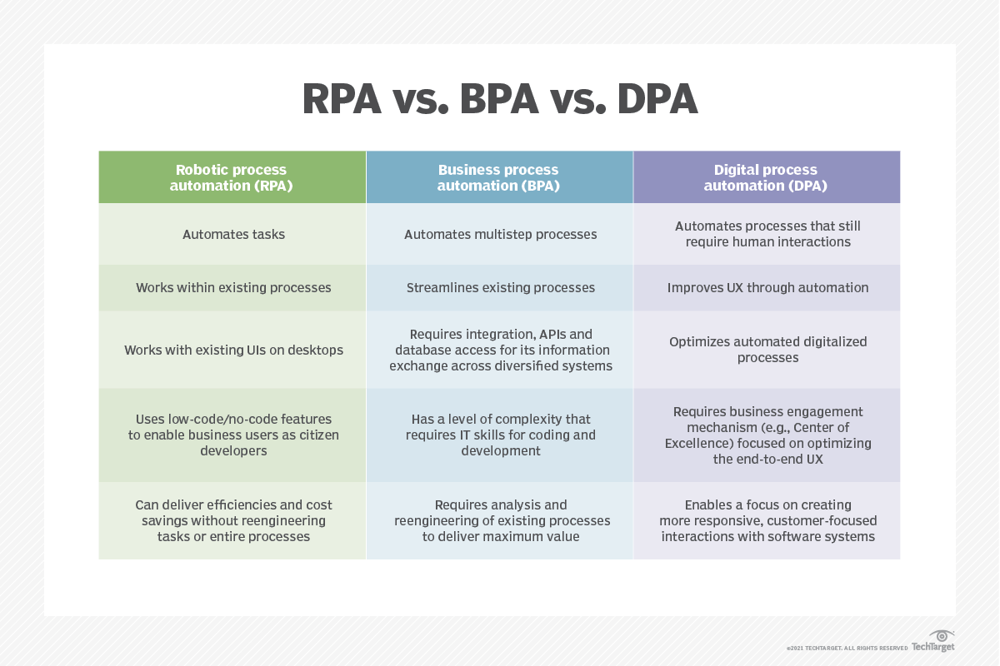
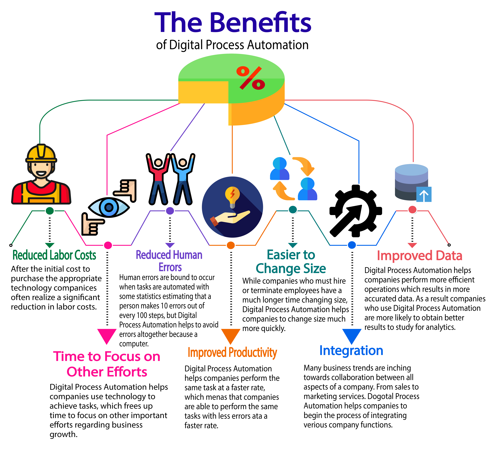
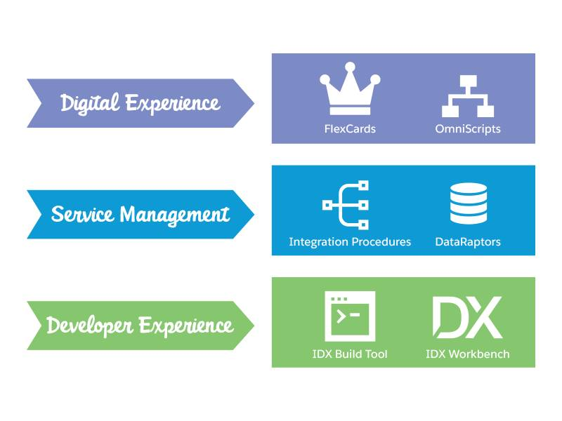
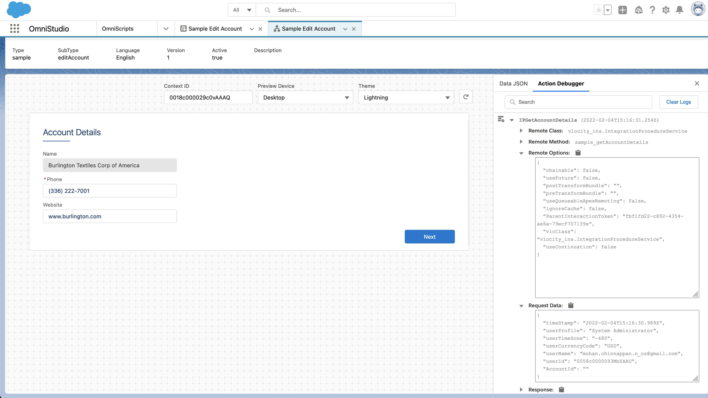
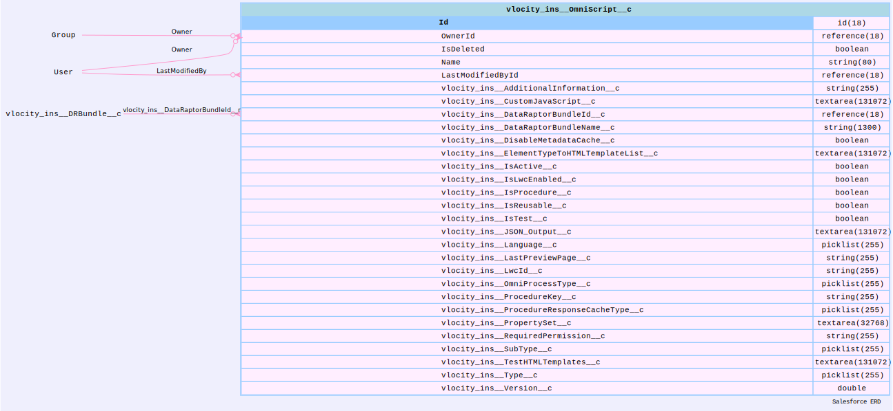
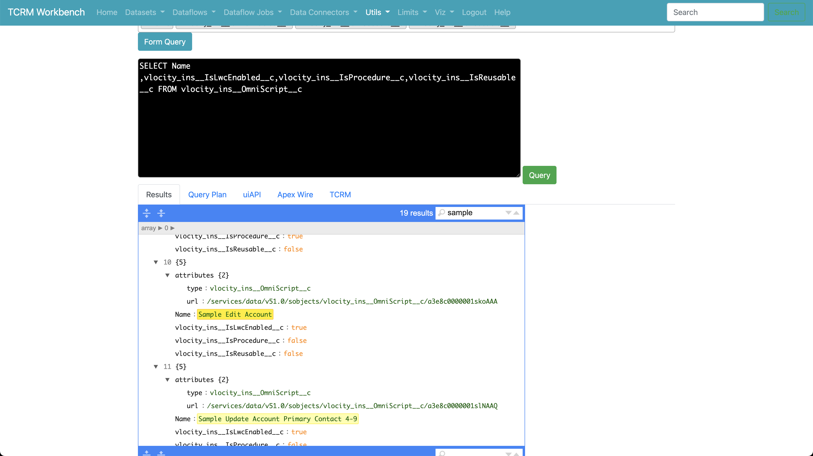

# About Digital Process Automation (DPA)
- Automates Processes which requires human interactions
- Improves the User Experience with the help of automation
- Creates more responsive, customer focused interactions




# Benefits of DPA

- 


# DPA in Salesforce
- Powered by OmniStudio
- Automated work orchestration
- Has process automation and integration tools
    - Decision Tables
    - Calculation Matrices and Procedures
    - Intelligent Document Automation

# OmniStudio
- Drives Digital Engagement
- Provides Guided UX
- suite of task-based components and services that enable businesses to rapidly
deliver digital-first and industry-specific experiences across multiple devices and channels. 
- Empowers companies to craft 
    - **branded, dynamic** customer and employee **interactions fast**, and connect them with **enterprise data and applications, without code**.


## Architecture


### Digital Experience Layer
- FlexCards
    - components of these 360° views
    - display contextual information and actions in an at-a-glance format for customer account data
    - summarize basic information at a glance, display **detailed information on demand**
    - provide quick access to common tasks (actions) that are context-relevant
    - OmniStudio **Interaction Console** shows a holistic view of a customer’s account and information. 

- OmniScripts
    - Provides a guided path to complete a business process
    - Serves as a **configurable way** of creating a seamless customer experience  

- LWC
    - When **activated**, FlexCards and OmniScripts become Lightning web components. 
    - With this the users launch LWC-enabled OmniScripts as flyouts to display additional information when they click an action on a FlexCard. 


### Service Management Layer

- OmniStudio Integration Procedures (IP)
    - Provides declarative, server-side processes that execute multiple actions in **a single server call**

- DataRaptors:  a mapping tool provides
    - Configurable services for 
        - retrieving 
            - Turbo Extract - Getting data from Single SObject
            - Extract - Getting data from one or more SObjects)
        - transforming (Transform)
        - updating data (Load) 
            - Manipulate any data that comes from inside or outside Salesforce


# Using OmniStudio

- 
- [YouTube Video](https://www.youtube.com/watch?v=6whgHo-CLTw)

- 

# Vlocity Data Model


## Exporting to off-platform LWC
```
.
└── src
    └── modules
        └── vlocityomniscript
            └── sampleEditAccountEnglish
                ├── sampleEditAccountEnglish.css
                ├── sampleEditAccountEnglish.html
                ├── sampleEditAccountEnglish.js
                ├── sampleEditAccountEnglish.js-meta.xml
                ├── sampleEditAccountEnglish.svg
                ├── sampleEditAccountEnglish_def.js
                ├── sampleEditAccountEnglish_nds.css
                └── sampleEditAccountEnglish_nds.html

4 directories, 8 files

```

# vlocity_ins__OmniScript__c 

## ERD
- 

## Querying   
- 

# Resources
- [digital process automation - TechTarget](https://www.techtarget.com/searchcio/definition/digital-process-automation)

- [7 Benefits with DPA](https://www.cetrixcloudservices.com/blog/7-benefits-realized-through-digital-process-automation)

## OmniStudio
- [Learn OmniStudio on Trailhead](https://trailhead.salesforce.com/en/promo/orgs/omnistudiotrails)

- [Using Digital Process Automation To Improve Customer & Employee Experiences | Salesforce](https://www.youtube.com/watch?v=B-7Z-wMRm0A)


- [Build digital-first experiences tailored to your industry](https://www.salesforce.com/products/omnistudio/overview/)

- [OmniStudio Datasheet](https://www.salesforce.com/content/dam/web/en_us/www/documents/industries/omnistudio-datasheet.pdf)

- [OmniStudio Architecture](https://trailhead.salesforce.com/content/learn/modules/omnistudio-architecture?trail_id=build-guided-experiences-with-omnistudio)
# Creation 
```
sfdx mohanc:slides:gen -i dpa.md -o dpa.md.html -t 'Digital Process Automation'
```

