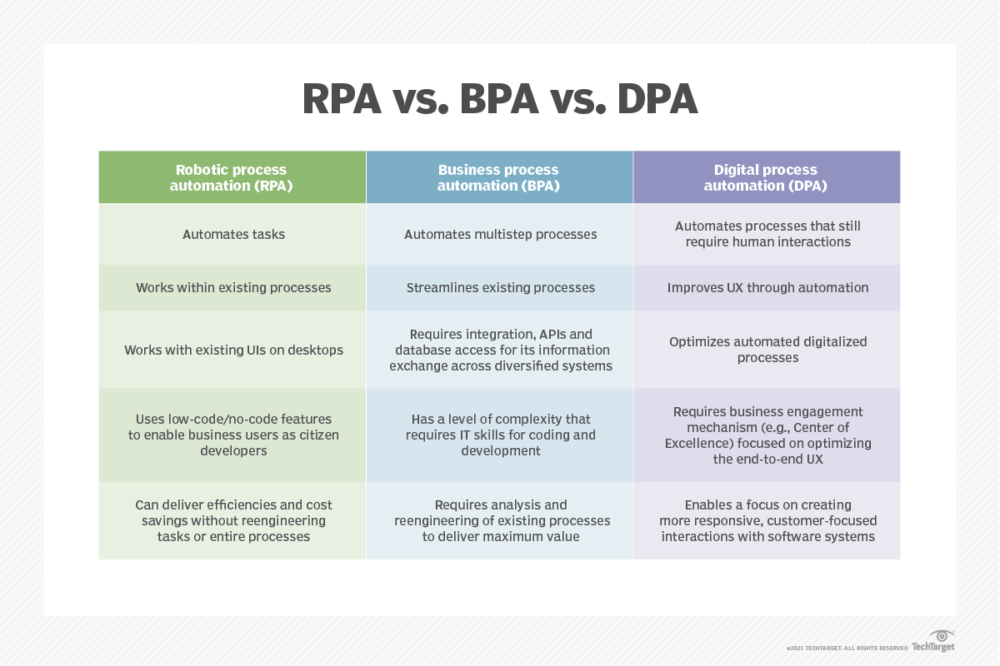

# Salesforce Automation Suite
- Fully Declarative (no/low code)
    - Workflow Rules
    - Process Builder
    - Flow
- Digital Process Automation (DPA) (no code)
    - OmniScript
    - FlexCards
    - Data Tools
    - Rule Engine
    - Document Generation
- Full Programming (code)
    - Apex
    - LWC
    - AppExchange

# About Digital Process Automation (DPA)
- Automates Processes which requires human interactions
- Improves the User Experience with the help of automation
- Creates more responsive, customer focused interactions




# Benefits of DPA

- 


# DPA in Salesforce
- Powered by OmniStudio
- Automated work orchestration
- Has process automation and integration tools
    - Decision Tables
    - Calculation Matrices and Procedures
    - Intelligent Document Automation

# OmniStudio
- Drives Digital Engagement
- Provides Guided UX
- suite of task-based components and services that enable businesses to rapidly
deliver digital-first and industry-specific experiences across multiple devices and channels. 
- Empowers companies to craft 
    - **branded, dynamic** customer and employee **interactions fast**, and connect them with **enterprise data and applications, without code**.


## Architecture


- Experience
    - FlexCards
        - UI Component with excellent Customer Experience
    - OmniScript
        - Design Multi-person omni-channel processes
        - Declarative scripting tool

    - Bots
        - AI powered interactions


- Workflow
    - Decision Tables
        - Rules to support complex  process
    - Data Processing Engine
        - Process Rules and Perform calculations within a process

    - Intelligent Document Automation (IDA)
        - Generate Documents and automate workflow

- Integration
    - Data Raptor
        - Native no-code data **transformation**
    - Integration Procures (IPs)
        - Ingest data from multiple data sources
### Digital Experience Layer
- FlexCards (display data and launch actions)
    - components of these 360° views
    - the Beginning and Ending Points for Customer Transactions
    - 
    - display contextual information and actions in an at-a-glance format for customer account data
    - summarize basic information at a glance, display **detailed information on demand**
    - provide quick access to common tasks (actions) that are context-relevant
    - OmniStudio **Interaction Console** shows a holistic view of a customer’s account and information.

- Interaction console
-  
- Provides a holistic view of the customer's information
- FlexCards are important components of these **360-degree views**. 
- The FlexCards we see on the console are Lightning web components (LWC) based on FlexCards
- The console itself is a Salesforce Lightning console

- OmniScripts (/lightning/n/vlocity_ins__OmniScriptHome)
    - contain the interaction logic
    - Provides a guided path to complete a business process
    - Serves as a **configurable way** of creating a seamless customer experience  

- LWC
    - When **activated**, FlexCards and OmniScripts become Lightning web components. 
    - With this the users launch LWC-enabled OmniScripts as flyouts to display additional information when they click an action on a FlexCard. 


### Service Management Layer

- OmniStudio Integration Procedures (IP)
    - Provides declarative, server-side processes that execute multiple actions in **a single server call**

- 
- DataRaptors:  a mapping tool provides
    - Configurable services for 
        - retrieving 
            - Turbo Extract - Getting data from Single SObject
            - Extract - Getting data from one or more SObjects)
        - transforming (Transform)
        - updating data (Load) 
            - Manipulate any data that comes from inside or outside Salesforce
    - Can read/write sObjects
    - xml2json 
    - Access any REST service
- API Calls
- 

- FlexCard Actions
    - have link to
        - FlexCard 
        - Pages
        - URLs
        - OmniScripts
        - OmniStudio Actions
    - Launch in context (e.g. %AccountId%)from one screen

- 

- States 
    - Single FlexCard is rendered differently based a value of a certain field
- 

# Using OmniStudio

- 
- [YouTube Video](https://www.youtube.com/watch?v=6whgHo-CLTw)

- 

# Vlocity Data Model
- [Vlocity data model](https://mohan-chinnappan-n5.github.io/2022/dpa/vmodel.html?f=vlocity_ins_small)

## Exporting to off-platform LWC
```
.
└── src
    └── modules
        └── vlocityomniscript
            └── sampleEditAccountEnglish
                ├── sampleEditAccountEnglish.css
                ├── sampleEditAccountEnglish.html
                ├── sampleEditAccountEnglish.js
                ├── sampleEditAccountEnglish.js-meta.xml
                ├── sampleEditAccountEnglish.svg
                ├── sampleEditAccountEnglish_def.js
                ├── sampleEditAccountEnglish_nds.css
                └── sampleEditAccountEnglish_nds.html

4 directories, 8 files

```

# vlocity_ins__OmniScript__c 

## ERD
- 

## Querying   
- 


# Remote Site URLS
- [Docs](https://docs-vlocity-help-center.s3.amazonaws.com/)
- [IPcommmunity](https://omnistudiotraining-developer-edition.na162.force.com/s/)


# Resources
- [digital process automation - TechTarget](https://www.techtarget.com/searchcio/definition/digital-process-automation)

- [7 Benefits with DPA](https://www.cetrixcloudservices.com/blog/7-benefits-realized-through-digital-process-automation)

## OmniStudio

- [Docs - Vlocity Help Center](https://docs.vlocity.com/en/FlexCard-Designer-Overview.html)
- [OmniStudio Foundation](https://developer.salesforce.com/files/credential-resources/OmniStudio-Documentation.pdf)
### Trailhead
- [Learn OmniStudio on Trailhead](https://trailhead.salesforce.com/en/promo/orgs/omnistudiotrails)

- [OmniStudio Architecture](https://trailhead.salesforce.com/content/learn/modules/omnistudio-architecture?trail_id=build-guided-experiences-with-omnistudio)

### Data sheets
- [Build digital-first experiences tailored to your industry](https://www.salesforce.com/products/omnistudio/overview/)

- [OmniStudio Datasheet](https://www.salesforce.com/content/dam/web/en_us/www/documents/industries/omnistudio-datasheet.pdf)


### Videos


- [Using Digital Process Automation To Improve Customer & Employee Experiences | Salesforce](https://www.youtube.com/watch?v=B-7Z-wMRm0A)

- [Omnistudio Development Tools, Tips and Tricks of passing Data | OmniStudio Best Practices
](https://www.youtube.com/watch?v=2ftoYvazRlg)


# Creation 
```
sfdx mohanc:slides:gen -i dpa.md -o dpa.md.html -t 'Digital Process Automation'
```

