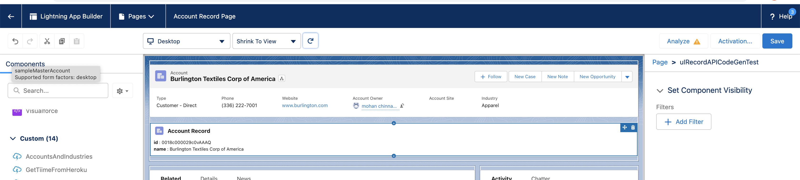
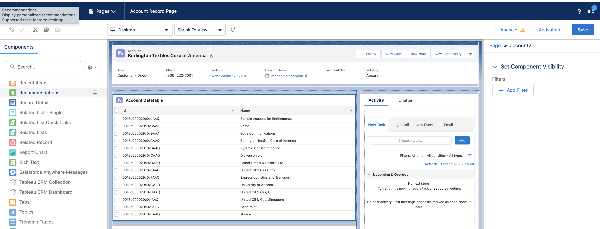
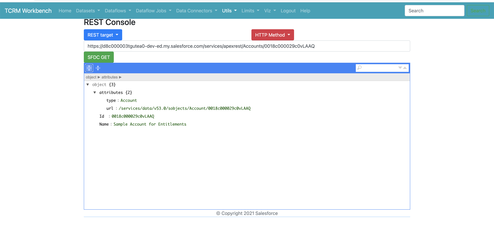

# How to Deploy?

## Create SFDX Project

```
sfdx force:project:create -n MyProject

cd MyProject

```

## Create files into lwc folder: force-app/main/default/lwc
- Working on to provide a zip file which you can unzip...
- Right now copy and paste in to right files as shown in the UI

## Deploy

```
sfdx force:source:deploy -u   mohan.chinnappan.n_os@gmail.com -p force-app/main/default/lwc

```
- In case of Apex class
```
sfdx force:source:deploy -u   mohan.chinnappan.n_os@gmail.com -p force-app/main/default/classes 

```

## Open the Org

```
sfdx force:org:open  -u   mohan.chinnappan.n_os@gmail.com

```

## Use this lwc component using App Builder

- 

- Apex Wire example



# Create commands

- SFDX Project
```
sfdx force:project:create -n MyProject
cd MyProject

```

- LWC
```
# sfdx force:lightning:component:create -n UIRecordAPICodeGenTest -d force-app/main/default/lwc --type lwc
sfdx force:lightning:component:create -n $1 -d force-app/main/default/lwc --type lwc
```
- Apex Class

```
# sfdx force:apex:class:create -n AccountController -d force-app/main/default/classes
sfdx force:apex:class:create -n $1 -d force-app/main/default/classes
```

# Apex REST creation

- Sample Class created for this query

```sql
SELECT Id, Name 
FROM Account

```


```java
// AccountRESTController.cls
@RestResource(urlMapping='/Accounts/*')
global with sharing class AccountRESTController {
    @HttpGet
    global static Account getAccountById() {
        RestRequest request = RestContext.request;
        // grab the accountId from the end of the URL
        String accountId = request.requestURI.substring(
          request.requestURI.lastIndexOf('/')+1);
          Account result =  [SELECT Id, Name 
FROM Account
            WHERE Id = :accountId];
          return result;


    }
}
```

- REST service available at for example:

```
https://instance_url/services/apexrest/Accounts/0018c000029c0vLAAQ

```


