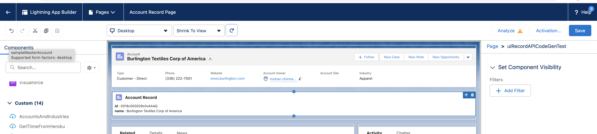

# How to Deploy

## Create SFDX Project

```
sfdx force:project:create -n MyProject

cd MyProject

```

## Create files into lwc folder


## Deploy

```
sfdx force:source:deploy -u   mohan.chinnappan.n_os@gmail.com -p force-app/main/default/lwc

```

## Open the Org

```
sfdx force:org:open  -u   mohan.chinnappan.n_os@gmail.com

```

## Use this lwc component using App Builder




