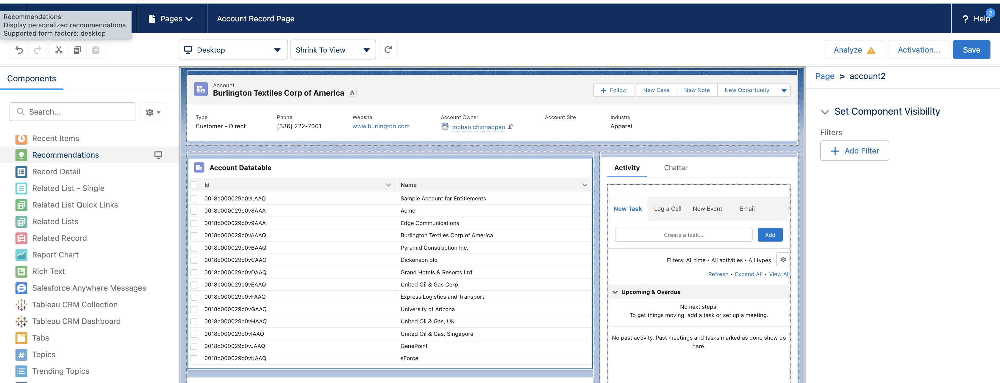

# How to Deploy?

## Create SFDX Project

```
sfdx force:project:create -n MyProject

cd MyProject

```

## Create files into lwc folder: force-app/main/default/lwc
- Working on to provide a zip file which you can unzip...
- Right now copy and paste in to right files as shown in the UI

## Deploy

```
sfdx force:source:deploy -u   mohan.chinnappan.n_os@gmail.com -p force-app/main/default/lwc

```
- In case of Apex class
```
sfdx force:source:deploy -u   mohan.chinnappan.n_os@gmail.com -p force-app/main/default/classes 

```

## Open the Org

```
sfdx force:org:open  -u   mohan.chinnappan.n_os@gmail.com

```

## Use this lwc component using App Builder

- 

- Apex Wire example



