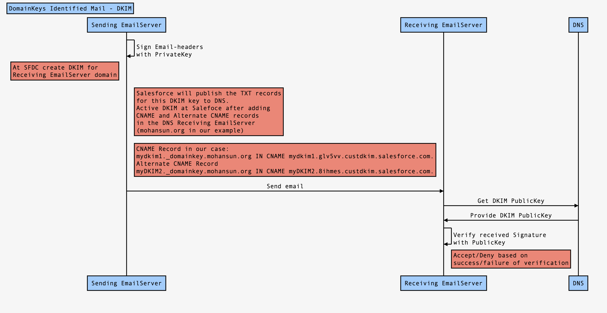

# DKIM Check
- DKIM - Domain Keys Identified Mail
- Verification technique that allows the **receiver** to check if that email was **actually** sent and **authorized** by the owner of that domain (say: biz.com) which sent that email.
- Thus providing **assurance** to that email's authenticity.


## How it is done?
- Providing that email a **digital signature** called DKIM signature
- DKIM Signature is an encrypted string embedded in that email (invisibly)
- DKIM Signature can be verified  by the **recipient's** email **server** (running at say: zeroco2.org) by looking at the **public DNS** records of the domain which sent this email (biz.com)

- For example, Salesforce uses DKIM keys to **sign outbound emails that your organization** sends from the Salesforce platform.  When we create a DKIM key in Salesforce, Salesforce publishes the **TXT record containing your public key to DNS**. Salesforce  automatically rotate keys to reduce the risk of your keys becoming compromised by a third party.

- You will get this message:

- "Salesforce has published the TXT records for this DKIM key to DNS. Before **activating** this key, add the CNAME and Alternate CNAME records in the DNS for your domain."

- The CNAME or “canonical name” DNS record type is used to alias or redirect one DNS name to another DNS name.



- Source for the seq diagram
```
Title: DomainKeys Identified Mail - DKIM

Sending EmailServer->Sending EmailServer:Sign Email-headers\n with PrivateKey
Note left of Sending EmailServer:At SFDC create DKIM for \nReceiving EmailServer domain
Note right of Sending EmailServer:Salesforce will publish the TXT records\n for this DKIM key to DNS.\n Active DKIM at Salefoce after adding \n CNAME and Alternate CNAME records\n in the DNS Receiving EmailServer\n (mohansun.org in our example)
Note right of Sending EmailServer:CNAME Record in our case:\n	mydkim1._domainkey.mohansun.org IN CNAME mydkim1.glv5vv.custdkim.salesforce.com.\nAlternate CNAME Record\n	myDKIM2._domainkey.mohansun.org IN CNAME myDKIM2.8ihmes.custdkim.salesforce.com.

Sending EmailServer->Receiving EmailServer:Send email
Receiving EmailServer->DNS: Get DKIM PublicKey
DNS->Receiving EmailServer: Provide DKIM PublicKey

Receiving EmailServer->Receiving EmailServer: Verify received Signature \n with PublicKey
 
Note right of Receiving EmailServer: Accept/Deny based on \n success/failure of  verification
    
 
  


```

```
dig google.com CNAME


; <<>> DiG 9.10.6 <<>> google.com CNAME
;; global options: +cmd
;; Got answer:
;; ->>HEADER<<- opcode: QUERY, status: NOERROR, id: 18702
;; flags: qr rd ra; QUERY: 1, ANSWER: 0, AUTHORITY: 1, ADDITIONAL: 1

;; OPT PSEUDOSECTION:
; EDNS: version: 0, flags:; udp: 512
;; QUESTION SECTION:
;google.com.                    IN      CNAME

;; AUTHORITY SECTION:
google.com.             42      IN      SOA     ns1.google.com. dns-admin.google.com. 461252381 900 900 1800 60

;; Query time: 47 msec
;; SERVER: 192.168.1.1#53(192.168.1.1)
;; WHEN: Sat Jul 16 08:54:32 EDT 2022
;; MSG SIZE  rcvd: 89
```

- Example DKIM in Salesforce

```
Key Size	1024
Selector	mydkim1
Alternate Selector	myDKIM2
Domain	mohansun.org
Domain Match	Exact domain only
CNAME Record	mydkim1._domainkey.mohansun.org IN CNAME mydkim1.glv5vv.custdkim.salesforce.com.
Alternate CNAME Record	myDKIM2._domainkey.mohansun.org IN CNAME myDKIM2.8ihmes.custdkim.salesforce.com.
TXT Record Status	Published
Active	Not Checked
```


# How to see the TXT records in DNS
```
nslookup -q=TXT salesforce.com
;; Truncated, retrying in TCP mode.
Server:         192.168.1.1
Address:        192.168.1.1#53

Non-authoritative answer:
salesforce.com  text = "v=spf1 include:_spf.google.com include:_spf.salesforce.com exists:%{i}._spf.corp.salesforce.com ~all"
salesforce.com  text = "google-site-verification=XHgruaJj29eI7YjqDkEWZivuT0wlakIWgB2N4DRa_QM"
salesforce.com  text = "google-site-verification=HV79FO1Y0siBF9WSte-fAOzLI3om9c1V08sBXq2p39M"
salesforce.com  text = "docker-verification=b238c187-0eb6-4710-ac1f-0d2ed19765b5"
salesforce.com  text = "hubspot-developer-verification=YjRkOWExNDAtM2JjZS00YWQ0LWExNzItMGVkYzljMDEwM2M3"
salesforce.com  text = "SFMC-cGJQFeEomoQQt-tQ3c_QXefdwzOGuj_Tjl4oWwrW"
salesforce.com  text = "google-site-verification=OXivRKiSmufeLZHqZHxzvbEU_LFMiy4XwYtJiSS1BhQ"
salesforce.com  text = "pardot1=6eae4d5ab80fc91a64539164ab421392a58d97551b230b12152dffb7553ea905"
salesforce.com  text = "stripe-verification=9ca4e73f9b5286bdcdbd5b91f97ad519544e5ee56eebb2f2dc6b48dbec579fe0"
salesforce.com  text = "atlassian-domain-verification=BbMCUfMM/IdZKdn891dRJK4CiORYZGfc1v04YIKNfA4PodxQ36fkTBak2UlB8hY0"
salesforce.com  text = "google-site-verification=D6BlHxqITDdvcLDrxA3_ltYf9P3rRxm8AKKNT3rk4W8"
salesforce.com  text = "pardot220122=922f8d6c355d7ff72ed3e771a2eca71656d0249cfdc70a8cebb481d367d6f006"
salesforce.com  text = "fastly-domain-delegation-lololo98765-341965-2021-07-14"
```

# DNS details
```
dig salesforce.com

; <<>> DiG 9.10.6 <<>> salesforce.com
;; global options: +cmd
;; Got answer:
;; ->>HEADER<<- opcode: QUERY, status: NOERROR, id: 28633
;; flags: qr rd ra; QUERY: 1, ANSWER: 8, AUTHORITY: 0, ADDITIONAL: 1

;; OPT PSEUDOSECTION:
; EDNS: version: 0, flags:; udp: 512
;; QUESTION SECTION: <--- asking for A
;salesforce.com.			IN	A

;; ANSWER SECTION: ( hosted on these 8 IP addresses for redundancy.)
salesforce.com.		120	IN	A	184.31.10.133
salesforce.com.		120	IN	A	23.1.35.132
salesforce.com.		120	IN	A	23.1.99.130
salesforce.com.		120	IN	A	23.1.106.133
salesforce.com.		120	IN	A	104.109.10.129
salesforce.com.		120	IN	A	104.109.11.129
salesforce.com.		120	IN	A	184.25.179.132
salesforce.com.		120	IN	A	184.31.3.130

;; Query time: 145 msec
;; SERVER: 192.168.1.1#53(192.168.1.1)
;; WHEN: Sat Jul 16 08:57:56 EDT 2022
;; MSG SIZE  rcvd: 171

```

# SPF - Sender Policy Framework

## Need for SPF:
- The Simple Mail Transfer Protocol (SMTP) permits any computer to send email claiming to be from **any source address**. This is exploited by spammers and scammers who often use forged email addresses, making it more difficult to **trace a message back to its source**, and easy for spammers to hide their identity in order to avoid responsibility.


- SPF allows the owner of an Internet domain (say example.com) to specify which computers(IPs) are authorized to send mail with **envelope-from** addresses in that domain, using Domain Name System (DNS) records.

-  Receivers verifying the SPF information in TXT records may reject messages from unauthorized sources **before receiving the body of the message**.

- SPF provides a process to verify which **providers** can send emails on behalf of your domain (example.com).
- Use case
    - You like to send email from Salesforce 
    - You need to authorize Salesforce.com mail servers as allowed for the example.com domain.


```
example.com     TXT     "v=spf1 include:_spf.salesforce.com ~all"

```
-  The "~all" at the end specifies that, if the previous mechanisms did not match, the message should be rejected.


- You can see how Salesforce has this SPF record:
```
salesforce.com  text = "v=spf1 include:_spf.google.com include:_spf.salesforce.com exists:%{i}._spf.corp.salesforce.com ~all"
```
## RFC 
- [RFC 7208 - Sender Policy Framework (SPF) for Authorizing Use of Domains in Email, Version 1](https://datatracker.ietf.org/doc/html/rfc7208)


# DMARC 
- Domain-based Message Authentication, Reporting, and Conformance (DMARC) is an email authentication, policy, and reporting protocol. It’s built on top of Sender Policy Framework (SPF) and DomainKeys Identified Mail (DKIM) protocols.
- If neither of those authentication methods passes, the DMARC policy determines what to do with the message.
- DMARC is a **second layer of authentication** after DKIM and SPF. If an email doesn't pass DKIM and SPF authentication, DMARC policy tells the receiver **what to do with** the message. For example, it can reject some email messages and quarantine others.

- With DMARC, the receiver can report back to the sender when emails fail their DKIM and SPF checks, even if the messages aren’t rejected. 

- Example
```
Google has announced that they will implement a strict email authentication Domain-based Message Authentication, Reporting & Conformance (DMARC) policy in June 2016. This policy advises DMARC-compliant email servers to reject emails with **@gmail.com in the “from” address**, when such emails do not originate from Google’s mail servers.
```
- [Guidelines for Configuring Deliverability Settings for Emails Sent from Salesforce](https://help.salesforce.com/s/articleView?id=sf.emailadmin_deliverability.htm&type=5)

# Resources
- [Emails sent from Salesforce are classified as spoofing or SPAM messages. Why is this?](https://help.salesforce.com/s/articleView?id=000336142&type=1)
- [Enable Email Relay](https://help.salesforce.com/s/articleView?id=000324260&type=1)
- [Sender Policy Framework (SPF)](https://help.salesforce.com/s/articleView?id=sf.emailadmin_spf_overview.htm&type=5)
- [Include Salesforce in Your SPF Record ](https://help.salesforce.com/s/articleView?id=sf.emailadmin_spf_include_salesforce.htm&type=5)
- [Twilio sendGrid](https://docs.sendgrid.com/ui/sending-email/dmarc)
- [What is DMARC](https://help.salesforce.com/s/articleView?id=sf.emailadmin_dmarc.htm&type=5)

# Creation
```
sfdx mohanc:slides:gen -i dkim.in.md -o dkim.in.md.html -t "DKIM and SPF Notes"; open  dkim.in.md.html 

```
- [Single Page View](https://github.com/mohan-chinnappan-n5/mohan-chinnappan-n5.github.io/blob/master/2022/email/dkim.in.md)