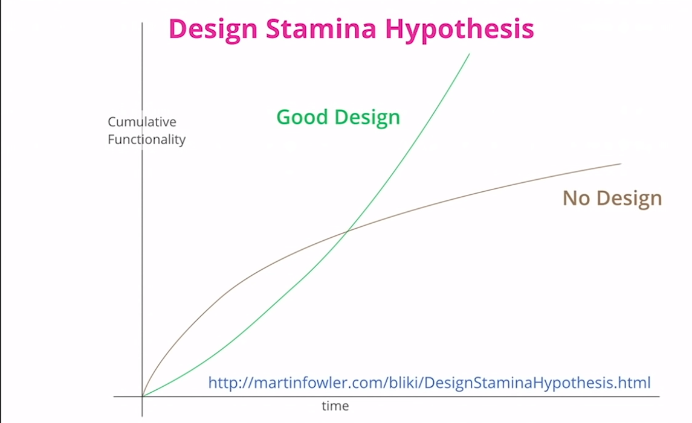
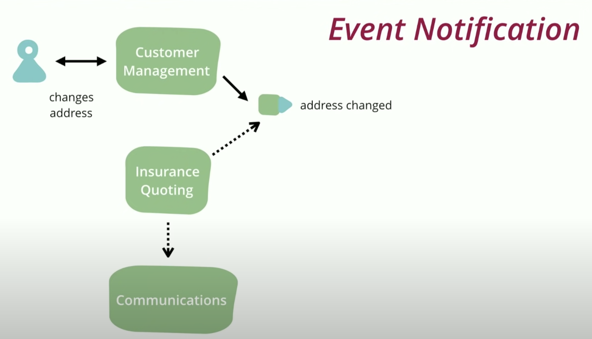
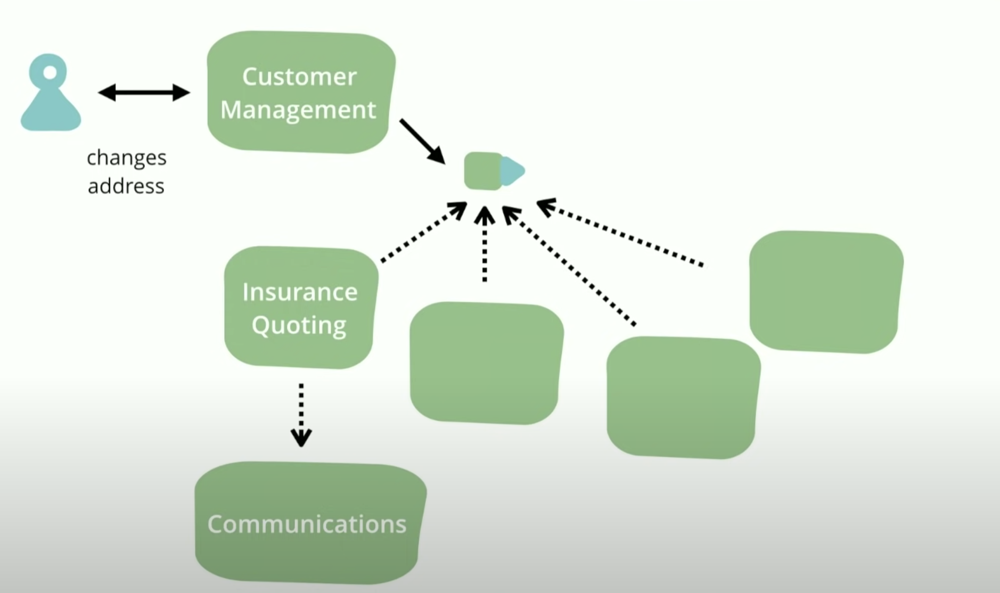
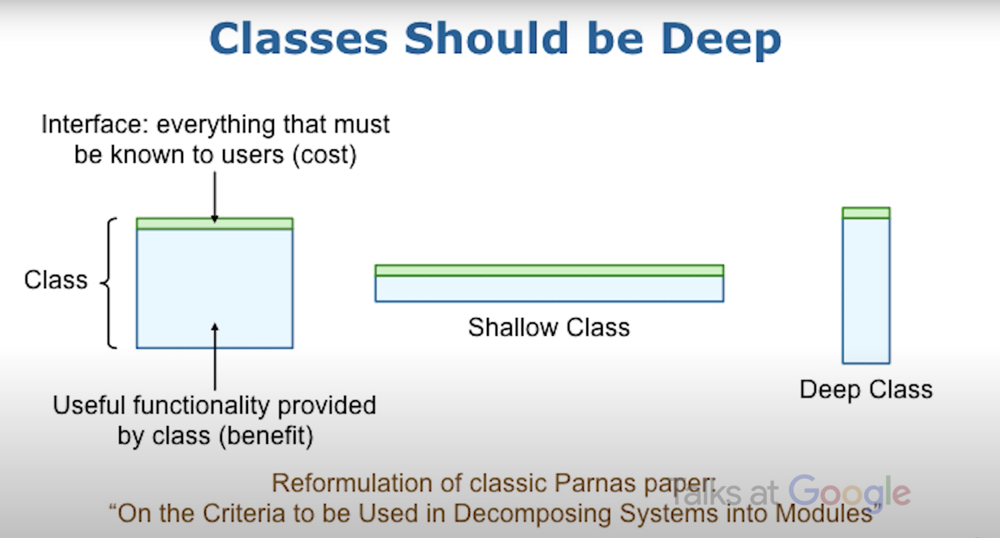
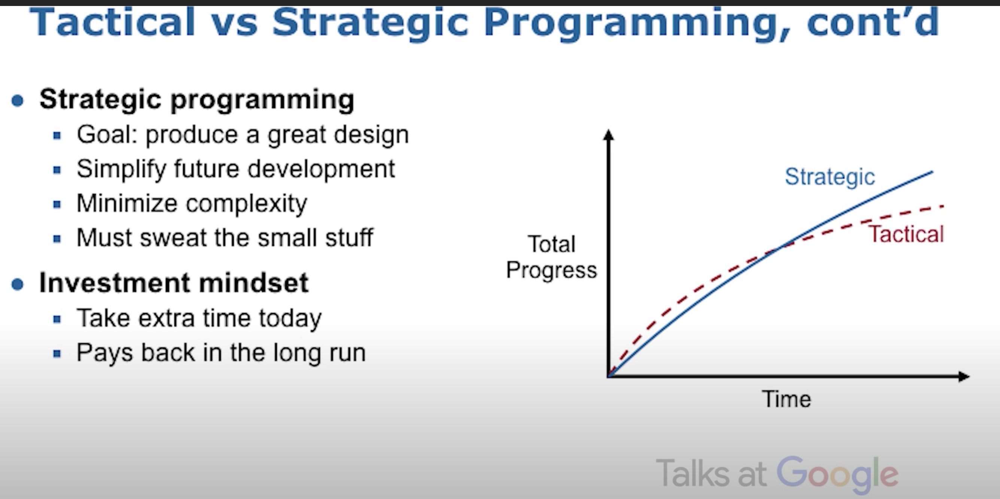

# What is Software Architecture?
- Architecture of a system is what’s important in a system. 
- Architecture might be combination of two things
1. decisions that are hard to change
	- i.e. from *the decisions you wish you got right early because they’re hard to change late* - e.g. programming language
2. expert developers’ shared understanding of system design 
	- common understanding on **how to the system works**
    	- implies a vague human-shared understanding
    	- need a good shared understanding for **growth**
 
# Good Software Architecture
- A good architecture will allow us to ship features faster; a bad architecture is only a short-term gain
- Bad architecture will slow down adding features
- Time when good architecture pays off is weeks, not months



# Resources
- [Making Architecture Matter - Martin Fowler Keynote](https://www.youtube.com/watch?v=DngAZyWMGR0)
- [Notes:Making Architecture Matter - Martin Fowler Keynote](http://alex-ii.github.io/notes/2018/11/11/making_architecture_matter.html)


# Event Driven Architecture

## 1. Event Notification
- Decouples receiver from the sender
- Has no statement to look at for the overall behavior
	- As it's not explicit in any program text
	- Often the only way to figure out this flow is from monitoring a live system
- So, this pattern is still very useful, but you have to be careful of the trap

-
-


- UI Event notification and handling
```js
document
            .getElementById("inputFile")
            .addEventListener("change", getUploadedFile);

```
- An event need not carry much data on it, often just 
	- some id information 
	- a link back to the sender that can be queried for more information

## 2. Event-Carried State Transfer

- Put enough data in the event payload so the receiver system does not need to go back to the receiver system.
```
{
	"name": "address change",
	"customerId": "C13444",
	"fromAddress" : {...},
	"toAddress" : {...},

}

```
- recipient systems can function if the customer system is becomes unavailable
-  there's lots of data moved around and lots of copies. But that's less of a problem in an age of abundant storage. 
- more complexity on the receiver, since it has to sort out maintaining all the state,

## 3. Event-Sourcing

- whenever we make a change to the state of a system, we **record** that state change as an event, and we can **confidently rebuild** the system state by reprocessing the events at any time in the future. 
- Similar to what version controls systems like git does.
- Similar to **Redo** logs in DBMS

-  it is often useful to build **snapshots** of the working copy so that you don't have to process all the events from scratch every time you need a working copy. 

-  The event log provides a strong audit capability (accounting transactions are an event source for account balances). 

- Replaying events becomes problematic when results depend on interactions with outside systems
- We have to figure out how to deal with changes in the schema of events over time.


## 4. Command Query Responsibility Segregation (CQRS)
- Having separate data structures for reading and writing information. 
- The justification for CQRS is that in complex domains, a single model to handle both reads and writes gets too complicated, and we can simplify by separating the models.
- This is particularly appealing when you have a difference in access patterns, such as lots of reads and very few writes


#  Event Driven Architecture Resources
- [What do you mean by “Event-Driven”?](https://martinfowler.com/articles/201701-event-driven.html)
- [The Many Meanings of Event-Driven Architecture • Martin Fowler • GOTO 2017](https://www.youtube.com/watch?v=STKCRSUsyP0)

# Software Design

## A few (somewhat vague) overall concepts:
- **Working code isn't enough: must minimize complexity**
- Complexity comes from dependencies and obscurity
- **Strategic vs. tactical programming**
- **Classes should be deep**
- 
- General-purpose classes are deeper
- New layer, new abstraction
- Comments should describe things that are not obvious from the cods
- **Define errors out of existence**
- Pull complexity downwards


## Define Errors Out of Existence

- Exceptions: a huge source of complexity
- Common wisdom: detect and throw as many errors as possible
- Better approach: define semantics to eliminate exceptions
- Example mistakes:
	- Tcl unset command (throws exception if variable doesn’t exist)
	-  Windows OS: can't delete file if open
 	- Java substring range exceptions
- Overall goal: minimize the number of places where exceptions must
be handled . 

## Working code is not enough - Tactical vs. Strategic Programming
- Tactical programming
	- Goal: get next feature/bug fix working ASAP
	-  A few shortcuts and kludges are OK?
	- Result: bad design, high complexity
	-  Extreme: tactical tornadoes
- Complexity is incremental

## Deep Interface - Example - Unix file I/O
- Amazingly beautiful interface design!

```c
int open(const char* path, int flags, mode_t permissions);

int close(int fd);

ssize_t read(int fd, void* buffer, size_t count);

ssize_t write(int fd, const void* buffer, size_t count);

off_t Iseek(int fd, off_t offset, int referencePosition);
```
- Hidden below the interface:
	- On-disk representation, disk block allocation
	- Directory management, path lookup
	- Permission management
	- Disk scheduling
	- Block caching
	- Device independence

## Tactical vs Strategic programming



## How much  to invest
- Most startups are totally tactical
- Pressure to get first products out quickly
 	- “We can clean this up later”
	-  Code base quickly turns to spaghetti
 	- Extremely difficult/expensive to repair damage

- Facebook: “Move quickly and break things”
	- Empowered developers
	- Code base notoriously incomprehensible/unstable
	- Eventually changed to "Move quickly with solid infrastructure”
- Can succeed with strong design culture: Google and VMware
	-  Attracted best engineers


# Resource for Software Design
- [A Philosophy of Software Design | John Ousterhout | Talks at Google](https://www.youtube.com/watch?v=bmSAYlu0NcY)
- [On the Criteria To Be Used in Decomposing Systems into Modules - D.L. Parnas Carnegie-Mellon University](img/criteria_for_modularization.pdf )


# Patterns


# Resources for patterns
- [5 Design Patterns Every Engineer Should Know ](https://www.youtube.com/watch?v=FLmBqI3IKMA)


# Refactoring


# Resources for Refactoring
- [The Second Edition of "Refactoring"](https://martinfowler.com/articles/refactoring-2nd-ed.html)


# Null Reference was a bad idea!

- [Null References The Billion Dollar Mistake - Tony Hoare](https://www.youtube.com/watch?v=YYkOWzrO3xg)
- [C++: No more nulls! (Fixing the billion dollar mistake) - Anders Schau Knatten ](https://www.youtube.com/watch?v=FTfLLB4kboQ)

- Algol
	- compiler was written in Machine Code
	- Advantages
		- if you made a mistake you can follow through and find out what the results of your mistake so you can fix it
	- In high-level languages that capacity is taken out - details of the underlying architecture was protected from the user
	- In case of arrays, subscript bounds (upper and lower) are checked - this added more code to do these tests  (1960)
	- Extension for Algol 60 - successor
		- record handling (Simula ) - concept of Object - reference can made to the Object by pointer	
		- Every variable going to hold the address as its value of the location where value is stored - the programmer must declare the type of location store that pointer is going to point to. - what kind of thing it points to?
		- This can be checked at the compile time
		- Record handling does not need subscript bounds checking
		- Subscript checking can be turned off after all the checking done?

		- Vehicles
			- Car - Capacity of the trunk
			- Bus - # passengers
			- Discrimination clause
			- Disjoint between Car and Bus
			- Null -> class which has any objects in it. Only one pointer which did not point to any object
				- initializing pointers to null

# Generation 
```
sfdx mohanc:slides:gen -i sarch.md -o sarch.md.html -t "Software Architecture and Design"
```