# Goals
1. Clean data/metadata (automated)
2. Clean Scratch orgs (automated)
3. Code scan integration, (automated)


    - codescan : ```catch them young```
    - 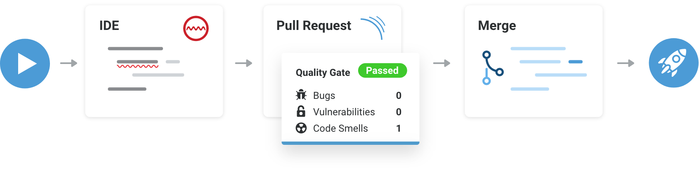
        - [**At Developer Side**](#1)
         - [PMD Scan at IDE VS Code](https://marketplace.visualstudio.com/items?itemName=mohanChinnappan.apex-pmd-code-scanner) 
         - [Sonar Lint at IDE VS Code](https://www.sonarlint.org/vscode))
       
        - **In the pipeline**
            -  [Sonar-scanner in the pipeline](#2)

4. Integrating tools like [org.viz](https://mohan-chinnappan-n5.github.io/sf-security/security.md.html#10) 

5. Performance measurements
    - speedtest.js [Lightning Performance tips](https://mohan-chinnappan-n2.github.io/2019/lex/perf.html)
    - [Lighthouse](https://developers.google.com/web/tools/lighthouse)

6. Integration with Slack

7. Test-Automation


# Code Scan at Developer side

- 

- [PMD at developer side (VS code Extension](https://marketplace.visualstudio.com/items?itemName=mohanChinnappan.apex-pmd-code-scanner)

- 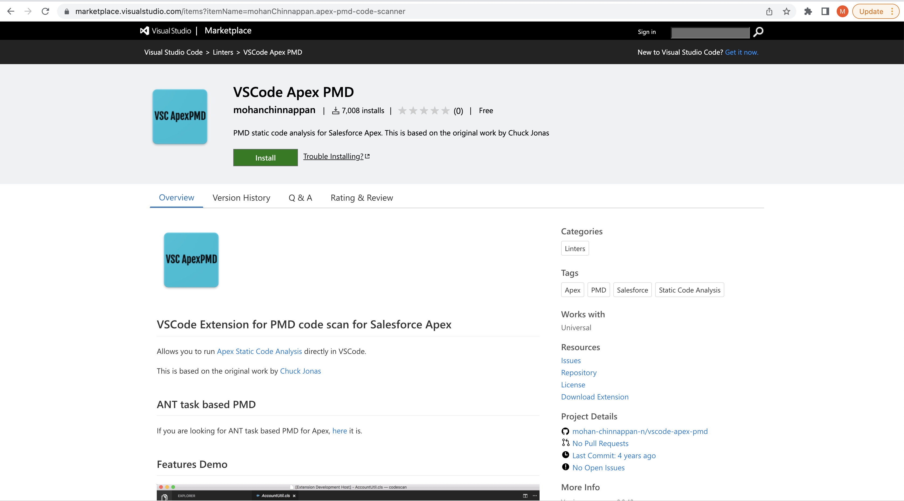

- 

## SonarLint
- [SonarLint](https://www.sonarqube.org/sonarlint/?referrer=sonarqube-welcome)
    - [VS Code SonarLint](https://www.sonarlint.org/vscode)
- 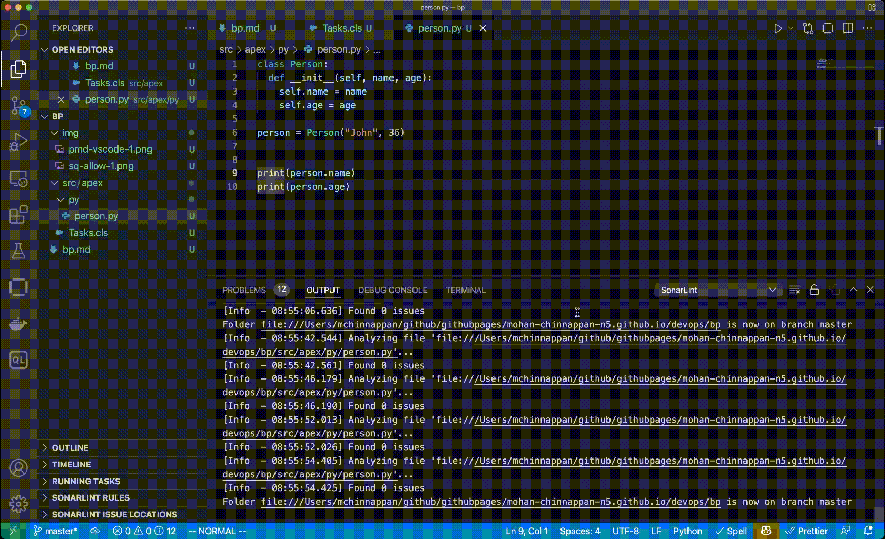

# Salesforce Lightning Code Scanner

- [Salesforce Lightning Code Scanner App](https://mohansun-slds-lint.herokuapp.com/)

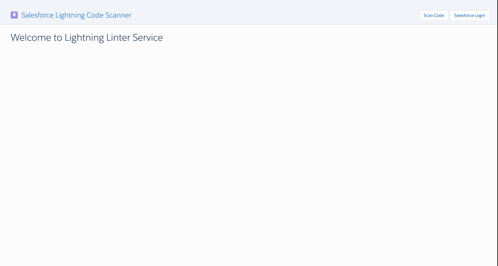

# Code Scan in the deployment pipeline
- Sonar-scanner in the pipeline

- [Download SonarQube](https://www.sonarqube.org/success-download-community-edition/)

## Start SonarQube Server
```
cd codescan/sonarqube/sonarqube-9.3.0.51899

./bin/macosx-universal-64/sonar.sh console

```

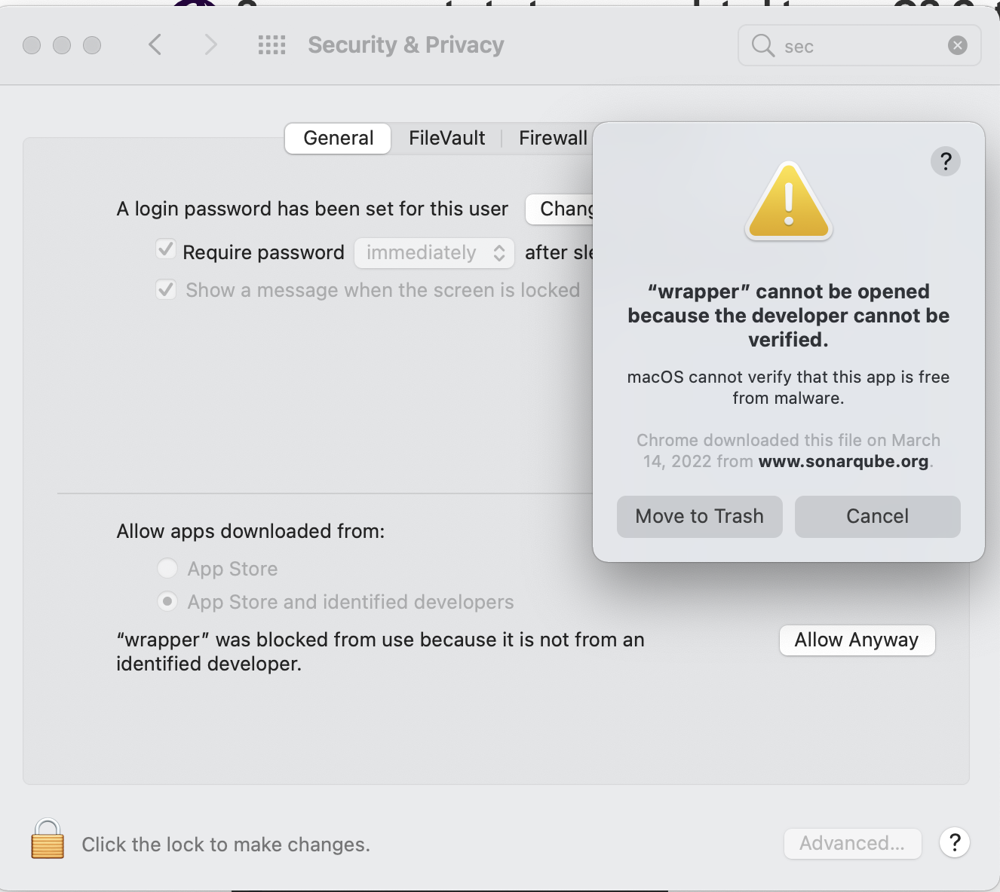

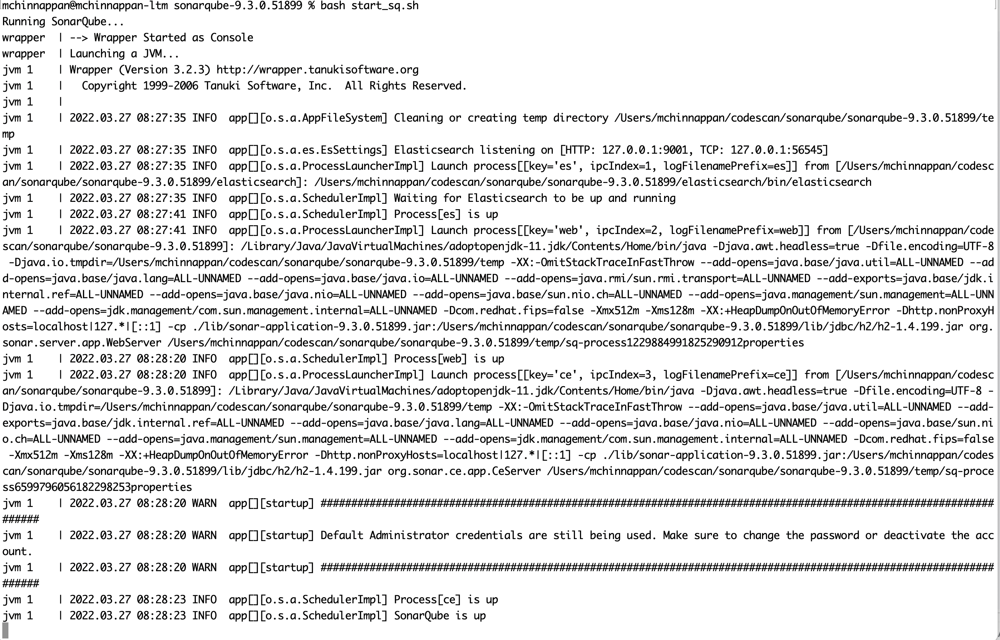

## Install sonar-scanner on mac
```
brew install sonar-scanner

```

## Setting up the project
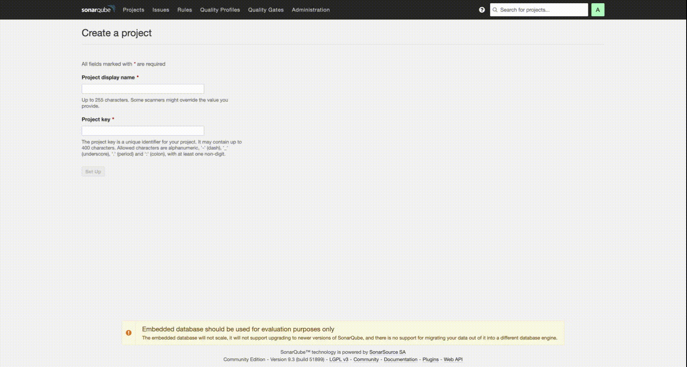


- Running
```
sonar-scanner \
  -Dsonar.projectKey=pythontest \
  -Dsonar.sources=. \
  -Dsonar.host.url=http://localhost:9000 \
  -Dsonar.login=c0fbb7cac9403c341a51307a69ad9f1104e9744c

```

- Note: ``` -Dsonar.login=c0fbb7cac9403c341a51307a69ad9f1104e9744c``` is the project key

- Viewing scanner output

- 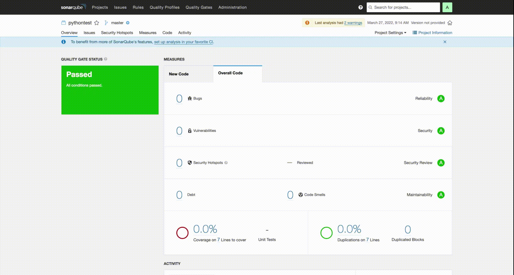

# SonarLint


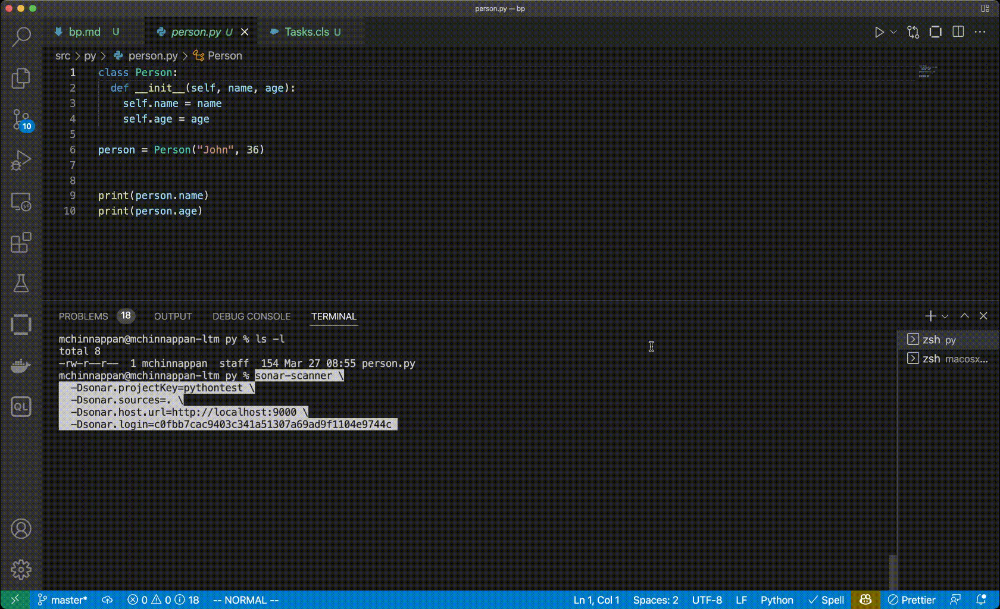


# Branching

- 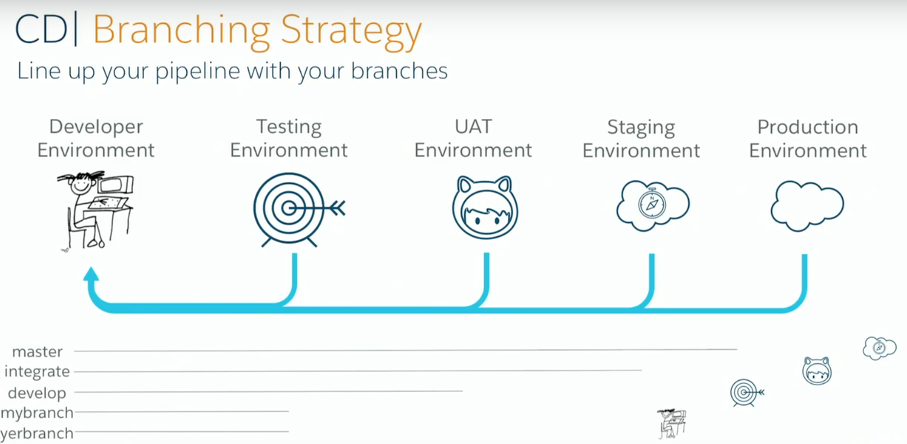

- 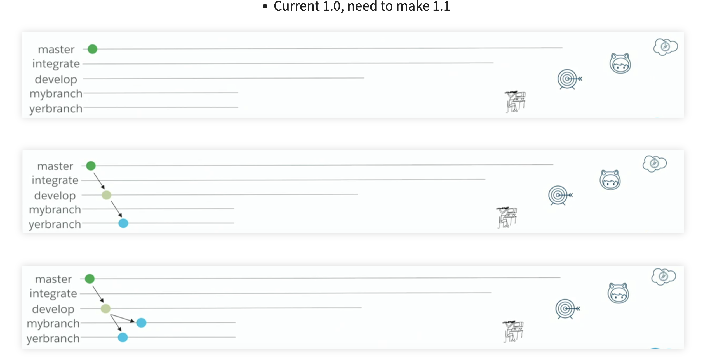


- 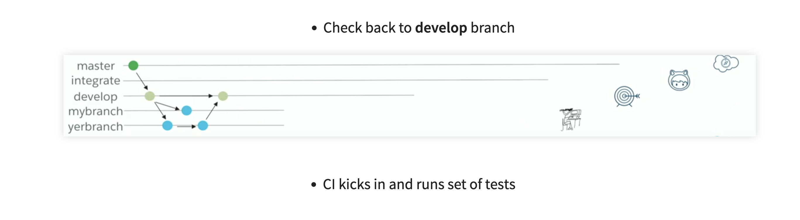

- 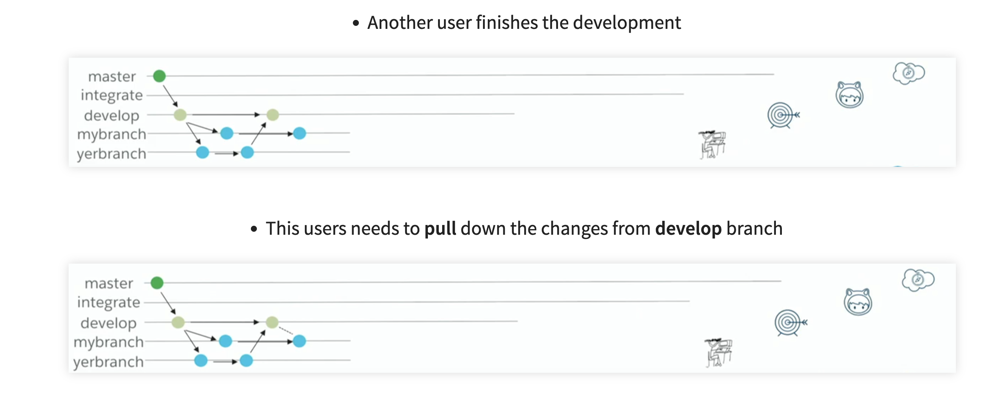

- 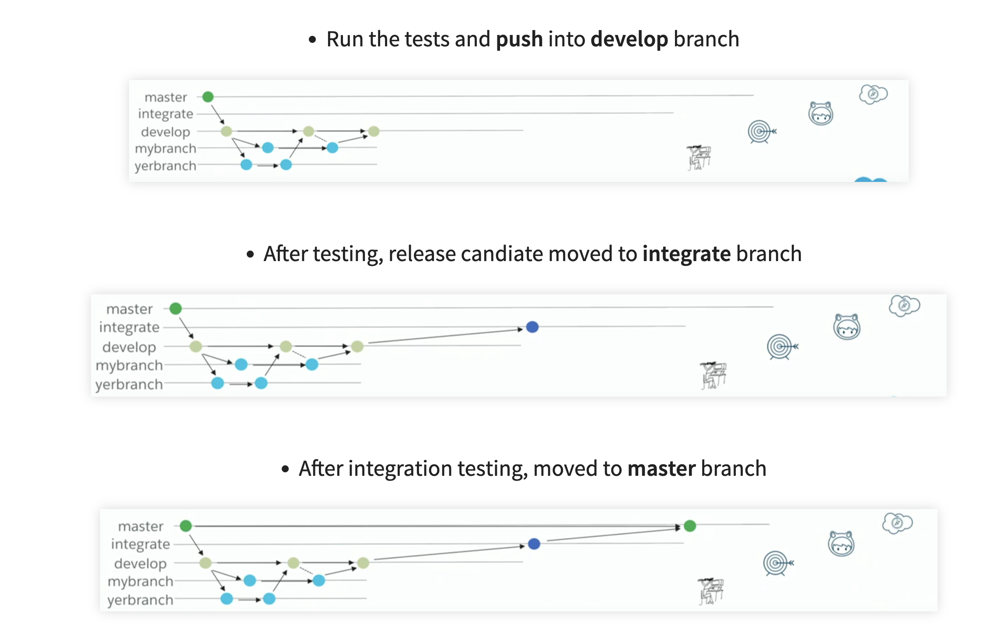

# Performance Measurements

- speedtest.js 
    - [Lightning Performance tips](https://mohan-chinnappan-n2.github.io/2019/lex/perf.html)

- 

- [Lighthouse](https://developers.google.com/web/tools/lighthouse)
    - 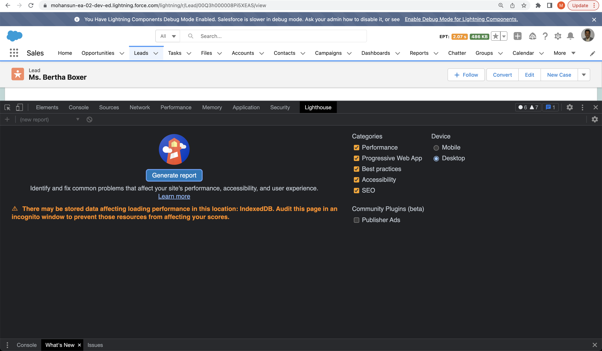
 

# Integration with Slack


- Slack Notifcations Plugin
- 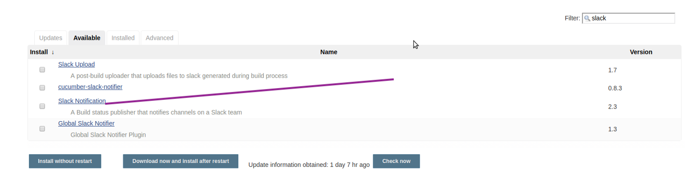
- 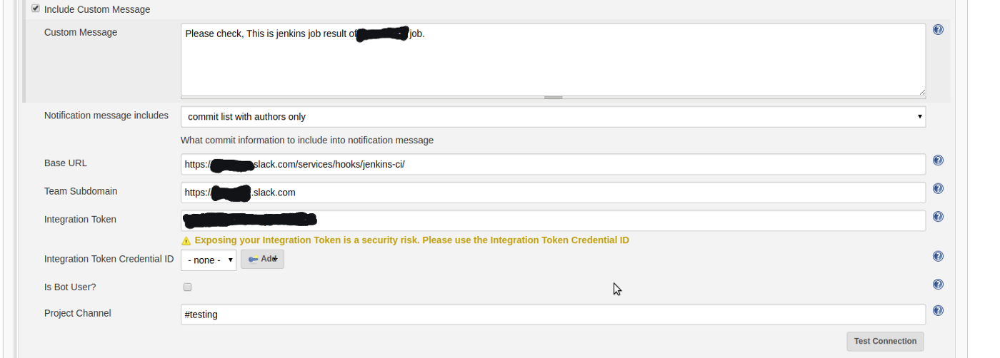


- Will be based on TCRM (Tableau CRM slack integration work)
- Demos of Tableau CRM slack integration work 
## Desktop

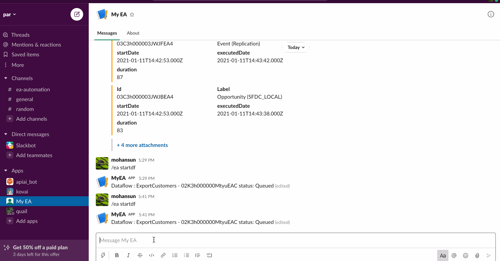


## Mobile


# References

## SFDX
- [SFDX Slides](https://mohan-chinnappan-n.github.io/sfdc/dx.html#/home)

## Code Scan

### SonarQube
- [SonarQube download](https://www.sonarqube.org/success-download-community-edition/)
- [SonalQube install](https://docs.sonarqube.org/latest/setup/get-started-2-minutes/)
- [Security and Preferences - SonarQube](https://community.sonarsource.com/t/sonar-cannot-start-once-updated-to-macos-catalina-error-as-wrapper-cannot-be-opened-because-the-developer-cannot-be-verified/16439/2)
- [SonarQube install on Mac](https://techblost.com/how-to-setup-sonarqube-locally-on-mac/)

- [SonarLint](https://www.sonarqube.org/sonarlint/?referrer=sonarqube-welcome)
    - [VS Code SonarLint](https://www.sonarlint.org/vscode)
- [SonarQube - Apex Rules](https://rules.sonarsource.com/apex)

# Creation

```
sfdx mohanc:slides:gen -i bp.md  -o bp.md.html -t 'DevOps Best Practices'

```


