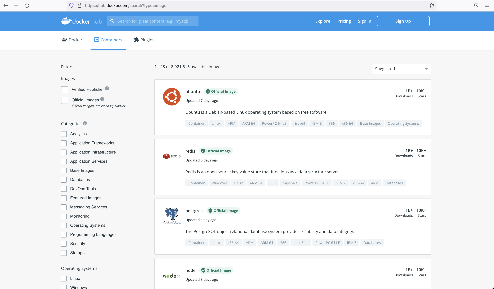
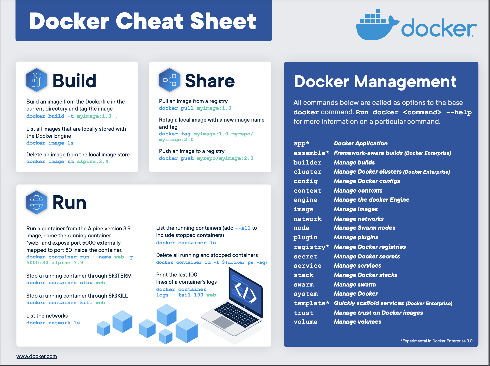
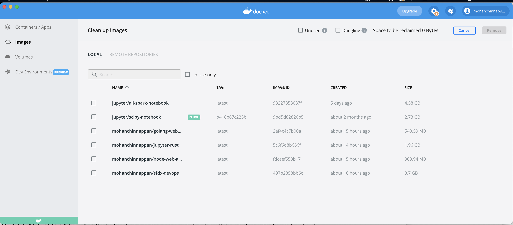

# Docker

# Docker Container
- Makes development process easier
    - Solves deployment problems

- It is your own isolated OS
- Packaged with all needed
- One command to install
```
docker run --help

Usage:  docker run [OPTIONS] IMAGE [COMMAND] [ARG...]

Run a command in a new container

```


## Container repository
- Storage for the containers
- Private repositories for the companies
- Public repositories
    - We can find and use the application container we need
    - [Docker Hub](https://hub.docker.com/)
        - Official container images 




# How it helps app development
- Without docker to setup the development environment:
    - Developers need to install various components like DBMS (e.g Postgres), web server (e.g node.js and express.js) in their OS
    - This install process with multiple steps will vary based on the OS that developers are using


# Inside a container

# Docker cheat sheet
- 
- [Docker Cheat Sheet PDF](img/docker-cheat-sheet.pdf)


# SFDX - DevOps - Docker

## Sample docker build

- [Dockerfile](./docker/Dockerfile)


```
docker build  -t mohanchinnappan/sfdx-devops  .

```


```

+] Building 0.4s (19/19) FINISHED                                                                                                                                
 => [internal] load build definition from Dockerfile                                                                                                         0.0s
 => => transferring dockerfile: 37B                                                                                                                          0.0s
 => [internal] load .dockerignore                                                                                                                            0.0s
 => => transferring context: 2B                                                                                                                              0.0s
 => [internal] load metadata for docker.io/library/ubuntu:21.04                                                                                              0.3s
 => [ 1/15] FROM docker.io/library/ubuntu:21.04@sha256:ba394fabd516b39ccf8597ec656a9ddd7d0a2688ed8cb373ca7ac9b6fe67848f                                      0.0s
 => CACHED [ 2/15] RUN apt-get update                                                                                                                        0.0s
 => CACHED [ 3/15] RUN DEBIAN_FRONTEND=noninteractive apt-get install -qq         curl         sudo         git         jq         zip         vim           0.0s
 => CACHED [ 4/15] RUN curl -sL https://deb.nodesource.com/setup_14.x | sudo -E bash -     && sudo apt-get install -qq nodejs                                0.0s
 => CACHED [ 5/15] RUN apt-get update -qq &&     DEBIAN_FRONTEND=noninteractive     apt-get install -qq openjdk-8-jdk &&     apt-get clean -qq &&  rm -rf /  0.0s
 => CACHED [ 6/15] RUN export JAVA_HOME                                                                                                                      0.0s
 => CACHED [ 7/15] RUN apt-get update     && apt-get install -y wget gnupg     && wget -q -O - https://dl-ssl.google.com/linux/linux_signing_key.pub | apt-  0.0s
 => CACHED [ 8/15] RUN mkdir -p /sfdx_plugins/.local/share &&     mkdir -p /sfdx_plugins/.config &&     mkdir -p /sfdx_plugins/.cache &&     chmod -R 777 s  0.0s
 => CACHED [ 9/15] RUN export XDG_DATA_HOME &&     export XDG_CONFIG_HOME &&     export XDG_CACHE_HOME                                                       0.0s
 => CACHED [10/15] RUN npm install --global sfdx-cli@latest                                                                                                  0.0s
 => CACHED [11/15] RUN groupadd -r devops && useradd -r -ms /bin/bash -g devops douser1                                                                      0.0s
 => CACHED [12/15] RUN echo 'y' | sfdx plugins:install sfdmu@4.11.1                                                                                          0.0s
 => CACHED [13/15] RUN echo 'y' | sfdx plugins:install sfpowerkit@4.1.5                                                                                      0.0s
 => CACHED [14/15] RUN echo 'y' | sfdx plugins:install @dxatscale/sfpowerscripts@10.2.15                                                                     0.0s
 => CACHED [15/15] RUN echo 'y' | sfdx plugins:install sfdx-browserforce-plugin@2.8.0                                                                        0.0s
 => exporting to image                                                                                                                                       0.0s
 => => exporting layers                                                                                                                                      0.0s
 => => writing image sha256:497b2858bb6c585683d5dfc3c015e1a0209890c6e5bc261e6d3aa932ab284cf4                                                                 0.0s
 => => naming to docker.io/mohanchinnappan/sfdx-devops                                                                                                       0.0s

Use 'docker scan' to run Snyk tests against images to find vulnerabilities and learn how to fix them
```
- 


## List
```

docker image ls                       

REPOSITORY                    TAG       IMAGE ID       CREATED          SIZE
mohanchinnappan/sfdx-devops   latest    497b2858bb6c   51 minutes ago   3.7GB
chevdor/jupyter-rust          latest    adbad4228be3   14 months ago    1.8GB

```

## Run
```
docker run -it 497b2858bb6c /bin/bash

```

```
douser1@ccc4fea347e5:/$ sfdx plugins

You acknowledge and agree that the CLI tool may collect usage information, user environment, and crash reports for the purposes of providing services or functions that are relevant to use of the CLI tool and product improvements.

@dxatscale/sfpowerscripts 10.2.15 (10.2.15)
sfdx-browserforce-plugin 2.8.0 (2.8.0)
sfpowerkit 4.1.5 (4.1.5)

douser1@ccc4fea347e5:/$ uname
Linux

douser1@ccc4fea347e5:/$ whoami 
douser1

```

# Search in docker hub

- [Docker Hub Search](https://hub.docker.com/u/mohanchinnappan)


# Creation 
``` 

sfdx mohanc:slides:gen -i docker.md -o docker.md.html -t 'All about Docker'

```