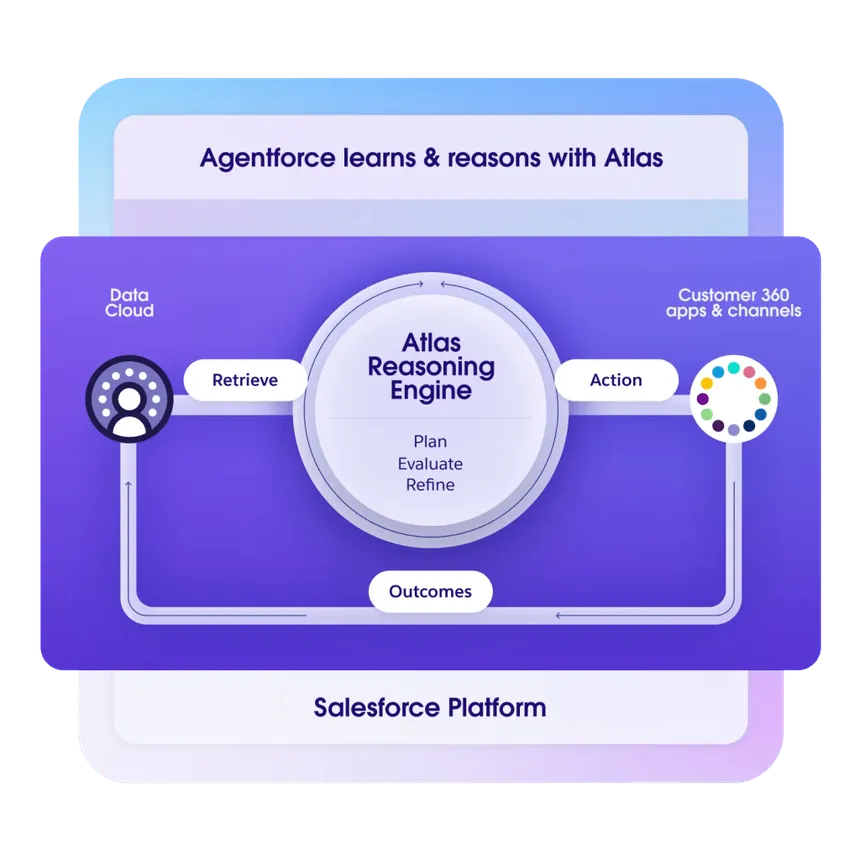

The **Atlas Reasoning Engine** is the core component of Agentforce, designed to enable autonomous, proactive AI agents to make intelligent decisions at scale. Here are some key points:

- **Reasoning and Acting (ReAct)**: The engine uses a loop of reasoning, acting, and observing to fulfill user goals, allowing for a more fluid and natural conversational experience.
- **Topic Classification**: Maps user input to specific topics, which contain relevant instructions, business policies, and actions.
- **Dynamic Information Retrieval**: Supports mechanisms like retrieval augmented generation (RAG) to access dynamic information from various sources.
- **Human Transfer**: Allows seamless transfer to human agents for critical scenarios.

**Use LLMs for responses**:  By this we have opened up the system to let the LLM respond using the **context in conversation history**, we’ve allowed for a far richer conversational experience. Now, users can ask for **clarifications and ask follow-up questions to prior outputs**, leading to an overall higher goal-fulfillment rate

### References
- [How the Atlas Reasoning Engine Powers Agentforce](https://www.salesforce.com/agentforce/what-is-a-reasoning-engine/atlas/)
- [How agentforce works](https://www.salesforce.com/ca/agentforce/how-it-works/)