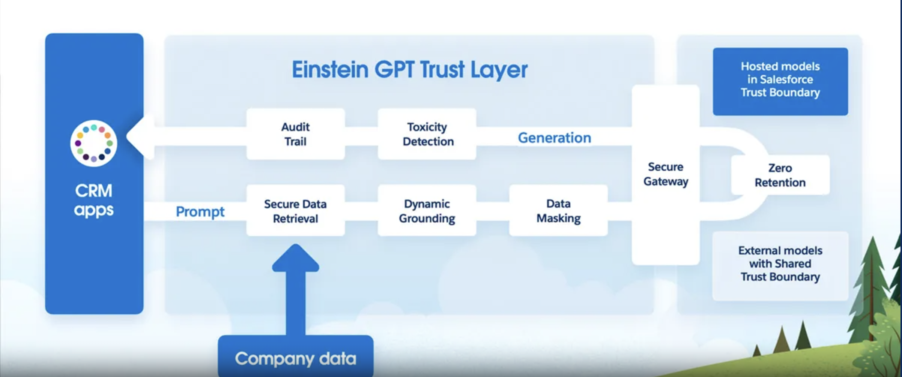

The Einstein Trust Layer is a robust set of features and guardrails designed to protect the **privacy and security** of your data, improve the **safety and accuracy** of AI results, and promote the responsible use of AI across the Salesforce ecosystem. 

Einstein Trust Layer  **detects and masks** sensitive data

Key features include:

- Dynamic Grounding: Ensures AI models are grounded in relevant and accurate data.
- Zero Data Retention: No data is retained by the AI models.
- Toxicity Detection: Identifies and mitigates harmful content.

- Video
    - [Einstein Trust Layer](https://www.salesforce.com/news/stories/video/explaining-the-einstein-gpt-trust-layer/)