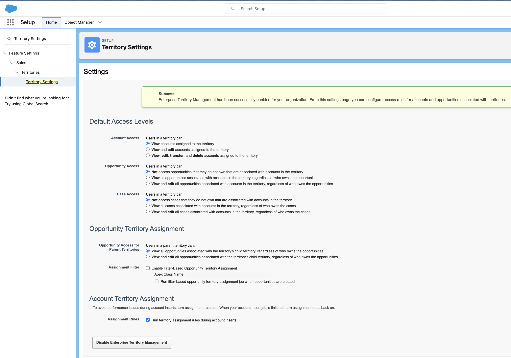

# Enterprise Territory Management (ETM) terms

# Sales Territories

- To keep track of which **reps** are assigned to which **accounts and opportunities**
- Encourages healthy competition within your team
	- which territory will meet its quota first this quarter: Northeast or Southeast?
	- gives reps access to accounts based on criteria such as **postal code, industry, revenue, or a custom field**
- Admins can **set up and test** territory models **before implementing them**
- It is easy to make assignments between territories, accounts, and opportunities
- Reports help teams 
	- organize for optimal coverage 
	- assess territory effectiveness
- With Collaborative Forecasts, you can forecast by territory

|---|---|---|
|Term|Meaning|Comments|
|Territory|Groups of accounts and the sales reps who work with those accounts||
|Territory type|group territories according to a common denominator - to organize and create territories||
|Territory type priority|create your own priority scheme - e.g. 001 means highest priority||
|Territory model|Modeling lets you create and preview multiple territory structures and different account and user assignments before you activate the model that works best||
|Territory hierarchy|model’s territory structure - run assignment rules for territories||
|Territory model state|state can be planning stage, in active use, or archived|can have only one active territory model at a time|

# Enabling ETM
- Success Message
	- Enterprise Territory Management has been successfully enabled for your organization. From this settings page you can configure **access rules for accounts and opportunities associated with territories**

- 
