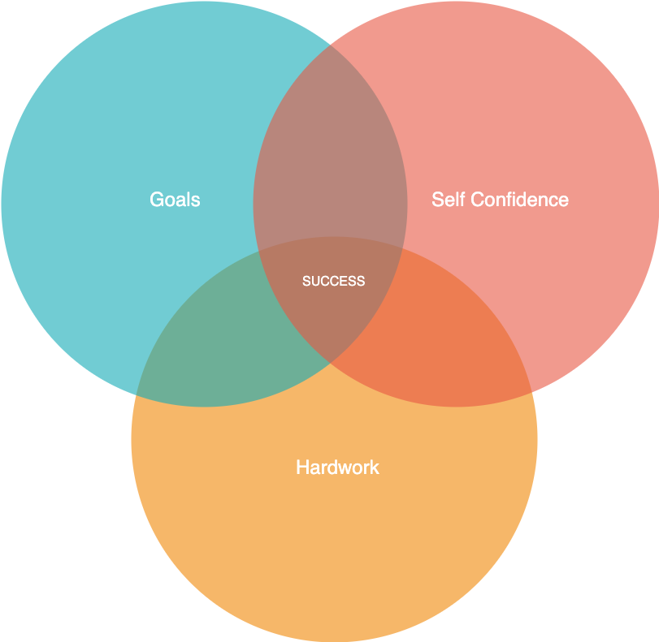

# I have a dream

 


<p>Was an American Baptist minister and activist who was a leader in the African-American Civil Rights Movement
  </p>

<audio controls>
  <source src="img/MLKDreamSpeech.mp3" type="audio/mpeg">
</audio>


# Dr. MLK quotes

- Love

```
Darkness cannot drive out darkness; only light can do that. Hate cannot drive out hate; only love can do that.
```

```
I have decided to stick with love. Hate is too great a burden to bear.

```

- Helping others
```
Life's most persistent and urgent question is, 'What are you doing for others?
```


- Infinite hope
```
We must accept finite disappointment, but never lose infinite hope.
```

# Formula for success



