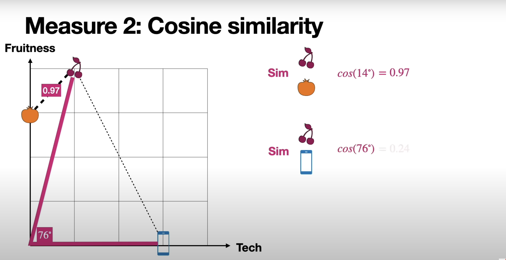
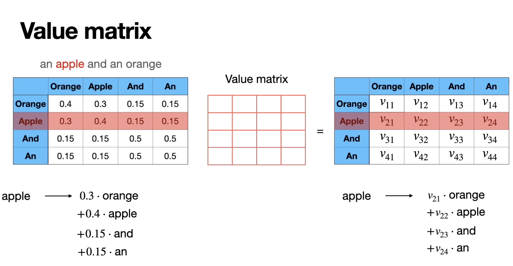

## Embeddings

- words --> numbers

## Math


### Attentions

- Context
```
Please buy an apple and an orange 
- we are talking about fruits
    - apple <---> orange
```


```
apple release m4 laptops

- we are talking about Brand apple
    - apple <---> laptop
```

#### Multi-head attention


- Math ops


### Similarity




### Word Match


### Normalize


### SoftMax


### Key Query Value (KQV)
-    Finding similarities


### Value Matrix
- Finding next word




### Single and multi-head


### Transformer Layers

- 
- 

- Perceptron


- 3 outputs


- Predict next word


## References

- [https://www.youtube.com/watch?v=UPtG_38Oq8o](The math behind Attention: Keys, Queries, and Values matrices)
- [LLM University!](https://docs.cohere.com/docs/llmu)
- [Stanford CS324](https://stanford-cs324.github.io/winter2022/lectures/introduction/)
