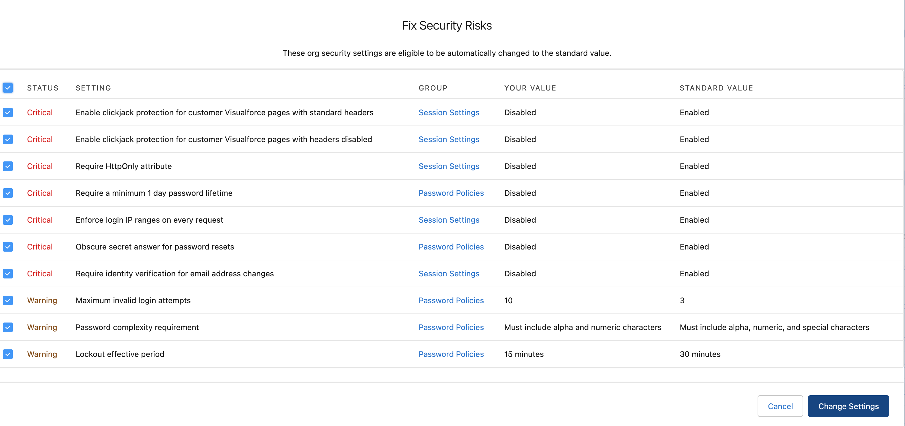
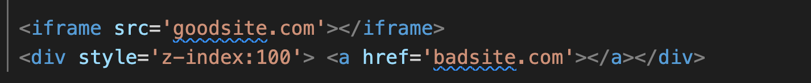
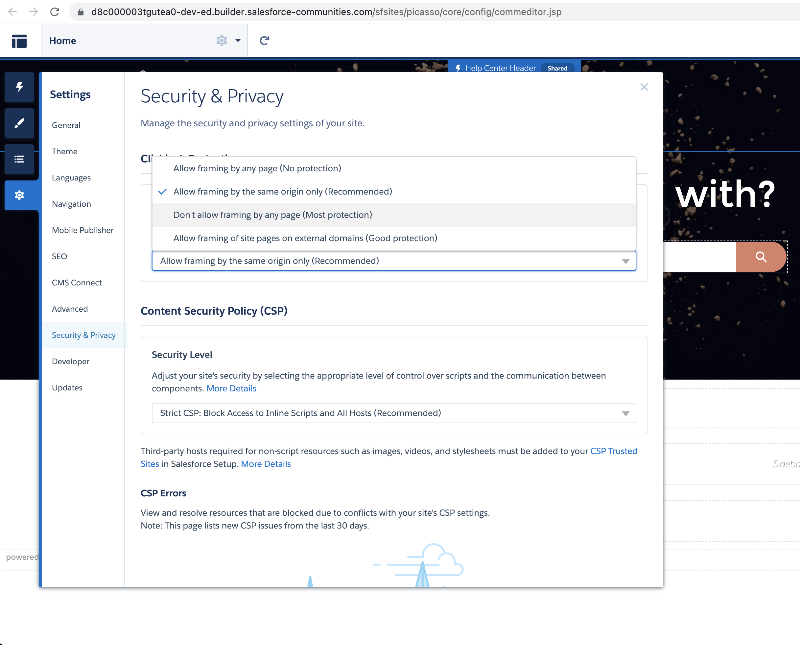
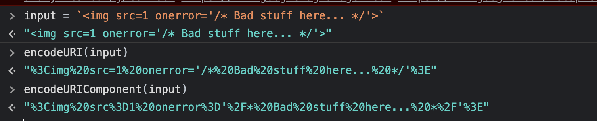
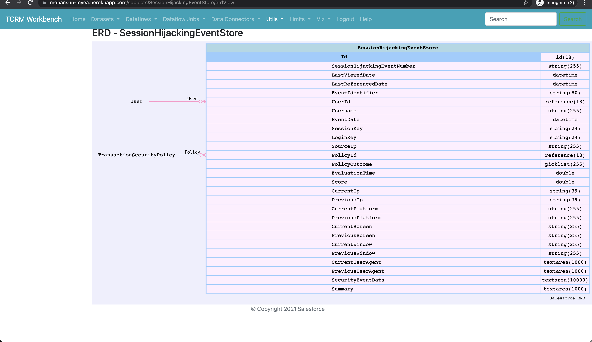
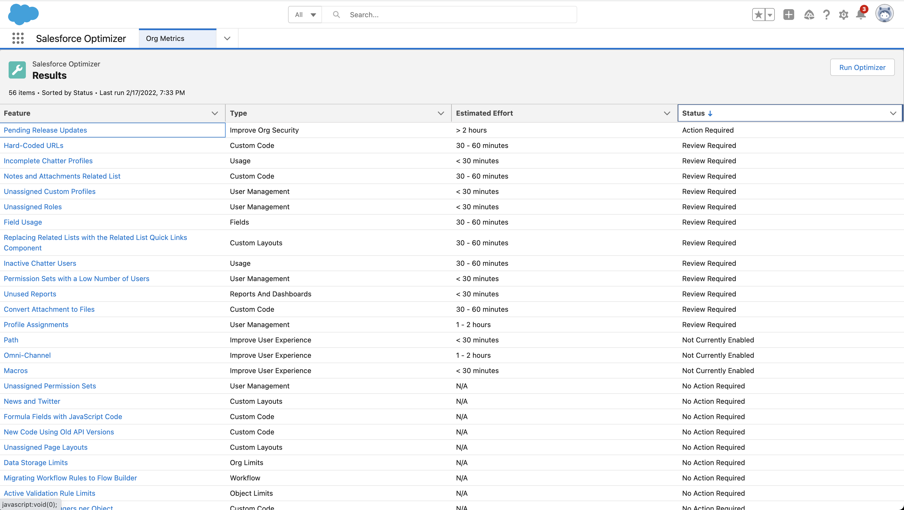

# Goals
- The Salesforce security features enable you to empower your users to do their jobs safely and efficiently

- Implement security controls that you think are appropriate for the sensitivity of your data. 

- Protect your data from unauthorized access from outside your company and from inappropriate usage by your users.


# Security Health Check
|Item|Section|Standard Value|
|---|---|---|
|Enable clickjack protection for customer Visualforce pages with standard headers|Session settings|Enabled|
|Enable clickjack protection for customer Visualforce pages with headers disabled|Session setting|Enabled|
|Require HttpOnly attribute|Session setting|Enabled|
|Maximum invalid login attempts|Password Policies|3|
|Expired Certificate|Certificate and Key Management|0|
|Lock sessions to the domain in which they were first used|Session Settings|Enabled|




# Clickjacking (click + hijacking)
```
Tricking a user into clicking on something different from what the user perceives,
 thus potentially revealing confidential information or allowing others 
 to take control of their computer while clicking on seemingly innocuous objects, 
 including web pages.

 In a clickjacking attack, the user is presented with a false interface, 
 where their input is applied to something they cannot see
 like transparent div on the top of the iframe (what the user sees) and high z-index
 and wrap that div with malicious link

 - when the user clicks, the user will taken to the malicious link
```


## 4 levels in community cloud

- 
- 1. Allow framing by any page (**no protection**)
- 2. Allows framing of your Visualforce site pages by pages on your external domains that are added to the *Trusted Domains for Inline Frames list*. 
- **3.** Allow framing by the **same origin** only (**recommended**): The default level for Experience Cloud sites. 
- 4. Don’t allow framing by any page (**most protection**): The most secure level
    - But for Salesforce Tabs + Visualforce sites, it can cause certain pages to appear **as blank pages**. 
    - To avoid this issue, **use the default setting instead**.


# Phishing
- Technique that attempts to acquire sensitive information, such as usernames, passwords, and credit card details, by masquerading (pretend to be someone one is not) as a trustworthy person or entity. 
- Can occur via:
    - email, text messaging, voice calls, and other avenues.
- With a goal to:
    - direct targets (users) to click a link and enter valuable information or to open an attachment with the goal of downloading malware onto the target’s device.
## Malware 
- is a software designed to infiltrate or damage a computer system **without the owner's informed consent**.

# Cross site scripting (XSS)
-  Attacker can insert unauthorized JavaScript, VBScript, HTML, or other **active content** into a web page viewed by other users. 
- A malicious script inserted into a page in this manner can hijack the **user’s session, submit unauthorized transactions as the user**, steal confidential information, or simply deface the page.

- Cross-site scripting works by manipulating a vulnerable web site so that it returns malicious JavaScript to users. When the **malicious code executes inside a victim's browser**, the attacker can fully compromise their interaction with the application.


```
https://insecure-website.com/status?message=All+is+well.
- Renders:
<p>Status: All is well.</p>

```

- Attacker passes script code via message parameter here:
```
https://insecure-website.com/status?message=<script>/*+Bad+stuff+here...+*/</script>

- Renders the script doing bad stuff:
<p>Status: <script>/* Bad stuff here... */</script></p>

```

## DOM based XSS
```
// get search data entered by the user via search input field
const search = document.getElementById('search').value;

const results = document.getElementById('results');
// whatever user put in the search element is render here in results element
results.innerHTML = `You searched for: ${search}`; 

// if the attacker entered bad stuff in the search box, it will render
//  the bad stuff in the result element
 You searched for: 

 // PREVENT it by encoding it


```
- 

## Node.js
```
const xssFilters = require('xss-filters');
const unsafeFirstNname = req.query.firstName;
const safeFirstName = xssFilters.inHTMLData(unsafeFirstName);

```

- [Cross Site Scripting (XSS)](https://owasp.org/www-community/attacks/xss/)

## Prevention
- Filter input on arrival. At the point where user input is received, filter as strictly as possible based on what is expected or valid input.

- Encode data on output
    -  If your page is processing GET parameter say userInput make sure that parameter is html encoded  before using in your page.


# SQL and SOQL Injection

- Exploiting query parameters to execute arbitrary SQL instructions is called SQL Injection 

```

// code with possible SQL Injection attack 
router.get('/email', (req, res) => {
  db.query('SELECT email FROM users WHERE id = ' + req.query.id);
    .then((record) => {
      // do stuff
      res.send(record[0]);
    })
});

```

```
//  parameterized queries would suffice to prevent the SQL Injection
router.get('/email', (req, res) => {
  db.query('SELECT email FROM users WHERE id = $1', req.query.id);
    .then((record) => {
      // do stuff
      res.send(record[0]);
    })
})

// refer: https://checkmarx.gitbooks.io/js-scp/content/

```

- Following code is vulnerable to SOQL Injection: if we get value of name from Visualforce page

```java
public class SOQLController {
    public String name {
        get { return name;}
        set { name = value;}
    } 
    public PageReference query() {
        String qryString = 'SELECT Id FROM Contact WHERE ' +
            '(IsDeleted = false and Name like \'%' + name + '%\')'; // <--------
        List<Contact> queryResult = Database.query(qryString);
        System.debug('query result is ' + queryResult);
        return null;
    }
}
```

- Used binding to take care of the SOQL inject as shown below:

```java
public class SOQLController { 
    public String name { 
        get { return name;} 
        set { name = value;} 
    } 
    public PageReference query() { 
        String queryName = '%' + name + '%';
        List<Contact> queryResult = [SELECT Id FROM Contact WHERE 
           (IsDeleted = false and Name like :queryName)]; //<---- binding variable is used here
        System.debug('query result is ' + queryResult);
        return null; 
    } 
}
```

- Use the following CLI command for checking possible SOQL injection
```

sfdx-mohanc-plugins % sfdx mohanc:security:apex -u  mohan.chinnappan.n_ea2@gmail.com

```
```
=== Possible SOQL Injections ===
 
```

```json
[
{
    name: 'SoftphoneContactSearchController',
    SOQLInject: true,
    match: [
      "SELECT Id, Phone, Name, Title, Account.Name FROM Contact WHERE (id = :name OR Name LIKE :('%' + name + '%') OR firstname LIKE :('%' + name + '%') OR lastname LIKE :('%' + name + '%') OR phone LIKE :('%' + name + '%')) LIMIT 10]){              contactList.add(contact);          }          return JSON.serialize(contactList);      }  }"
    ]
  },
  {
    name: 'SOQLControllerInjection',
    SOQLInject: true,
    match: [
      "SELECT Id FROM Contact WHERE ' +              '(IsDeleted = false and Name like \\'%' + name + '%\\')';          List<Contact> queryResult = Database.query(qryString);          System.debug('query result is ' + queryResult);          return null;      }  }"
    ]
  }
]
```


# Browser fingerprint
- A browser fingerprint is a **collection of features that together identify a device**.
- Salesforce uses these features to build a model of the user’s original browser fingerprint when they logged in. 
- Salesforce uses this model to detect whether a user’s session was hijacked.

|Feature|
|---|
|window|
|userAgent|
|timestamp|
|screen|
|plugins|
|originApp|
|webSockets|
|sessionStorage|
|platform|
|indexedDb|
|ipAddress|

# Session Hijacking Event Store 

 
- SessionHijackingEvent and its storage equivalent SessionHijackingEventStore track **when unauthorized users gain ownership of a Salesforce user’s session with a stolen session identifier**. 
- To detect such an event, Salesforce evaluates how significantly a user’s current browser **fingerprint diverges from the previously known fingerprint**. 
- Salesforce uses a probabilistically inferred **significance of change**.




# Health Check

- [Use Health Check to Scan Your Security Configurations](https://trailhead.salesforce.com/en/content/learn/modules/security_basics/security_basics_healthcheck)
- [Video: Learn About Security Health Check (Lightning Experience) | Salesforce](https://www.youtube.com/watch?v=jC0ciHZrkh0)

# User Audit
- [Admin Best Practices: Remove Security Risks From Your Org With a User Audit](https://trailhead.salesforce.com/live/videos/a2r3k000001n2jh/admin-best-practices-remove-security-risks-from-your-org-with-a-user-audit/)


|Step|Details|
|---|---|
|Maintain|Maintain an accurate user roster and ensure the **principle of least privileges** applied to user permissions|
|Review|Correctly Configure user access within the org  using **permission sets, permission set groups, FLS**|
|Align|Protect access to a Salesforce org by implementing security controls such as **MFA, SSO and Login IP Ranges**|
|Analyze|Gain visibility into the security of an org using tools like: **Health Check, Optimizer, Security Center**|


|Bad Practice|Best Pratice|
|---|---|
|Allowing users (or admins) to share logins| Give each user their own login|
|Users have permissions to see and do more than they need to do their jobs |Ensure the correct level of access as org changes happen, or when employees join/leave the company|
|Granting admin access for all users|Grant admin access to the smallest number of users possible (typically 1-5, depending on the size of your company)|
|Allowing users that have left the company to remain active for a period of time after leaving|Deactivate users in a timely manner after departure |
|Not reviewing privileges on a regular basis | Set time aside quarterly or bi-annually to review and reevaluate user privileges, part of release cycle|

|Checklist|
|---|
|Review user list and last login date|
|Deactivate users who no longer need access, do not rename users|
|Remove unused profiles and permission sets/permission set groups per Optimizer results|
|Align Salesforce access levels and job functions, do not align directly to the org chart|

|User Audit Action Items|
|---|
|Custom profiles that have system admin privileges|
|Active users who haven't logged in within 60 days|
|Unused roles, profiles, permission sets|
|Setup Audit Trail|
|A large number (5+) of system admin users or users utilizing admin permissions|
|Re-run Salesforce Optimizer for a fresh report to track progress|


|Preparing for, Communicating and Managing Security Changes|
|---|
|Perform your user audit|
|Document proposed changes and security protocols|
|Present findings to leadership; get executive sponsorship|
|Create a plan to update user permissions (build in testing if necessary)|
|Communicate the changes (and then communicate again!) to users|
|Make sure you're aware of ALL the implications of changing user permissions/ privileges before making updates|


## Apps
- [Permission Helper App](https://appexchange.salesforce.com/appxListingDetail?listingId=a0N3A00000FeF99UAF)
- [Admins SECURITY ](https://admin.salesforce.com/security)
    - [5 Security Habits That Will Help Your Admin Career](https://admin.salesforce.com/blog/2021/5-security-habits-that-will-help-your-admin-career)
    - [Admin Best Practices: Security ](https://trailhead.salesforce.com/live/videos/a2r3k000001WFIi/admin-best-practices-security/)


# Apex sharing check

- Use the following CLI command to find out the Apex Class with and without sharing 
```
sfdx mohanc:security:apex -u  mohan.chinnappan.n_ea2@gmail.com 
```

```json
{
    "withSharing": [
        {
            "name": "ClassDiagramCreatorCtrl",
            "withSharing": true
        },
        {
            "name": "MultiselectController",
            "withSharing": true
        },
        {
            "name": "ERDCreatorCtrl",
            "withSharing": true
        },
        ...
    ],
    "withoutSharing": [
        {
            "name": "PlantUMLClassDiagram",
            "withSharing": false
        },
        {
            "name": "PlantUMLERDiagram",
            "withSharing": false
        },
        {
            "name": "SelectOptionSorter",
            "withSharing": false
        },
        {
            "name": "CodeMetrics",
            "withSharing": false
        },
        {
            "name": "ApexClassForTests",
            "withSharing": false
        },
        {
            "name": "ApexParser",
            "withSharing": false
        },
        {
            "name": "ClassDiagramCreatorCtrl",
            "withSharing": false
        },
        {
            "name": "CommunitiesSelfRegController",
            "withSharing": false
        },
        {
            "name": "AsyncExecutionExample",
            "withSharing": false
        },
        
        ...
         
         
    ]
}


```

# Guest Profile permission

- Check Guest Profile permissions using CLI

```
sfdx mohanc:security:userLicenseProfile -u  mohan.chinnappan.n_ea2@gmail.com -l 'Guest'
```

```json
{
    "totalSize": 2,
    "done": true,
    "records": [
        {
            "attributes": {
                "type": "Profile",
                "url": "/services/data/v54.0/sobjects/Profile/00e3h000001AxZmAAK"
            },
            "Id": "00e3h000001AxZmAAK",
            "Name": "Standard Guest",
            "PermissionsEmailSingle": false,
            "PermissionsEmailMass": false,
            "PermissionsEditTask": false,
            "PermissionsEditEvent": false,
            "PermissionsExportReport": false,
            "PermissionsImportPersonal": false,
            "PermissionsDataExport": false,
            "PermissionsManageUsers": false,
            "PermissionsEditPublicFilters": false,
            "PermissionsEditPublicTemplates": false,
            "PermissionsModifyAllData": false,
            "PermissionsManageCases": false,
            "PermissionsMassInlineEdit": false,
            "PermissionsManageSolutions": false,
            "PermissionsCustomizeApplication": false,
            "PermissionsEditReadonlyFields": false,
            "PermissionsRunReports": false,
            ...
            "UserLicenseId": "1003h000000sGNCAA2",
            "UserType": "Guest",
            "CreatedDate": "2020-07-25T10:44:13.000+0000",
            "CreatedById": "0053h000002xQ5sAAE",
            "LastModifiedDate": "2021-10-09T11:19:17.000+0000",
            "LastModifiedById": "0053h000003de6eAAA",
            "SystemModstamp": "2021-10-09T11:19:17.000+0000",
            "Description": null,
            "LastViewedDate": null,
            "LastReferencedDate": null
        }
    ]
}
```


# Optimizer 


# Real-Time Event Monitoring
- Gives you access to detailed performance, security, and usage data on all your Salesforce apps. See who is accessing critical business data when, and from where. 

- [Viewing and Visualizing Event Log files using DX](https://github.com/mohan-chinnappan-n/cli-dx/blob/master/monitoring/em.md)

# Field Audit Trail
- Lets you know the state and value of your data for any date, at any time
- Built on a **big data backend** for massive scalability, Field Audit Trail helps companies create a forensic data-level audit trail with up to 10 years of history. 
- You can also set triggers for when data is deleted. 

# Resources

## Platform
- [Salesforce Security Guide](https://resources.docs.salesforce.com/236/latest/en-us/sfdc/pdf/salesforce_security_impl_guide.pdf)

- [Trust | Security](https://security.salesforce.com/)
- [Security for Administrators](https://security.salesforce.com/security-for-administrators)
- [Security for Developers](https://security.salesforce.com/security-for-developers)

- [Sharing Model](https://mohan-chinnappan-n2.github.io/2020/sharing/sharing.html)
- [Sharing Debugger](https://github.com/mohan-chinnappan-n/cli-dx/blob/master/sharing.md)
- [How to get Apex Classes and checking the sharing using DX ?](https://github.com/mohan-chinnappan-n/cli-dx/blob/master/apex.md)
- [Sharing Data model interactive](https://mohan-chinnappan-n.github.io/sfdc/fs-cloud/model-sfdc.html)

- [Viewing and Visualizing Event Log files using DX](https://github.com/mohan-chinnappan-n/cli-dx/blob/master/monitoring/em.md)

## Community Cloud
- [Community (Experience Cloud) Related Resources ](https://github.com/mohan-chinnappan-n/cli-dx/blob/master/cc.md)
- [Community Cloud Security](https://mohan-chinnappan-n2.github.io/2020/cc/security/security.html)
- [Community Cloud Tips](https://mohan-chinnappan-n2.github.io/2020/cc/cc.html#0)

- [Enable Clickjack Protection in Experience Cloud Sites](https://help.salesforce.com/s/articleView?id=sf.networks_clickjack_protection.htm&type=5)

# Creation 
```
sfdx mohanc:slides:gen -i security.md -o security.md.html -t "Salesforce Security
```
