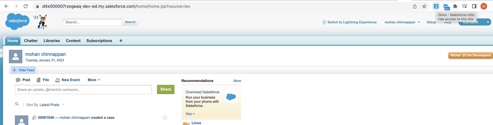
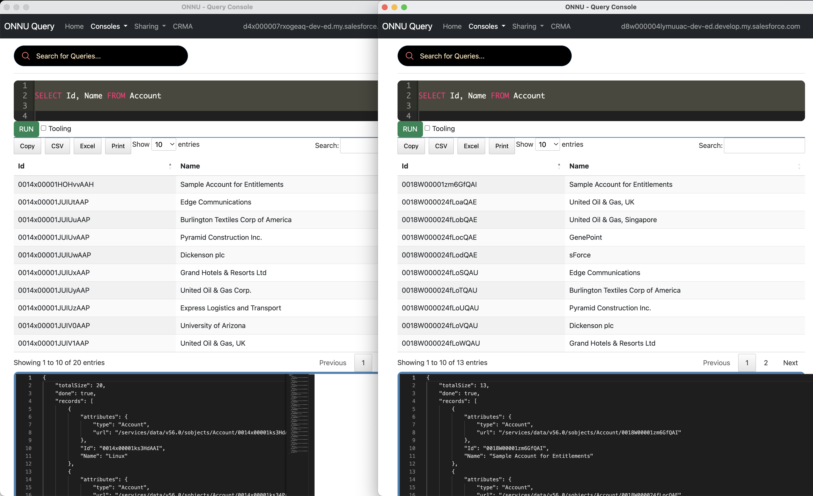

# Chrome Extensions


## ONNU 
- ONNU is a chrome extension to provide Utils for Salesforce Admins and Developers

- Available from chrome web store - [Onnu - Salesforce Utils
](https://chrome.google.com/webstore/detail/onnu-salesforce-utils/epdodcflhaclcmidephmhajpneilommo)


- Once installed ONNU in your chrome browser, login into Salesforce org and switch to Classic mode to start :


----

## Topics
- [About Onnu](#about)
- [How to get ERD of a SObject](#erd)
- [How to get  CRMA (Einstein Analytics) Metadata Assets?](#crma)
- [Screenshots](#ss)
- [SetupAuditTrail Query](#satq)

## Videos

<a name='about'></a>
### About ONNU

<iframe width="920" height="600" src="https://www.youtube.com/embed/feH8KIuUsrY" title="YouTube video player" frameborder="0" allow="accelerometer; autoplay; clipboard-write; encrypted-media; gyroscope; picture-in-picture; web-share" allowfullscreen></iframe>

----

<a name='erd'></a>

### How to get ERD of a sObject?

<iframe width="920" height="600" src="https://www.youtube.com/embed/zAyL1JxDyts?start=8" title="YouTube video player" frameborder="0" allow="accelerometer; autoplay; clipboard-write; encrypted-media; gyroscope; picture-in-picture; web-share" allowfullscreen></iframe>


---
<a name='crma'></a>

### How to get  CRMA (Einstein Analytics) Metadata Assets?

<iframe width="920" height="600" src="https://www.youtube.com/embed/CzhHrkRbr0c" title="YouTube video player" frameborder="0" allow="accelerometer; autoplay; clipboard-write; encrypted-media; gyroscope; picture-in-picture; web-share" allowfullscreen></iframe>


<a name='ss'></a>

## Screenshots

- Compare queries from 2 orgs




---
<a name='satq'></a>

## SetupAuditTrail Query

```sql
SELECT CreatedDate,
          CreatedBy.Name, 
          CreatedByContext,
          CreatedByIssuer,
          Display,
          Section 
          FROM SetupAuditTrail 
            ORDER BY CreatedDate  
            DESC LIMIT 10
```


## About the name ONNU
- ONNU to mean ON to New
- ONNU is number one in some Indian languages 
