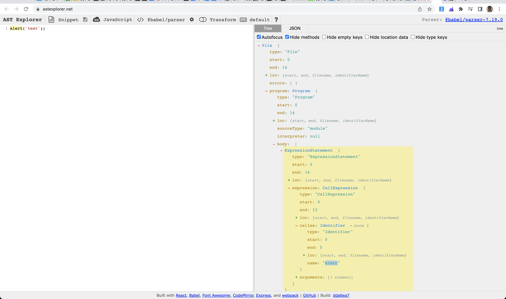

# eslint custom rules

Here we will explain how to setup a custom rule for eslint in two methods 

- [Without using the plugin](#np)
- [With using the plugin - eslint-plugin-mohanc-eslint-rules](#wp)

## Use case

- We like want to warn the developers about using ```alert()``` in their code


<a name='np'></a>

### Writing the rule

- Prepare the offending code
```
alert('test')
```
- Use [AST Explorer](https://astexplorer.net/) to find out the node details



- We need to check for


```js
node.callee.name === 'alert'

```
as per the AST

- Our rule should be something like this
- **meta** : for metadata about the rule
- **create**: action part of the rule
    - here we check for ``` node.callee.name === 'alert'```  and report the developer that with a message: ```Using alert() is not recommended``` using the ```context``` provided by the eslint
---
```js
module.exports = {
  meta: {
    type: 'suggestion',
    docs: {
      description: 'Warn the alert function used in the code',
      category: 'Best Practices',
      recommended: true,
    },
  },
 create: function (context) {
  return {
    CallExpression(node) {
      if (node.callee.name === 'alert') {
        context.report({
          node,
          message: 'Using alert() is not recommended',
        });
      }
    },
  };
},

};

```

---

## Project Setup

### Create project: custom-rules-demo 

```
~/eslint  >mkdir custom-rules-demo
~/eslint  >cd custom-rules-demo 
~/eslint/custom-rules-demo  >npm init @eslint/config
✔ How would you like to use ESLint? · problems
✔ What type of modules does your project use? · esm
✔ Which framework does your project use? · none
✔ Does your project use TypeScript? · No / Yes
✔ Where does your code run? · browser
✔ What format do you want your config file to be in? · JavaScript
A config file was generated, but the config file itself may not follow your linting rules.
Successfully created .eslintrc.js file in /Users/mchinnappan/eslint/custom-rules-demo

```

### Look at .eslintrc.js 

``` 
~/eslint/custom-rules-demo  >cat .eslintrc.js 
```
```js
module.exports = {
    "env": {
        "browser": true,
        "es2021": true
    },
    "extends": "eslint:recommended",
    "overrides": [
    ],
    "parserOptions": {
        "ecmaVersion": "latest",
        "sourceType": "module"
    },
    "rules": {
    }
}
```
### Make a folder for rules
```
~/eslint/custom-rules-demo  >mkdir rules
~/eslint/custom-rules-demo  >touch rules/no-alert.js
```
### Content of the rules/no-alert.js
```
~/eslint/custom-rules-demo  >cat rules/no-alert.js 
```
```js
module.exports = {
  meta: {
    type: 'suggestion',
    docs: {
      description: 'Warn the alert function used in the code',
      category: 'Best Practices',
      recommended: true,
    },
  },
 create: function (context) {
  return {
    CallExpression(node) {
      if (node.callee.name === 'alert') {
        context.report({
          node,
          message: 'Using alert() is not recommended',
        });
      }
    },
  };
},

};
```

### Create app.js
```
~/eslint/custom-rules-demo  >touch app.js
~/eslint/custom-rules-demo  >cat app.js 
```

```js
console.log('hello world!');
alert('this is an alert');
```

## Add an entry in the .eslintrc.js  for our custom rule ```no-alert```

```js
"rules": {
        "no-alert": ["warn"]
    }

```

```
~/eslint/custom-rules-demo  >vi .eslintrc.js 
~/eslint/custom-rules-demo  >cat .eslintrc.js 
```

```js
module.exports = {
    "env": {
        "browser": true,
        "es2021": true
    },
    "extends": "eslint:recommended",
    "overrides": [
    ],
    "parserOptions": {
        "ecmaVersion": "latest",
        "sourceType": "module"
    },
    "rules": {
        "no-alert": ["warn"]
    }
}

```

### Run the eslint with  our custom rule
```
~/eslint/custom-rules-demo  >eslint --rulesdir rules app.js
```

#### Results  
```
/Users/mchinnappan/eslint/custom-rules-demo/app.js
  1:28  error    Extra semicolon                   semi
  2:1   warning  Using alert() is not recommended  no-alert
  2:26  error    Extra semicolon                   semi

✖ 3 problems (2 errors, 1 warning)
  2 errors and 0 warnings potentially fixable with the `--fix` option.
```

### Fixing and running eslint

```
vi app.js
cat app.js 
```
```js
console.log('hello world!')

```

- Running the modified code
```bash
eslint --rulesdir rules app.js
```

## Taking care of assertions like in JEST ```expect(1).toBe(1) ```

```
cat .eslintrc.js 
```
```js
module.exports = {
    "env": {
        "browser": true,
        "es2021": true,
        "jest": true
    },
    "extends": ["eslint:recommended"],
    "overrides": [
    ],
    "parserOptions": {
        "ecmaVersion": "latest",
        "sourceType": "module"
    },
    "plugins": ["jest"],
    "rules": {
        "no-alert": ["warn"],
        "no-literal-expect": ["warn"]
    }
}
```

```
cat rules/no-literal-expect.js
```

```js
module.exports = {
  meta: {
    type: 'problem',
    docs: {
      description: 'disallow hardcoded expect statements',
      category: 'Possible Errors',
      recommended: true
    },
    schema: []
  },
  create: function (context) {
    return {
      CallExpression(node) {
       if (
              node.callee.type === "Identifier" &&
              node.callee.name === "expect" &&
              node.arguments.length === 1 &&
              node.arguments[0].value === 1
            ) {
          context.report({
            node,
            message: `${context.id}: Using expect(1).toBe(1) is not recommended`,
          });
        }
      },
    };
  }
  
}
```

### Testing

```
cat app.js 
```
```js
alert('hello')
expect(1).toBe(1)
const x = 100
expect(x).to(100)
```


```
eslint --rulesdir=rules app.js
```

```
  1:1  warning  Using alert() is not recommended                               no-alert
  2:1  warning  no-literal-expect: Using expect(1).toBe(1) is not recommended  no-literal-expect

✖ 2 problems (0 errors, 2 warnings)

```

<a name='wp'></a>

## Using plugin eslint-plugin-mohanc-eslint-rules

### Create a new project
- Note: In an existing project you **do not need this step**

```
mkdir eslint-testing
cd eslint-testing 
npm init -y
```

```
Wrote to /private/tmp/eslint-testing/package.json:

{
  "name": "eslint-testing",
  "version": "1.0.0",
  "description": "",
  "main": "index.js",
  "scripts": {
    "test": "echo \"Error: no test specified\" && exit 1"
  },
  "keywords": [],
  "author": "",
  "license": "ISC"
}

```

### Install the plugin for the custom rules

- Note: This step is required for an existing project as well

```
npm i eslint-plugin-mohanc-eslint-rules

```
```
added 1 package, and audited 2 packages in 922ms

found 0 vulnerabilities
```

### Look at the package.json
```
 cat package.json 

```

```json
{
  "name": "eslint-testing",
  "version": "1.0.0",
  "description": "",
  "main": "index.js",
  "scripts": {
    "test": "echo \"Error: no test specified\" && exit 1"
  },
  "keywords": [],
  "author": "",
  "license": "ISC",
  "dependencies": {
    "eslint-plugin-mohanc-eslint-rules": "^0.0.2"
  }
}
```

### Create .eslintrc 

- NOTE: **In an existing project just add/update the line specific to "plugins"**

```
vi  .eslintrc
cat .eslintrc
```

```
{
  "parserOptions": {
    "ecmaVersion": 2021,
    "jest": true

  },
  "rules": {
    "mohanc-eslint-rules/no-alert": "warn",
    "mohanc-eslint-rules/no-literal-expect": "warn"
 
  },
  "plugins": ["mohanc-eslint-rules"]
}


```

### Create the sample code (app.js) to test these custom rules

```
vi app.js
cat app.js
```

```js
alert('hello');
expect(1).toBe(1);
const x = 100;
expect(x).toBe(100);

```

### Run the eslint to lint this file (app.js)

```
/tmp/eslint-testing  >npx eslint app.js 

/private/tmp/eslint-testing/app.js
  1:1  warning  Using alert() is not recommended                                                   mohanc-eslint-rules/no-alert
  2:1  warning  mohanc-eslint-rules/no-literal-expect: Using expect(1).toBe(1) is not recommended  mohanc-eslint-rules/no-literal-expect

✖ 2 problems (0 errors, 2 warnings)

```

### How it shows in VSCode (click on the image to view the full view)

- Demo

[](img/eslint-custom-rules-1.webm.gif)
