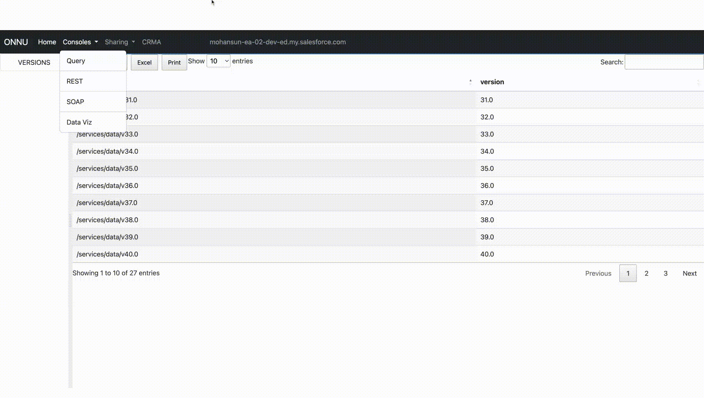

# Deployment

## Use case
- For first time: Move the wave assets from a source org into a target org 
    -  commit these wave assets into the version control once it is verified


## package.xml used in this use case
- You can customize it as needed
```xml

<?xml version="1.0" encoding="UTF-8"?>
<Package xmlns=“http://soap.sforce.com/2006/04/metadata”>
    <types>
        <members>*</members>
        <name>WaveApplication</name>
    </types>
    <types>
        <members>*</members>
        <name>WaveComponent</name>
    </types>
    <types>
        <members>*</members>
        <name>WaveDashboard</name>
    </types>
    <types>
        <members>*</members>
        <name>WaveDataflow</name>
    </types>
    <types>
        <members>*</members>
        <name>WaveDataset</name>
    </types>
    <types>
        <members>*</members>
        <name>WaveLens</name>
    </types>
    <types>
        <members>*</members>
        <name>WaveRecipe</name>
    </types>
    <types>
        <members>*</members>
        <name>WaveTemplateBundle</name>
    </types>
    <types>
        <members>*</members>
        <name>WaveXmd</name>
    </types>
    <version>56.0</version>
</Package>
```
## Option - 1

- Download CRMA package zip file 
    - using Chrome Extension [ONNU](https://mohan-chinnappan-n5.github.io/sfbooks/sfdevnotes/chromeext/onnu.html)



### Changing extension of the xmd and xds
```bash
python3 change_extn.py

```
```
-------------------------------------------------------
Usage: python3 change_extn.py <from_extn> <to_extn>

Examples: python3 change_extn.py xmd  xmd-meta.xml 
        : python3 change_extn.py xds  xds-meta.xml 
-------------------------------------------------------
```

- Download the script [change_extn.py](https://raw.githubusercontent.com/mohan-chinnappan-n/shell-scripts/master/py/change_extn.py)
```py
import os
import sys

"""
 change_extn.py
  - changes the extension of the given file into  required extension
    - For example:
        from: xmd 
        to:  xmd-meta.xml  
- mchinnappan
"""
usage = """
-------------------------------------------------------
Usage: python3 change_extn.py <from_extn> <to_extn>

Examples: python3 change_extn.py xmd  xmd-meta.xml 
        : python3 change_extn.py xds  xds-meta.xml 
-------------------------------------------------------
"""

if len(sys.argv) < 3:
    print (f'{usage}')
    exit(0)

inext =  sys.argv[1]
outext = sys.argv[2]


for filename in os.listdir('.'):
    if filename.endswith(f'.{inext}'):
        os.rename(filename, filename[:-len(inext)] + outext)


```
- run it on the wave folder:

```bash

python3 change_extn.py xmd  xmd-meta.xml 
python3 change_extn.py xds  xds-meta.xml 

```


## Option - 2
- Download CRMA package zip file 
    - using DX

```
sfdx force:mdapi:retrieve -k ~/.package/crma-package.xml -u mohan.chinnappan.n_ea2@gmail.com -r .

```

```
Retrieving v56.0 metadata from mohan.chinnappan.n_ea2@gmail.com using the v57.0 SOAP API
Retrieve ID: 09S3h000006la2aEAA
Retrieving metadata from mohan.chinnappan.n_ea2@gmail.com... done
Wrote retrieve zip to /private/tmp/CRMA/unpackaged.zip

```

- View/unzip the zip file
```
/tmp/CRMA  >jar xvf unpackaged.zip 
```

```
   105 Thu Mar 09 11:55:00 EST 2023 unpackaged/waveTemplates/Service_Analytics_Flex/dataset_files/ServiceOmniUserPresence_XMD_20_template.json
 40861 Thu Mar 09 11:55:00 EST 2023 unpackaged/waveTemplates/Trailhead_Template_PartOne/workflow/SalesAnalyticsDataflow.json
   221 Thu Mar 09 11:55:00 EST 2023 unpackaged/waveTemplates/Trailhead_Template_PartTwo/folder.json
 44649 Thu Mar 09 11:55:00 EST 2023 unpackaged/waveTemplates/Trailhead_Template_PartTwo/workflow/SalesAnalyticsDataflow.json
 90993 Thu Mar 09 11:55:00 EST 2023 unpackaged/waveTemplates/Service_Analytics_Flex/dashboards/Service_Knowledge_Efficiency.json
101231 Thu Mar 09 11:55:00 EST 2023 unpackaged/waveTemplates/Service_Analytics_Flex/dashboards/Service_Channel_Review.json
120130 Thu Mar 09 11:55:00 EST 2023 unpackaged/waveTemplates/Service_Analytics_Flex/dashboards/Service_Live_Agent_Chat.json
100166 Thu Mar 09 11:55:00 EST 2023 unpackaged/waveTemplates/Service_Analytics_Flex/dashboards/Service_Telephony.json
...

```

## Move this zip content  unpackaged/* into your local folder of your SFDX Project under the wave folder


```
# copy under force-app/main/default/wave of your sfdx project, for example:
/tmp/CRMA  >
cp unpackaged/wave/* ~/treeprj/force-app/main/default/wave/
```

## Deploy into the target org

- checkOnly (-c flag)
```
sfdx force:source:deploy -x ~/.package/crma-package.xml    -c --verbose --loglevel TRACE 

```

- Example
```
sfdx force:source:deploy -x ~/.package/crma-package.xml    -c --verbose --loglevel TRACE -u mohan.chinnappan.n_ea2@gmail.com
Deploying v56.0 metadata to mohan.chinnappan.n_ea2@gmail.com using the v57.0 SOAP API
Deploy ID: 0Af3h00000SZ7WpCAL
DEPLOY PROGRESS | ████████████████████████████████████████ | 27/27 Components

=== Deployed Source

 FULL NAME                                            TYPE          PROJECT PATH                                                        
 ──────────────────────────────────────────────────── ───────────── ─────────────────────────────────────────────────────────────────── 
 Benchmark_dashboard                                  WaveDashboard Benchmark_dashboard.wdash                                           
 Benchmark_dashboard                                  WaveDashboard Benchmark_dashboard.wdash-meta.xml                                  
 Cars3DB                                              WaveDashboard Cars3DB.wdash                                                       
 Cars3DB                                              WaveDashboard Cars3DB.wdash-meta.xml                                              
 DTC_Sales_SAMPLE                                     WaveDashboard DTC_Sales_SAMPLE.wdash                                              
 DTC_Sales_SAMPLE                                     WaveDashboard DTC_Sales_SAMPLE.wdash-meta.xml                                     
 FieldUsage                                           WaveDashboard FieldUsage.wdash                                                    
 FieldUsage                                           WaveDashboard FieldUsage.wdash-meta.xml                                           
 Opportunity_Details                                  WaveDashboard Opportunity_Details.wdash                                           
 Opportunity_Details                                  WaveDashboard Opportunity_Details.wdash-meta.xml                                  
 Regional_Sales_SAMPLE                                WaveDashboard Regional_Sales_SAMPLE.wdash                                         
 Regional_Sales_SAMPLE                                WaveDashboard Regional_Sales_SAMPLE.wdash-meta.xml                                
 Sales_Performance_with_Selectable_Measures_Trailhead WaveDashboard Sales_Performance_with_Selectable_Measures_Trailhead.wdash          
 Sales_Performance_with_Selectable_Measures_Trailhead WaveDashboard Sales_Performance_with_Selectable_Measures_Trailhead.wdash-meta.xml 
 The_Motivator_1                                      WaveDashboard The_Motivator_1.wdash                                               
 The_Motivator_1                                      WaveDashboard The_Motivator_1.wdash-meta.xml                                      
 The_Motivator_2                                      WaveDashboard The_Motivator_2.wdash                                               
 The_Motivator_2                                      WaveDashboard The_Motivator_2.wdash-meta.xml                                      
 Worldwide_Fundraising_Starter                        WaveDashboard Worldwide_Fundraising_Starter.wdash                                 
 Worldwide_Fundraising_Starter                        WaveDashboard Worldwide_Fundraising_Starter.wdash-meta.xml                        
 ExportCustomers                                      WaveDataflow  ExportCustomers.wdf                                                 
 ExportCustomers                                      WaveDataflow  ExportCustomers.wdf-meta.xml                                        
 FlattenExample                                       WaveDataflow  FlattenExample.wdf                                                  
 FlattenExample                                       WaveDataflow  FlattenExample.wdf-meta.xml                                         
 JOINSTutorial                                        WaveDataflow  JOINSTutorial.wdf                                                   
 JOINSTutorial                                        WaveDataflow  JOINSTutorial.wdf-meta.xml                                          
 SalesEdgeEltWorkflow                                 WaveDataflow  SalesEdgeEltWorkflow.wdf                                            
 SalesEdgeEltWorkflow                                 WaveDataflow  SalesEdgeEltWorkflow.wdf-meta.xml                                   
 The_Motivator                                        WaveDataflow  The_Motivator.wdf                                                   
 The_Motivator                                        WaveDataflow  The_Motivator.wdf-meta.xml                                          
 exportOppty                                          WaveDataflow  exportOppty.wdf                                                     
 exportOppty                                          WaveDataflow  exportOppty.wdf-meta.xml                                            
 exportOppty2                                         WaveDataflow  exportOppty2.wdf                                                    
 exportOppty2                                         WaveDataflow  exportOppty2.wdf-meta.xml                                           
 filterFruits                                         WaveDataflow  filterFruits.wdf                                                    
 filterFruits                                         WaveDataflow  filterFruits.wdf-meta.xml                                           
 fruitsdf                                             WaveDataflow  fruitsdf.wdf                                                        
 fruitsdf                                             WaveDataflow  fruitsdf.wdf-meta.xml                                               
 Benchmark                                            WaveLens      Benchmark.wlens                                                     
 Benchmark                                            WaveLens      Benchmark.wlens-meta.xml                                            
 myFriutsYield                                        WaveLens      myFriutsYield.wlens                                                 
 myFriutsYield                                        WaveLens      myFriutsYield.wlens-meta.xml                                        
 FlattenTest                                          WaveRecipe    FlattenTest.wdpr                                                    
 FlattenTest                                          WaveRecipe    FlattenTest.wdpr-meta.xml                                           
 JoinedOutput                                         WaveRecipe    JoinedOutput.wdpr                                                   
 JoinedOutput                                         WaveRecipe    JoinedOutput.wdpr-meta.xml                                          
 Yield2_Recipe                                        WaveRecipe    Yield2_Recipe.wdpr                                                  
 Yield2_Recipe                                        WaveRecipe    Yield2_Recipe.wdpr-meta.xml                                         
 ea_s3_r                                              WaveRecipe    ea_s3_r.wdpr                                                        
 ea_s3_r                                              WaveRecipe    ea_s3_r.wdpr-meta.xml                                               
 fruits                                               WaveRecipe    fruits.wdpr                                                         
 fruits                                               WaveRecipe    fruits.wdpr-meta.xml                                                
 yield2_r                                             WaveRecipe    yield2_r.wdpr                                                       
 yield2_r                                             WaveRecipe    yield2_r.wdpr-meta.xml                                              
Successfully validated the deployment.

```

### Next Steps
1. Once this is successful, use **quick deploy** to deploy these wave assets into the target org

2. After **verification** of the wave assets in the target org, commit into the version control 

3. Keep the version control **up-to-date** with your CRMA development