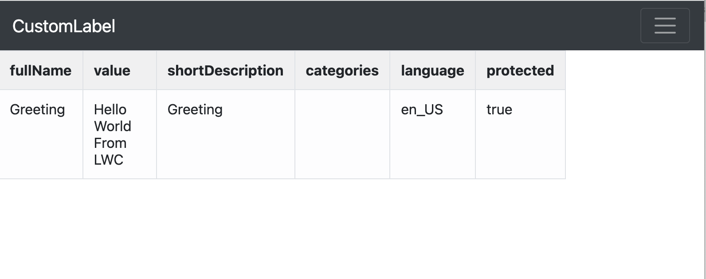

# Custom Labels

## Topics
- [Validate and find duplicate fullNames](#dup1)
- [Find the duplicate label values](#dup2)
- [HTML view of the Custom Labels file](#htmlview)

----

<a name='dup1'></a>
## Use case
- validate the CustomLabels.labels-meta.xml 
- find any duplicate labels 
- fix this issues and commit back to the version control


-  Requires 
    - [mohanc plugin](https://mohan-chinnappan-n.github.io/dx/plugins.html#/1)
    - [Nodejs](https://nodejs.org/en/)


## Steps
1. - Validate the  CustomLabels.labels-meta.xml using

```
sfdx mohanc:xml:validate -p  src/sales/channel-fundamentals/main/default/labels/ -i
```

and fix any missing or invalid tags


2. Find the duplicate labels
```
sfdx mohanc:xml:xml2json  -i CustomLabels.labels-meta.xml  ; \
 sfdx mohanc:data:jq -f  '.CustomLabels.labels[].fullName' -i CustomLabels.labels-meta.xml.json | sort | node dup.mjs

```
```
Label1 2
Label2 2
...
```

## Scripts used
```
cat dup.mjs
```

```js

//-------------------------------
// feb-2023 mchinnappan
// read the given file from the stdin and emit duplicate items
// cat input.txt | node dup.mjs
//-------------------------------

import readline from "readline";

const items = {};
const rl = readline.createInterface({
  input: process.stdin,
  output: process.stdout,
  terminal: false,
});

rl.on("line", (line) => {
  const item = line.replace(/"/g, ""); //remove quotes
  if (items[item]) ++items[item];
  else items[item] = 1;
  if (items[item] !== 1) {
    console.log(item, items[item]);
  }
});

rl.once("close", () => {
  //console.log(items);
});
```

<a name='dup2'></a>
## Use case
- Find out duplicate values (same value with different fullName)
- This will list out label values list in the sorted order
- Work with teams to make sure you reuse the label values

### Option-1 - csv viewer

```
 sfdx mohanc:xml:xml2json  -i CustomLabels.labels-meta.xml  ; \
 sfdx mohanc:data:jq -f  '.CustomLabels.labels[].value' -i CustomLabels.labels-meta.xml.json | sort > labelValues.csv; open labelValues.csv 
 ```

### Option-2 - datatable
```
sfdx mohanc:xml:xml2json  -i CustomLabels.labels-meta.xml  ; \
 sfdx mohanc:data:jq -f  '.CustomLabels.labels[].value' -i CustomLabels.labels-meta.xml.json | sort   | pbcopy ; open "https://mohan-chinnappan-n5.github.io/viz/datatable/dt.html?c=csv"

 ```

### List of duplicates label values
 ```
Account
Account
Accounts Assigned to
Action
Actions
Active Account Plan
Active
Active;Completed
Activities
Activity Category
Activity
Activity
Activity
```

<a name='htmlview'></a>
## HTML view of the Custom Labels file

```
bat CustomLabels.labels
───────┬───────────────────────────────────────────────────────────────────────────────────────────────────────────────────────────────
       │ File: CustomLabels.labels
───────┼───────────────────────────────────────────────────────────────────────────────────────────────────────────────────────────────
   1   │ <?xml version="1.0" encoding="UTF-8"?>
   2   │ <CustomLabels xmlns="http://soap.sforce.com/2006/04/metadata">
   3   │     <labels>
   4   │         <fullName>Greeting</fullName>
   5   │         <language>en_US</language>
   6   │         <protected>true</protected>
   7   │         <shortDescription>Greeting</shortDescription>
   8   │         <value>Hello World From LWC</value>
   9   │     </labels>
  10   │ </CustomLabels>
───────┴──────────────────────

```

```
sfdx mohanc:xml:transform -i CustomLabels.labels -m customlabel
```





