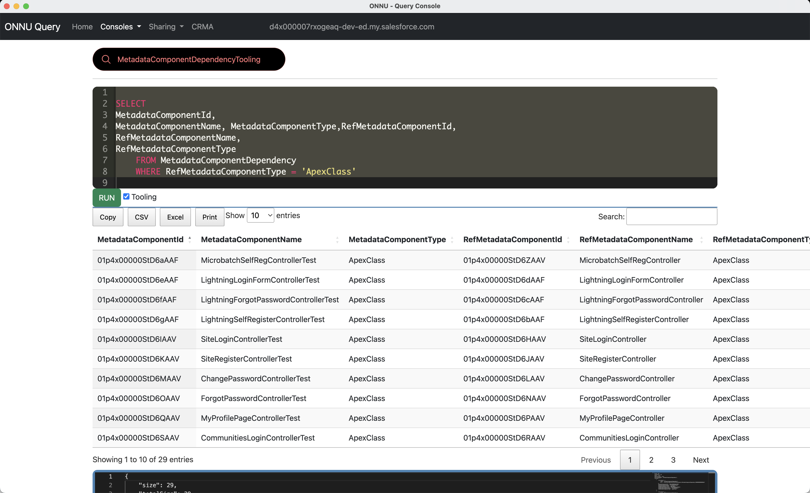

# MetadataComponentDependency


## SOQL used for this:
```sql

SELECT 
MetadataComponentId,
MetadataComponentName, MetadataComponentType,RefMetadataComponentId,
RefMetadataComponentName,
RefMetadataComponentType
    FROM MetadataComponentDependency
    WHERE RefMetadataComponentType = 'ApexClass'


```

## Using ONNU for this

