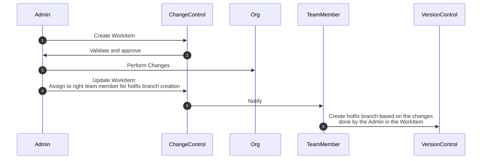
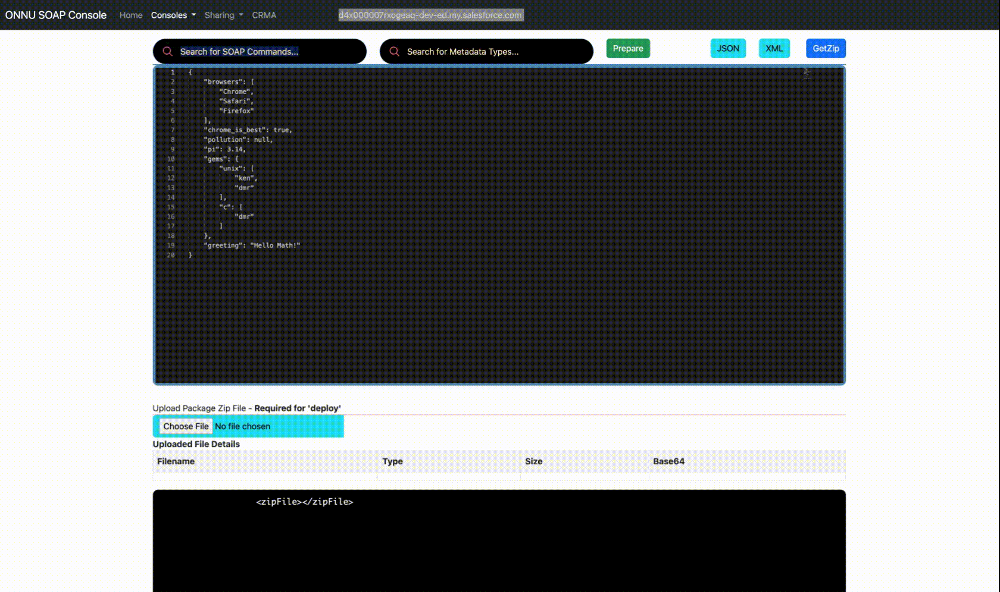

# Taking care of Admin changes


## Topics

- [Use case](#usecase)
- [Hotfix creation](#hotfix)
- [Using ONNU Chrome Extension](#onnu)
- [Using CLI](#cli)
- [Retrieving Profile and Permission Set](../security/profile-ps.md)
- [Viewing SetupAuditTrail](../security/setupAuditTrail.md)
- [package.xml Generator](#pkggen)

<a name='usecase'></a>
## Use case
- Admin wants to make changes (like adding reports, adding custom fields, list views...) to a non-source tracked orgs like PROD
- Admin not familiar with developer tools, version control




<a name='hotfix'></a>
## Create hotfix based on the changes done by the Admin in the WorkItem
- Options
    - Using Chrome Extension [ONNU](../chromeext/onnu.md)
    - Using CLI
- **This assumes the TeamMember has the access to this Org**

<a name='onnu'></a>
### Using ONNU
- Assume Admin has added a CustomObject ```FruitTree__c``` as the WorkItem - WI-12345

- 


### Zip file created
```
tree unpackaged\ 68
```

```
unpackaged\ 68
├── objects
│   └── FruitTree__c.object
└── package.xml
```

```
~/Downloads/unpackaged 68  >cat objects/FruitTree__c.object 
```

```xml
<?xml version="1.0" encoding="UTF-8"?>
<CustomObject xmlns="http://soap.sforce.com/2006/04/metadata">
    <actionOverrides>
        <actionName>Accept</actionName>
        <type>Default</type>
    </actionOverrides>
    <actionOverrides>
        <actionName>Accept</actionName>
        <formFactor>Large</formFactor>
        <type>Default</type>
    </actionOverrides>
    <actionOverrides>
        <actionName>Accept</actionName>
        <formFactor>Small</formFactor>
        <type>Default</type>
    </actionOverrides>
    <actionOverrides>
        <actionName>CancelEdit</actionName>
        <type>Default</type>
    </actionOverrides>
    <actionOverrides>
        <actionName>CancelEdit</actionName>
        <formFactor>Large</formFactor>
        <type>Default</type>
    </actionOverrides>
    <actionOverrides>
        <actionName>CancelEdit</actionName>
        <formFactor>Small</formFactor>
        <type>Default</type>
    </actionOverrides>
    <actionOverrides>
        <actionName>Clone</actionName>
        <type>Default</type>
    </actionOverrides>
    <actionOverrides>
        <actionName>Clone</actionName>
        <formFactor>Large</formFactor>
        <type>Default</type>
    </actionOverrides>
    <actionOverrides>
        <actionName>Clone</actionName>
        <formFactor>Small</formFactor>
        <type>Default</type>
    </actionOverrides>
    <actionOverrides>
        <actionName>Delete</actionName>
        <type>Default</type>
    </actionOverrides>
    <actionOverrides>
        <actionName>Delete</actionName>
        <formFactor>Large</formFactor>
        <type>Default</type>
    </actionOverrides>
    <actionOverrides>
        <actionName>Delete</actionName>
        <formFactor>Small</formFactor>
        <type>Default</type>
    </actionOverrides>
    <actionOverrides>
        <actionName>Edit</actionName>
        <type>Default</type>
    </actionOverrides>
    <actionOverrides>
        <actionName>Edit</actionName>
        <formFactor>Large</formFactor>
        <type>Default</type>
    </actionOverrides>
    <actionOverrides>
        <actionName>Edit</actionName>
        <formFactor>Small</formFactor>
        <type>Default</type>
    </actionOverrides>
    <actionOverrides>
        <actionName>List</actionName>
        <type>Default</type>
    </actionOverrides>
    <actionOverrides>
        <actionName>List</actionName>
        <formFactor>Large</formFactor>
        <type>Default</type>
    </actionOverrides>
    <actionOverrides>
        <actionName>List</actionName>
        <formFactor>Small</formFactor>
        <type>Default</type>
    </actionOverrides>
    <actionOverrides>
        <actionName>New</actionName>
        <type>Default</type>
    </actionOverrides>
    <actionOverrides>
        <actionName>New</actionName>
        <formFactor>Large</formFactor>
        <type>Default</type>
    </actionOverrides>
    <actionOverrides>
        <actionName>New</actionName>
        <formFactor>Small</formFactor>
        <type>Default</type>
    </actionOverrides>
    <actionOverrides>
        <actionName>SaveEdit</actionName>
        <type>Default</type>
    </actionOverrides>
    <actionOverrides>
        <actionName>SaveEdit</actionName>
        <formFactor>Large</formFactor>
        <type>Default</type>
    </actionOverrides>
    <actionOverrides>
        <actionName>SaveEdit</actionName>
        <formFactor>Small</formFactor>
        <type>Default</type>
    </actionOverrides>
    <actionOverrides>
        <actionName>Tab</actionName>
        <type>Default</type>
    </actionOverrides>
    <actionOverrides>
        <actionName>Tab</actionName>
        <formFactor>Large</formFactor>
        <type>Default</type>
    </actionOverrides>
    <actionOverrides>
        <actionName>Tab</actionName>
        <formFactor>Small</formFactor>
        <type>Default</type>
    </actionOverrides>
    <actionOverrides>
        <actionName>View</actionName>
        <type>Default</type>
    </actionOverrides>
    <actionOverrides>
        <actionName>View</actionName>
        <formFactor>Large</formFactor>
        <type>Default</type>
    </actionOverrides>
    <actionOverrides>
        <actionName>View</actionName>
        <formFactor>Small</formFactor>
        <type>Default</type>
    </actionOverrides>
    <allowInChatterGroups>false</allowInChatterGroups>
    <compactLayoutAssignment>SYSTEM</compactLayoutAssignment>
    <deploymentStatus>Deployed</deploymentStatus>
    <enableActivities>false</enableActivities>
    <enableBulkApi>true</enableBulkApi>
    <enableFeeds>false</enableFeeds>
    <enableHistory>false</enableHistory>
    <enableLicensing>false</enableLicensing>
    <enableReports>false</enableReports>
    <enableSearch>false</enableSearch>
    <enableSharing>true</enableSharing>
    <enableStreamingApi>true</enableStreamingApi>
    <externalSharingModel>Private</externalSharingModel>
    <label>FruitTree</label>
    <nameField>
        <label>FruitTree Name</label>
        <type>Text</type>
    </nameField>
    <pluralLabel>FruitTrees</pluralLabel>
    <searchLayouts/>
    <sharingModel>ReadWrite</sharingModel>
    <visibility>Public</visibility>
</CustomObject>

```

- TeamMember will create a hotfix branch say hotfix-WI-12345 to take of this so this change done by the Admin is back committed into the version control

<a name='cli'></a>

### Using CLI

- Login
```
sfdx force:auth:web:login
Successfully authorized mohan.chinnappan.n.sel@gmail.com with org ID 00D4x000007rxoGEAQ
```

- Prepare package.xml
```
~/hotfix  >cat hotfix_package.xml 
```

```xml
<?xml version="1.0" encoding="UTF-8"?>
<Package xmlns="http://soap.sforce.com/2006/04/metadata">
    <types>
        <members>FruitTree__c</members>
        <name>CustomObject</name>
    </types>
    <version>56.0</version>
</Package>

```

- Retrieve
```
sfdx force:mdapi:retrieve -k hotfix_package.xml -u mohan.chinnappan.n.sel@gmail.com -r .

```
```
Retrieving v56.0 metadata from mohan.chinnappan.n.sel@gmail.com using the v56.0 SOAP API
Retrieve ID: 09S4x00000EyAenEAF
Retrieving metadata from mohan.chinnappan.n.sel@gmail.com... done
Wrote retrieve zip to /Users/mchinnappan/hotfix/unpackaged.zip
```

- Unzip
```
~/hotfix  >jar xvf unpackaged.zip
```
```
 inflated: unpackaged/objects/FruitTree__c.object
 inflated: unpackaged/package.xml
 ```
```
 tree                  
.
├── hotfix_package.xml
├── unpackaged
│   ├── objects
│   │   └── FruitTree__c.object
│   └── package.xml
└── unpackaged.zip
2 directories, 4 files
```

```
~/hotfix  >cat hotfix_package.xml 
```

```xml
<?xml version="1.0" encoding="UTF-8"?>
<Package xmlns="http://soap.sforce.com/2006/04/metadata">
    <types>
        <members>FruitTree__c</members>
        <name>CustomObject</name>
    </types>
    <version>56.0</version>
</Package>
```


```
~/hotfix  >cat unpackaged/objects/FruitTree__c.object 
```

```xml
<?xml version="1.0" encoding="UTF-8"?>
<CustomObject xmlns="http://soap.sforce.com/2006/04/metadata">
    <actionOverrides>
        <actionName>Accept</actionName>
        <type>Default</type>
    </actionOverrides>
    <actionOverrides>
        <actionName>Accept</actionName>
        <formFactor>Large</formFactor>
        <type>Default</type>
    </actionOverrides>
    <actionOverrides>
        <actionName>Accept</actionName>
        <formFactor>Small</formFactor>
        <type>Default</type>
    </actionOverrides>
    <actionOverrides>
        <actionName>CancelEdit</actionName>
        <type>Default</type>
    </actionOverrides>
    <actionOverrides>
        <actionName>CancelEdit</actionName>
        <formFactor>Large</formFactor>
        <type>Default</type>
    </actionOverrides>
    <actionOverrides>
        <actionName>CancelEdit</actionName>
        <formFactor>Small</formFactor>
        <type>Default</type>
    </actionOverrides>
    <actionOverrides>
        <actionName>Clone</actionName>
        <type>Default</type>
    </actionOverrides>
    <actionOverrides>
        <actionName>Clone</actionName>
        <formFactor>Large</formFactor>
        <type>Default</type>
    </actionOverrides>
    <actionOverrides>
        <actionName>Clone</actionName>
        <formFactor>Small</formFactor>
        <type>Default</type>
    </actionOverrides>
    <actionOverrides>
        <actionName>Delete</actionName>
        <type>Default</type>
    </actionOverrides>
    <actionOverrides>
        <actionName>Delete</actionName>
        <formFactor>Large</formFactor>
        <type>Default</type>
    </actionOverrides>
    <actionOverrides>
        <actionName>Delete</actionName>
        <formFactor>Small</formFactor>
        <type>Default</type>
    </actionOverrides>
    <actionOverrides>
        <actionName>Edit</actionName>
        <type>Default</type>
    </actionOverrides>
    <actionOverrides>
        <actionName>Edit</actionName>
        <formFactor>Large</formFactor>
        <type>Default</type>
    </actionOverrides>
    <actionOverrides>
        <actionName>Edit</actionName>
        <formFactor>Small</formFactor>
        <type>Default</type>
    </actionOverrides>
    <actionOverrides>
        <actionName>List</actionName>
        <type>Default</type>
    </actionOverrides>
    <actionOverrides>
        <actionName>List</actionName>
        <formFactor>Large</formFactor>
        <type>Default</type>
    </actionOverrides>
    <actionOverrides>
        <actionName>List</actionName>
        <formFactor>Small</formFactor>
        <type>Default</type>
    </actionOverrides>
    <actionOverrides>
        <actionName>New</actionName>
        <type>Default</type>
    </actionOverrides>
    <actionOverrides>
        <actionName>New</actionName>
        <formFactor>Large</formFactor>
        <type>Default</type>
    </actionOverrides>
    <actionOverrides>
        <actionName>New</actionName>
        <formFactor>Small</formFactor>
        <type>Default</type>
    </actionOverrides>
    <actionOverrides>
        <actionName>SaveEdit</actionName>
        <type>Default</type>
    </actionOverrides>
    <actionOverrides>
        <actionName>SaveEdit</actionName>
        <formFactor>Large</formFactor>
        <type>Default</type>
    </actionOverrides>
    <actionOverrides>
        <actionName>SaveEdit</actionName>
        <formFactor>Small</formFactor>
        <type>Default</type>
    </actionOverrides>
    <actionOverrides>
        <actionName>Tab</actionName>
        <type>Default</type>
    </actionOverrides>
    <actionOverrides>
        <actionName>Tab</actionName>
        <formFactor>Large</formFactor>
        <type>Default</type>
    </actionOverrides>
    <actionOverrides>
        <actionName>Tab</actionName>
        <formFactor>Small</formFactor>
        <type>Default</type>
    </actionOverrides>
    <actionOverrides>
        <actionName>View</actionName>
        <type>Default</type>
    </actionOverrides>
    <actionOverrides>
        <actionName>View</actionName>
        <formFactor>Large</formFactor>
        <type>Default</type>
    </actionOverrides>
    <actionOverrides>
        <actionName>View</actionName>
        <formFactor>Small</formFactor>
        <type>Default</type>
    </actionOverrides>
    <allowInChatterGroups>false</allowInChatterGroups>
    <compactLayoutAssignment>SYSTEM</compactLayoutAssignment>
    <deploymentStatus>Deployed</deploymentStatus>
    <enableActivities>false</enableActivities>
    <enableBulkApi>true</enableBulkApi>
    <enableFeeds>false</enableFeeds>
    <enableHistory>false</enableHistory>
    <enableLicensing>false</enableLicensing>
    <enableReports>false</enableReports>
    <enableSearch>false</enableSearch>
    <enableSharing>true</enableSharing>
    <enableStreamingApi>true</enableStreamingApi>
    <externalSharingModel>Private</externalSharingModel>
    <label>FruitTree</label>
    <nameField>
        <label>FruitTree Name</label>
        <type>Text</type>
    </nameField>
    <pluralLabel>FruitTrees</pluralLabel>
    <searchLayouts/>
    <sharingModel>ReadWrite</sharingModel>
    <visibility>Public</visibility>
</CustomObject>
```
<a name='pkggen'></a>
## package.xml Generator 
- You can use [this tool](https://mohan-chinnappan-n5.github.io/pkg/pkg-gen.html) to generate ```package.xml``` for your requirements


