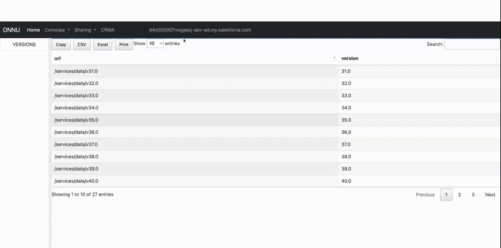
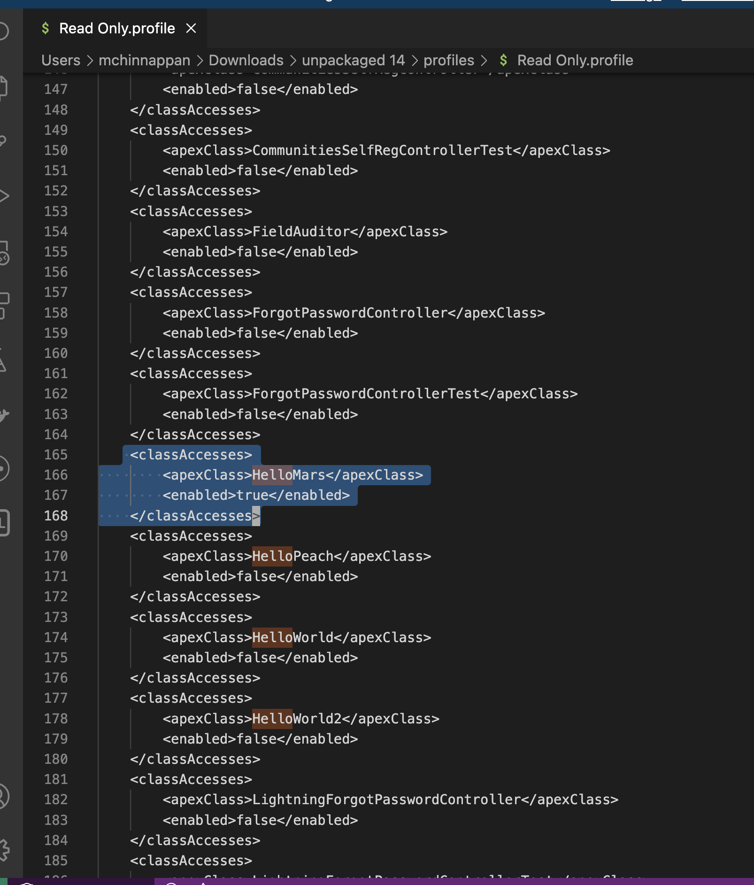
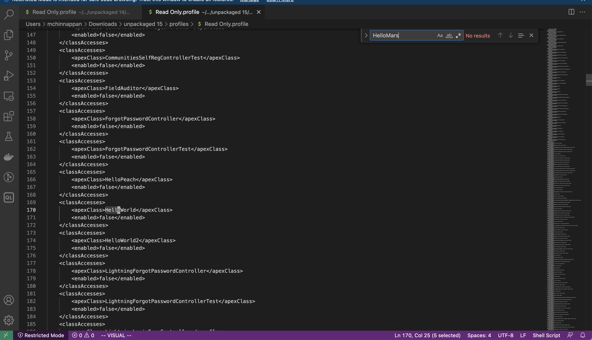
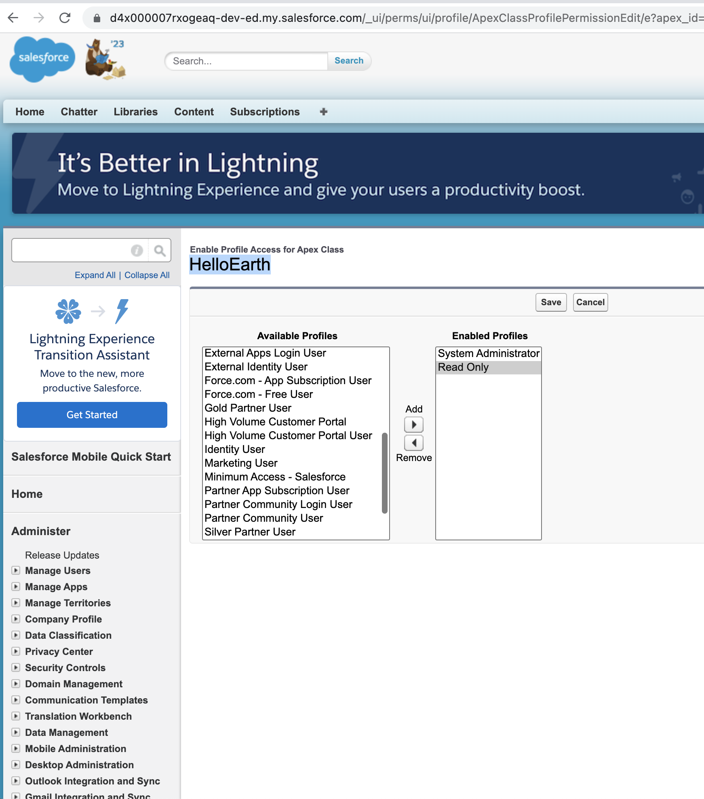
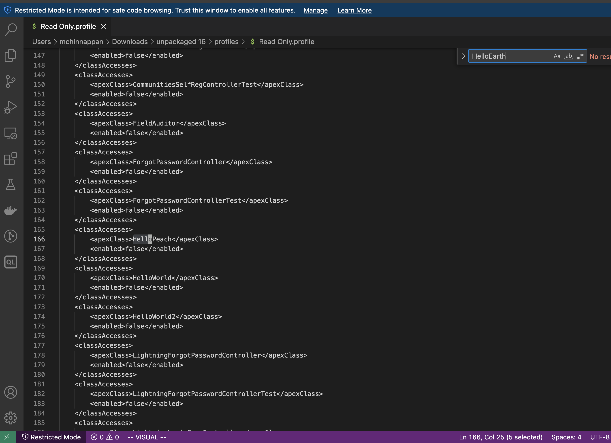

# Dangling Fields


## Topics
- [Dangling Fields Finder](#df)
- [How Salesforce Manages profile items life cycle](#slc)

----
<a name='df'></a>

- Dangling fields are ones which are present assets like Profile but they not in the source asset like Objects.
For example ```Account.carbonFootprint__c``` may be in Profiles/PermissionSets but the Account Object will not have this field ```carbonFootprint__c```

- Having Dangling fields in assets like Profiles makes the deployment task hard, so clean them as soon as possible.

- I coined this **Dangling fields** with comparison to dangling pointers in memory model of the languages like C, C++. I am open to your feedback on this naming...


## Finding Dangling fields using CLI

### list the profile files in json format

```
sfdx mohanc:mdapi:listFiles -p src -t permissionsets --help 
List Dangling Fields

USAGE
  $ sfdx mohanc mdapi listFiles [-p <string>] [-t <string>] [--json] [--loglevel trace|debug|info|warn|error|fatal|TRACE|DEBUG|INFO|WARN|ERROR|FATAL]

FLAGS
  -p, --projectpath=<value>                                                         Project location (say src)
  -t, --type=<value>                                                                Metadata type (e.g profiles)
  --json                                                                            format output as json
  --loglevel=(trace|debug|info|warn|error|fatal|TRACE|DEBUG|INFO|WARN|ERROR|FATAL)  [default: warn] logging level for this command invocation

DESCRIPTION
  List Dangling Fields

EXAMPLES
             List the files of given metadata type 
           
             sfdx mohanc:mdapi:listFiles  -p <projectPath>  -t <metadataType>
             Example:
             sfdx mohanc:mdapi:listFiles  -p src -t <profiles | permissionsets >
```

```
sfdx mohanc:mdapi:listFiles -p /path/to/src/folder -t profiles > /tmp/profiles.json
```

### find the dangling fields for those profiles or permissionsets

```
sfdx mohanc:mdapi:df -i /tmp/permissionsets.json -m PermissionSet --help           
List Dangling Fields

USAGE
  $ sfdx mohanc mdapi df -i <string> -m <string> [--json] [--loglevel trace|debug|info|warn|error|fatal|TRACE|DEBUG|INFO|WARN|ERROR|FATAL]

FLAGS
  -i, --xmls=<value>                                                                (required) JSON file with profile xml files
  -m, --type=<value>                                                                (required) [default: Profile] Profile or PermissionSet
  --json                                                                            format output as json
  --loglevel=(trace|debug|info|warn|error|fatal|TRACE|DEBUG|INFO|WARN|ERROR|FATAL)  [default: warn] logging level for this command invocation

DESCRIPTION
  List Dangling Fields

EXAMPLES
             List the dangling files when comparing with fields
             sfdx mohanc:mdapi:df   -i <XMLfiles.json>  -m <Profile | PermissionSet>
      

```


```
sfdx mohanc:mdapi:df -i /tmp/profiles.json > dangling_fields_2.tsv
```

### opens in numbers or Excel
```
open dangling_fields_2.tsv
```

### cleanup

```
cd /path/to/src/profiles/folder
rm *.json
cd /path/to/src/permissionsets/folder
rm *.json

```
<a name='slc'></a>
## How Salesforce Manages profile items life cycle

- Let us explain this creating an Apex Class ```HelloMars``` 
  - set the Security for that class
  - verify the profile to have the entry for this classAccess
  - delete the class in **UI**
  - verify the profile that Salesforce has removed this classAccess entry in the profile

### Create the class ```HelloMars```
```
~/treeprj [patch1] >sfdx force:apex:class:create -n HelloMars -d force-app/main/default/classes 
target dir = /Users/mchinnappan/treeprj/force-app/main/default/classes
   create force-app/main/default/classes/HelloMars.cls
   create force-app/main/default/classes/HelloMars.cls-meta.xml

~/treeprj [patch1] >tree force-app/main/default/classes    
force-app/main/default/classes
├── HelloMars.cls
├── HelloMars.cls-meta.xml
├── HelloPeach.cls
└── HelloPeach.cls-meta.xml

0 directories, 4 files
~/treeprj [patch1] >sfdx force:source:deploy -u mohan.chinnappan.n.sel@gmail.com -p force-app/main/default/classes 
Deploying v55.0 metadata to mohan.chinnappan.n.sel@gmail.com using the v57.0 SOAP API
Deploy ID: 0Af4x00000YS5i5CAD
DEPLOY PROGRESS | ████████████████████████████████████████ | 2/2 Components

=== Deployed Source

 FULL NAME  TYPE      PROJECT PATH                                           
 ────────── ───────── ────────────────────────────────────────────────────── 
 HelloMars  ApexClass force-app/main/default/classes/HelloMars.cls           
 HelloMars  ApexClass force-app/main/default/classes/HelloMars.cls-meta.xml  
 HelloPeach ApexClass force-app/main/default/classes/HelloPeach.cls          
 HelloPeach ApexClass force-app/main/default/classes/HelloPeach.cls-meta.xml 
Deploy Succeeded.
~/treeprj [patch1] >bat force-app/main/default/classes/HelloMars.cls
───────┬────────────────────────────────────────────────────────────────────────────────────────────────────────────
       │ File: force-app/main/default/classes/HelloMars.cls
───────┼────────────────────────────────────────────────────────────────────────────────────────────────────────────
   1   │ public with sharing class HelloMars {
   2   │     public HelloMars() {
   3   │ 
   4   │     }
   5   │ }
───────┴────────────────────────────────────────────────────────────────────────────────────────────────────────────
~/treeprj [patch1] >
```





- After deleting the Class in the **UI**



## Let us repeat the above exercise, this time will we will use CLI to delete the class
```
~/treeprj [patch1] >sfdx force:apex:class:create -n HelloEarth -d force-app/main/default/classes              
target dir = /Users/mchinnappan/treeprj/force-app/main/default/classes
   create force-app/main/default/classes/HelloEarth.cls
   create force-app/main/default/classes/HelloEarth.cls-meta.xml

~/treeprj [patch1] >sfdx force:source:deploy -u mohan.chinnappan.n.sel@gmail.com -p force-app/main/default/classes/HelloEarth.cls
Deploying v55.0 metadata to mohan.chinnappan.n.sel@gmail.com using the v57.0 SOAP API
Deploy ID: 0Af4x00000YS5u1CAD
DEPLOY PROGRESS | ████████████████████████████████████████ | 1/1 Components

=== Deployed Source

 FULL NAME  TYPE      PROJECT PATH                                           
 ────────── ───────── ────────────────────────────────────────────────────── 
 HelloEarth ApexClass force-app/main/default/classes/HelloEarth.cls          
 HelloEarth ApexClass force-app/main/default/classes/HelloEarth.cls-meta.xml 
Deploy Succeeded.
```
- 

- Prepare destructiveChanges 
```
 
~/treeprj [patch1] >cd destructiveChanges 
~/treeprj/destructiveChanges [patch1] >ls
destructiveChanges.xml	package.xml
~/treeprj/destructiveChanges [patch1] >vi destructiveChanges.xml 
~/treeprj/destructiveChanges [patch1] >bat destructiveChanges.xml 
───────┬────────────────────────────────────────────────────────────────────────────────────────────────────────────
       │ File: destructiveChanges.xml
───────┼────────────────────────────────────────────────────────────────────────────────────────────────────────────
   1   │ <?xml version="1.0" encoding="UTF-8"?>
   2   │ <Package xmlns="http://soap.sforce.com/2006/04/metadata">
   3   │     <version>55.0</version>
   4 ~ │ 
   5 ~ │  <types>
   6 ~ │             <members>HelloEarth</members>
   7 ~ │             <name>ApexClass</name>
   8 ~ │  </types>
   9 ~ │ 
  10 ~ │ </Package>
───────┴────────────────────────────────────────────────────────────────────────────────────────────────────────────
~/treeprj/destructiveChanges [patch1] >cd ..                     
~/treeprj [patch1] >vi package.json 
~/treeprj [patch1] >vi package.xml 
~/treeprj [patch1] >cp destructiveChanges/package.xml .
~/treeprj [patch1] >vi package.xml 
~/treeprj [patch1] >bat package.xml
───────┬────────────────────────────────────────────────────────────────────────────────────────────────────────────
       │ File: package.xml
───────┼────────────────────────────────────────────────────────────────────────────────────────────────────────────
   1   │ <?xml version="1.0" encoding="UTF-8"?>
   2   │ <Package xmlns="http://soap.sforce.com/2006/04/metadata">
   3   │     <version>55.0</version>
   4   │ </Package>
───────┴────────────────────────────────────────────────────────────────────────────────────────────────────────────
 
~/treeprj [patch1] >sfdx force:source:deploy -x package.xml --postdestructivechanges destructiveChanges/destructiveChanges.xml --verbose --loglevel TRACE -u mohan.chinnappan.n.sel@gmail.com -c
Deploying v55.0 metadata to mohan.chinnappan.n.sel@gmail.com using the v57.0 SOAP API
Deploy ID: 0Af4x00000YS5uBCAT

=== Deleted Source

 FULL NAME  TYPE      PROJECT PATH                                           
 ────────── ───────── ────────────────────────────────────────────────────── 
 HelloEarth ApexClass force-app/main/default/classes/HelloEarth.cls          
 HelloEarth ApexClass force-app/main/default/classes/HelloEarth.cls-meta.xml 
Successfully validated the deployment.
~/treeprj [patch1] >sfdx force:source:deploy -x package.xml --postdestructivechanges destructiveChanges/destructiveChanges.xml --verbose --loglevel TRACE -u mohan.chinnappan.n.sel@gmail.com  
Deploying v55.0 metadata to mohan.chinnappan.n.sel@gmail.com using the v57.0 SOAP API
Deploy ID: 0Af4x00000YS5uLCAT

=== Deleted Source

 FULL NAME  TYPE      PROJECT PATH                                           
 ────────── ───────── ────────────────────────────────────────────────────── 
 HelloEarth ApexClass force-app/main/default/classes/HelloEarth.cls          
 HelloEarth ApexClass force-app/main/default/classes/HelloEarth.cls-meta.xml 
Deploy Succeeded.

```




### About class files in the local folder
- Since destructiveChanges deployment do not  change files in the local folder as shown below:
```
tree force-app/main/default/classes 
force-app/main/default/classes
├── HelloEarth.cls
├── HelloEarth.cls-meta.xml
├── HelloMars.cls
├── HelloMars.cls-meta.xml
├── HelloPeach.cls
└── HelloPeach.cls-meta.xml

0 directories, 6 files
~/treeprj [patch1] >sfdx force:source:retrieve -p force-app/main/default/classes -u mohan.chinnappan.n.sel@gmail.com      
Retrieving v55.0 metadata from mohan.chinnappan.n.sel@gmail.com using the v57.0 SOAP API
Preparing retrieve request... done
=== Retrieved Source

 FULL NAME  TYPE      PROJECT PATH                                           
 ────────── ───────── ────────────────────────────────────────────────────── 
 HelloPeach ApexClass force-app/main/default/classes/HelloPeach.cls          
 HelloPeach ApexClass force-app/main/default/classes/HelloPeach.cls-meta.xml 
=== Retrieved Source Warnings

 FILE NAME              PROBLEM                                                       
 ────────────────────── ───────────────────────────────────────────────────────────── 
 unpackaged/package.xml Entity of type 'ApexClass' named 'HelloEarth' cannot be found 
 unpackaged/package.xml Entity of type 'ApexClass' named 'HelloMars' cannot be found  

~/treeprj [patch1] >tree force-app/main/default/classes 
force-app/main/default/classes
├── HelloEarth.cls
├── HelloEarth.cls-meta.xml
├── HelloMars.cls
├── HelloMars.cls-meta.xml
├── HelloPeach.cls
└── HelloPeach.cls-meta.xml

0 directories, 6 files

````

- We need to **manually delete them**, otherwise the following command (wildcard based) will re-deploy the deleted the classes back into the org
```
sfdx force:source:deploy -u mohan.chinnappan.n.sel@gmail.com -p force-app/main/default/classes 
```
