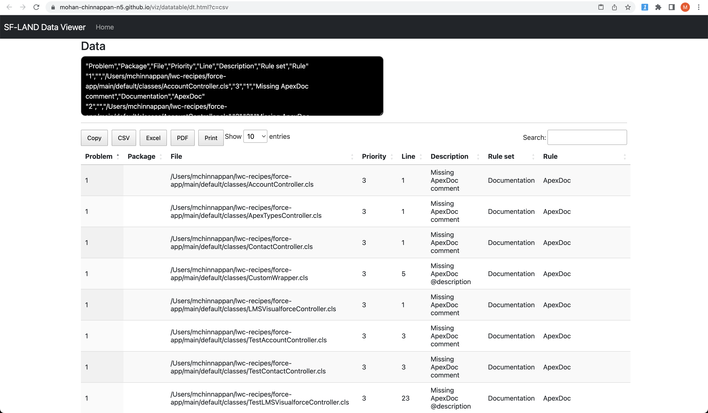

# git config

## Table of contents
- [Customizing the git log](./git-log.md)
- [git pmd-scan](#git-pmd-scan)
- [git pmd-cpd](#git-cpd)


<a name='git-pmd-scan'></a>
## git pmd-scan
- Running PMD Scan as git alias

```
git pmd-scan ~/lwc-recipes/force-app/main/default/classes  4
```
```
  % Total    % Received % Xferd  Average Speed   Time    Time     Time  Current
                                 Dload  Upload   Total   Spent    Left  Speed
100  9657  100  9657    0     0  80105      0 --:--:-- --:--:-- --:--:-- 84710
=== Running PMD scan on /Users/mchinnappan/lwc-recipes/force-app/main/default/classes === and THRESHOLD: 4 ...
Going to run: pmd-run.sh pmd -R  /Users/mchinnappan/.pmd/apex_ruleset.xml -d /Users/mchinnappan/lwc-recipes/force-app/main/default/classes  -f csv > /tmp/results.csv ...
Mar 19, 2023 7:26:23 AM net.sourceforge.pmd.PMD encourageToUseIncrementalAnalysis
WARNING: This analysis could be faster, please consider using Incremental Analysis: https://pmd.github.io/pmd-6.47.0/pmd_userdocs_incremental_analysis.html
Mar 19, 2023 7:26:24 AM net.sourceforge.pmd.PMD runPmd
WARNING: Some deprecated options were used on the command-line, including -property
Mar 19, 2023 7:26:24 AM net.sourceforge.pmd.PMD runPmd
WARNING: Consider replacing it with --property
Mar 19, 2023 7:26:24 AM net.sourceforge.pmd.PMD encourageToUseIncrementalAnalysis
WARNING: This analysis could be faster, please consider using Incremental Analysis: https://pmd.github.io/pmd-6.47.0/pmd_userdocs_incremental_analysis.html
SELECT COUNT(*) AS CNT   FROM CSV("/tmp/results.csv", {headers:true}) WHERE Priority < 4
=== Checking for PMD  violations ... ===
nerrors: 23
===       24 /tmp/results.csv lines.  Opening in the your web browser to view the logs ===
=== Number of P1,P2 and P3 issues are:  23. Can't continue! === 

```




### How to setup git pmd-scan - extending git with alias

- Get the script [git-pmd](https://github.com/mohan-chinnappan-n/git-scripts/blob/main/git-pmd)
- Store it in your local folder say: ```~/git-scripts```
- Make it executable 
```
chmod +x /path/to/git-logs-csv
```
- Configure it to run by git
```
 git config --global alias.pmd-scan '!/Users/mchinnappan/git-scripts/git-pmd'
```

<a name='git-cpd'></a>
##  git cpd (Copy and Paste Detector)
- Get the script [git-cpd](https://github.com/mohan-chinnappan-n/git-scripts/blob/main/git-cpd)
- Store it in your local folder say: ```~/git-scripts```
- Make it executable 
```
chmod +x /path/to/git-cpd
```

- Configure it to run by git
```
git config --global alias.pmd-cpd '!/Users/mchinnappan/git-scripts/git-cpd'

```
### Running it
```
code1=~/lwc-recipes/force-app/main/default/classes
git pmd-cpd ${code1} 100 > /tmp/cpd.xml

echo === xmlutil transform --xml=/tmp/cpdhtml-v2.xml --xsl=cpd --out=/tmp/cpd.html
xmlutil transform --xml=/tmp/cpd.xml --xsl=cpdhtml-v2 --out=/tmp/cpd.html
open /tmp/cpd.html
```


