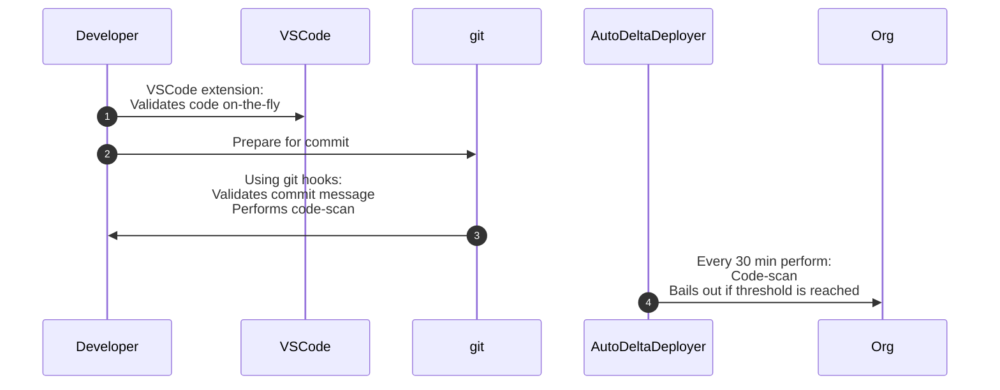
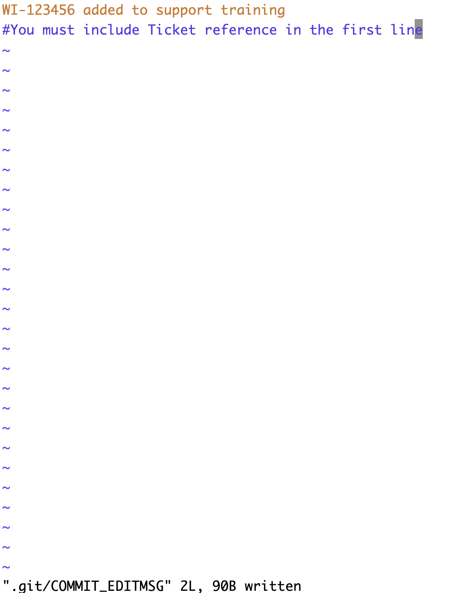
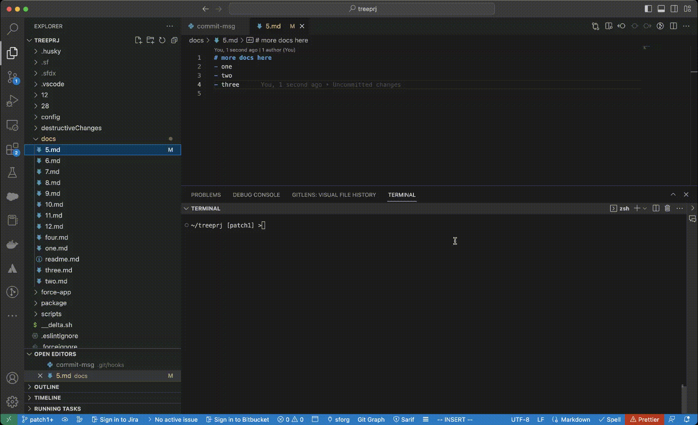

# git hooks


## Good Projects have good git hooks!
----





<iframe width="920" height="500" src="https://www.youtube.com/embed/F5t_1_C3SP8" title="YouTube video player" frameborder="0" allow="accelerometer; autoplay; clipboard-write; encrypted-media; gyroscope; picture-in-picture; web-share" allowfullscreen></iframe>

## Pre-requisites
- Make sure your PMD tools are installed according to [this](../cq/pmd.md) 
- Check python is already installed in your system by typing following in the terminal:
```bash
   python
```
Or
```bash
   python3
```

  - If you are successful in above command, you have already python installed if not continue to next steps:

- Python is installed in **one of these 2 ways**
  - Install from [python.org](https://www.python.org/downloads/)
  ----
  - Install via Homebrew
  ```bash
   /bin/bash -c "$(curl -fsSL https://raw.githubusercontent.com/Homebrew/install/master/install.sh)"
  ```
  - After Homebrew is installed install python
  ```bash
  brew install python
  ```

- Required [SFDX Plugin](https://mohan-chinnappan-n.github.io/dx/plugins.html#/1) is installed:
  ```bash
  sfdx plugins:install sfdx-mohanc-plugins
  ````
- All the hooks have to be made executable. For example:
```
chmod +x  prepare-commit-msg pre-commit commit-msg 
```
- You can view this :
```bash
/treeprj/.git/hooks [patch1] >ls -l prepare-commit-msg pre-commit commit-msg 
-rwxr-xr-x  1 mchinnappan  staff   522 Jan 25 08:43 commit-msg
-rwxr-xr-x  1 mchinnappan  staff  1050 Feb  8 03:47 pre-commit
-rwxr-xr-x  1 mchinnappan  staff   177 Jan 25 05:54 prepare-commit-msg
```
------


- Here we explain how to use the power of git hooks to check/enforce:
  - commit comments quality 
  - the committed code is deployable


- Git hooks can be run:
 - **locally**
     - prepare-commit-msg
     - pre-commit
     - commit-msg
     - post-commit

    -  They are not copied over to the new repository when you run git clone. And, since hooks are local, they can be altered by anybody with access to the repository.


- **on git server**
    - pre-receive 
    - update
    - post-receive
----
- **Local hooks** can only serve as a guidance and should not be relied upon for enforcements.
  -  They are **not copied** over to the new repository when you run git clone.
  -  Can be altered by anybody with access to the repository.
  - ```.git/hooks directory``` isn’t cloned with the rest of your project, nor is it under version control.

    - Easily disabled by the user - by deleting the ```.git/hook/``` directory or ```--no-verify``` with git cli
    - We need to  find a way to make sure hooks stay **up-to-date amongst your team members**. 
    - You **can’t force developers** to create commits that look a certain way
        - You can **only encourage** them to do so. 

- **Solution**
    - A simple solution to these local problems is to:
        -  Store your hooks in the actual project directory (above the ```.git``` directory)
        -  This lets you edit them like any other version-controlled file
        -  To install a hook, you can  create a symlink to it in ```.git/hooks```

    - Git Templates Directory
        - Git's [Template Directory](http://git-scm.com/docs/git-init#_template_directory) mechanism that makes it easier to **install hooks automatically**.
        - All of the files and directories contained in this template directory are copied into the ```.git``` directory every time you use ```git init``` or ```git clone```.
----
- **Server hooks** are a better choice for enforcing rules.


## Topics we will cover here:
- [prepare-commit-msg](#prepare-commit-msg)
- [commit-msg](#commit-msg)
- [pre-commit](#pre-commit)


<a name='prepare-commit-msg'></a>

## Sample prepare-commit-msg

```bash
cat .git/hooks/prepare-commit-msg
```

```py
#!/usr/bin/env python3
import sys
import subprocess

# Run the git command to get the current branch name
result = subprocess.run(['git', 'rev-parse', '--abbrev-ref', 'HEAD'], stdout=subprocess.PIPE)

# Extract the branch name from the command output
branch_name = result.stdout.decode('utf-8').strip()
#print(branch_name)

# read .git/COMMIT_EDITMSG
commit_msg_filepath = sys.argv[1]
with open(commit_msg_filepath, "w") as f:
    #  change the following as needed
    f.write(f"{branch_name} your info\n#You must include Ticket reference in the first line")

```

### prepare-commit-msg in action
```bash
git branch WI-123456
git checkout WI-123456
Switched to branch 'WI-123456'
touch r3.md
[WI-123456]- >git add .
[WI-123456]- >git commit 
[WI-123456 e855e40] WI-123456 added to support training
 1 file changed, 0 insertions(+), 0 deletions(-)
 create mode 100644 r3.md

[WI-123456]- > git lg
* e855e40 - (3 minutes ago) WI-123456 added to support training - mohan-chinnappan-n (HEAD -> WI-123456)
```


  


-----


<a name='commit-msg'></a>

## commit-msg

- With commit-msg we can enforce commit message

```py
#!/usr/bin/env python3

# python script check the format of the commit with a regex
# valid: WI-123456 adding new docs
#  echo $? -> 0
# invalid: " adding more docs"  
#   echo $? -> 1
# TODO: change the regex to fit your needs

import re,sys
input = sys.argv[1]
print('INPUT', 	input)

prefix='==='
with open(input, 'r') as file:
    data = file.read()

p = re.compile("^WI-([0-9]*){1,6}\s[a-zA-Z0-9\s]{1,30}")

print (f'{prefix} commit msg: {data} ')
if bool(p.match(data)):
	print (f'{prefix} Valid commit message!{prefix}')
else:
	print (f'{prefix} Invalid commit message! bailing out... {prefix}')
	exit(1)


```

### Testing 

```
cat ".git/COMMIT_EDITMSG"  
WI-123456 adding new docs
```

```
~/treeprj [patch1] >python .git/hooks/commit-msg ".git/COMMIT_EDITMSG"  
Invalid commit message! bailing out...
~/treeprj [patch1] >echo $?
1
```

```
~/treeprj [patch1] >python .git/hooks/commit-msg ".git/COMMIT_EDITMSG"  
Valid commit message!
~/treeprj [patch1] >echo $?                                                
0

```


### Demo

```
git commit                                        
Jan 25, 2023 8:45:02 AM net.sourceforge.pmd.PMD encourageToUseIncrementalAnalysis
WARNING: This analysis could be faster, please consider using Incremental Analysis: https://pmd.github.io/pmd-6.47.0/pmd_userdocs_incremental_analysis.html
SELECT COUNT(*) AS CNT   FROM CSV("results.csv", {headers:true}) WHERE Priority < 3
nerrors: 0
Continue the deployment...
Deploying v55.0 metadata to test-uzsmfdqkhtk7@example.com using the v56.0 SOAP API
Deploy ID: 0AfDM000016PncS0AS
DEPLOY PROGRESS | ████████████████████████████████████████ | 1/1 Components

=== Deployed Source

 FULL NAME  TYPE      PROJECT PATH                                           
 ────────── ───────── ────────────────────────────────────────────────────── 
 HelloPeach ApexClass force-app/main/default/classes/HelloPeach.cls          
 HelloPeach ApexClass force-app/main/default/classes/HelloPeach.cls-meta.xml 
Successfully validated the deployment.
('INPUT', '.git/COMMIT_EDITMSG')
Valid commit message!
[patch1 9fd2000] WI-123456 adding new docs
 3 files changed, 3 insertions(+), 2 deletions(-)
 create mode 100644 docs/12.md
~/treeprj [patch1] >git lg | head -n 1
* 9fd2000 - (53 seconds ago) WI-123456 adding new docs - mohan-chinnappan-n (HEAD -> patch1)
```


<a name='pre-commit'></a>
## pre-commit hook

- Note this will increase time to do the commit but you will be assured of what is committed is deployable
- Here I have explained for deploy check for classes, but you can add it as needed.


```
cat .git/hooks/pre-commit
```

```bash
#!/usr/bin/env bash
sfdx force:source:deploy -p /Users/mchinnappan/treeprj/force-app/main/default/classes/ -u test-uzsmfdqkhtk7@example.com -c --verbose

```

##  pre-commit hook in action
- Script used for this

```
~/treeprj [patch1] >
sfdx force:source:deploy -p /Users/mchinnappan/treeprj/force-app/main/default/classes/ -u test-uzsmfdqkhtk7@example.com -c --verbose
Deploying v55.0 metadata to test-uzsmfdqkhtk7@example.com using the v56.0 SOAP API
Deploy ID: 0AfDM000016PUr90AG
DEPLOY PROGRESS | ████████████████████████████████████████ | 1/1 Components

=== Deployed Source

 FULL NAME  TYPE      PROJECT PATH                                           
 ────────── ───────── ────────────────────────────────────────────────────── 
 HelloPeach ApexClass force-app/main/default/classes/HelloPeach.cls          
 HelloPeach ApexClass force-app/main/default/classes/HelloPeach.cls-meta.xml 
Successfully validated the deployment.
~/treeprj [patch1] >echo $?                                                                                                  
0
```
----
- Note here the validation deploy is run to make sure that code is deployable 

```
~/treeprj [patch1] >vi docs/9.md 
~/treeprj [patch1] >git add -A                    
~/treeprj [patch1] >git commit
Deploying v55.0 metadata to test-uzsmfdqkhtk7@example.com using the v56.0 SOAP API
Deploy ID: 0AfDM000016PUwn0AG
DEPLOY PROGRESS | ████████████████████████████████████████ | 1/1 Components

=== Deployed Source

 FULL NAME  TYPE      PROJECT PATH                                           
 ────────── ───────── ────────────────────────────────────────────────────── 
 HelloPeach ApexClass force-app/main/default/classes/HelloPeach.cls          
 HelloPeach ApexClass force-app/main/default/classes/HelloPeach.cls-meta.xml 
Successfully validated the deployment.
[patch1 9f3ce34] PATCH1 WI-2345 - more docs added
 1 file changed, 2 insertions(+)
 create mode 100644 docs/9.md

```

### Adding PMD code scan in pre-commit

```
~/treeprj [patch1] >vi docs/10.md
~/treeprj [patch1] >git add -A
~/treeprj [patch1] >git commit
Jan 25, 2023 6:41:18 AM net.sourceforge.pmd.PMD encourageToUseIncrementalAnalysis
WARNING: This analysis could be faster, please consider using Incremental Analysis: https://pmd.github.io/pmd-6.47.0/pmd_userdocs_incremental_analysis.html
SELECT COUNT(*) AS CNT   FROM CSV("results.csv", {headers:true}) WHERE Priority < 4
nerrors: 3
Number of P1,P2 and P3 issues are:  3. Stopping the deployment!

```

```bash
cat .git/hooks/pre-commit
```

```bash
#!/usr/bin/env bash
# Script for pipeline
# Bails out if count of P1,P2 and P3 are not zero
# -----------------------------------------

#----- configure the following to meet your needs ----
RULESET=~/.pmd/apex_ruleset.xml
MSG="Number of P1,P2 and P3 issues are"
THRESHOLD=3
CODE=/Users/mchinnappan/treeprj/force-app/main/default/classes/
#-----------------------------------------------------
PREFIX="==="
# Run the pmd
echo "$PREFIX Running PMD scan on ${CODE} ${PREFIX}..."
echo "Going to run: pmd-run.sh pmd -R  $RULESET -d $CODE  -f csv > results.csv ..."
pmd-run.sh pmd -R  $RULESET -d $CODE  -f csv > results.csv


# query the results using SQL
echo "SELECT COUNT(*) AS CNT   FROM CSV(\"results.csv\", {headers:true}) WHERE Priority < $THRESHOLD" > q.sql
cat q.sql
sfdx mohanc:data:query:sql -q q.sql  > out.json

# check for the errors
echo "$PREFIX Checking for PMD  violations ... $PREFIX"
nerrors=`sfdx mohanc:data:jq -f  '.[].CNT'  -i out.json`
echo "nerrors: $nerrors"

if [ "$nerrors" != 0 ]
then
  echo "$PREFIX $MSG:  $nerrors. Stopping the deployment! $PREFIX "
  exit 2
else 
  echo "$PREFIX No PMD violations! $PREFIX"
fi
echo "$PREFIX Continue the deployment...$PREFIX"
echo sfdx force:source:deploy -p $CODE -u test-uzsmfdqkhtk7@example.com -c --verbose

```

### Demo of successful commit
```
~/treeprj [patch1] >git add -A              
~/treeprj [patch1] >git commit               
Jan 25, 2023 6:51:23 AM net.sourceforge.pmd.PMD encourageToUseIncrementalAnalysis
WARNING: This analysis could be faster, please consider using Incremental Analysis: https://pmd.github.io/pmd-6.47.0/pmd_userdocs_incremental_analysis.html
SELECT COUNT(*) AS CNT   FROM CSV("results.csv", {headers:true}) WHERE Priority < 3
nerrors: 0
Continue the deployment...
Deploying v55.0 metadata to test-uzsmfdqkhtk7@example.com using the v56.0 SOAP API
Deploy ID: 0AfDM000016PX2w0AG
DEPLOY PROGRESS | ████████████████████████████████████████ | 1/1 Components

=== Deployed Source

 FULL NAME  TYPE      PROJECT PATH                                           
 ────────── ───────── ────────────────────────────────────────────────────── 
 HelloPeach ApexClass force-app/main/default/classes/HelloPeach.cls          
 HelloPeach ApexClass force-app/main/default/classes/HelloPeach.cls-meta.xml 
Successfully validated the deployment.
[patch1 b1ebf5a] PATCH1 WI-4567 - add more docs
 5 files changed, 9 insertions(+)
 create mode 100644 docs/10.md
 create mode 100644 docs/11.md
 ...
```
```
~/treeprj [patch1] >git lg   
* b1ebf5a - (2 minutes ago) PATCH1 WI-4567 - add more docs - mohan-chinnappan-n (HEAD -> patch1)
```




## References
- [8.4 Customizing Git - An Example Git-Enforced Policy](https://git-scm.com/book/en/v2/Customizing-Git-An-Example-Git-Enforced-Policy)
- [Git Hooks](https://www.atlassian.com/git/tutorials/git-hooks)
- [Server side hooks](https://www.atlassian.com/git/tutorials/git-hooks#server-side-hooks)