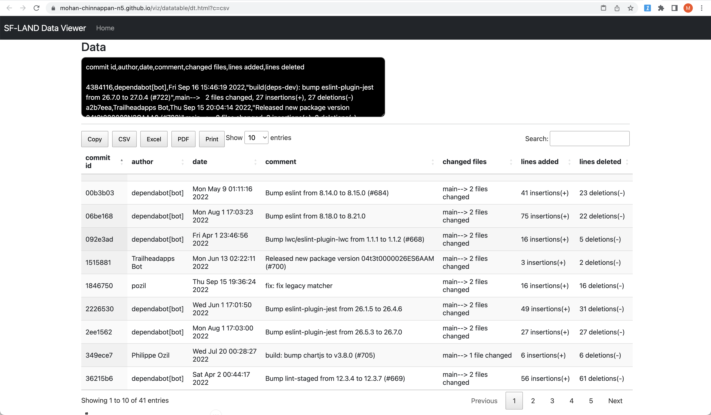

# git log

## Customizing the git log

- Since: last year
```
/lwc-recipes  (git)-[main]- >
```
```
git logs-csv 'last year' 
```

```
=== Getting logs for since:last year with the filter: ADM ===
===       50 /tmp/_gitlog_.csv lines.  Opening in the your web browser to view the logs ===

```



- Since: 2022-01-01
```
git logs-csv '2022-01-01'
```
```
=== Getting logs for since:2023-01-01 with the filter: ADM ===
===       89 /tmp/_gitlog_.csv lines.  Opening in the your web browser to view the logs ===
```

## How to setup this - extending git with alias

- Get the script [git-logs-csv](https://github.com/mohan-chinnappan-n/git-scripts/blob/main/git-logs-csv)
- Store it in your local folder say ```~/git-scripts```
- Make it executable 
```
chmod +x /path/to/git-logs-csv
```
- Configure it to run by git
```
git config --global alias.logs-csv '!/path/to/git-logs-csv'
```


