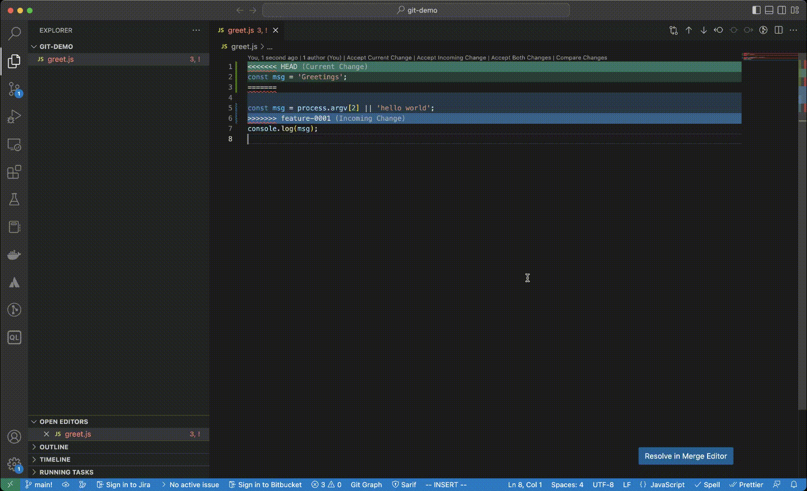

# git operations

- Refer [git](./git.md) chapter before starting this.

## Topics
- [init](#init)
- [stage](#stage)
- [commit](#commit)
- [logs](#logs)
- [branch](#branch)
- [work in feature branch](#fb)
- [switch back to main](#switch)
- [cheery-pick](#cherry-pick)

----------------
<a name='init'></a>
## init

```
~/git-playground [master] >cd 
~  >mkdir git-demo
~  >cd git-demo 
~/git-demo  >ls
~/git-demo  >git init .
hint: Using 'master' as the name for the initial branch. This default branch name
hint: is subject to change. To configure the initial branch name to use in all
hint: of your new repositories, which will suppress this warning, call:
hint: 
hint: 	git config --global init.defaultBranch <name>
hint: 
hint: Names commonly chosen instead of 'master' are 'main', 'trunk' and
hint: 'development'. The just-created branch can be renamed via this command:
hint: 
hint: 	git branch -m <name>
Initialized empty Git repository in /Users/mchinnappan/git-demo/.git/
~/git-demo [master] >git config --global init.defaultBranch  
~/git-demo [master] >git config --global init.defaultBranch main
~/git-demo [master] >git branch -m main
~/git-demo [main] >code .
~/git-demo [main] >git status
On branch main

No commits yet

Untracked files:
  (use "git add <file>..." to include in what will be committed)
	greet.js

nothing added to commit but untracked files present (use "git add" to track)
```

<a name='stage'></a>

## stage

```
~/git-demo [main] >git add greet.js 
```

<a name='status'></a>

## status
```
~/git-demo [main] >git status
On branch main

No commits yet

Changes to be committed:
  (use "git rm --cached <file>..." to unstage)
	new file:   greet.js
```


<a name='commit'></a>

## commit 

```
~/git-demo [main] >git commit -m 'init'
[main (root-commit) 6738865] init
 1 file changed, 2 insertions(+)
 create mode 100644 greet.js
~/git-demo [main] >git status
On branch main
nothing to commit, working tree clean
```

<a name='logs'></a>
## logs

```
git log 
commit 6738865ba8b8549b62b9fbadf4b4041ac891e36e (HEAD -> main)
Author: mohan-chinnappan-n <mohan.chinnappan.n@gmail.com>
Date:   Fri Feb 3 07:27:03 2023 -0500

    init

```

```
~/git-demo [main] >git lg
* 6738865 - (12 seconds ago) init - mohan-chinnappan-n (HEAD -> main)
~/git-demo [main] >

```
<a name='branch'></a>
## branch
```
~/git-demo [main] >git branch feature-0001
``
```
~/git-demo [main] >git branch
  feature-0001
* main

```

```
~/git-demo [main] >git checkout feature-0001
Switched to branch 'feature-0001'

```
~/git-demo [feature-0001] >git lg                   
* 6738865 - (24 minutes ago) init - mohan-chinnappan-n (HEAD -> feature-0001, main)

```

```
~/git-demo [feature-0001] >git branch
* feature-0001
  main

```

<a name='fb'></a>

## work in feature-0001 branch
```
~/git-demo [feature-0001] >vi greet.js 

~/git-demo [feature-0001] >cat greet.js 

const msg = 'hello world';
console.log(msg);
```

```
~/git-demo [feature-0001] >node greet.js 
hello world
```

### commit the changes
```
~/git-demo [feature-0001] >git add greet.js 
~/git-demo [feature-0001] >git commit -m 'msg updated'
[feature-0001 4f8fbaa] msg updated
 1 file changed, 3 insertions(+), 2 deletions(-)
```

```
~/git-demo [feature-0001] >git lg  
* 4f8fbaa - (9 seconds ago) msg updated - mohan-chinnappan-n (HEAD -> feature-0001)
* 6738865 - (25 minutes ago) init - mohan-chinnappan-n (main)
```

### Keep working on feature-0001
```
~/git-demo [feature-0001] >vi greet.js 
~/git-demo [feature-0001] >cat greet.js 

const msg = process.argv[2] || 'hello world';
console.log(msg);
~/git-demo [feature-0001] >node greet.js HelloWorld
HelloWorld

~/git-demo [feature-0001] >node greet.js           
hello world

```

```
/git-demo [feature-0001] >git add greet.js 
~/git-demo [feature-0001] >git commit -m 'added msg from commandline param'
[feature-0001 6aff16d] added msg from commandline param
 1 file changed, 1 insertion(+), 1 deletion(-)

```

### logs
```
~/git-demo [feature-0001] >git lg2
* 6aff16d - Fri, 3 Feb 2023 07:57:30 -0500 (69 seconds ago) (HEAD -> feature-0001)
|           added msg from commandline param - mohan-chinnappan-n
* 4f8fbaa - Fri, 3 Feb 2023 07:52:23 -0500 (6 minutes ago)
|           msg updated - mohan-chinnappan-n
* 6738865 - Fri, 3 Feb 2023 07:27:03 -0500 (32 minutes ago) (main)
            init - mohan-chinnappan-n

```
<a name='switch'></a>

### switch back to main and make few updates and commit

```
~/git-demo [feature-0001] >git checkout main
Switched to branch 'main'
~/git-demo [main] >vi greet.js 
~/git-demo [main] >cat greet.js 
const msg = 'Greetings';
console.log(msg);
~/git-demo [main] >node greet.js 
Greetings

```

```
~/git-demo [feature-0001] >git checkout main
Switched to branch 'main'
~/git-demo [main] >vi greet.js 
~/git-demo [main] >cat greet.js 
const msg = 'Greetings';
console.log(msg);
~/git-demo [main] >node greet.js 
Greetings
~/git-demo [main] >git add greet.js 
~/git-demo [main] >git commit -m 'msg is changed'
[main 972c964] msg is changed
 1 file changed, 2 insertions(+), 2 deletions(-)
~/git-demo [main] >git lg2
* 972c964 - Fri, 3 Feb 2023 08:00:54 -0500 (6 seconds ago) (HEAD -> main)
|           msg is changed - mohan-chinnappan-n
| * 6aff16d - Fri, 3 Feb 2023 07:57:30 -0500 (4 minutes ago) (feature-0001)
| |           added msg from commandline param - mohan-chinnappan-n
| * 4f8fbaa - Fri, 3 Feb 2023 07:52:23 -0500 (9 minutes ago)
|/            msg updated - mohan-chinnappan-n
* 6738865 - Fri, 3 Feb 2023 07:27:03 -0500 (34 minutes ago)
            init - mohan-chinnappan-n

```

<a name='merge'></a>

## let us merge feature-001 with main to the conflicts
```
~/git-demo [main] >git merge feature-0001
Auto-merging greet.js
CONFLICT (content): Merge conflict in greet.js
Automatic merge failed; fix conflicts and then commit the result.
```

### use merge editor in VSCode to resolve the conflicts



```
~/git-demo  (git)-[main|merge]- >git status
On branch main
All conflicts fixed but you are still merging.
  (use "git commit" to conclude merge)

Changes to be committed:
	modified:   greet.js

```

```
~/git-demo  (git)-[main|merge]- >git add greet.js 

~/git-demo  (git)-[main|merge]- >git commit -m 'merged with feature-0001'
[main 50fa27f] merged with feature-0001
```
```
~/git-demo [main] >git lg2
*   50fa27f - Fri, 3 Feb 2023 08:09:16 -0500 (6 seconds ago) (HEAD -> main)
|\            merged with feature-0001 - mohan-chinnappan-n
| * 6aff16d - Fri, 3 Feb 2023 07:57:30 -0500 (12 minutes ago) (feature-0001)
| |           added msg from commandline param - mohan-chinnappan-n
| * 4f8fbaa - Fri, 3 Feb 2023 07:52:23 -0500 (17 minutes ago)
| |           msg updated - mohan-chinnappan-n
* | 972c964 - Fri, 3 Feb 2023 08:00:54 -0500 (8 minutes ago)
|/            msg is changed - mohan-chinnappan-n
* 6738865 - Fri, 3 Feb 2023 07:27:03 -0500 (42 minutes ago)
            init - mohan-chinnappan-n
~/git-demo [main] >cat greet.js 

const msg = process.argv[2] || 'hello world';
console.log(msg);

```

## Some more update on feature-0001
```
git checkout feature-0001
M	greet.js
Switched to branch 'feature-0001'
``` 

```
~/git-demo [main] >vi greet.js 
~/git-demo [main] >vi greet.js
~/git-demo [main] >node greet.js  
hello world
30
~/git-demo [main] >cat greet.js 

const msg = process.argv[2] || 'hello world';
console.log(msg);

const add = (a,b) => a+b;
console.log(add(10,20));

```

```
~/git-demo [feature-0001] >git status
On branch feature-0001
Changes not staged for commit:
  (use "git add <file>..." to update what will be committed)
  (use "git restore <file>..." to discard changes in working directory)
	modified:   greet.js

no changes added to commit (use "git add" and/or "git commit -a")
~/git-demo [feature-0001] >git add greet.js 
~/git-demo [feature-0001] >git commit -m 'add function added'
[feature-0001 af3e5f4] add function added
 1 file changed, 3 insertions(+)
~/git-demo [feature-0001] >git lg3
* af3e5f4 - Sat, 4 Feb 2023 04:40:59 -0500 (4 seconds ago) (committed: Sat, 4 Feb 2023 04:40:59 -0500)  (HEAD -> feature-0001)
|           add function added
|           - mohan-chinnappan-n <mohan.chinnappan.n@gmail.com>  (committer: mohan-chinnappan-n <mohan.chinnappan.n@gmail.com>)
| *   50fa27f - Fri, 3 Feb 2023 08:09:16 -0500 (21 hours ago) (committed: Fri, 3 Feb 2023 08:09:16 -0500)  (main)
| |\            merged with feature-0001
| |/            - mohan-chinnappan-n <mohan.chinnappan.n@gmail.com>  (committer: mohan-chinnappan-n <mohan.chinnappan.n@gmail.com>)
|/|   
* | 6aff16d - Fri, 3 Feb 2023 07:57:30 -0500 (21 hours ago) (committed: Fri, 3 Feb 2023 07:57:30 -0500) 
| |           added msg from commandline param
| |           - mohan-chinnappan-n <mohan.chinnappan.n@gmail.com>  (committer: mohan-chinnappan-n <mohan.chinnappan.n@gmail.com>)
* | 4f8fbaa - Fri, 3 Feb 2023 07:52:23 -0500 (21 hours ago) (committed: Fri, 3 Feb 2023 07:52:23 -0500) 
| |           msg updated
| |           - mohan-chinnappan-n <mohan.chinnappan.n@gmail.com>  (committer: mohan-chinnappan-n <mohan.chinnappan.n@gmail.com>)
| * 972c964 - Fri, 3 Feb 2023 08:00:54 -0500 (21 hours ago) (committed: Fri, 3 Feb 2023 08:00:54 -0500) 
|/            msg is changed
|             - mohan-chinnappan-n <mohan.chinnappan.n@gmail.com>  (committer: mohan-chinnappan-n <mohan.chinnappan.n@gmail.com>)
* 6738865 - Fri, 3 Feb 2023 07:27:03 -0500 (21 hours ago) (committed: Fri, 3 Feb 2023 07:27:03 -0500) 
            init
            - mohan-chinnappan-n <mohan.chinnappan.n@gmail.com>  (committer: mohan-chinnappan-n <mohan.chinnappan.n@gmail.com>)

```


```
~/git-demo [feature-0001] >vi greet.js 
~/git-demo [feature-0001] >node greet.js 
hello world
30
200
~/git-demo [feature-0001] >cat greet.js 

const msg = process.argv[2] || 'hello world';
console.log(msg);

const add = (a,b) => a+b;
console.log(add(10,20));

const mul = (a,b) => a*b;
console.log(mul(10,20));
~/git-demo [feature-0001] >git add greet.js 
~/git-demo [feature-0001] >git commit -m 'mul function added'
[feature-0001 d99c263] mul function added
 1 file changed, 3 insertions(+)
~/git-demo [feature-0001] >git lg
* d99c263 - (36 seconds ago) mul function added - mohan-chinnappan-n (HEAD -> feature-0001)
* af3e5f4 - (3 minutes ago) add function added - mohan-chinnappan-n
| *   50fa27f - (21 hours ago) merged with feature-0001 - mohan-chinnappan-n (main)
| |\  
| |/  
|/|   
* | 6aff16d - (21 hours ago) added msg from commandline param - mohan-chinnappan-n
* | 4f8fbaa - (21 hours ago) msg updated - mohan-chinnappan-n
| * 972c964 - (21 hours ago) msg is changed - mohan-chinnappan-n
|/  
* 6738865 - (21 hours ago) init - mohan-chinnappan-n
~/git-demo [feature-0001] >git lg2
* d99c263 - Sat, 4 Feb 2023 04:43:06 -0500 (43 seconds ago) (HEAD -> feature-0001)
|           mul function added - mohan-chinnappan-n
* af3e5f4 - Sat, 4 Feb 2023 04:40:59 -0500 (3 minutes ago)
|           add function added - mohan-chinnappan-n
| *   50fa27f - Fri, 3 Feb 2023 08:09:16 -0500 (21 hours ago) (main)
| |\            merged with feature-0001 - mohan-chinnappan-n
| |/  
|/|   
* | 6aff16d - Fri, 3 Feb 2023 07:57:30 -0500 (21 hours ago)
| |           added msg from commandline param - mohan-chinnappan-n
* | 4f8fbaa - Fri, 3 Feb 2023 07:52:23 -0500 (21 hours ago)
| |           msg updated - mohan-chinnappan-n
| * 972c964 - Fri, 3 Feb 2023 08:00:54 -0500 (21 hours ago)
|/            msg is changed - mohan-chinnappan-n
* 6738865 - Fri, 3 Feb 2023 07:27:03 -0500 (21 hours ago)
            init - mohan-chinnappan-n
```

```
~/git-demo [feature-0001] >git log --pretty='format:%h|%an|%ae|%s'
d99c263|mohan-chinnappan-n|mohan.chinnappan.n@gmail.com|mul function added
af3e5f4|mohan-chinnappan-n|mohan.chinnappan.n@gmail.com|add function added
6aff16d|mohan-chinnappan-n|mohan.chinnappan.n@gmail.com|added msg from commandline param
4f8fbaa|mohan-chinnappan-n|mohan.chinnappan.n@gmail.com|msg updated
6738865|mohan-chinnappan-n|mohan.chinnappan.n@gmail.com|init
```

<a name='cherry-pick'></a>


### cherry-pick af3e5f4 into main

```
~/git-demo [feature-0001] >cat greet.js 

const msg = process.argv[2] || 'hello world';
console.log(msg);

const add = (a,b) => a+b;
console.log(add(10,20));

const mul = (a,b) => a*b;
console.log(mul(10,20));
```

```
~/git-demo [feature-0001] >git checkout main
Switched to branch 'main'
```

```
~/git-demo [main] >cat greet.js     

const msg = process.argv[2] || 'hello world';
console.log(msg);
```

```
~/git-demo [main] >git cherry-pick af3e5f4
[main befe251] add function added
 Date: Sat Feb 4 04:40:59 2023 -0500
 1 file changed, 3 insertions(+)
 ```

 ```
~/git-demo [main] >cat greet.js           

const msg = process.argv[2] || 'hello world';
console.log(msg);

const add = (a,b) => a+b;
console.log(add(10,20));

```

```
~/git-demo [main] >node greet.js 
hello world
30
```

```
~/git-demo [main] >git lg2
* befe251 - Sat, 4 Feb 2023 04:40:59 -0500 (10 minutes ago) (HEAD -> main)
|           add function added - mohan-chinnappan-n
*   50fa27f - Fri, 3 Feb 2023 08:09:16 -0500 (21 hours ago)
|\            merged with feature-0001 - mohan-chinnappan-n
* | 972c964 - Fri, 3 Feb 2023 08:00:54 -0500 (21 hours ago)
| |           msg is changed - mohan-chinnappan-n
| | * d99c263 - Sat, 4 Feb 2023 04:43:06 -0500 (7 minutes ago) (feature-0001)
| | |           mul function added - mohan-chinnappan-n
| | * af3e5f4 - Sat, 4 Feb 2023 04:40:59 -0500 (10 minutes ago)<---------- cheery-pick
| |/            add function added - mohan-chinnappan-n
| * 6aff16d - Fri, 3 Feb 2023 07:57:30 -0500 (21 hours ago)
| |           added msg from commandline param - mohan-chinnappan-n
| * 4f8fbaa - Fri, 3 Feb 2023 07:52:23 -0500 (21 hours ago)
|/            msg updated - mohan-chinnappan-n
* 6738865 - Fri, 3 Feb 2023 07:27:03 -0500 (21 hours ago)
            init - mohan-chinnappan-n


```
## References
- [cheery-pick](https://www.atlassian.com/git/tutorials/cherry-pick)


