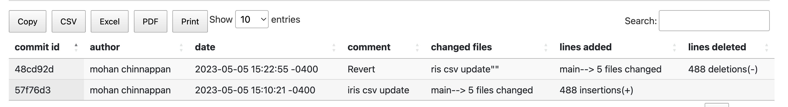

# git revert


## Reverting a git commit

```
git revert commitId

```

### Log before revert


```
git revert 57f76d3

```

## Log after the revert of 57f76d3 




## Reverting a revert

- To revert a revert in Git, we can use the ```git revert``` command again.


```

git revert 48cd92d

```

### Log after reverting a revert


## Reverting a git merge


```
git branch feature-0002
```

```
git checkout feature-0002
```
```
Switched to branch 'feature-0002'
```

```
~/git-demo  (git)-[feature-0002]- >git add -A                                 
~/git-demo  (git)-[feature-0002]- >git commit -m 'iris.csv added new record 4'
```

```
git commit -m 'iris.csv added new record 4'
[feature-0002 a78f1a5] iris.csv added new record 4
 1 file changed, 1 insertion(+)

 ```

### Finding the diff in a file in 2 branches
 ```
~/git-demo  (git)-[feature-0002]- >git diff feature-0002 main iris.csv
```

```
diff --git a/iris.csv b/iris.csv
index c51bae8..098e207 100644
--- a/iris.csv
+++ b/iris.csv
@@ -1,7 +1,7 @@
 sepal_length,sepal_width,petal_length,petal_width,species
 5.1,3.5,1.4,0.2,Iris-setosa
 5.1,3.5,1.4,0.2,Iris-setosa
-4.9,3,1.4,0.2,Iris-setosa
+5.1,3.5,1.4,0.2,Iris-setosa^M
 4.9,3,1.4,0.2,Iris-setosa
 4.7,3.2,1.3,0.2,Iris-setosa
 4.6,3.1,1.5,0.2,Iris-setosa

```


### git merge
- The command used to integrate changes from one branch into another. Merging combines changes made in separate branches and creates a new commit that includes the changes from both branches.
- Merging is a powerful feature of git that allows multiple developers to work on the same codebase simultaneously and combine their changes in a controlled and efficient way. 


#### Steps

1. git checkout <current-branch>

```
~/git-demo  (git)-[feature-0002]- >git checkout main
Switched to branch 'main'
```

2. git merge <source-branch-for-merge>

```

git merge feature-0002
```

```
Auto-merging iris.csv
Merge made by the 'ort' strategy.
 iris.csv | 1 +
 1 file changed, 1 insertion(+)

```

```
head iris.csv 
sepal_length,sepal_width,petal_length,petal_width,species
5.1,3.5,1.4,0.2,Iris-setosa
5.1,3.5,1.4,0.2,Iris-setosa
5.1,3.5,1.4,0.2,Iris-setosa
4.9,3,1.4,0.2,Iris-setosa
4.9,3,1.4,0.2,Iris-setosa
4.7,3.2,1.3,0.2,Iris-setosa
4.6,3.1,1.5,0.2,Iris-setosa
5,3.6,1.4,0.2,Iris-setosa
5.4,3.9,1.7,0.4,Iris-setosa
```

- This command merges the changes from **<source-branch-for-merge>** into the **current branch**. Before performing the merge, git checks whether there are any conflicts between the two branches. If there are conflicts, git will prompt you to resolve them manually.


## Reverting a Branch merge

```
git revert <merge-commit-hash> -m <greaterThan 0> 

```
----
- The ```-m 1``` option specifies that you want to revert to the **first parent of the merge commit**, which is typically the **branch you were on before the merge**. 

- If the merge **had conflicts** and you had to manually resolve them, you may need to specify ```-m 2``` instead.
----
