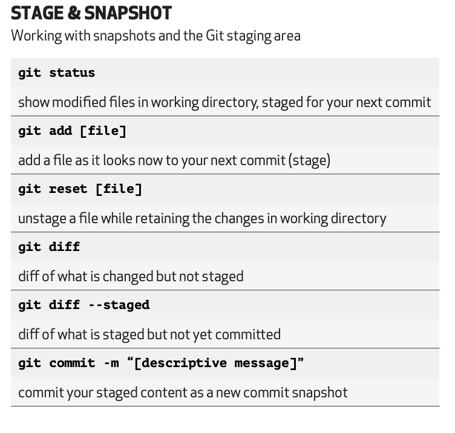

# git


- Well designed branching strategy is key to the success of your deployments

## Topic
- [Git Basic Operations](#ops)
- [Git Cheat Sheet](#cheatsheet)
- [Git Graph Editor](#gitdwg)
- [VS Code - Merge Editor](#mergeConflicts)
- [Using git logs](#gitlogs)


<a name='ops'></a>
## Basic Operations


## [Cheat Sheet](https://education.github.com/git-cheat-sheet-education.pdf) - click to view the documentation
<a name='cheatsheet'></a>

|       |  | |
| ----------- | ----------- | -----------|
| | [](https://git-scm.com/docs/git-config)       | [](https://git-scm.com/docs/git-init)|
| | [](https://git-scm.com/docs/git-status)       | [](https://git-scm.com/docs/git-merge)|
| | [](https://git-scm.com/docs/git-log)       | [](https://git-scm.com/docs/git-pull)|
| | [](https://git-scm.com/docs/git-log)       | [](https://git-scm.com/docs/git-rebase)|
| | [](https://git-scm.com/docs/gitignore)       | [](https://git-scm.com/docs/git-stash)|


<a name='gitdwg'></a>
<iframe id="inlineFrameExample"
    title="Inline Frame Example"
    width="1100"
    height="800"
    src="https://mohan-chinnappan-n5.github.io//2021/dwg/pg/dwg2.html?d=LS0tCnRpdGxlOiBFeGFtcGxlIEdpdCBkaWFncmFtCi0tLQpnaXRHcmFwaAogICBjb21taXQgaWQ6ICIxMDAwIgogICBjb21taXQKICAgYnJhbmNoIGRldmVsb3AKICAgY2hlY2tvdXQgZGV2ZWxvcAogICBjb21taXQKICAgY29tbWl0CiAgIGNoZWNrb3V0IG1haW4KICAgbWVyZ2UgZGV2ZWxvcAogICBjb21taXQKICAgY29tbWl0Cgo=">
</iframe>


<a name='mergeConflicts'></a>
## Merge Conflicts
<iframe width="920" height="500" src="https://www.youtube.com/embed/HosPml1qkrg" title="YouTube video player" frameborder="0" allow="accelerometer; autoplay; clipboard-write; encrypted-media; gyroscope; picture-in-picture; web-share" allowfullscreen></iframe>

<a name='gitlogs'></a>
## Using git logs

### my .gitconfig

```
[alias]
    lg = lg1
    lg1 = lg1-specific --all
    lg2 = lg2-specific --all
    lg3 = lg3-specific --all
    lg1-specific = log --graph --abbrev-commit --decorate --format=format:'%C(bold blue)%h%C(reset) - %C(bold green)(%ar)%C(reset) %C(white)%s%C(reset) %C(dim white)- %an%C(reset)%C(auto)%d%C(reset)'
    lg2-specific = log --graph --abbrev-commit --decorate --format=format:'%C(bold blue)%h%C(reset) - %C(bold cyan)%aD%C(reset) %C(bold green)(%ar)%C(reset)%C(auto)%d%C(reset)%n''          %C(white)%s%C(reset) %C(dim white)- %an%C(reset)'
    lg3-specific = log --graph --abbrev-commit --decorate --format=format:'%C(bold blue)%h%C(reset) - %C(bold cyan)%aD%C(reset) %C(bold green)(%ar)%C(reset) %C(bold cyan)(committed: %cD)%C(reset) %C(auto)%d%C(reset)%n''          %C(white)%s%C(reset)%n''          %C(dim white)- %an <%ae> %C(reset) %C(dim white)(committer: %cn <%ce>)%C(reset)'
```

### Let us git lg3 on tensorflow repo
```
~/tf/tensorflow [master] >git lg3 
* 0d4d75bc2b7 - Sun, 22 Jan 2023 01:31:56 -0800 (8 hours ago) (committed: Sun, 22 Jan 2023 01:36:16 -0800)  (HEAD -> master, origin/master, origin/HEAD)
|           Add no_pip tag for `pywrap_quantize_model_test`.
|           - Dan Suh <dansuh@google.com>  (committer: TensorFlower Gardener <gardener@tensorflow.org>)
* 0b9a85fa851 - Sun, 22 Jan 2023 01:01:52 -0800 (8 hours ago) (committed: Sun, 22 Jan 2023 01:12:11 -0800) 
|           compat: Update forward compatibility horizon to 2023-01-22
|           - A. Unique TensorFlower <gardener@tensorflow.org>  (committer: TensorFlower Gardener <gardener@tensorflow.org>)
* a35dac30a05 - Sun, 22 Jan 2023 01:01:52 -0800 (8 hours ago) (committed: Sun, 22 Jan 2023 01:06:31 -0800) 
|           Update GraphDef version to 1384.
|           - A. Unique TensorFlower <gardener@tensorflow.org>  (committer: TensorFlower Gardener <gardener@tensorflow.org>)
* 7a0e6f3a58c - Sat, 21 Jan 2023 14:45:12 -0800 (18 hours ago) (committed: Sat, 21 Jan 2023 14:49:53 -0800)  (origin/nightly)
|           Use tensor.extract_slice instead of gml_st.materialize.
|           - Alexander Belyaev <pifon@google.com>  (committer: TensorFlower Gardener <gardener@tensorflow.org>)
* 114579d598c - Sat, 21 Jan 2023 14:15:52 -0800 (19 hours ago) (committed: Sat, 21 Jan 2023 14:19:18 -0800) 
|           [StableHLO to MHLO] Handle bounds in the CholeskyOp shape function
|           - Gunhyun Park <gunhyun@google.com>  (committer: TensorFlower Gardener <gardener@tensorflow.org>)
* 5c880d3ebe3 - Sat, 21 Jan 2023 13:41:09 -0800 (20 hours ago) (committed: Sat, 21 Jan 2023 13:46:12 -0800) 
|           [StableHLO to MHLO] Handle bounds in the ReduceWindowOp shape function
|           - Gunhyun Park <gunhyun@google.com>  (committer: TensorFlower Gardener <gardener@tensorflow.org>)
* 421205cd514 - Sat, 21 Jan 2023 13:30:20 -0800 (20 hours ago) (committed: Sat, 21 Jan 2023 13:33:14 -0800) 
|           Hotfix for breakage
|           - Johannes Reifferscheid <jreiffers@google.com>  (committer: TensorFlower Gardener <gardener@tensorflow.org>)
* 6ca0c86111d - Sat, 21 Jan 2023 13:02:20 -0800 (20 hours ago) (committed: Sat, 21 Jan 2023 13:06:28 -0800) 
|           Replace 0l with int64_t{0}.
|           - Johannes Reifferscheid <jreiffers@google.com>  (committer: TensorFlower Gardener <gardener@tensorflow.org>)
* 5d9c9ba31d6 - Sat, 21 Jan 2023 12:31:25 -0800 (21 hours ago) (committed: Sat, 21 Jan 2023 12:40:01 -0800) 
|           [StableHLO to MHLO] Verify exponent and mantissa in ReducePrecisionOp
|           - Gunhyun Park <gunhyun@google.com>  (committer: TensorFlower Gardener <gardener@tensorflow.org>)
* 4a67ff1bfd4 - Sat, 21 Jan 2023 12:30:41 -0800 (21 hours ago) (committed: Sat, 21 Jan 2023 12:34:19 -0800) 
|           [StableHLO to MHLO] Handle bounds in the SelectAndScatterOp shape function
|           - Gunhyun Park <gunhyun@google.com>  (committer: TensorFlower Gardener <gardener@tensorflow.org>)
* 0c4eb3ace86 - Sat, 21 Jan 2023 11:18:46 -0800 (22 hours ago) (committed: Sat, 21 Jan 2023 11:21:55 -0800) 
|           [StableHLO to MHLO] Fix typos in infer_stablehlo.mlir tests
:

```

### Script extract git logs into a TSV file
```bash
# gitLogs.sh
# Script to  produce git logs from the current branch
# Run this command when you are in the branch for which you need gitlogs
# mchinnappan

branch="$(git branch | sed -n -e 's/^\* \(.*\)/\1/p')"
echo "=== branch: ${branch} ==="
tsvoutput="${branch}-$(date +"%Y_%m_%d_%I_%M_%p").tsv"
echo "=== Output file: $tsvoutput ==="

git log --pretty='format:%h|%an|%ae|%s' | sed 's/|/\t/g' > "${tsvoutput}"
open "${output}" 

```
- Run it on Tensorflow master
```
bash gitLogs.sh 
=== branch: master ===
=== Output file: master-2023_01_22_12_13_PM.tsv ===
```

```
wc -l master-2023_01_22_12_13_PM.tsv 
  141977 master-2023_01_22_12_13_PM.tsv
```

### Word Cloud on Tensorflow git logs


### Using SF-LAND Data Viz to visualize the tensorflow git logs 
### Using SF-LAND Data Viz to view the model file
  <iframe id="inlineFrameExample"
    title="Inline Frame Example"
    width="1100"
    height="800"
    src="https://mohan-chinnappan-n5.github.io/dfv/dfv.html?d=data/git/tf_master-2023_01_22_12_13_PM_10k.tsv&c=0&wc=3">
</iframe>

## References
- [git cheat sheet](https://education.github.com/git-cheat-sheet-education.pdf)
- [git --fast-version-control](https://git-scm.com/book/en/v2)
- [Git and GitHub Basics](https://trailhead.salesforce.com/content/learn/modules/git-and-git-hub-basics)
