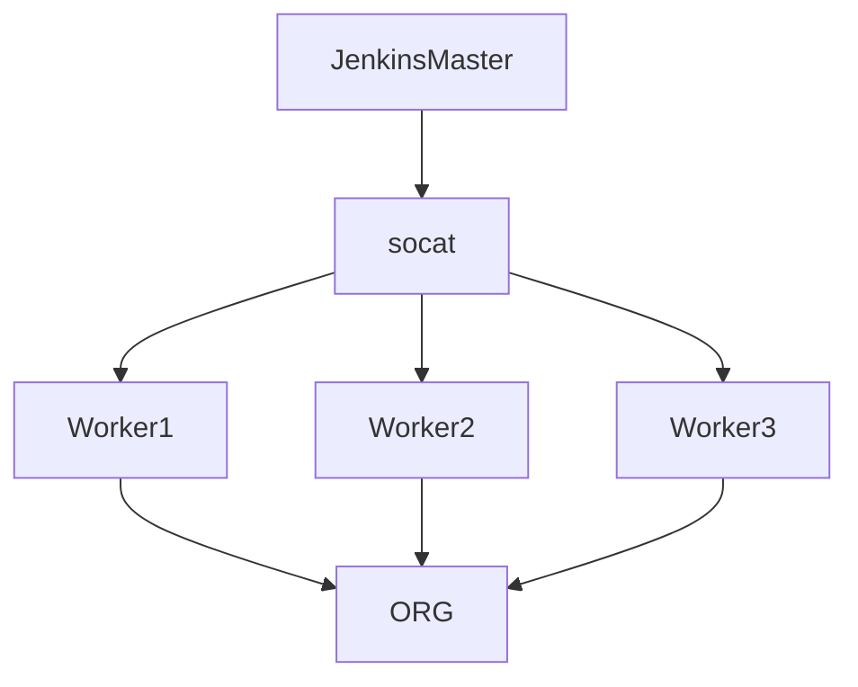
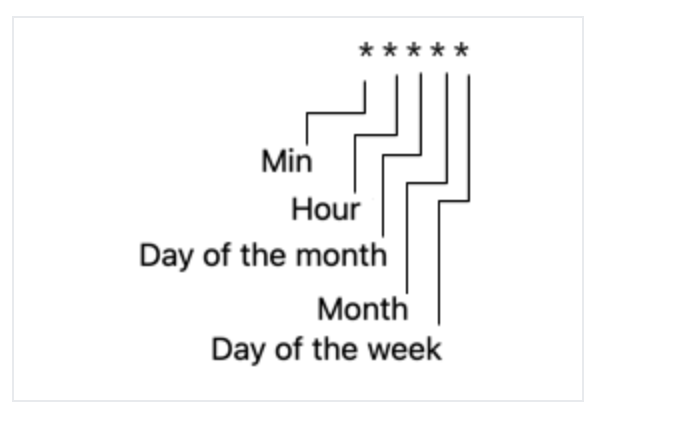
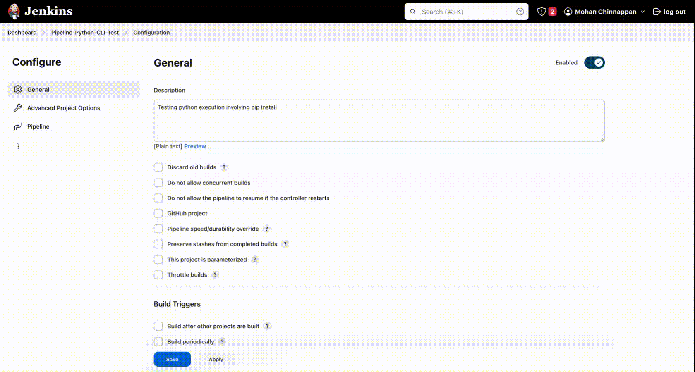

# Jenkins

```
The best part is no part.
Physics is the law and everything else is a recommendation.
The machine that makes the machine!

- Elon Musk
```


## Topics
- [Use Case](#usecase)
- [Setting up Jenkins Master](#master)
- [Setting up Worker Nodes](#worker)

---


<a name='usecase'></a>
## Use Case

- Setup Jenkins Master and Worker Nodes to run SFDX  for the given org
- Make use of JWT flow to login to a Salesforce org 




<a name='master'></a>
## Setting up Jenkins Master

```
docker network create jenkins
```
```
37d113c8d79cd12a209822f0ccb12be7058b9c6ccdc62e2b298725537edd703d
```

```
docker network ls
NETWORK ID     NAME      DRIVER    SCOPE
f8ca68549edb   bridge    bridge    local
145498352d20   host      host      local
37d113c8d79c   jenkins   bridge    local
3bdfaf921867   none      null      local
```

```
docker run --name jenkins-docker --rm --detach \
  --privileged --network jenkins --network-alias docker \
  --env DOCKER_TLS_CERTDIR=/certs \
  --volume jenkins-docker-certs:/certs/client \
  --volume jenkins-data:/var/jenkins_home \
  --publish 2376:2376 \
  docker:dind --storage-driver overlay2
```
```
Unable to find image 'docker:dind' locally
dind: Pulling from library/docker
63b65145d645: Pull complete 
67fecbccebe0: Pull complete 
2b3fda0e4f2a: Pull complete 
30dc96e58339: Pull complete 
8c007c9e333b: Pull complete 
c31b9f3137a1: Pull complete 
782206789a08: Pull complete 
e415889ffe25: Pull complete 
55134767123a: Pull complete 
36af3abb7351: Pull complete 
9e414f2e72f2: Pull complete 
4ccabe0725ae: Pull complete 
ca215d26ccb7: Pull complete 
Digest: sha256:e4d776dd1e0580dfb670559d887300aa08b53b8a59f5df2d4eaace936ef4d0e9
Status: Downloaded newer image for docker:dind
58b1537f513652de9951efd03766a2c9ad853e45341a18584f39565bb4beae14
```

``` 
cat Dockerfile
```
```

FROM jenkins/jenkins:2.387.1
USER root
RUN apt-get update && apt-get install -y lsb-release
RUN curl -fsSLo /usr/share/keyrings/docker-archive-keyring.asc \
  https://download.docker.com/linux/debian/gpg
RUN echo "deb [arch=$(dpkg --print-architecture) \
  signed-by=/usr/share/keyrings/docker-archive-keyring.asc] \
  https://download.docker.com/linux/debian \
  $(lsb_release -cs) stable" > /etc/apt/sources.list.d/docker.list
RUN apt-get update && apt-get install -y docker-ce-cli
USER jenkins
RUN jenkins-plugin-cli --plugins "blueocean docker-workflow"
```

```
docker build -t myjenkins-blueocean:2.387.1-1 .
[+] Building 42.9s (10/10) FINISHED                                                                                                                    
 => [internal] load build definition from Dockerfile                                                                                              0.0s
 => => transferring dockerfile: 602B                                                                                                              0.0s
 => [internal] load .dockerignore                                                                                                                 0.0s
 => => transferring context: 2B                                                                                                                   0.0s
 => [internal] load metadata for docker.io/jenkins/jenkins:2.387.1                                                                                1.0s
 => [1/6] FROM docker.io/jenkins/jenkins:2.387.1@sha256:0944e18261a6547e89b700cec432949281a7419a6165a3906e78c97efde3bc86                         11.1s
 => => resolve docker.io/jenkins/jenkins:2.387.1@sha256:0944e18261a6547e89b700cec432949281a7419a6165a3906e78c97efde3bc86                          0.0s
 => => sha256:a56533012712c1db623da3e5e9c2d0276301c82db0a2e7a82debfb57e5d916f2 8.93MB / 8.93MB                                                    0.3s
 => => sha256:c09d5e9e1188f3fff7a4f8c3c7c330fde5184cba1c6f0c92526b8b7bd0ac7c26 51.63MB / 51.63MB                                                  3.4s
 => => sha256:0944e18261a6547e89b700cec432949281a7419a6165a3906e78c97efde3bc86 2.36kB / 2.36kB                                                    0.0s
 => => sha256:32fb02163b6bb519a30f909008e852354dae10bdfd6b34190dbdfe8f15403ea0 55.05MB / 55.05MB                                                  2.6s
 => => sha256:005fcb5c3017ef120d0d9d8d8925e9248ff6e2cf2b5e18b527b01459c7b2b3f4 2.77kB / 2.77kB                                                    0.0s
 => => sha256:d5ed2ceef0ec08e9044ebb39812f211d64dbcdfce775cc6b0460ca289193416f 13.13kB / 13.13kB                                                  0.0s
 => => sha256:7936e107ffe73b406a0d02edf9bb02b983534d803bb06fd03dc38dac4b6cfe2a 1.24kB / 1.24kB                                                    0.4s
 => => sha256:3ca683058265b99b65bbc69b9e8fa4c46e830db35aad614706200e6cf0c30d8a 189B / 189B                                                        0.5s
 => => sha256:c2ecd304b4b84ef6154bd85e13360f0b015e39057a329698617ce0a53ed6cf32 98.12MB / 98.12MB                                                  4.7s
 => => extracting sha256:32fb02163b6bb519a30f909008e852354dae10bdfd6b34190dbdfe8f15403ea0                                                         2.4s
 => => sha256:be3512d810d65f00f28af0885e2f30833263ee061528e20c7fee21664f1572b8 202B / 202B                                                        2.8s
 => => sha256:56b37d7c2a7a3c93fd013cb1ad5652f8cea3910ecc0274d73064bba27ab57864 5.84MB / 5.84MB                                                    3.4s
 => => sha256:99ed1e723e52507ce2d615e1682d673c3ffcec5f5b68c266db70d829ef4be208 76.93MB / 76.93MB                                                  5.8s
 => => sha256:256db5485b1399ecbd58c2558388fc9a4ff1caaaeacbdfe23127c7f13b1ee98b 1.93kB / 1.93kB                                                    3.5s
 => => sha256:ee8c7eaf5e6bd8c45e503756da48e80137def6765017148ce9f2af66ce97244b 1.17kB / 1.17kB                                                    3.7s
 => => sha256:509f66c2f3174642f0eb3e3b2e8a70da698f613042ec65f525c476afe0b6b7d5 374B / 374B                                                        3.9s
 => => sha256:820296a845d636be13276fdf3bdae7fdf2ac00d401182632d1ab450e26353674 271B / 271B                                                        4.1s
 => => extracting sha256:c09d5e9e1188f3fff7a4f8c3c7c330fde5184cba1c6f0c92526b8b7bd0ac7c26                                                         2.0s
 => => extracting sha256:a56533012712c1db623da3e5e9c2d0276301c82db0a2e7a82debfb57e5d916f2                                                         0.2s
 => => extracting sha256:7936e107ffe73b406a0d02edf9bb02b983534d803bb06fd03dc38dac4b6cfe2a                                                         0.0s
 => => extracting sha256:3ca683058265b99b65bbc69b9e8fa4c46e830db35aad614706200e6cf0c30d8a                                                         0.0s
 => => extracting sha256:c2ecd304b4b84ef6154bd85e13360f0b015e39057a329698617ce0a53ed6cf32                                                         0.6s
 => => extracting sha256:be3512d810d65f00f28af0885e2f30833263ee061528e20c7fee21664f1572b8                                                         0.0s
 => => extracting sha256:56b37d7c2a7a3c93fd013cb1ad5652f8cea3910ecc0274d73064bba27ab57864                                                         0.1s
 => => extracting sha256:99ed1e723e52507ce2d615e1682d673c3ffcec5f5b68c266db70d829ef4be208                                                         1.6s
 => => extracting sha256:256db5485b1399ecbd58c2558388fc9a4ff1caaaeacbdfe23127c7f13b1ee98b                                                         0.0s
 => => extracting sha256:ee8c7eaf5e6bd8c45e503756da48e80137def6765017148ce9f2af66ce97244b                                                         0.0s
 => => extracting sha256:509f66c2f3174642f0eb3e3b2e8a70da698f613042ec65f525c476afe0b6b7d5                                                         0.0s
 => => extracting sha256:820296a845d636be13276fdf3bdae7fdf2ac00d401182632d1ab450e26353674                                                         0.0s
 => [2/6] RUN apt-get update && apt-get install -y lsb-release                                                                                    6.7s
 => [3/6] RUN curl -fsSLo /usr/share/keyrings/docker-archive-keyring.asc   https://download.docker.com/linux/debian/gpg                           0.7s
 => [4/6] RUN echo "deb [arch=$(dpkg --print-architecture)   signed-by=/usr/share/keyrings/docker-archive-keyring.asc]   https://download.docker  0.2s
 => [5/6] RUN apt-get update && apt-get install -y docker-ce-cli                                                                                  8.9s
 => [6/6] RUN jenkins-plugin-cli --plugins "blueocean docker-workflow"                                                                           13.5s
 => exporting to image                                                                                                                            0.8s
 => => exporting layers                                                                                                                           0.8s
 => => writing image sha256:fd428091db2d8149ed7ce13d7fe3ccd7d412e87a121f4a6850ec0cfd0ed91ce2                                                      0.0s
 => => naming to docker.io/library/myjenkins-blueocean:2.387.1-1                                                                                  0.0s

Use 'docker scan' to run Snyk tests against images to find vulnerabilities and learn how to fix them
```

```
docker container ls
```

```
CONTAINER ID   IMAGE         COMMAND                  CREATED         STATUS         PORTS                              NAMES
58b1537f5136   docker:dind   "dockerd-entrypoint.…"   2 minutes ago   Up 2 minutes   2375/tcp, 0.0.0.0:2376->2376/tcp   jenkins-docker
```

```
docker run --name jenkins-blueocean --restart=on-failure --detach \
  --network jenkins --env DOCKER_HOST=tcp://docker:2376 \
  --env DOCKER_CERT_PATH=/certs/client --env DOCKER_TLS_VERIFY=1 \
  --publish 8080:8080 --publish 50000:50000 \
  --volume jenkins-data:/var/jenkins_home \
  --volume jenkins-docker-certs:/certs/client:ro \
  myjenkins-blueocean:2.387.1-1
```

```
docker ps
```

```
CONTAINER ID   IMAGE                           COMMAND                  CREATED         STATUS         PORTS                                              NAMES
c5ea234eee86   myjenkins-blueocean:2.387.1-1   "/usr/bin/tini -- /u…"   2 minutes ago   Up 2 minutes   0.0.0.0:8080->8080/tcp, 0.0.0.0:50000->50000/tcp   jenkins-blueocean
58b1537f5136   docker:dind                     "dockerd-entrypoint.…"   4 minutes ago   Up 4 minutes   2375/tcp, 0.0.0.0:2376->2376/tcp                   jenkins-docker
```

## Getting initialAdminPassword
```
docker exec c5ea234eee86  cat /var/jenkins_home/secrets/initialAdminPassword
```
```
600755197d9642a08d03aa294fb82344
```

## bash into docker container
```
docker exec -it c5ea234eee86   bash
```

```
jenkins@c5ea234eee86:~$ ls -l
total 112
-rw-r--r--   1 jenkins jenkins  1663 Mar 12 13:29 config.xml
-rw-r--r--   1 jenkins jenkins  5316 Mar 12 13:28 copy_reference_file.log
-rw-r--r--   1 jenkins jenkins   156 Mar 12 13:28 hudson.model.UpdateCenter.xml
-rw-r--r--   1 jenkins jenkins   370 Mar 12 13:28 hudson.plugins.git.GitTool.xml
-rw-------   1 jenkins jenkins  1680 Mar 12 13:28 identity.key.enc
-rw-r--r--   1 jenkins jenkins     7 Mar 12 13:34 jenkins.install.InstallUtil.lastExecVersion
-rw-r--r--   1 jenkins jenkins     7 Mar 12 13:34 jenkins.install.UpgradeWizard.state
-rw-r--r--   1 jenkins jenkins   179 Mar 12 13:34 jenkins.model.JenkinsLocationConfiguration.xml
-rw-r--r--   1 jenkins jenkins   171 Mar 12 13:28 jenkins.telemetry.Correlator.xml
drwxr-xr-x   3 jenkins jenkins  4096 Mar 12 13:51 jobs
drwxr-xr-x   4 jenkins jenkins  4096 Mar 12 14:33 logs
-rw-r--r--   1 jenkins jenkins   907 Mar 12 13:28 nodeMonitors.xml
drwxr-xr-x   2 jenkins jenkins  4096 Mar 12 13:28 nodes
drwxr-xr-x 114 jenkins jenkins 24576 Mar 12 13:33 plugins
-rw-r--r--   1 jenkins jenkins   129 Mar 12 13:54 queue.xml
-rw-r--r--   1 jenkins jenkins    64 Mar 12 13:28 secret.key
-rw-r--r--   1 jenkins jenkins     0 Mar 12 13:28 secret.key.not-so-secret
drwx------   2 jenkins jenkins  4096 Mar 12 13:53 secrets
drwxr-xr-x   2 jenkins jenkins  4096 Mar 12 13:33 updates
drwxr-xr-x   2 jenkins jenkins  4096 Mar 12 13:28 userContent
drwxr-xr-x   3 jenkins jenkins  4096 Mar 12 13:33 users
drwxr-xr-x  11 jenkins jenkins  4096 Mar 12 13:28 war
drwxr-xr-x   3 jenkins jenkins  4096 Mar 12 13:53 workspace
jenkins@c5ea234eee86:~$ pwd
/var/jenkins_home
jenkins@c5ea234eee86:~$ python3
Python 3.9.2 (default, Feb 28 2021, 17:03:44) 
[GCC 10.2.1 20210110] on linux
Type "help", "copyright", "credits" or "license" for more information.
>>> exit()
```


## socat container 
- [socat](https://hub.docker.com/r/alpine/socat/) provides proxy the connection between Jenkins master container and localhost


- Steps


1) If you are running jenkins as container, in the docker host uri field you have to enter unix or tcp address of the docker host. But since you are running jenkins as container, the container can't reach docker host unix port

2) So we have to run another container that can mediate between docker host and jenkins container. It will publish docker host's unix port as its tcp port. Follow the instructions to create socat container https://hub.docker.com/r/alpine/socat/

3)After the creating socat container, you can go back the docker configuration in jenkins and enter tcp://socat-container-ip:2375

4) Test Connection should succeed now

```
docker run -d --restart=always -p 127.0.0.1:2400:2375 --network jenkins -v /var/run/docker.sock:/var/run/docker.sock alpine/socat tcp-listen:2375,fork,reuseaddr unix-connect:/var/run/docker.sock
```
```
b643f2a82b31e1f2ac9e5261badbb65d13447b94a92eaa0bb34202a9148f39b4


```

```
 docker container ls
```
```
CONTAINER ID   IMAGE                           COMMAND                  CREATED              STATUS              PORTS                                              NAMES
b643f2a82b31   alpine/socat                    "socat tcp-listen:23…"   About a minute ago   Up About a minute   127.0.0.1:2400->2375/tcp                           silly_hopper
c5ea234eee86   myjenkins-blueocean:2.387.1-1   "/usr/bin/tini -- /u…"   3 hours ago          Up 12 minutes       0.0.0.0:8080->8080/tcp, 0.0.0.0:50000->50000/tcp   jenkins-blueocean
58b1537f5136   docker:dind                     "dockerd-entrypoint.…"   3 hours ago          Up 3 hours          2375/tcp, 0.0.0.0:2376->2376/tcp                   jenkins-docker


```

```
docker inspect b643f2a82b31e1f2ac9e5261badbb65d13447b94a92eaa0bb34202a9148f39b4 | grep IPAddress
```

```
"SecondaryIPAddresses": null,
            "IPAddress": "",
                    "IPAddress": "172.18.0.4",
```

```

docker ps
```

```
CONTAINER ID   IMAGE                           COMMAND                  CREATED         STATUS          PORTS                                              NAMES
b643f2a82b31   alpine/socat                    "socat tcp-listen:23…"   2 minutes ago   Up 2 minutes    127.0.0.1:2400->2375/tcp                           silly_hopper
c5ea234eee86   myjenkins-blueocean:2.387.1-1   "/usr/bin/tini -- /u…"   3 hours ago     Up 13 minutes   0.0.0.0:8080->8080/tcp, 0.0.0.0:50000->50000/tcp   jenkins-blueocean
58b1537f5136   docker:dind                     "dockerd-entrypoint.…"   3 hours ago     Up 3 hours      2375/tcp, 0.0.0.0:2376->2376/tcp                   jenkins-docker
```

### Inspect socat
```

docker inspect  silly_hopper 
```

```json
[
    {
        "Id": "b643f2a82b31e1f2ac9e5261badbb65d13447b94a92eaa0bb34202a9148f39b4",
        "Created": "2023-03-12T16:08:27.933374909Z",
        "Path": "socat",
        "Args": [
            "tcp-listen:2375,fork,reuseaddr",
            "unix-connect:/var/run/docker.sock"
        ],
        "State": {
            "Status": "running",
            "Running": true,
            "Paused": false,
            "Restarting": false,
            "OOMKilled": false,
            "Dead": false,
            "Pid": 8609,
            "ExitCode": 0,
            "Error": "",
            "StartedAt": "2023-03-12T16:08:28.362760818Z",
            "FinishedAt": "0001-01-01T00:00:00Z"
        },
        "Image": "sha256:f0bbf8a4f6a0e25e06fe69c284e6e0494948e8de21ef933d72732b7858da3110",
        "ResolvConfPath": "/var/lib/docker/containers/b643f2a82b31e1f2ac9e5261badbb65d13447b94a92eaa0bb34202a9148f39b4/resolv.conf",
        "HostnamePath": "/var/lib/docker/containers/b643f2a82b31e1f2ac9e5261badbb65d13447b94a92eaa0bb34202a9148f39b4/hostname",
        "HostsPath": "/var/lib/docker/containers/b643f2a82b31e1f2ac9e5261badbb65d13447b94a92eaa0bb34202a9148f39b4/hosts",
        "LogPath": "/var/lib/docker/containers/b643f2a82b31e1f2ac9e5261badbb65d13447b94a92eaa0bb34202a9148f39b4/b643f2a82b31e1f2ac9e5261badbb65d13447b94a92eaa0bb34202a9148f39b4-json.log",
        "Name": "/silly_hopper",
        "RestartCount": 0,
        "Driver": "overlay2",
        "Platform": "linux",
        "MountLabel": "",
        "ProcessLabel": "",
        "AppArmorProfile": "",
        "ExecIDs": null,
        "HostConfig": {
            "Binds": [
                "/var/run/docker.sock:/var/run/docker.sock"
            ],
            "ContainerIDFile": "",
            "LogConfig": {
                "Type": "json-file",
                "Config": {}
            },
            "NetworkMode": "jenkins",
            "PortBindings": {
                "2375/tcp": [
                    {
                        "HostIp": "127.0.0.1",
                        "HostPort": "2400"
                    }
                ]
            },
            "RestartPolicy": {
                "Name": "always",
                "MaximumRetryCount": 0
            },
            "AutoRemove": false,
            "VolumeDriver": "",
            "VolumesFrom": null,
            "CapAdd": null,
            "CapDrop": null,
            "CgroupnsMode": "private",
            "Dns": [],
            "DnsOptions": [],
            "DnsSearch": [],
            "ExtraHosts": null,
            "GroupAdd": null,
            "IpcMode": "private",
            "Cgroup": "",
            "Links": null,
            "OomScoreAdj": 0,
            "PidMode": "",
            "Privileged": false,
            "PublishAllPorts": false,
            "ReadonlyRootfs": false,
            "SecurityOpt": null,
            "UTSMode": "",
            "UsernsMode": "",
            "ShmSize": 67108864,
            "Runtime": "runc",
            "ConsoleSize": [
                0,
                0
            ],
            "Isolation": "",
            "CpuShares": 0,
            "Memory": 0,
            "NanoCpus": 0,
            "CgroupParent": "",
            "BlkioWeight": 0,
            "BlkioWeightDevice": [],
            "BlkioDeviceReadBps": null,
            "BlkioDeviceWriteBps": null,
            "BlkioDeviceReadIOps": null,
            "BlkioDeviceWriteIOps": null,
            "CpuPeriod": 0,
            "CpuQuota": 0,
            "CpuRealtimePeriod": 0,
            "CpuRealtimeRuntime": 0,
            "CpusetCpus": "",
            "CpusetMems": "",
            "Devices": [],
            "DeviceCgroupRules": null,
            "DeviceRequests": null,
            "KernelMemory": 0,
            "KernelMemoryTCP": 0,
            "MemoryReservation": 0,
            "MemorySwap": 0,
            "MemorySwappiness": null,
            "OomKillDisable": null,
            "PidsLimit": null,
            "Ulimits": null,
            "CpuCount": 0,
            "CpuPercent": 0,
            "IOMaximumIOps": 0,
            "IOMaximumBandwidth": 0,
            "MaskedPaths": [
                "/proc/asound",
                "/proc/acpi",
                "/proc/kcore",
                "/proc/keys",
                "/proc/latency_stats",
                "/proc/timer_list",
                "/proc/timer_stats",
                "/proc/sched_debug",
                "/proc/scsi",
                "/sys/firmware"
            ],
            "ReadonlyPaths": [
                "/proc/bus",
                "/proc/fs",
                "/proc/irq",
                "/proc/sys",
                "/proc/sysrq-trigger"
            ]
        },
        "GraphDriver": {
            "Data": {
                "LowerDir": "/var/lib/docker/overlay2/ac59c4bb642c204d52676ea5a3f38ab123aa55c28e7c4d32885c29798685bf6c-init/diff:/var/lib/docker/overlay2/33c335c0d0c0267bc8a0de4b181fa6a67212ef993d5b23cc2d932eccd87da979/diff:/var/lib/docker/overlay2/0b76f458f2092bfa7d73629e242e320299fb159448bf52a18647959f1637387c/diff",
                "MergedDir": "/var/lib/docker/overlay2/ac59c4bb642c204d52676ea5a3f38ab123aa55c28e7c4d32885c29798685bf6c/merged",
                "UpperDir": "/var/lib/docker/overlay2/ac59c4bb642c204d52676ea5a3f38ab123aa55c28e7c4d32885c29798685bf6c/diff",
                "WorkDir": "/var/lib/docker/overlay2/ac59c4bb642c204d52676ea5a3f38ab123aa55c28e7c4d32885c29798685bf6c/work"
            },
            "Name": "overlay2"
        },
        "Mounts": [
            {
                "Type": "bind",
                "Source": "/var/run/docker.sock",
                "Destination": "/var/run/docker.sock",
                "Mode": "",
                "RW": true,
                "Propagation": "rprivate"
            }
        ],
        "Config": {
            "Hostname": "b643f2a82b31",
            "Domainname": "",
            "User": "",
            "AttachStdin": false,
            "AttachStdout": false,
            "AttachStderr": false,
            "ExposedPorts": {
                "2375/tcp": {}
            },
            "Tty": false,
            "OpenStdin": false,
            "StdinOnce": false,
            "Env": [
                "PATH=/usr/local/sbin:/usr/local/bin:/usr/sbin:/usr/bin:/sbin:/bin"
            ],
            "Cmd": [
                "tcp-listen:2375,fork,reuseaddr",
                "unix-connect:/var/run/docker.sock"
            ],
            "Image": "alpine/socat",
            "Volumes": null,
            "WorkingDir": "",
            "Entrypoint": [
                "socat"
            ],
            "OnBuild": null,
            "Labels": {}
        },
        "NetworkSettings": {
            "Bridge": "",
            "SandboxID": "a818d2616cbaced18798c777a02b95d53c16765842f392151d39272ed0e4be37",
            "HairpinMode": false,
            "LinkLocalIPv6Address": "",
            "LinkLocalIPv6PrefixLen": 0,
            "Ports": {
                "2375/tcp": [
                    {
                        "HostIp": "127.0.0.1",
                        "HostPort": "2400"
                    }
                ]
            },
            "SandboxKey": "/var/run/docker/netns/a818d2616cba",
            "SecondaryIPAddresses": null,
            "SecondaryIPv6Addresses": null,
            "EndpointID": "",
            "Gateway": "",
            "GlobalIPv6Address": "",
            "GlobalIPv6PrefixLen": 0,
            "IPAddress": "",
            "IPPrefixLen": 0,
            "IPv6Gateway": "",
            "MacAddress": "",
            "Networks": {
                "jenkins": {
                    "IPAMConfig": null,
                    "Links": null,
                    "Aliases": [
                        "b643f2a82b31"
                    ],
                    "NetworkID": "37d113c8d79cd12a209822f0ccb12be7058b9c6ccdc62e2b298725537edd703d",
                    "EndpointID": "08bc7021dd48b6993f51b08a0d0e9333276c64311b4487361b02c476a3a1e3f9",
                    "Gateway": "172.18.0.1",
                    "IPAddress": "172.18.0.4",
                    "IPPrefixLen": 16,
                    "IPv6Gateway": "",
                    "GlobalIPv6Address": "",
                    "GlobalIPv6PrefixLen": 0,
                    "MacAddress": "02:42:ac:12:00:04",
                    "DriverOpts": null
                }
            }
        }
    }
]
```
 

<a name='worker'></a>

## Worker node setup
### Build Docker image

```
cat Dockerfile
```

```dockerfile
FROM jenkins/agent:alpine-jdk11
# author: mchinnappan

USER root
# install python3
RUN apk add python3
RUN apk add py3-pip

# install vim
RUN apk add  vim


# install nodejs and sfdx cli
RUN apk add nodejs 
RUN apk add npm 
RUN apk add yarn 


ARG SALESFORCE_CLI_VERSION=latest
RUN npm install --global sfdx-cli@${SALESFORCE_CLI_VERSION}


RUN apk add jq 

USER jenkins

# install required plugins
RUN  echo 'y' |  sfdx plugins:install sfdx-mohanc-plugins
RUN  echo 'y' |  sfdx plugins:install sfdx-git-delta


```

 

```
docker build -t docker-agent-sfdx .
```

```
[+] Building 160.6s (15/15) FINISHED                                                                                                                                                      
 => [internal] load build definition from Dockerfile                                                                                                                                 0.0s
 => => transferring dockerfile: 557B                                                                                                                                                 0.0s
 => [internal] load .dockerignore                                                                                                                                                    0.0s
 => => transferring context: 2B                                                                                                                                                      0.0s
 => [internal] load metadata for docker.io/jenkins/agent:alpine-jdk11                                                                                                                0.9s
 => [ 1/11] FROM docker.io/jenkins/agent:alpine-jdk11@sha256:fdf4d5e79b3645be5779130bf3239cf9344b5b1929d538b7d2980be8868550f6                                                        0.0s
 => CACHED [ 2/11] RUN apk add python3                                                                                                                                               0.0s
 => CACHED [ 3/11] RUN apk add py3-pip                                                                                                                                               0.0s
 => [ 4/11] RUN apk add  vim                                                                                                                                                         1.4s
 => [ 5/11] RUN apk add nodejs                                                                                                                                                       1.3s
 => [ 6/11] RUN apk add npm                                                                                                                                                          1.0s 
 => [ 7/11] RUN apk add yarn                                                                                                                                                         0.8s 
 => [ 8/11] RUN npm install --global sfdx-cli@latest                                                                                                                                30.6s 
 => [ 9/11] RUN apk add jq                                                                                                                                                           0.9s 
 => [10/11] RUN  echo 'y' |  sfdx plugins:install sfdx-mohanc-plugins                                                                                                               63.6s 
 => [11/11] RUN  echo 'y' |  sfdx plugins:install sfdx-git-delta                                                                                                                    38.8s 
 => exporting to image                                                                                                                                                              21.2s 
 => => exporting layers                                                                                                                                                             21.1s 
 => => writing image sha256:5d988bfa62b447ffe80a0421417b9f6329656f4d78722ea65969d32cdc13b5d4                                                                                         0.0s 
 => => naming to docker.io/library/docker-agent-sfdx 
 ```

 ## run the image
 ```
 docker run -it --entrypoint bash   --name  docker-agent-sfdx-app docker-agent-sfdx 
```
```
 17ded65a422c:~$ sfdx plugins
sfdx-git-delta 5.13.3
sfdx-mohanc-plugins 0.0.343

 ```

 ```
 exit
 ```

 ## Publish this image : 5d988bfa62b447ffe80a0421417b9f6329656f4d78722ea65969d32cdc13b5d4   

 ```
 docker tag 5d988bfa62b447ffe80a0421417b9f6329656f4d78722ea65969d32cdc13b5d4    mohanchinnappan/mc-sfdx 
```
```
docker images
```

```
REPOSITORY                       TAG            IMAGE ID       CREATED          SIZE
mohanchinnappan/mc-sfdx          latest         5d988bfa62b4   24 minutes ago   1.51GB
myjenkins-blueocean              2.387.1-1      fd428091db2d   4 hours ago      805MB
docker                           dind           c365741dcfc2   4 days ago       311MB
alpine/socat                     latest         f0bbf8a4f6a0   2 weeks ago      8.5MB
```

### Push
```
docker push   mohanchinnappan/mc-sfdx 
```
```
Using default tag: latest
The push refers to repository [docker.io/mohanchinnappan/mc-sfdx]
3c3548e6efa9: Pushed 
c991a1b7df1a: Pushed 
018486e93789: Pushed 
96d7750030cc: Pushed 
17ec9d53bd65: Pushed 
cc4f6cce9ed0: Pushed 
e5fc35b10359: Pushed 
26cde4efb06b: Pushed 
a91d2cf08b0f: Pushed 
0970af15e418: Pushed 
5f70bf18a086: Mounted from mohanchinnappan/jupyter-rust 
639d13e0e024: Mounted from jenkins/agent 
b910852e976b: Mounted from jenkins/agent 
bc4c636cd02f: Mounted from jenkins/agent 
99b5df13238c: Mounted from jenkins/agent 
10009e9661e3: Mounted from jenkins/agent 
abc8eda4da3a: Mounted from jenkins/agent 
591e5beaaae8: Mounted from jenkins/agent 
a34e3a797aad: Mounted from jenkins/agent 
7cd52847ad77: Mounted from jenkins/agent 
latest: digest: sha256:cf4b1d93c8833298cec8fa5897d22ede339b53193a606c69448ac8ee76a0c90b size: 4532
```

### Published Docker Image
- [mohanchinnappan/mc-sfdxDocker](https://hub.docker.com/repository/docker/mohanchinnappan/mc-sfdx/general)


## Run it
```
docker run -it --entrypoint bash    mohanchinnappan/mc-sfdx  


```

```
9900abaf79d2:~$ sfdx plugins
sfdx-git-delta 5.13.3
sfdx-mohanc-plugins 0.0.343

python3 
Python 3.10.10 (main, Feb  9 2023, 02:08:14) [GCC 12.2.1 20220924] on linux
Type "help", "copyright", "credits" or "license" for more information.
>>> exit()

9900abaf79d2:~$ pwd
/home/jenkins


9900abaf79d2:~$ vim
9900abaf79d2:~$ java --version
openjdk 11.0.18 2023-01-17
OpenJDK Runtime Environment Temurin-11.0.18+10 (build 11.0.18+10)
OpenJDK 64-Bit Server VM Temurin-11.0.18+10 (build 11.0.18+10, mixed mode)


```


```
docker ps       
```

```
CONTAINER ID   IMAGE                           COMMAND                  CREATED          STATUS          PORTS                                              NAMES
bd6b56f8666f   mohanchinnappan/mc-sfdx         "bash"                   36 seconds ago   Up 35 seconds                                                      reverent_beaver
b643f2a82b31   alpine/socat                    "socat tcp-listen:23…"   2 hours ago      Up 2 hours      127.0.0.1:2400->2375/tcp                           silly_hopper
c5ea234eee86   myjenkins-blueocean:2.387.1-1   "/usr/bin/tini -- /u…"   5 hours ago      Up 2 hours      0.0.0.0:8080->8080/tcp, 0.0.0.0:50000->50000/tcp   jenkins-blueocean
58b1537f5136   docker:dind                     "dockerd-entrypoint.…"   5 hours ago      Up 5 hours      2375/tcp, 0.0.0.0:2376->2376/tcp                   jenkins-docker
```


## Running build on this 


```
 Started by user Mohan Chinnappan
Running as SYSTEM
Building remotely on docker-node-sfdx-00006mp66sdok on docker (docker-node-sfdx) in workspace /home/jenkins/workspace/HelloWorldPython
The recommended git tool is: NONE
No credentials specified
Cloning the remote Git repository
Cloning repository https://github.com/mohan-chinnappan-n/jenkins-cicd
 > git init /home/jenkins/workspace/HelloWorldPython # timeout=10
Fetching upstream changes from https://github.com/mohan-chinnappan-n/jenkins-cicd
 > git --version # timeout=10
 > git --version # 'git version 2.38.4'
 > git fetch --tags --force --progress -- https://github.com/mohan-chinnappan-n/jenkins-cicd +refs/heads/*:refs/remotes/origin/* # timeout=10
 > git config remote.origin.url https://github.com/mohan-chinnappan-n/jenkins-cicd # timeout=10
 > git config --add remote.origin.fetch +refs/heads/*:refs/remotes/origin/* # timeout=10
Avoid second fetch
 > git rev-parse refs/remotes/origin/main^{commit} # timeout=10
Checking out Revision b34f09b31c3cc64d716a6e9ff613e7b71de5fe4c (refs/remotes/origin/main)
 > git config core.sparsecheckout # timeout=10
 > git checkout -f b34f09b31c3cc64d716a6e9ff613e7b71de5fe4c # timeout=10
Commit message: "init"
 > git rev-list --no-walk b34f09b31c3cc64d716a6e9ff613e7b71de5fe4c # timeout=10
[HelloWorldPython] $ /bin/sh -xe /tmp/jenkins15310274698032643005.sh
+ python3 py/hw.py
Hello World!
Finished: SUCCESS

```


## sfdx XML project

```
Started by user Mohan Chinnappan
Running as SYSTEM
Building remotely on docker-node-sfdx-00006t9wamykj on docker (docker-node-sfdx) in workspace /home/jenkins/workspace/sfdc-project-xml
The recommended git tool is: NONE
No credentials specified
Cloning the remote Git repository
Cloning repository https://github.com/mohan-chinnappan-n/jenkins-cicd
 > git init /home/jenkins/workspace/sfdc-project-xml # timeout=10
Fetching upstream changes from https://github.com/mohan-chinnappan-n/jenkins-cicd
 > git --version # timeout=10
 > git --version # 'git version 2.38.4'
 > git fetch --tags --force --progress -- https://github.com/mohan-chinnappan-n/jenkins-cicd +refs/heads/*:refs/remotes/origin/* # timeout=10
 > git config remote.origin.url https://github.com/mohan-chinnappan-n/jenkins-cicd # timeout=10
 > git config --add remote.origin.fetch +refs/heads/*:refs/remotes/origin/* # timeout=10
Avoid second fetch
 > git rev-parse refs/remotes/origin/main^{commit} # timeout=10
Checking out Revision 12763086762b99f46569a109d06c03a4e8cfd65d (refs/remotes/origin/main)
 > git config core.sparsecheckout # timeout=10
 > git checkout -f 12763086762b99f46569a109d06c03a4e8cfd65d # timeout=10
Commit message: "xml added"
First time build. Skipping changelog.
[sfdc-project-xml] $ /bin/sh -xe /tmp/jenkins13699243142254465595.sh
+ sfdx mohanc:xml:transform -i xml/Admin.profile-meta.xml -m Profile
=== Writing the output into file : xml/Admin.profile-meta.xml.html ===
Finished: SUCCESS

```

### Pipeline 

 


|Field|Format of valid values|
|---|---|
|Min|0-59|
|Hour|	0-23|
|Day of the month|	1-31|
|Month|	1-12 (or JAN to DEC)|
|Day of the week|	0-6 (or SUN to SAT; or 7 for Sunday)|


#### Script 

```groovy
pipeline {
    agent { 
        node { label 'docker-node-sfdx' }
    }
    triggers {
            pollSCM '*/5 * * * *'
    }

     environment { 
        SF_USERNAME = 'mohan.chinnappan.n.sel2@gmail.com'
        SF_INSTANCE_URL = 'https://login.salesforce.com'
        SF_CONSUMER_KEY = '3MVG9vp1McGXQBYGcnDR0UfAip.JjJVJUbccWajKPlMgbFIV.C9g3FdmKaKfOYlrJ6iY4QUQKnC1F8dzu8YAz'
        SERVER_KEY_CREDENTALS_ID='cb689b37-ff89-490c-87b0-da6983e03854'
         
    }

     
    stages {


        stage('Prepare') {

            steps {
                withCredentials([file(credentialsId: SERVER_KEY_CREDENTALS_ID, variable: 'server_key_file')]) {

                echo "pip install"
                sh '''
                    cd py
                    pip3 install -r requirements.txt
                    echo ${SF_USERNAME}
                    sfdx force:auth:jwt:grant -u  ${SF_USERNAME} -f ${server_key_file} -i ${SF_CONSUMER_KEY} 
                    sfdx force:data:soql:query --query  "SELECT Id, Name, Account.Name FROM Contact" -u  ${SF_USERNAME} 

                    sfdx mohanc:org:viz -u ${SF_USERNAME} 
                    
                    wc -l Org.json
                '''
             }
            }
        }

        stage('Test') {
            steps {
                echo "Testing it"
                sh '''

                cd py
                python3 double.py double 27
                
                '''
            }
        }
        stage('Deploy') {
            steps {
                echo 'Deploy....'
                sh '''
                echo "Deploying..."
                '''
            }
        }
    }
}


```
#### Setup


#### Demo


```
Started by user Mohan Chinnappan
Obtained py/Jenkinsfile from git https://github.com/mohan-chinnappan-n/jenkins-cicd
[Pipeline] Start of Pipeline
[Pipeline] node
Still waiting to schedule task
‘Jenkins’ doesn’t have label ‘docker-node-sfdx’
Running on docker-node-sfdx-0000ejftdsk7i on docker in /home/jenkins/workspace/Pipeline-Python-CLI-Test
[Pipeline] {
[Pipeline] stage
[Pipeline] { (Declarative: Checkout SCM)
[Pipeline] checkout
The recommended git tool is: git
No credentials specified
Cloning the remote Git repository
Cloning repository https://github.com/mohan-chinnappan-n/jenkins-cicd
 > git init /home/jenkins/workspace/Pipeline-Python-CLI-Test # timeout=10
Fetching upstream changes from https://github.com/mohan-chinnappan-n/jenkins-cicd
 > git --version # timeout=10
 > git --version # 'git version 2.38.4'
 > git fetch --tags --force --progress -- https://github.com/mohan-chinnappan-n/jenkins-cicd +refs/heads/*:refs/remotes/origin/* # timeout=10
 > git config remote.origin.url https://github.com/mohan-chinnappan-n/jenkins-cicd # timeout=10
 > git config --add remote.origin.fetch +refs/heads/*:refs/remotes/origin/* # timeout=10
Avoid second fetch
Checking out Revision a53c0b8dfdfa5617d000ee07a6b8e2172370a933 (refs/remotes/origin/main)
Commit message: "py fire test added"
 > git rev-parse refs/remotes/origin/main^{commit} # timeout=10
 > git config core.sparsecheckout # timeout=10
 > git checkout -f a53c0b8dfdfa5617d000ee07a6b8e2172370a933 # timeout=10
 > git rev-list --no-walk a53c0b8dfdfa5617d000ee07a6b8e2172370a933 # timeout=10
[Pipeline] }
[Pipeline] // stage
[Pipeline] withEnv
[Pipeline] {
[Pipeline] withEnv
[Pipeline] {
[Pipeline] stage
[Pipeline] { (Prepare)
[Pipeline] withCredentials
Masking supported pattern matches of $server_key_file
[Pipeline] {
[Pipeline] echo
pip install
[Pipeline] sh
+ cd py
+ pip3 install -r requirements.txt
Defaulting to user installation because normal site-packages is not writeable
Collecting fire==0.5.0
  Downloading fire-0.5.0.tar.gz (88 kB)
     ━━━━━━━━━━━━━━━━━━━━━━━━━━━━━━━━━━━━━━━━ 88.3/88.3 kB 2.2 MB/s eta 0:00:00
  Preparing metadata (setup.py): started
  Preparing metadata (setup.py): finished with status 'done'
Requirement already satisfied: six in /usr/lib/python3.10/site-packages (from fire==0.5.0->-r requirements.txt (line 1)) (1.16.0)
Collecting termcolor
  Downloading termcolor-2.2.0-py3-none-any.whl (6.6 kB)
Installing collected packages: termcolor, fire
  DEPRECATION: fire is being installed using the legacy 'setup.py install' method, because it does not have a 'pyproject.toml' and the 'wheel' package is not installed. pip 23.1 will enforce this behaviour change. A possible replacement is to enable the '--use-pep517' option. Discussion can be found at https://github.com/pypa/pip/issues/8559
  Running setup.py install for fire: started
  Running setup.py install for fire: finished with status 'done'
Successfully installed fire-0.5.0 termcolor-2.2.0
+ echo mohan.chinnappan.n.sel2@gmail.com
mohan.chinnappan.n.sel2@gmail.com
+ sfdx force:auth:jwt:grant -u mohan.chinnappan.n.sel2@gmail.com -f **** -i 3MVG9vp1McGXQBYGcnDR0UfAip.JjJVJUbccWajKPlMgbFIV.C9g3FdmKaKfOYlrJ6iY4QUQKnC1F8dzu8YAz
Warning: The "-u" flag has been deprecated. Use "--username" instead.
Successfully authorized mohan.chinnappan.n.sel2@gmail.com with org ID 00D8W000004LymuUAC
+ sfdx force:data:soql:query --query 'SELECT Id, Name, Account.Name FROM Contact' -u mohan.chinnappan.n.sel2@gmail.com
Warning: The "force data soql query" command has been deprecated. Use "data query" instead.
Warning: The "-u" flag has been deprecated. Use "--target-org" instead.
Querying Data...
 ID                 NAME              ACCOUNT.NAME                        
 ────────────────── ───────────────── ─────────────────────────────────── 
 0038W00001ulzMpQAI Rose Gonzalez     Edge Communications                 
 0038W00001ulzMqQAI Sean Forbes       Edge Communications                 
 0038W00001ulzMrQAI Jack Rogers       Burlington Textiles Corp of America 
 0038W00001ulzMsQAI Pat Stumuller     Pyramid Construction Inc.           
 0038W00001ulzMtQAI Andy Young        Dickenson plc                       
 0038W00001ulzMuQAI Tim Barr          Grand Hotels & Resorts Ltd          
 0038W00001ulzMvQAI John Bond         Grand Hotels & Resorts Ltd          
 0038W00001ulzMwQAI Stella Pavlova    United Oil & Gas Corp.              
 0038W00001ulzMxQAI Lauren Boyle      United Oil & Gas Corp.              
 0038W00001ulzMyQAI Josh Davis        Express Logistics and Transport     
 0038W00001ulzMzQAI Jane Grey         University of Arizona               
 0038W00001ulzN0QAI Arthur Song       United Oil & Gas Corp.              
 0038W00001ulzN1QAI Avi Green         United Oil & Gas Corp.              
 0038W00001ulzN2QAI Babara Levy       Express Logistics and Transport     
 0038W00001ulzN3QAI Ashley James      United Oil & Gas, UK                
 0038W00001ulzN4QAI Tom Ripley        United Oil & Gas, Singapore         
 0038W00001ulzN5QAI Liz D'Cruz        United Oil & Gas, Singapore         
 0038W00001ulzN6QAI Edna Frank        GenePoint                           
 0038W00001ulzN7QAI Siddartha Nedaerk sForce                              
 0038W00001ulzN8QAI Jake Llorrac      sForce                              
Total number of records retrieved: 20.
Querying Data... done
+ sfdx mohanc:org:viz -u mohan.chinnappan.n.sel2@gmail.com
=== Working on getOrgData ===
=== Working on getOrgLimits ===
=== Working on getCount:ApexClass ===
=== Working on getCount:ApexPage ===
=== Working on getCount:ConnectedApplication ===
=== Working on getCount:CustomPermission ===
=== Working on getCount:ExternalDataSource ===
=== Working on getCount:FieldPermissions ===
=== Working on getCount:FieldSecurityClassification ===
=== Working on getCount:Group ===
=== Working on getCount:GroupMember ===
=== Working on getCount:NamedCredential ===
=== Working on getCount:ObjectPermissions ===
=== Working on getCount:PackageLicense ===
=== Working on getCount:PermissionSet ===
=== Working on getCount:PermissionSetAssignment ===
=== Working on getCount:PermissionSetGroup ===
=== Working on getCount:PermissionSetLicense ===
=== Working on getCount:Profile ===
=== Working on getCount:QueueSobject ===
=== Working on getCount:SetupAssistantStep ===
=== Working on getCount:SetupEntityAccess ===
=== Working on getCount:User ===
=== Working on getCount:UserLicense ===
=== Working on getCount:UserPackageLicense ===
=== Working on getCount:UserRole ===
=== Working on getCount:Account ===
=== Working on getCount:AccountContactRole ===
=== Working on getCount:Asset ===
=== Working on getCount:Campaign ===
=== Working on getCount:CampaignMember ===
=== Working on getCount:Case ===
=== Working on getCount:CaseStatus ===
=== Working on getCount:Contact ===
=== Working on getCount:Contract ===
=== Working on getCount:ContractContactRole ===
=== Working on getCount:Lead ===
=== Working on getCount:Opportunity ===
=== Working on getCount:OpportunityCompetitor ===
=== Working on getCount:OpportunityContactRole ===
=== Working on getCount:OpportunityStage ===
=== Working on getCount:Order ===
=== Working on getCount:Partner ===
=== Working on getCount:PartnerRole ===
=== Working on getCount:Account ===
=== Working on getCount:Case ===
=== Working on getCount:CaseComment ===
=== Working on getCount:CaseHistory ===
=== Working on getCount:CaseSolution ===
=== Working on getCount:Contact ===
=== Working on getCount:Solution ===
=== Working on getPackageInfo ===
=== Working on EntityDefinitionSummary:Account ===
=== Working on EntityDefinitionSummary:Contact ===
=== Working on EntityDefinitionSummary:AccountContactRole ===
=== Working on EntityDefinitionSummary:Opportunity ===
=== Working on EntityDefinitionSummary:OpportunityContactRole ===
=== Working on EntityDefinitionSummary:OpportunityCompetitor ===
=== Working on EntityDefinitionSummary:Lead ===
=== Working on EntityDefinitionSummary:Case ===
=== Working on EntityDefinitionSummary:Campaign ===
=== Working on EntityDefinitionSummary:CampaignMember ===
=== Working on EntityDefinitionSummary:Asset ===
=== Working on EntityDefinitionSummary:Contract ===
=== Working on EntityDefinitionSummary:ContractContactRole ===
=== Working on EntityDefinitionSummary:Order ===
=== Working on getApexCodeCoverage ===
=== Working on getBusinessProcess ===
=== Working on getCertificate ===
=== Working on CspTrustedSite ===
=== Working on getOauthToken ===
=== Working on getSetupAuditTrail ===
=== Working on getInactiveUsers ===
=== Working on getUnusedProfiles ===
=== Working on getUsedProfiles ===
=== Working on getUsedPermissionSets ===
=== Working on getUnusedPermissionSets ===
=== Working on getUsedProfiles ===
=== Working on getUsedRoles ===
=== Working on getSysAdminUsers ===
=== Working on getProfileInfo:System Administrator ===
Error: {
    "name": "INVALID_FIELD",
    "errorCode": "INVALID_FIELD"
}
=== Working on getProfileInfo:Customer Community Login User ===
Error: {
    "name": "INVALID_FIELD",
    "errorCode": "INVALID_FIELD"
}
=== Working on getPermissionSetInfo:Sales_Ops ===
Error: {
    "name": "INVALID_FIELD",
    "errorCode": "INVALID_FIELD"
}
=== Working on getProfileForUserLicense:Guest ===
Error: {
    "name": "INVALID_FIELD",
    "errorCode": "INVALID_FIELD"
}
=== Working on getUserLicenseInfo ===
=== Working on getNetworkMemberInfo ===
Error: {
    "name": "INVALID_TYPE",
    "errorCode": "INVALID_TYPE"
}
=== Working on getHasEinsteinDataDiscovery ===
=== Working on getHasEDD ===
=== Working on getHasEinsteinDataDiscovery ===
=== Working on getCountTooling:flow ===
=== Working on getFlows ===
=== Working on getFlowMetadata ===
=== Writing Org JSON in file Org.json ...
=== Writing visualization in file Org.svg ...
Visualization done. "open  Org.svg" in Chrome Browser to view the Visualization.
+ wc -l Org.json
2726 Org.json
[Pipeline] }
[Pipeline] // withCredentials
[Pipeline] }
[Pipeline] // stage
[Pipeline] stage
[Pipeline] { (Test)
[Pipeline] echo
Testing it
[Pipeline] sh
+ cd py
+ python3 double.py double 27
54
[Pipeline] }
[Pipeline] // stage
[Pipeline] stage
[Pipeline] { (Deploy)
[Pipeline] echo
Deploy....
[Pipeline] sh
+ echo Deploying...
Deploying...
[Pipeline] }
[Pipeline] // stage
[Pipeline] }
[Pipeline] // withEnv
[Pipeline] }
[Pipeline] // withEnv
[Pipeline] }
[Pipeline] // node
[Pipeline] End of Pipeline
Finished: SUCCESS

```


## Resources
- [How to use OAuth2.0 based JWT flow to login to a Salesforce org using DX](https://github.com/mohan-chinnappan-n/cli-dx/blob/master/jwt.md)
- [Sample Pipelines](https://github.com/mohan-chinnappan-n/jenkins-cicd)
- [Configure Your Environment for Jenkins](https://developer.salesforce.com/docs/atlas.en-us.sfdx_dev.meta/sfdx_dev/sfdx_dev_ci_jenkins_config_env.htm)
- [Learn Jenkins! Complete Jenkins Course - Zero to Hero](https://www.youtube.com/watch?v=6YZvp2GwT0A)

