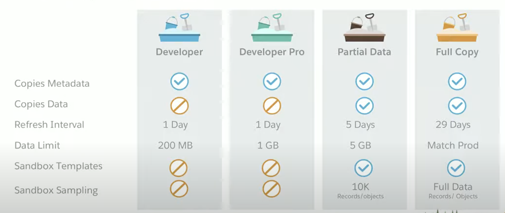
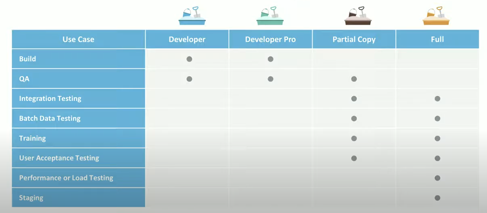
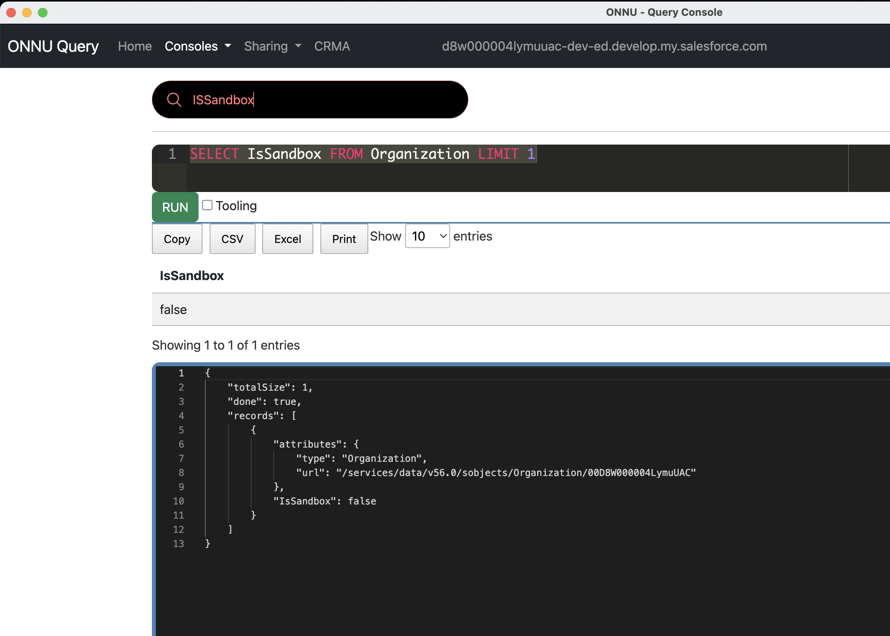

# Sandbox Management




<iframe width="920" height="640" src="https://www.youtube.com/embed/B73qPE1pEj4" title="YouTube video player" frameborder="0" allow="accelerometer; autoplay; clipboard-write; encrypted-media; gyroscope; picture-in-picture; web-share" allowfullscreen></iframe>

## Sandbox Clone
|Question|Answer|
|----|---|
|How **Sandbox Clone** is different from regular Sandbox|With Sandbox Clone, you can create a copy of an existing sandbox. That copy will contain all data that existed in the Source Sandbox at the time of the copy. A regular sandbox is a **copy of production** org. In **Setup > Sandboxes** page it will be have **Copied From** field|
|How to create or refresh cloned sandbox|You can create or refresh a cloned sandbox the same way you use a regular sandbox, you have to choose your **source sandbox** rather than **production** on the **Create From** drop-down field.You can clone a sandbox that’s on a **different major Salesforce release version** than your production organization.|
|Things to know|A sandbox clone can only be of the **same type sandbox** as the **source**. For example, a 'Full Copy Sandbox' can only be cloned as another 'Full Copy Sandbox.' |

## Sandbox Refresh

### 1. Create a Pre-refresh Checklist

### 2. Minimize Downtime using right refresh window (taking care of developers developing new features, UAT and Training users)
- Makes sure that refresh window aligns with Salesforce release window
  
- For each sandbox
    - Salesforce **sandbox refreshes take time** - It is a function of amount of configuration and metadata it contains
    - Determine a window for running sandbox refresh - this could take around 2 days 
    - During this window the **sandbox won’t be available**
    - Type of sandbox determines **how often** it can be refreshed:
        - Developer, Developer Pro - 1 day
        - Partial Copy  - 5 days
        - Full Copy - 29 days

    -  **Refreshing the sandbox will delete all that metadata (that is not yet committed in to Production)**


### 3. Sandbox Refresh Communication
    - Communicate early and often about the Sandbox Refresh
- Use custom metadata types (mdt) in production, so they’re easily modified 
    - Use custom settings and/or custom metadata types to specify email addresses, integration endpoints, etc. 
        - modify these values post-refresh
        -  Have 2 records per metadata type—one for production and one for sandboxes
            -  Apex classes can then use the ```IsSandbox``` property to dynamically choose which metadata type to use at runtime. 
            ```sql
            SELECT IsSandbox FROM Organization LIMIT 1
            ```
            

### 4. Create a Post-refresh Checklist
- After refreshing a sandbox take care of removing production endpoints
- [SandboxPostCopy](https://developer.salesforce.com/docs/atlas.en-us.apexref.meta/apexref/apex_interface_System_SandboxPostCopy.htm)  to extend this interface and add methods to perform post-copy tasks, then specify the class during sandbox creation.


```java
    global class PrepareMySandbox implements SandboxPostCopy {
 
    global PrepareMySandbox() {
        //Implementations of SandboxPostCopy must have a no-arg constructor.
        //This constructor is used during the sandbox copy process.
        //You can also implement constructors with arguments, but be aware that
        //they won’t be used by the sandbox copy process (unless as part of the
        //no-arg constructor).
        this(some_args);
    }
 
    global PrepareMySandbox(String some_args) {
        //Logic for constructor.
    }
    
    global void runApexClass(SandboxContext context) {
        System.debug('Org ID: ' + context.organizationId());
        System.debug('Sandbox ID: ' + context.sandboxId());
        System.debug('Sandbox Name: ' + context.sandboxName());
 
        // Insert logic here to prepare the sandbox for use.
    }
}
```

### 5. Take care of configuration data (not metadata)
    - Import it using the Data Loader or Import Wizard.
    - Some AppExchange apps use custom object for the configuration. When we create a new sandbox that does not include data, these apps will not work after the sandbox refresh. 
    - For master-detail relationships - insert the parent records before any child records

---
## References
- [Sandbox Clone FAQ](https://help.salesforce.com/s/articleView?id=000384932&type=1)
- [Refresh a Cloned Sandbox](https://help.salesforce.com/s/articleView?id=sf.data_sandbox_refresh_clone.htm&type=5)