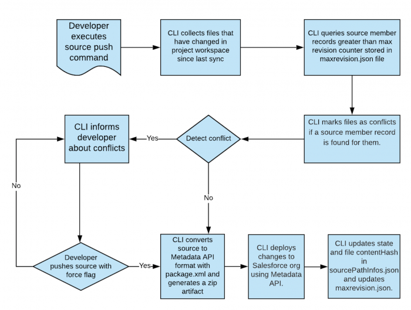

# Source Tracking

- Used for Tracking Changes Between Your Project and Org


- Source Tracking can be [enabled](https://developer.salesforce.com/docs/atlas.en-us.sfdx_dev.meta/sfdx_dev/sfdx_setup_enable_source_tracking_sandboxes.htm) for Developer Sandbox and Developer Pro Sandboxes
- It is enabled in Scratch orgs

## Content for your .sfdx folder in your DX Project

- You can [create a DX project](https://mohan-chinnappan-n.github.io/sfdc/dx.html#/37) by
```
sfdx force:project:create -n treePrj

```

 - The files in the .sfdx folder as they are necessary for the internal workings of the Salesforce CLI 
```
~/treeprj [master] >tree .sfdx
.sfdx
├── indexes
│   └── lwc
│       └── custom-components.json
├── orgs
│   └── mohan.chinnappan.n_ea2@gmail.com
│       └── sourcePathInfos.json <---- This information is used to make sure conflicts between files in an org and your project folder can be properly detected.


├── tools
│   ├── sobjects
│   │   └── standardObjects
│   │       ├── Account.cls
│   │       ├── Attachment.cls
│   │       ├── Case.cls
│   │       ├── Contact.cls
│   │       ├── Contract.cls
│   │       ├── Lead.cls
│   │       ├── Note.cls
│   │       ├── Opportunity.cls
│   │       ├── Order.cls
│   │       ├── Pricebook2.cls
│   │       ├── PricebookEntry.cls
│   │       ├── Product2.cls
│   │       ├── RecordType.cls
│   │       ├── Report.cls
│   │       ├── Task.cls
│   │       └── User.cls
│   ├── soqlMetadata
│   │   ├── customObjects
│   │   ├── standardObjects
│   │   │   ├── Account.json
│   │   │   ├── Attachment.json
│   │   │   ├── Case.json
│   │   │   ├── Contact.json
│   │   │   ├── Contract.json
│   │   │   ├── Lead.json
│   │   │   ├── Note.json
│   │   │   ├── Opportunity.json
│   │   │   ├── Order.json
│   │   │   ├── Pricebook2.json
│   │   │   ├── PricebookEntry.json
│   │   │   ├── Product2.json
│   │   │   ├── RecordType.json
│   │   │   ├── Report.json
│   │   │   ├── Task.json
│   │   │   └── User.json
│   │   └── typeNames.json
│   └── testresults
│       └── apex
└── typings
    └── lwc
        ├── apex.d.ts
        ├── engine.d.ts
        ├── lds.d.ts
        ├── messageservice.d.ts
        ├── schema.d.ts
        ├── sobjects
        │   ├── Account.d.ts
        │   ├── Attachment.d.ts
        │   ├── Case.d.ts
        │   ├── Contact.d.ts
        │   ├── Contract.d.ts
        │   ├── Lead.d.ts
        │   ├── Note.d.ts
        │   ├── Opportunity.d.ts
        │   ├── Order.d.ts
        │   ├── Pricebook2.d.ts
        │   ├── PricebookEntry.d.ts
        │   ├── Product2.d.ts
        │   ├── RecordType.d.ts
        │   ├── Report.d.ts
        │   ├── Task.d.ts
        │   └── User.d.ts
        └── user.d.ts

15 directories, 57 files
```

## What is under orgs folder?
```
───────┬───────────────────────────────────────────────────────────────────────────────────────────────────────────────────────────────────────────────
       │ File: .sfdx/orgs/mohan.chinnappan.n_ea2@gmail.com/sourcePathInfos.json
───────┼───────────────────────────────────────────────────────────────────────────────────────────────────────────────────────────────────────────────
   1   │ {
   2   │     "/Users/mchinnappan/treeprj/force-app": {
   3   │         "sourcePath": "/Users/mchinnappan/treeprj/force-app",
   4   │         "deferContentHash": false,
   5   │         "isWorkspace": false,
   6   │         "isArtifactRoot": true,
   7   │         "state": "n",
   8   │         "package": "force-app",
   9   │         "isDirectory": true,
  10   │         "isMetadataFile": false,
  11   │         "size": 128,
  12   │         "modifiedTime": 1673263339703,
  13   │         "changeTime": 1673263339703,
  14   │         "contentHash": "51d86f3b64a3d9a0048d192f02147b0e9e9594e4"
  15   │     },
  16   │     "/Users/mchinnappan/treeprj/force-app/main": {
  17   │         "sourcePath": "/Users/mchinnappan/treeprj/force-app/main",
  18   │         "deferContentHash": false,
  19   │         "isWorkspace": false,
  20   │         "isArtifactRoot": false,
  21   │         "state": "n",
  22   │         "package": "force-app",
  23   │         "isDirectory": true,
  24   │         "isMetadataFile": false,
  25   │         "size": 128,
  26   │         "modifiedTime": 1673263339699,
  27   │         "changeTime": 1673263339699,
  28   │         "contentHash": "ae41ed56706e4439a34cda97ac997d7988935c2f"
  29   │     },
  30   │     "/Users/mchinnappan/treeprj/force-app/main/default": {
  31   │         "sourcePath": "/Users/mchinnappan/treeprj/force-app/main/default",
:
```

## Querying SourceMember Object

- SourceMember object is used to log  any changes to the org metadata and settings.

### No entries 
```

sfdx force:data:soql:query --query "SELECT ChangedBy, IsNameObsolete, MemberName, MemberType, RevisionCounter FROM SourceMember" --usetoolingapi -u  test-uzsmfdqkhtk7@example.com    
 
 
Total number of records retrieved: 0.
Querying Data... done

```

### Let us deploy classes to get the entries 
```
~/treeprj [master] >sfdx force:source:deploy -u test-uzsmfdqkhtk7@example.com -p force-app/main/default/classes 
Deploying v55.0 metadata to test-uzsmfdqkhtk7@example.com using the v56.0 SOAP API
Deploy ID: 0AfDM000016M4060AC
DEPLOY PROGRESS | ████████████████████████████████████████ | 1/1 Components

=== Deployed Source

 FULL NAME  TYPE      PROJECT PATH                                           
 ────────── ───────── ────────────────────────────────────────────────────── 
 HelloPeach ApexClass force-app/main/default/classes/HelloPeach.cls          
 HelloPeach ApexClass force-app/main/default/classes/HelloPeach.cls-meta.xml 
Deploy Succeeded.

```

```
~/treeprj [master] >sfdx force:data:soql:query --query "SELECT ChangedBy, IsNameObsolete, MemberName, MemberType, RevisionCounter FROM SourceMember" --usetoolingapi -u  test-uzsmfdqkhtk7@example.com
 CHANGEDBY       ISNAMEOBSOLETE MEMBERNAME MEMBERTYPE REVISIONCOUNTER 
 ─────────────── ────────────── ────────── ────────── ─────────────── 
 005DM00000682Jy                Admin      Profile    2               
 005DM00000682Jy                HelloPeach ApexClass  3               
Total number of records retrieved: 2.
Querying Data... done
```

## Listing local and remote changes
### Local changes

```
sfdx force:source:status -u test-uzsmfdqkhtk7@example.com  -l
Source Status
 STATE     FULL NAME                           TYPE          PROJECT PATH                                                                                       
 ───────── ─────────────────────────────────── ───────────── ────────────────────────────────────────────────────────────────────────────────────────────────── 
 Local Add HelloPeach                          ApexClass     force-app/main/default/classes/HelloPeach.cls                                                      
 Local Add HelloPeach                          ApexClass     force-app/main/default/classes/HelloPeach.cls-meta.xml                                             
 Local Add Tree__c.quantity__c                 CustomField   force-app/main/default/objects/Tree__c/fields/quantity__c.field-meta.xml                           
 Local Add Account_Plan__c                     CustomObject  force-app/main/default/objects/Account_Plan__c/Account_Plan__c.object-meta.xml                     
 Local Add Sales_Play__c                       CustomObject  force-app/main/default/objects/Sales_Play__c/Sales_Play__c.object-meta.xml                         
 Local Add Tree__c                             CustomObject  force-app/main/default/objects/Tree__c/Tree__c.object-meta.xml                                     
 Local Add Experience_Profile_Manager          PermissionSet force-app/main/default/permissionsets/Experience_Profile_Manager.permissionset-meta.xml            
 Local Add Manage_Encryption_Keys              PermissionSet force-app/main/default/permissionsets/Manage_Encryption_Keys.permissionset-meta.xml                
 Local Add sf_devops_InitializeEnvironments    PermissionSet force-app/main/default/permissionsets/sf_devops_InitializeEnvironments.permissionset-meta.xml      
 Local Add sf_devops_InitializeEnvironments    PermissionSet force-app/main/default/permissionsets/sf_devops_InitializeEnvironments.permissionset-meta.xml.html 
 Local Add sf_devops_NamedCredentials          PermissionSet force-app/main/default/permissionsets/sf_devops_NamedCredentials.permissionset-meta.xml            
 Local Add Admin                               Profile       force-app/main/default/profiles/Admin.profile-meta.xml                                             
 Local Add Admin                               Profile       force-app/main/default/profiles/Admin.profile-meta.xml.html                                        
 Local Add Admin                               Profile       force-app/main/default/profiles/Admin.profile-meta.xml.json                                        
 Local Add Analytics Cloud Integration User    Profile       force-app/main/default/profiles/Analytics Cloud Integration User.profile-meta.xml                  
 Local Add Analytics Cloud Security User       Profile       force-app/main/default/profiles/Analytics Cloud Security User.profile-meta.xml                     
 Local Add Authenticated Website               Profile       force-app/main/default/profiles/Authenticated Website.profile-meta.xml                             
 Local Add Chatter External User               Profile       force-app/main/default/profiles/Chatter External User.profile-meta.xml                             
 Local Add Chatter Free User                   Profile       force-app/main/default/profiles/Chatter Free User.profile-meta.xml                                 
 Local Add Chatter Moderator User              Profile       force-app/main/default/profiles/Chatter Moderator User.profile-meta.xml                            
 Local Add ContractManager                     Profile       force-app/main/default/profiles/ContractManager.profile-meta.xml                                   
 Local Add Cross Org Data Proxy User           Profile       force-app/main/default/profiles/Cross Org Data Proxy User.profile-meta.xml                         
 Local Add Custom%3A Marketing Profile         Profile       force-app/main/default/profiles/Custom%3A Marketing Profile.profile-meta.xml                       
 Local Add Custom%3A Sales Profile             Profile       force-app/main/default/profiles/Custom%3A Sales Profile.profile-meta.xml                           
 Local Add Custom%3A Support Profile           Profile       force-app/main/default/profiles/Custom%3A Support Profile.profile-meta.xml                         
 Local Add Customer Community Login User       Profile       force-app/main/default/profiles/Customer Community Login User.profile-meta.xml                     
 Local Add Customer Community Plus Login User  Profile       force-app/main/default/profiles/Customer Community Plus Login User.profile-meta.xml                
 Local Add Customer Community Plus User        Profile       force-app/main/default/profiles/Customer Community Plus User.profile-meta.xml                      
 Local Add Customer Community User             Profile       force-app/main/default/profiles/Customer Community User.profile-meta.xml                           
 Local Add Customer Portal Manager Custom      Profile       force-app/main/default/profiles/Customer Portal Manager Custom.profile-meta.xml                    
 Local Add Customer Portal Manager Standard    Profile       force-app/main/default/profiles/Customer Portal Manager Standard.profile-meta.xml                  
 Local Add External Apps Login User            Profile       force-app/main/default/profiles/External Apps Login User.profile-meta.xml                          
 Local Add External Identity User              Profile       force-app/main/default/profiles/External Identity User.profile-meta.xml                            
 Local Add Force%2Ecom - App Subscription User Profile       force-app/main/default/profiles/Force%2Ecom - App Subscription User.profile-meta.xml               
 Local Add Force%2Ecom - Free User             Profile       force-app/main/default/profiles/Force%2Ecom - Free User.profile-meta.xml                           
 Local Add Gold Partner User                   Profile       force-app/main/default/profiles/Gold Partner User.profile-meta.xml                                 
 Local Add Guest License User                  Profile       force-app/main/default/profiles/Guest License User.profile-meta.xml                                
 Local Add High Volume Customer Portal User    Profile       force-app/main/default/profiles/High Volume Customer Portal User.profile-meta.xml                  
 Local Add HighVolumePortal                    Profile       force-app/main/default/profiles/HighVolumePortal.profile-meta.xml                                  
 Local Add Identity User                       Profile       force-app/main/default/profiles/Identity User.profile-meta.xml                                     
 Local Add MarketingProfile                    Profile       force-app/main/default/profiles/MarketingProfile.profile-meta.xml                                  
 Local Add Minimum Access - Salesforce         Profile       force-app/main/default/profiles/Minimum Access - Salesforce.profile-meta.xml                       
 Local Add mohanc Profile                      Profile       force-app/main/default/profiles/mohanc Profile.profile-meta.xml                                    
 Local Add Partner App Subscription User       Profile       force-app/main/default/profiles/Partner App Subscription User.profile-meta.xml                     
 Local Add Partner Community Login User        Profile       force-app/main/default/profiles/Partner Community Login User.profile-meta.xml                      
 Local Add Partner Community User              Profile       force-app/main/default/profiles/Partner Community User.profile-meta.xml                            
 Local Add PlatformPortal                      Profile       force-app/main/default/profiles/PlatformPortal.profile-meta.xml                                    
 Local Add Read Only                           Profile       force-app/main/default/profiles/Read Only.profile-meta.xml                                         
 Local Add Silver Partner User                 Profile       force-app/main/default/profiles/Silver Partner User.profile-meta.xml                               
 Local Add SolutionManager                     Profile       force-app/main/default/profiles/SolutionManager.profile-meta.xml                                   
 Local Add Standard                            Profile       force-app/main/default/profiles/Standard.profile-meta.xml                                          
 Local Add StandardAul                         Profile       force-app/main/default/profiles/StandardAul.profile-meta.xml                                       
 Local Add Work%2Ecom Only User                Profile       force-app/main/default/profiles/Work%2Ecom Only User.profile-meta.xml                              

```
### Remote changes
```
sfdx force:source:status -u test-uzsmfdqkhtk7@example.com  -r
Source Status
 STATE          FULL NAME  TYPE      PROJECT PATH                                                
 ────────────── ────────── ───────── ─────────────────────────────────────────────────────────── 
 Remote Changed HelloPeach ApexClass force-app/main/default/classes/HelloPeach.cls-meta.xml      
 Remote Changed HelloPeach ApexClass force-app/main/default/classes/HelloPeach.cls               
 Remote Changed Admin      Profile   force-app/main/default/profiles/Admin.profile-meta.xml.json 
 ```

 ## How force:source:push  works

 

- The CLI collects files that have changed in the project workspace since the last sync.
- The CLI queries SourceMember object records greater than max revision counter stored in maxrevision.json file.
- The CLI marks files as conflicts if a SourceMember object record is found for them.
- If conflicts are detected, the CLI informs the developer about these conflicts. The developer needs to resolve them and force push using the force flag.
- If no conflicts are detected, the CLI converts source to Metadata API format with package.xml and generate a zip artifact.
- The CLI deploys changes to the Salesforce org using the Metadata API.
- The CLI updates state and file contentHash in sourcePathInfos.json and maxrevision.json.


## Viewing sfdx.log  

```
# macOS
open -a TextEdit $HOME/.sfdx/sfdx.log

```


## Resources
- [A Deep Dive Into Source Tracked Projects](https://developer.salesforce.com/blogs/2020/04/a-deep-dive-into-source-tracked-projects)
- [Source format](https://developer.salesforce.com/docs/atlas.en-us.sfdx_dev.meta/sfdx_dev/sfdx_dev_source_file_format.htm)
- [SourcePushApi.ts](https://github.com/forcedotcom/salesforce-alm/blob/master/src/lib/source/sourcePushApi.ts)
- [salesforce-alm](https://github.com/forcedotcom/salesforce-alm)