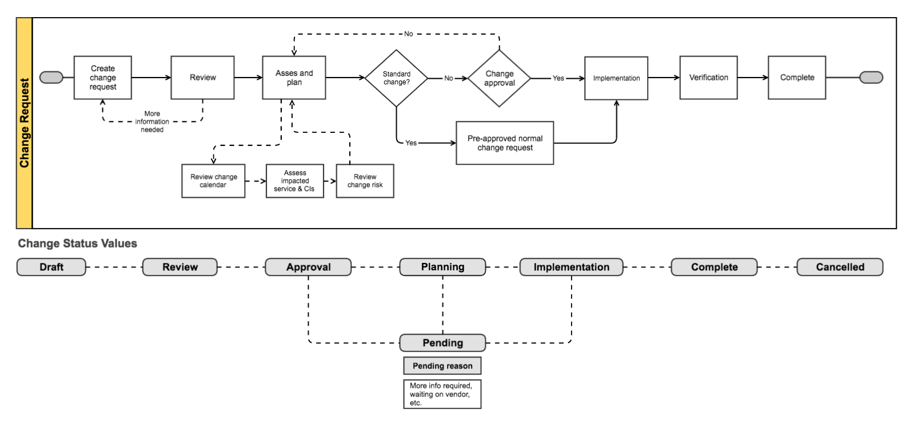
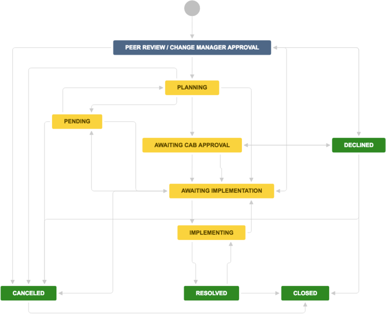

# Change Management


- Optimizing the **change management**  is the key to the **success** of any Salesforce implementation
- Changes are a regular affair when you are bringing in new features/enhancements into your implementation 

 ```mermaid
    graph TD;
        A[Finding the Need for the Change]-->B[Define Change Scope];
        B-->C[Assign Priority to the Change you are bringing in.\n How it enhances/affects current implementation];
        C-->D[Submit the change to the Change Approval Board - CAB];
        D-->E[Change got approved by CAB];
        E-->F[Perform the change];
        F-->G[Regression test the change];
        G-->H[Change Manager Approves the implemented change.\n Records that change was successful,\n timely, accurately estimated, within budget, and other details ]
     
```

## Using Atlassian Change Management

<iframe width="800" height="400" src="https://www.youtube.com/embed/ZLq6QKxt0KA" title="YouTube video player" frameborder="0" allow="accelerometer; autoplay; clipboard-write; encrypted-media; gyroscope; picture-in-picture; web-share" allowfullscreen></iframe>





- A project member requests a change. They provide the details like the affected systems, possible risks, and expected implementation.
- The change manager or peers determine if the change will be successful. They may ask for more information in this step.
- After review, the team plans how to put the change in place. They record details about:
    - the expected outcomes 
    - resources needed
    - timeline
    - testing requirements
    - undo : ways to roll back the change

- Depending on the type of change and risk, a **change approval board (CAB)** may need to review the plan.
- The team works to implement the change, documenting their procedures and results.
- The **change manager** reviews and closes the implemented change. 
    - They note whether it was successful, timely, accurately estimated, within budget, and other details.





## Roles

### Change Manager (CM)
- A Change Manager (CM) is a trusted advisor that addresses the people side of change. 
- A CM’s primary goal is to help define a clear vision for change and assist in designing a plan that will drive faster adoption, increase utilization of and proficiency with the changes that impact an organization or business.

### Project Manager
- Primary point of contact
- Manages Project Plan, Organization, delivery within budget and schedule
- Escalation point for the  project team and stakeholders
- Monitor project alignment and goals


### Product Owner
- Primary point of contact for Development team
- Defines product roadmap and vision
- Manages product backlog
- Oversees and evaluates development stages and progress


## References
- [Change management](https://confluence.atlassian.com/servicedeskcloud/managing-changes-with-your-it-service-desk-817562147.html)


## Videos

<iframe width="800" height="460" src="https://www.youtube.com/embed/94ttfphUR-8" title="YouTube video player" frameborder="0" allow="accelerometer; autoplay; clipboard-write; encrypted-media; gyroscope; picture-in-picture; web-share" allowfullscreen></iframe>