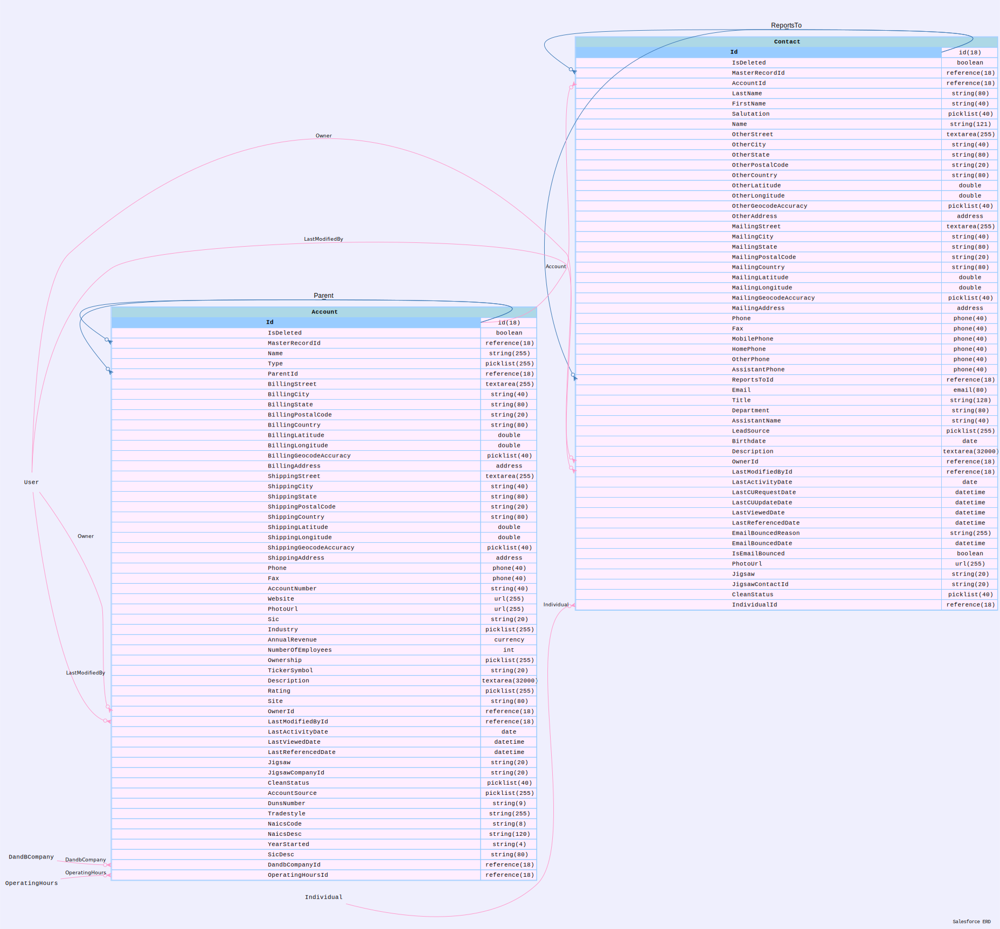

# Data Model

## Topics
- [Tools for extracting Org metadata](#tools)
- [SF-LAND Data Viz for viewing the metadata](#sfl)
- [Getting ERD for given sObjects](#erd)

----

<a name='tools'></a>

## Tools for getting the complete metadata of your org

###  Let us pick a scratch org to show the concepts
```
ALIAS     USERNAME                      ORG ID             EXPIRATION DATE 
 ─ ───────── ───────────────────────────── ────────────────── ─────────────── 
   treeprjSO test-uzsmfdqkhtk7@example.com 00DDM000003raPM2AY 2023-01-28      

```

### Let us get the all the objects in the org into a object list txt file
```
~/treeprj [main] >sfdx mohanc:md:describeGlobal -u test-uzsmfdqkhtk7@example.com > treeprjSO_Objects.txt

```

### You can get the list of objects names in the org from this text file by:
```
cat treeprjSO_Objects.txt | sed 's/,/\n/g' | bat 
───────┬───────────────────────────────────────────────────────────────────────────────────────────────────────────────────────────────────────────────
       │ STDIN
───────┼───────────────────────────────────────────────────────────────────────────────────────────────────────────────────────────────────────────────
   1   │ AIApplication
   2   │ AIApplicationConfig
   3   │ AIInsightAction
   4   │ AIInsightFeedback
   5   │ AIInsightReason
   6   │ AIInsightValue
   7   │ AIPredictionEvent
   8   │ AIRecordInsight
   9   │ AcceptedEventRelation
  10   │ Account
  11   │ AccountChangeEvent
  12   │ AccountCleanInfo
  13   │ AccountContactRole
  14   │ AccountContactRoleChangeEvent
  15   │ AccountFeed
  16   │ AccountHistory
  17   │ AccountPartner
  18   │ AccountShare
  19   │ ActionLinkGroupTemplate
  20   │ ActionLinkTemplate
  21   │ ActiveFeatureLicenseMetric
  22   │ ActivePermSetLicenseMetric
  23   │ ActiveProfileMetric
  24   │ ActivityHistory
  25   │ AdditionalNumber
  26   │ Address
  27   │ AggregateResult
  28   │ AlternativePaymentMethod
  29   │ AlternativePaymentMethodShare
  30   │ Announcement
:

```


### Get the org metadata using this object list text file into treeprjSO_metadata.csv 
- This operation may take few minutes based your org metadata 
```
sfdx mohanc:md:describe -u test-uzsmfdqkhtk7@example.com -i treeprjSO_Objects.txt > treeprjSO_metadata.csv

```

```
bat treeprjSO_metadata.csv 
───────┬───────────────────────────────────────────────────────────────────────────────────────────────────────────────────────────────────────────────
       │ File: treeprjSO_metadata.csv
───────┼───────────────────────────────────────────────────────────────────────────────────────────────────────────────────────────────────────────────
   1   │ "sobjectName","sobjectLabel","name","label","type","length","nillable","referenceTo","relationshipName","unique","updateable","inlineHelpText"
       │ ,"picklistValues","externalId"
   2   │ "AIApplication","AI Application","Id","AI Application ID","id",18,false,"[]",,false,false,,"[]",false
   3   │ "AIApplication","AI Application","IsDeleted","Deleted","boolean",0,false,"[]",,false,false,,"[]",false
   4   │ "AIApplication","AI Application","DeveloperName","Name","string",80,false,"[]",,false,false,,"[]",false
   5   │ "AIApplication","AI Application","Language","Master Language","picklist",40,false,"[]",,false,false,,"[""English"",""German"",""Spanish"",""Fr
       │ ench"",""Italian"",""Japanese"",""Swedish"",""Korean"",""Chinese (Traditional)"",""Chinese (Simplified)"",""Portuguese (Brazil)"",""Dutch"",""
       │ Danish"",""Thai"",""Finnish"",""Russian"",""Spanish (Mexico)"",""Norwegian""]",false
   6   │ "AIApplication","AI Application","MasterLabel","Label","string",80,false,"[]",,false,false,,"[]",false
   7   │ "AIApplication","AI Application","NamespacePrefix","Namespace Prefix","string",15,true,"[]",,false,false,,"[]",false
   8   │ "AIApplication","AI Application","CreatedDate","Created Date","datetime",0,false,"[]",,false,false,,"[]",false
   9   │ "AIApplication","AI Application","CreatedById","Created By ID","reference",18,false,"[""User""]","CreatedBy",false,false,,"[]",false
  10   │ "AIApplication","AI Application","LastModifiedDate","Last Modified Date","datetime",0,false,"[]",,false,false,,"[]",false
  11   │ "AIApplication","AI Application","LastModifiedById","Last Modified By ID","reference",18,false,"[""User""]","LastModifiedBy",false,false,,"[]"
       │ ,false
  12   │ "AIApplication","AI Application","SystemModstamp","System Modstamp","datetime",0,false,"[]",,false,false,,"[]",false
  13   │ "AIApplication","AI Application","Status","Status","picklist",255,false,"[]",,false,false,,"[""3"",""2"",""1"",""0""]",false
  14   │ "AIApplication","AI Application","Type","App Type","picklist",255,false,"[]",,false,false,,"[""5"",""14""]",false
  15   │ "sobjectName","sobjectLabel","name","label","type","length","nillable","referenceTo","relationshipName","unique","updateable","inlineHelpText"
       │ ,"picklistValues","externalId"
  16   │ "AIApplicationConfig","AI Application config","Id","AI Application config Id","id",18,false,"[]",,false,false,,"[]",false
  17   │ "AIApplicationConfig","AI Application config","IsDeleted","Deleted","boolean",0,false,"[]",,false,false,,"[]",false
  18   │ "AIApplicationConfig","AI Application config","DeveloperName","Name","string",80,false,"[]",,false,false,,"[]",false
  19   │ "AIApplicationConfig","AI Application config","Language","Master Language","picklist",40,false,"[]",,false,false,,"[""English"",""German"",""S
       │ panish"",""French"",""Italian"",""Japanese"",""Swedish"",""Korean"",""Chinese (Traditional)"",""Chinese (Simplified)"",""Portuguese (Brazil)""
       │ ,""Dutch"",""Danish"",""Thai"",""Finnish"",""Russian"",""Spanish (Mexico)"",""Norwegian""]",false
  20   │ "AIApplicationConfig","AI Application config","MasterLabel","Label","string",80,false,"[]",,false,false,,"[]",false
  21   │ "AIApplicationConfig","AI Application config","NamespacePrefix","Namespace Prefix","string",15,true,"[]",,false,false,,"[]",false
  22   │ "AIApplicationConfig","AI Application config","CreatedDate","Created Date","datetime",0,false,"[]",,false,false,,"[]",false
  23   │ "AIApplicationConfig","AI Application config","CreatedById","Created By ID","reference",18,false,"[""User""]","CreatedBy",false,false,,"[]",
  ```   

<a name='sfl'></a>
### Using SF-LAND Data Viz to view the model file
  <iframe id="inlineFrameExample"
    title="Inline Frame Example"
    width="1100"
    height="800"
    src="https://mohan-chinnappan-n5.github.io/dfv/dfv.html?d=data/treeprjSO_metadata.csv&x=4">
</iframe>

<a name='erd'></a>
## ERD

- Let us get ERD for Contact and Account Objects
- Note: This also emits the metadata for these 2 object in csv - contact-account.csv
```
sfdx mohanc:md:describe -s Contact,Account -e contact-account.dot -u test-uzsmfdqkhtk7@example.com > contact-account.csv
```

## Get the SVG for this ERD
```
sfdx mohanc:viz:graphviz:dot2svg -i contact-account.dot 
SVG file is written to contact-account.dot.svg

open contact-account.dot.svg 

```

- Click on the image to view the full version

[](img/contact-account.dot.svg)
```


