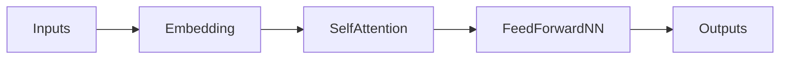
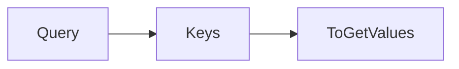
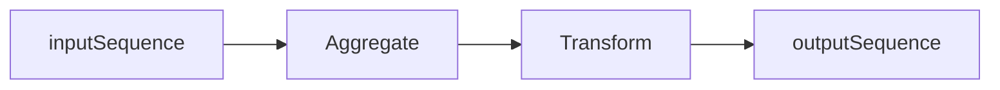
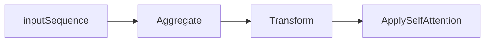

# [Transformers](https://arxiv.org/abs/1706.03762)

```
Model success depends on how fast you can build it and how good it is in reducing the losses!
```

- It is a general-purpose [differentiable computer](https://twitter.com/karpathy/status/1582807367988654081?lang=en). 

- A neural network architecture developed at Google that relies on self-attention mechanisms to transform a **sequence of input embeddings** into a **sequence of output embeddings** without relying on convolutions or recurrent neural networks. 

-  A [Transformer](https://developers.google.com/machine-learning/glossary#Transformer) can be viewed as a stack of self-attention layers.

- Based on a self-attention mechanisms unlike traditional convolutional (CNN) or recurrent neural networks (RNN)

-  Transformer outperforms both recurrent and convolutional models in language translation benchmarks

---

### Resilient

Remarkably, the Transformer architecture published by [Google team](https://arxiv.org/pdf/1706.03762.pdf) is very resilient over time. 
The Transformer that came out in [2017](https://ai.googleblog.com/2017/08/transformer-novel-neural-network.html) is basically the same as today except 
that we reshuffle some of the layer normalizations. 

Researchers are making training datasets much larger, evaluation much larger,
but they are keeping the architecture untouched, which is remarkable!

---


- they aggregate information from **surrounding words** to determine the meaning of a given bit of language in context. 

---

**A man/word is known by the company she/he/word keeps means that a person/words is similar to the people/words she/
he/word chooses to spend time with!**

Example: 
- deciding on the most likely meaning and appropriate representation of the word **bank** in the sentence :

**I arrived at the bank after crossing the…** requires knowing if the sentence ends in **“... road.” or “... river.”**

----

|Architecture|Notes|
|---|---|
|RNN|Can determine that “bank” is likely to refer to the bank of a **river** after reading each word between “bank” and “river” step by step. **More** the steps decisions require, the **harder** it is for a RNN to learn how to make those decisions.The sequential nature of RNNs also makes it more difficult to fully take advantage of modern fast computing devices such as [TPUs](https://arxiv.org/abs/1704.04760) and [GPUs](https://www.intel.com/content/www/us/en/products/docs/processors/what-is-a-gpu.html), which excel at parallel and not sequential processing.|
|CNN|Less sequential than RNNs, the number of steps required to combine information from distant parts of the input **still grows with increasing distance**|
|Transformer|Performs a small, constant number of steps (chosen empirically). In each step, it applies a **self-attention** mechanism which directly models **relationships between all words in a sentence**, regardless of their respective position.


---


|Feature|Comments|
|---|---|
|Expressive| With forward pass. It nodes store **vectors** and these nodes look at each other and they can see what's important for their computation in the other nodes. Message-passing-like architecture is general (i.e. completeness) and powerful (i.e. efficiency), able to cover many real-world algorithms and in a small number of compute steps; an an empirical finding.|
|Optimizable|With [Back-Propagation](https://developers.google.com/machine-learning/glossary#b) and [Gradient Descent](https://developers.google.com/machine-learning/glossary#gradient_descent). With  residual connections, layer normalization and [softmax](https://developers.google.com/machine-learning/glossary#softmax) attention. Residual connections support a kind of ability to learn short algorithms (think low LOC) fast and first, then gradually extend them longer during training.|
|Efficient|High parallelism compute graph. Can efficiently run on modern hardware (GPUs). Compute graph is shallow and wide, mapping significantly better to our [high-parallelism compute architectures](https://arxiv.org/abs/1511.08228) |

----

-  It can become a single neural network architecture for multi-modal inputs (text, image, video, audio), and thus converging all the other architectures into one.

- Transformers combine some of the benefits traditionally seen with convolutional neural networks (CNNs) and recurrent neural networks (RNNs).


|Architecture|Feature|Transformer|
|---|---|---|
|CNN|learn structured representations of images|ability to process input in a **hierarchical** manner, with each layer of the model learning increasingly complex features|learn highly structured representations of the input data|
|CNN|process input in a fixed-length window|use self-attention mechanisms that allow the model to directly relate different input elements to each other, regardless of their distance in the sequence. Capture long-range dependencies between input elements,|
|RNN|Cyclic. Ability to capture dependencies between elements in a **sequence**||
----

## Model Architecture
 

- The encoder and decoder are represented by **six layers** (the number can be any, for example, in BERT there are 24 encoder blocks)



|Steps|Description|
|---|---|
|1|The input data of the encoder first passes through the Self-Attention layer. This layer helps the encoder look at other words in the input sentence when it encodes a particular word.|
|2|The results of this Self-Attention layer are fed to the FeedForward NN|
|3|As the model processes each token (each word in the input sequence, say *w*), the Self-Attention layer allows it to search for hints in the other tokens (words) in the input sequence that may help improve the **encoding** of that word (*w*).|
|4| FeedForward NN has **no interaction with other words**, and therefore **various chains** can be executed in parallel as they pass through this layer. This allows transformer to process all words in the input text in **parallel**.|

Model  constantly cares about what “she”, “it” , “the”, or “that” refers to (pronouns).
```
I never been to Mars. But it is on wish list
```
**it**  here refers to **Mars**


#### Query/Key/Value vectors -  retrieval system


\\( \int x dx = \frac{x^2}{2} + C \\)

 




- we want to compute the self-attention for the word **it** in above sentence 
- creating matrices Q, K, and V for this input sentence
    - where q (row in matrix Q) represents the query vector for the word **it**
        -  K represents the key   matrix for all the words in the sentence
        -  V represents the value matrix for all the words in the sentence.  
- The self-attention for the word **it** would then be computed as:
    -  the dot product of Q and K, divided by the square root of the length of K, followed by a dot product with V.

\\( \frac {Q \cdot K}{\sqrt(dim(K))} \\)

----
The matrices  \\( (W^Q, W^K, W^V) \\) are initially randomly initialized weight matrices.
 
- The vector \\( (x_n) \\)in this case would be a word embedding of the input token (or output of the previous attention layer). 


##### Example
```
Hello World
```

- Embeddings
    - \\( x_0 \\) : Hello
    - \\( x_1 \\) : World
- We have vectors \\( q, k,  v \\) for each of these two words. 
- These vectors are generated by multiplying embedding vector of the word and the weight matrix \\( W \\)


### Encoder and Decoder

An encoder transforms a sequence of [embeddings]() into a new sequence of the same length. 
- Includes N identical layers (Nx), each of which contains **two sub-layers**. 
    - These two sub-layers are applied at each position of the input embedding sequence, transforming each element of the sequence into a new embedding. 
        - The first encoder sub-layer **aggregates** information from across the input sequence.  - aggregation 
        - The second encoder sub-layer **transforms** the aggregated information into an output embedding. - transformation

- Each encoder consists of two layers: Self-Attention and Feed Forward Neural Network.




A decoder transforms a sequence of input embeddings into a sequence of output embeddings, possibly with a different length.
-  Includes N identical layers with **three sub-layers**
-  First and second of which are similar to the encoder sub-layers. 
-  The third decoder sub-layer takes the output of the encoder and applies the self-attention mechanism to gather information from it





### Self-attention 

For this sentence:

```
 The animal didn't cross the street because it was too tired.  
 
 ```

- self-attention layer's attention pattern for the pronoun **it**:  (with the darkness of each line indicating how much each word contributes to the representation:)

- The self-attention layer highlights words that are relevant to **it**. In this case, the attention layer has learned to highlight words that it might refer to, assigning the highest weight to animal.
- For a sequence of n tokens, self-attention transforms a sequence of embeddings n separate times, once at each position in the sequence.

In the  example:

```
I arrived at the bank after crossing the river
```
- to determine that the word **bank** refers to the *shore of a river* and not a financial institution
    - Transformer can learn to immediately attend to the word **river** and make this decision in a single step

- To compute the next representation for a given word - **bank** for example - the Transformer compares it to **every other word** in the sentence
    - The result of these comparisons is an **attention score** for every other word in the sentence. 
    - These **attention scores** determine how much each of the other words should **contribute** to the next representation of **bank**
        - The disambiguating **river** could receive a **high attention score** when computing a new representation for **bank** 
        -  The attention scores are then used as weights for a weighted average of all words’ representations which is fed into a fully-connected network to generate a new representation for **bank**, reflecting that the sentence is **talking about a river bank**.


 Neural networks for machine translation typically contain 
 - an **encoder** reading the input sentence and generating a representation of it
 - a decoder then generates the output sentence word by word while **consulting** the representation generated by the encoder
- Transformer starts by generating initial representations, or embeddings, for each word. 
    - These are represented by the unfilled circles
    - Then, using self-attention, it aggregates information from all of the other words, generating a new representation per word informed by the entire context, represented by the filled balls.
    - This step is then repeated multiple times in **parallel for all words**, successively generating new representations.
- The **decoder** operates similarly, but generates one word at a time, from left to right. It attends not only to the other previously generated words, but also to the final representations generated by the encoder.

- We can visualize what other parts of a sentence the network **attends** to when processing or translating a given word, thus gaining insights into how information travels through the network.


- In the first sentence pair **it** refers to the animal, and in the second to the street. 
- In one of its steps, the Transformer clearly identified the two nouns **it** could refer to and the respective amount of attention reflects its choice in the different contexts.


Given this insight, it might not be that surprising that the Transformer also performs very well on the classic language analysis task of syntactic constituency parsing, a task the natural language processing community has attacked with highly specialized systems for decades.

- [Sample work](https://colab.research.google.com/github/tensorflow/tensor2tensor/blob/master/tensor2tensor/notebooks/hello_t2t.ipynb)


- [Walkthrough](https://github.com/tensorflow/tensor2tensor/blob/master/README.md#walkthrough)
- [Notebook](https://github.com/tensorflow/tensor2tensor/blob/master/tensor2tensor/notebooks/Transformer_translate.ipynb)

----


 
## Terms
|Term|Description|
|---|---|
|Gradient descent|A mathematical technique to **minimize loss**. [Gradient descent](https://developers.google.com/machine-learning/glossary#gradient_descent) iteratively adjusts **weights and biases**, gradually finding the best combination to minimize loss|
|Loss|The difference between the prediction and the label value is the loss |
|Forward Pass|System processes a batch of **examples** to yield prediction(s). The system compares each prediction to each label value. The difference between the prediction and the label value is the loss for that example. The system aggregates the losses for all the examples to compute the total loss for the current batch.|
|Backward pass (backpropagation)|System reduces loss by adjusting the weights of all the neurons in all the hidden layer(s).Backpropagation determines whether to increase or decrease the weights applied to particular neurons.|
|[Hidden layer](https://developers.google.com/machine-learning/glossary#hidden_layer)|A layer in a neural network between the input layer (the features) and the output layer (the prediction). Each  consists of one or more neurons.|
|Learning Rate|Multiplier that controls the degree to which each backward pass increases or decreases each weight. A large learning rate will increase or decrease each weight more than a small learning rate|
|[Chain rule](https://en.wikipedia.org/wiki/Chain_rule)|expresses the derivative of the composition of two differentiable functions f and g in terms of the derivatives of f and g|
|[Lagrange's notation](https://en.wikipedia.org/wiki/Notation_for_differentiation#Lagrange's_notation)|a prime mark denotes a derivative. If f is a function, then its derivative evaluated at x is written f`(x)|
|[Encode](https://developers.google.com/machine-learning/glossary#e)|In sequence-to-sequence tasks, encoder takes an input sequence and returns an internal state (a vector). Then, the decoder uses that internal state to predict the next sequence. |
|Tensor|N-dimensional (where N could be very large) data structures, most commonly scalars, vectors, or matrices. The elements of a Tensor can hold integer, floating-point, or string values|
|language understanding tasks|language modeling, machine translation and question answering|
|Attention|Weighted **sum over a set of inputs**, where the weight for each input is computed by another part of the neural network|
|self-attention|Each embedding in the output sequence is constructed by integrating information from the elements of the input sequence through an attention mechanism.The **self** part of **self-attention** refers to the **sequence attending to itself** rather than to some other context. A self-attention layer starts with a sequence of input representations, one for each word. For each word in an input sequence, the network scores the relevance of the word to every element in the whole sequence of words. The relevance scores determine how much the word's final representation incorporates the representations of other words.Self-attention is one of the main building blocks for Transformers and uses dictionary lookup terminology, such as “query”, “key”, and “value”. Self-attention and multi-head self-attention, which are the building blocks of Transformers.|
|Masked language modelling|Encoder only architectures (like BERT) solve the task of predicting the masked word in a sentence. So the attention can see all the words before and after this masked word|
|Predict next token|Predict the next token or set of tokens, i.e. given tokens [0, ..., n-1] predict n|


 
 ## Sentence completion task
 -  This requires decoder portion of the transformer architecture
 - For the translation tasks we need to **encode** the input text first 
    -  have a cross-attention layer with the translated text


